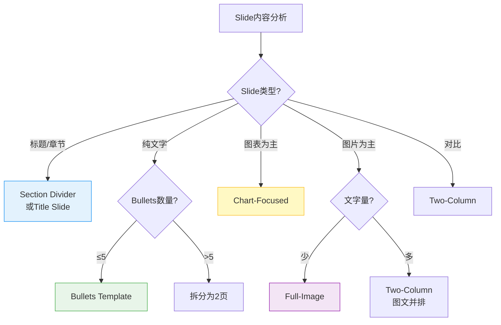

# ppt-layout Skill

**功能**：基于网格系统（Grid System）和 Assertion-Evidence 模板，为每页幻灯片选择最优布局，确保信息清晰传达、视觉层次分明。

**职责边界**：
- ✅ **本skill负责**：12列网格系统定义、8种布局模板规范、智能布局选择算法、网格对齐规则
- 🔗 **协作skill**：
  - `ppt-theme-manager.skill`：提供 Spacing Tokens（边距、间距）
  - `ppt-visual.skill`：提供视觉层次和 Material Design 组件规范
  - `ppt-outline.skill`：提供 Slide Type 分类（title, content, section-divider 等）

---

## 1. 核心网格系统

### 1.1 标题栏与内容区域垂直布局规范

**PPT 垂直空间分配**（针对 16:9 标准幻灯片，13.33" × 7.5"）：

```yaml
# 垂直布局计算公式（Vertical Layout Formula）
slide_height: 7.5"  # 标准16:9高度

title_bar:
  height: 0.6" - 0.8"  # 推荐 0.7" (占slide高度的9%)
  height_ratio: 8-11%  # 不超过11%
  background: primary_700 或 brand_primary
  text_color: white (#FFFFFF)
  text_vertical_align: center
  calculation: |
    title_box.top = (title_bar_height - font_size_in_inches) / 2
    title_box.height = font_size_in_inches + padding

spacing:
  top_margin: 0.2" - 0.3"  # 标题栏后的间距，推荐 0.3"
  bottom_margin: 0.3" - 0.5"  # 底部留白，推荐 0.4"

content_area:
  top: title_bar_height + top_margin  # 推荐 1.0" (0.7" + 0.3")
  height: slide_height - title_bar_height - top_margin - bottom_margin
  # 推荐值: 7.5" - 0.7" - 0.3" - 0.4" = 6.1"
  height_ratio: ≥80%  # 目标：内容可用空间占slide总高度的80%以上

# 函数接口（Function Interface）
def calculate_content_area(slide_height=7.5, title_bar_height=0.7, 
                          top_margin=0.3, bottom_margin=0.4):
    """
    计算内容区域的top位置和可用高度
    
    Args:
        slide_height: slide总高度（英寸），默认7.5"
        title_bar_height: 标题栏高度（英寸），推荐0.7"
        top_margin: 标题栏后间距（英寸），推荐0.3"
        bottom_margin: 底部留白（英寸），推荐0.4"
    
    Returns:
        {
            'content_top': Inches(1.0),      # 内容起始位置
            'content_height': Inches(6.1),   # 内容可用高度
            'usage_ratio': 0.81              # 空间利用率 (81%)
        }
    """
    content_top = title_bar_height + top_margin
    content_height = slide_height - title_bar_height - top_margin - bottom_margin
    usage_ratio = content_height / slide_height
    
    return {
        'content_top': content_top,
        'content_height': content_height,
        'usage_ratio': usage_ratio
    }
```

**推荐值（Recommended Values for 7.5" slides）**：
| 参数 | 推荐值 | 占比 | 说明 |
|------|--------|------|------|
| **title_bar_height** | 0.7" | 9% | 标题栏高度，不超过11% |
| **content_top** | 1.0" | 13% | 内容起始位置（0.7" + 0.3"） |
| **content_height** | 6.1" | 81% | 内容可用高度（目标≥80%） |
| **bottom_margin** | 0.4" | 5% | 底部留白，避免内容触底 |

**字体规格约束**（配合标题栏高度）：
```yaml
title_bar_text:
  font_size: 24pt - 28pt  # 推荐24pt for 7.5" slides
  font_size_ratio: 3-4% of slide_height  # 标题字体占slide高度的3-4%
  line_height: 1.3 - 1.4
  calculation: |
    # 24pt ≈ 0.33" (at 72 DPI)
    # 0.33" / 7.5" ≈ 4.4% (合理比例)

content_text:
  body_large: 16pt - 20pt  # 推荐16pt (英文) / 18-20pt (中文)
  body_small: 14pt - 16pt  # 最小14pt (投影可读性下限)
  line_height: 1.5 - 1.6 (中文), 1.3 - 1.5 (英文)
```

---

### 1.2 12列网格基础（Swiss Grid）

**水平网格结构**（源自瑞士设计）：
```
1280px宽度 ÷ 12列 = 每列106.67px

┌─┬─┬─┬─┬─┬─┬─┬─┬─┬─┬─┬─┐
│1│2│3│4│5│6│7│8│9│10│11│12│
└─┴─┴─┴─┴─┴─┴─┴─┴─┴─┴─┴─┘

边距（Margin）: 48px (左右各，推荐40-48px)
间距（Gutter）: 24px (列之间)
内容区域: 1184px (1280 - 96)
```

**常用布局**：
```yaml
full-width:
  columns: [1, 12]
  usage: 标题页、大图、章节分隔

centered-content:
  columns: [3, 10]
  usage: 正文内容（留边距）

two-column-equal:
  left: [1, 6]
  right: [7, 12]
  usage: 对比、图文并排

two-column-6040:
  major: [1, 7]    # 60%
  minor: [8, 12]   # 40%
  usage: 主图+注释

three-column:
  col1: [1, 4]
  col2: [5, 8]
  col3: [9, 12]
  usage: 三项对比
```

### 1.2 与 Material Design Grid 集成

**Material Design 12列网格对应**：
```yaml
# ppt-theme-manager.skill 提供的 Spacing Tokens
spacing_tokens:
  margin_horizontal: 80px   # 对应网格外边距
  gutter: 24px              # 对应列间距
  content_padding: 32px     # 内容区内边距
  
# 映射到12列网格
grid_mapping:
  total_width: 1920px
  margin: 80px × 2 = 160px
  content_area: 1760px
  column_width: (1760 - 11×24) / 12 = 124.67px
  column_with_gutter: 148.67px
```

**响应式断点**（来自 Material Design）：
```yaml
breakpoints:
  16:9_standard:
    width: 1920px
    height: 1080px
    columns: 12
    margin: 80px
  
  4:3_classic:
    width: 1024px
    height: 768px
    columns: 8  # 降级到8列
    margin: 48px
```

---

## 2. 布局模板规范

### 2.1 Template 1: Title Slide（标题页）
```
┌───────────────────────────────┐
│                               │
│                               │
│        [大标题]               │
│        [副标题]               │
│        [日期/作者]            │
│                               │
│    [公司Logo]                 │
└───────────────────────────────┘

specs:
  title_size: 48-60pt
  subtitle_size: 24-32pt
  alignment: center or left
  background: brand_color or image with overlay
```

### 2.2 Template 2: Section Divider（章节分隔）
```
┌───────────────────────────────┐
│                               │
│     [章节编号]                │
│                               │
│     [章节名称]                │
│                               │
│                               │
└───────────────────────────────┘

specs:
  number_size: 72-96pt (超大)
  title_size: 36-48pt
  background: full-bleed color or gradient
  minimal_text: true
```

### 2.3 Template 3: Assertion-Evidence（断言-证据）

**Michael Alley标准模板**：
```
┌───────────────────────────────┐
│ [断言句：完整陈述结论]       │
├───────────────────────────────┤
│  ┌─────┐  ┌─────┐  ┌─────┐   │
│  │证据1│  │证据2│  │证据3│   │
│  │图表 │  │图表 │  │数据 │   │
│  └─────┘  └─────┘  └─────┘   │
└───────────────────────────────┘

rules:
  - 标题必须是完整句子（非短语）
  - 标题传达核心发现（不只是话题）
  - 证据支持断言（图表/数据）
  - 最小化文字，最大化视觉

example:
  ❌ "系统性能"
  ✅ "缓存优化使P99延迟降低62%"
```

### 2.4 Template 4: Bullets（列表）
```
┌───────────────────────────────┐
│ [标题]                         │
├───────────────────────────────┤
│ • Bullet point 1               │
│ • Bullet point 2               │
│ • Bullet point 3               │
│ • Bullet point 4               │
│                                │
└───────────────────────────────┘

constraints:
  max_bullets: 5
  max_words_per_bullet: 8
  icon_optional: true (替代bullet符号)
  
variants:
  - icon-bullets: 用图标替代圆点
  - numbered: 有序列表（步骤）
  - checklist: 带勾选框
```

### 2.5 Template 5: Two-Column（双栏）
```
┌─────────────┬─────────────────┐
│ [标题]                         │
├─────────────┼─────────────────┤
│             │                 │
│  [左侧]     │   [右侧]        │
│             │                 │
│             │                 │
└─────────────┴─────────────────┘

use_cases:
  - 对比（Before vs After）
  - 图文（Diagram + Explanation）
  - 问题-方案
  
split_ratios:
  - 50/50: 平等重要
  - 60/40: 主次分明
  - 70/30: 一主一辅
```

### 2.6 Template 6: Chart-Focused（图表为主）
```
┌───────────────────────────────┐
│ [结论性标题]                   │
├───────────────────────────────┤
│                               │
│       [大图表]                │
│                               │
│                               │
│   [数据来源]                  │
└───────────────────────────────┘

specs:
  chart_area: 60-70% of slide
  title: 传达insight（非描述）
  annotation: 直接标注关键数据
  source: 小字号底部标注
```

### 2.7 Template 7: Full-Image（全屏图片）
```
┌───────────────────────────────┐
│  ╔═══════════════════════╗   │
│  ║                       ║   │
│  ║   [Background Image]  ║   │
│  ║                       ║   │
│  ║   [Text Overlay]      ║   │
│  ╚═══════════════════════╝   │
└───────────────────────────────┘

requirements:
  overlay: gradient or semi-transparent
  contrast: ≥4.5:1 (text vs background)
  text_position: safe_zone (避开复杂区域)
  
safe_zones:
  - left-third
  - bottom-quarter
  - top-with-gradient
```

### 2.8 Template 8: Appendix（附录）
```
┌───────────────────────────────┐
│ 附录: [技术细节]    [页码]    │
├───────────────────────────────┤
│ [密集信息/表格/代码]          │
│                               │
│                               │
│                               │
└───────────────────────────────┘

features:
  smaller_font: 10-12pt (vs 14-18pt正文)
  higher_density: 允许更多内容
  gray_header: 视觉区分
  page_numbers: 必需
```

---

## 3. 智能布局选择

### 3.1 布局决策树

**选择算法**：


### 3.2 布局选择算法实现

```python
def select_layout(slide):
    """智能选择布局模板"""
    
    # 特殊页面
    if slide.type == 'title':
        return 'title-slide'
    elif slide.type == 'section-divider':
        return 'section-divider'
    elif slide.type == 'appendix':
        return 'appendix'
    
    # 内容驱动
    has_chart = len(slide.charts) > 0
    has_image = slide.image is not None
    bullet_count = len(slide.bullets)
    
    if has_chart and not has_image:
        return 'chart-focused'
    
    elif has_image and bullet_count == 0:
        return 'full-image'
    
    elif has_image and bullet_count > 0:
        return 'two-column'  # 图文并排
    
    elif bullet_count <= 5:
        # Assertion-Evidence优先
        if slide.title.endswith(('。', '.', '!', '！')):
            return 'assertion-evidence'
        else:
            return 'bullets'
    
    else:
        # 超过5个bullets，需要拆分
        return 'split-required'
```

### 3.3 Assertion-Evidence 检测

**断言句识别规则**：
```python
def is_assertion_title(title: str) -> bool:
    """检测标题是否为断言句（适合Assertion-Evidence模板）"""
    
    # 规则1: 以句号、感叹号结尾（完整句子）
    if title.endswith(('。', '.', '!', '！')):
        return True
    
    # 规则2: 包含动词+结果（"使..."、"降低..."、"提升..."）
    result_patterns = [
        r'使.*(降低|提升|增加|改善)',
        r'(降低|提升|增加|改善).*%',
        r'通过.*实现',
        r'优化.*达到'
    ]
    
    import re
    for pattern in result_patterns:
        if re.search(pattern, title):
            return True
    
    # 规则3: 包含数值+单位（量化结果）
    if re.search(r'\d+(%|ms|倍|次)', title):
        return True
    
    return False


# 示例
assert is_assertion_title("缓存优化使P99延迟降低62%") == True
assert is_assertion_title("系统性能优化") == False
assert is_assertion_title("延迟降至45ms，提升3倍。") == True
```

---

## 4. 集成接口

### 4.1 输入格式

```json
{
  "slide": {
    "type": "content",
    "title": "缓存优化使P99延迟降低62%",
    "bullets": [
      "Redis缓存层部署完成",
      "热点数据命中率95%",
      "P99延迟从120ms降至45ms"
    ],
    "charts": ["performance_comparison.png"],
    "emphasis": "performance"
  },
  "aspect_ratio": "16:9"
}
```

### 4.2 输出格式

```json
{
  "layout": "assertion-evidence",
  "template_specs": {
    "grid": {
      "columns": 12,
      "content_area": [2, 11],
      "gutter": 24
    },
    "title_area": {
      "position": "top",
      "height": "15%",
      "alignment": "left",
      "font_size": 36
    },
    "content_area": {
      "position": "below-title",
      "height": "75%",
      "layout": "three-column"
    }
  },
  "reasoning": "标题是完整断言句，适合Assertion-Evidence模板"
}
```

---

## 5. 最佳实践

### 5.1 布局设计规范

**DO**：
- ✅ **优先 Assertion-Evidence**：标题传达结论（"使延迟降低62%"）而非话题（"性能优化"）
- ✅ **遵循网格对齐**：所有元素对齐12列网格线
- ✅ **保持一致边距**：统一使用80px外边距
- ✅ **视觉呼吸空间**：内容区不超过85%（留白15%）
- ✅ **单页单焦点**：每页突出1个核心信息

**DON'T**：
- ❌ **随意摆放元素**：违反网格系统
- ❌ **标题只写话题**："系统架构"应改为"微服务架构提升扩展性3倍"
- ❌ **过度拥挤**：bullets超过5条需拆分
- ❌ **混用布局风格**：同一演讲保持模板一致性
- ❌ **忽略安全区域**：Full-Image模板文字避开复杂背景

### 5.2 网格使用规范

**DO**：
- ✅ **主内容居中**：使用 columns [2, 11] 或 [3, 10]
- ✅ **双栏平衡**：50/50 或 60/40 比例（避免极端分割）
- ✅ **跨列对齐**：图表/图片边界对齐网格线
- ✅ **响应式降级**：4:3 比例降级到8列网格

**DON'T**：
- ❌ **打破网格**：元素宽度不对应网格列数
- ❌ **不一致间距**：必须使用24px gutter
- ❌ **边缘紧贴**：Full-width模板仍需保留边距

### 5.3 模板选择规范

**选择优先级**：
```
1. 断言句标题 → Assertion-Evidence
2. 单图表 + 少量文字 → Chart-Focused
3. 大图片 + 标题 → Full-Image
4. 文字+图片 → Two-Column
5. ≤5条bullets → Bullets Template
6. >5条bullets → 拆分为2页
7. 章节切换 → Section Divider
```

**特殊场景**：
- **技术评审**：多用 Assertion-Evidence（量化结果）
- **战略汇报**：多用 Full-Image（视觉冲击）
- **培训教学**：多用 Bullets + Two-Column（清晰传达）
- **快速回顾**：Appendix 模板（高密度信息）

---

## 6. 完整实现示例

```python
from typing import Dict, List, Any
import re


class LayoutEngine:
    """幻灯片布局引擎 - 智能选择和应用布局模板"""
    
    # 布局模板定义
    TEMPLATES = {
        'title-slide': {
            'grid': {'content_area': [1, 12]},
            'title_size': 48,
            'alignment': 'center'
        },
        'section-divider': {
            'grid': {'content_area': [1, 12]},
            'number_size': 72,
            'title_size': 36,
            'background': 'full-bleed'
        },
        'assertion-evidence': {
            'grid': {'title_area': [1, 12], 'content_area': [2, 11]},
            'title_size': 36,
            'title_type': 'assertion',  # 完整句
            'evidence_layout': 'three-column'
        },
        'bullets': {
            'grid': {'content_area': [3, 10]},
            'max_bullets': 5,
            'bullet_style': 'icon'
        },
        'two-column': {
            'grid': {'left': [1, 6], 'right': [7, 12]},
            'split_ratio': '50/50'
        },
        'chart-focused': {
            'grid': {'chart_area': [2, 11]},
            'chart_coverage': 0.7  # 70%页面
        },
        'full-image': {
            'grid': {'content_area': [1, 12]},
            'overlay': 'gradient',
            'safe_zones': ['left-third', 'bottom-quarter']
        },
        'appendix': {
            'grid': {'content_area': [1, 12]},
            'font_size': 10,
            'density': 'high'
        }
    }
    
    def __init__(self):
        self.grid_columns = 12
        self.margin = 80
        self.gutter = 24
    
    def select_layout(self, slide: Dict[str, Any]) -> str:
        """主函数：智能选择布局模板"""
        
        # Step 1: 特殊页面类型
        if slide.get('type') == 'title':
            return 'title-slide'
        elif slide.get('type') == 'section-divider':
            return 'section-divider'
        elif slide.get('type') == 'appendix':
            return 'appendix'
        
        # Step 2: 内容驱动选择
        has_chart = len(slide.get('charts', [])) > 0
        has_image = slide.get('image') is not None
        bullet_count = len(slide.get('bullets', []))
        title = slide.get('title', '')
        
        # Step 3: 应用决策树
        if has_chart and not has_image:
            return 'chart-focused'
        
        elif has_image and bullet_count == 0:
            return 'full-image'
        
        elif has_image and bullet_count > 0:
            return 'two-column'
        
        elif bullet_count <= 5:
            # 检测是否为断言句
            if self._is_assertion_title(title):
                return 'assertion-evidence'
            else:
                return 'bullets'
        
        else:
            # 超过5个bullets，标记需拆分
            return 'split-required'
    
    def _is_assertion_title(self, title: str) -> bool:
        """检测标题是否为断言句"""
        # 规则1: 完整句子（以句号、感叹号结尾）
        if title.endswith(('。', '.', '!', '！')):
            return True
        
        # 规则2: 包含结果动词
        result_patterns = [
            r'使.*(降低|提升|增加|改善)',
            r'(降低|提升|增加|改善).*%',
            r'通过.*实现',
            r'优化.*达到'
        ]
        
        for pattern in result_patterns:
            if re.search(pattern, title):
                return True
        
        # 规则3: 包含量化结果
        if re.search(r'\d+(%|ms|倍|次)', title):
            return True
        
        return False
    
    def apply_layout(self, slide: Dict[str, Any], layout_name: str) -> Dict[str, Any]:
        """应用布局模板，生成详细规范"""
        
        if layout_name not in self.TEMPLATES:
            raise ValueError(f"Unknown layout: {layout_name}")
        
        template = self.TEMPLATES[layout_name]
        
        # 生成布局规范
        layout_spec = {
            'layout': layout_name,
            'template_specs': {
                'grid': {
                    'columns': self.grid_columns,
                    'margin': self.margin,
                    'gutter': self.gutter,
                    **template.get('grid', {})
                },
                **{k: v for k, v in template.items() if k != 'grid'}
            },
            'reasoning': self._explain_choice(slide, layout_name)
        }
        
        return layout_spec
    
    def _explain_choice(self, slide: Dict[str, Any], layout: str) -> str:
        """生成布局选择原因说明"""
        
        reasons = {
            'title-slide': "幻灯片类型为标题页",
            'section-divider': "章节分隔页",
            'assertion-evidence': "标题是完整断言句，适合强调结论",
            'bullets': "内容为列表形式，数量适中（≤5条）",
            'two-column': "包含图片和文字，双栏并排展示",
            'chart-focused': "主要内容为图表，需突出数据可视化",
            'full-image': "大图片+少量文字，适合全屏展示",
            'appendix': "附录页，允许高密度信息",
            'split-required': "内容过多（>5条bullets），需拆分为多页"
        }
        
        return reasons.get(layout, "默认布局")
    
    def validate_grid_alignment(self, element: Dict[str, Any]) -> bool:
        """验证元素是否对齐网格"""
        
        x = element.get('x', 0)
        width = element.get('width', 0)
        
        # 计算列宽
        total_width = 1920
        content_width = total_width - 2 * self.margin
        column_width = (content_width - (self.grid_columns - 1) * self.gutter) / self.grid_columns
        
        # 检查x坐标是否对齐网格线
        x_relative = x - self.margin
        column_index = round(x_relative / (column_width + self.gutter))
        expected_x = self.margin + column_index * (column_width + self.gutter)
        
        # 允许±2px误差
        return abs(x - expected_x) <= 2


# 使用示例
if __name__ == '__main__':
    engine = LayoutEngine()
    
    # 测试用例1: 断言句标题
    slide1 = {
        'type': 'content',
        'title': '缓存优化使P99延迟降低62%',
        'bullets': [
            'Redis缓存层部署完成',
            '热点数据命中率95%',
            'P99延迟从120ms降至45ms'
        ],
        'charts': ['performance_comparison.png']
    }
    
    layout1 = engine.select_layout(slide1)
    spec1 = engine.apply_layout(slide1, layout1)
    print(f"Slide 1 Layout: {layout1}")
    print(f"Reasoning: {spec1['reasoning']}")
    
    # 测试用例2: 普通列表
    slide2 = {
        'type': 'content',
        'title': '系统架构',
        'bullets': ['认证模块', '限流模块', '推荐模块'],
        'charts': [],
        'image': None
    }
    
    layout2 = engine.select_layout(slide2)
    spec2 = engine.apply_layout(slide2, layout2)
    print(f"\nSlide 2 Layout: {layout2}")
    print(f"Reasoning: {spec2['reasoning']}")
```

---

## 7. Implementation Interface (Python)

### 7.1 Core Functions

#### `get_grid_layout(layout_type: str, slide_width: Inches = Inches(13.33)) -> dict`

根据布局类型返回网格规格（基于12列网格系统）。

**Parameters**:
- `layout_type`: 布局类型字符串
  - `'two-column-6040'`: 60/40双栏（内容/图片）
  - `'two-column-5050'`: 50/50双栏（平等）
  - `'bullets'`: 全宽列表
  - `'title-slide'`: 标题页
  - `'chart-focused'`: 图表为主
  - `'full-image'`: 全屏图片
  - `'section-divider'`: 章节分隔
  - `'appendix'`: 附录
- `slide_width`: Slide总宽度（Inches对象），默认13.33英寸（16:9标准）

**Returns**: Dictionary with layout specifications
```python
{
    'content': {
        'left': Inches,    # 内容区域左边距
        'width': Inches,   # 内容区域宽度
        'top': Inches      # 内容区域顶部位置
    },
    'image': {  # Optional，仅当布局包含图片时
        'left': Inches,    # 图片左边距
        'width': Inches,   # 图片宽度
        'top': Inches      # 图片顶部位置
    }
}
```

**Implementation Example**:
```python
from pptx.util import Inches

def get_grid_layout(layout_type, slide_width=Inches(13.33)):
    """基于12列网格系统计算布局规格"""
    GRID_COLS = 12
    COL_WIDTH = slide_width / GRID_COLS
    MARGIN = Inches(0.5)  # 边距
    
    layouts = {
        'two-column-6040': {
            'content': {
                'left': MARGIN,
                'width': COL_WIDTH * 6.5,  # 列1-7 (60%)
                'top': Inches(1.6)
            },
            'image': {
                'left': COL_WIDTH * 7,     # 列8开始
                'width': COL_WIDTH * 5,    # 列8-12 (40%)
                'top': Inches(1.5)
            }
        },
        'two-column-5050': {
            'content': {
                'left': MARGIN,
                'width': COL_WIDTH * 6,
                'top': Inches(1.6)
            },
            'image': {
                'left': COL_WIDTH * 6,
                'width': COL_WIDTH * 6,
                'top': Inches(1.5)
            }
        },
        'bullets': {
            'content': {
                'left': MARGIN,
                'width': slide_width - MARGIN * 2,  # 全宽
                'top': Inches(1.6)
            }
        },
        'title-slide': {
            'content': {
                'left': Inches(1),
                'width': slide_width - Inches(2),
                'top': Inches(2.5)
            }
        },
        'chart-focused': {
            'content': {
                'left': MARGIN,
                'width': COL_WIDTH * 3,   # 左侧小栏（标注）
                'top': Inches(1.6)
            },
            'image': {
                'left': COL_WIDTH * 3.5,
                'width': COL_WIDTH * 8.5, # 右侧大图
                'top': Inches(1.2)
            }
        }
    }
    
    return layouts.get(layout_type, layouts['bullets'])
```

**Usage Example**:
```python
from pptx.util import Inches

layout = get_grid_layout('two-column-6040', Inches(13.33))
# Returns:
# {
#   'content': {'left': Inches(0.5), 'width': Inches(5.5), 'top': Inches(1.6)},
#   'image': {'left': Inches(6.5), 'width': Inches(6.3), 'top': Inches(1.5)}
# }

# Apply to slide
textbox = slide.shapes.add_textbox(
    layout['content']['left'],
    layout['content']['top'],
    layout['content']['width'],
    Inches(5.5)
)

if 'image' in layout:
    slide.shapes.add_picture(
        img_path,
        layout['image']['left'],
        layout['image']['top'],
        width=layout['image']['width']
    )
```

---

#### `select_layout_template(slide_type: str, requires_diagram: bool, bullet_count: int = 0) -> str`

智能选择布局模板（基于slide metadata和内容特征）。

**Parameters**:
- `slide_type`: Slide类型（from slides.md METADATA）
  - `'title'`: 标题页
  - `'bullet-list'`: 列表页
  - `'chart'`: 图表页
  - `'section-divider'`: 章节分隔
  - `'appendix'`: 附录
- `requires_diagram`: True if slide有VISUAL annotation
- `bullet_count`: Bullets数量（用于决定是否需要split）

**Returns**: `layout_type` string (用于传给`get_grid_layout()`)

**Decision Logic**:
```python
def select_layout_template(slide_type, requires_diagram, bullet_count=0):
    """基于slide metadata选择最优布局"""
    
    # 特殊页面类型
    if slide_type == 'title':
        return 'title-slide'
    elif slide_type == 'section-divider':
        return 'section-divider'
    elif slide_type == 'appendix':
        return 'appendix'
    
    # 内容驱动选择
    if slide_type == 'chart':
        return 'chart-focused'
    
    # 图文组合
    if requires_diagram:
        if bullet_count > 0:
            return 'two-column-6040'  # 左文右图
        else:
            return 'full-image'       # 纯图片
    
    # 纯文字
    if bullet_count > 5:
        # ⚠️ Trigger auto-fix: split into 2 slides
        return 'bullets-split'  # Specialist应该识别并split
    else:
        return 'bullets'
```

**Usage Example**:
```python
# From parsed slide data
slide_data = {
    'metadata': {
        'slide_type': 'bullet-list',
        'requires_diagram': True
    },
    'content': [('bullet', 'Point 1'), ('bullet', 'Point 2')]
}

layout_type = select_layout_template(
    slide_type=slide_data['metadata']['slide_type'],
    requires_diagram=slide_data['metadata']['requires_diagram'],
    bullet_count=len(slide_data['content'])
)
# Returns: 'two-column-6040'

# Then get layout spec
layout_spec = get_grid_layout(layout_type)
```

---

#### `calculate_column_positions(cols: List[int], grid_config: dict) -> Tuple[Inches, Inches]`

将列索引转换为实际像素/英寸位置（低级工具函数）。

**Parameters**:
- `cols`: `[start_col, end_col]`，例如`[1, 7]`表示列1-7
- `grid_config`: 网格配置字典
  ```python
  {
      'grid_columns': 12,
      'slide_width_px': 1920,
      'margin_horizontal': 80,
      'gutter': 24
  }
  ```

**Returns**: `(left_position, width)` as `Inches` tuples

**Implementation**:
```python
def calculate_column_positions(cols, grid_config):
    """将列索引转换为Inches坐标"""
    grid_cols = grid_config['grid_columns']
    slide_width_px = grid_config['slide_width_px']
    margin_px = grid_config['margin_horizontal']
    gutter_px = grid_config['gutter']
    
    # Calculate column width
    content_width_px = slide_width_px - 2 * margin_px
    total_gutter_px = gutter_px * (grid_cols - 1)
    col_width_px = (content_width_px - total_gutter_px) / grid_cols
    
    # Calculate position
    start_col, end_col = cols
    left_px = margin_px + (start_col - 1) * (col_width_px + gutter_px)
    width_px = (end_col - start_col + 1) * col_width_px + (end_col - start_col) * gutter_px
    
    # Convert to Inches (assuming 96 DPI)
    DPI = 96
    left_inches = Inches(left_px / DPI)
    width_inches = Inches(width_px / DPI)
    
    return left_inches, width_inches
```

**Usage Example**:
```python
grid_config = {
    'grid_columns': 12,
    'slide_width_px': 1920,
    'margin_horizontal': 80,
    'gutter': 24
}

# Get position for columns 1-7 (60% layout)
left, width = calculate_column_positions([1, 7], grid_config)
# Returns: (Inches(0.83), Inches(9.17))
```

---

### 7.2 Integration Checklist (for ppt-specialist)

使用本skill时，specialist应该：

1. ✅ **加载grid配置**: 从design-spec.json读取`layout_system`字段
2. ✅ **读取slide metadata**: 从slides.md METADATA block获取`slide_type`和`requires_diagram`
3. ✅ **选择布局**: 调用`select_layout_template()`根据metadata选择布局类型
4. ✅ **获取布局规格**: 调用`get_grid_layout()`获取精确的坐标和尺寸
5. ✅ **应用到slide**: 使用`layout_spec['content']`和`layout_spec['image']`定位元素
6. ✅ **验证无硬编码**: 所有坐标必须来自网格计算（禁止`Inches(7)`等magic numbers）
7. ✅ **处理特殊情况**: `bullets-split`应触发auto-fix（split into 2 slides）

**Anti-Pattern Checklist**:
- ❌ 硬编码坐标（如`Inches(7)`, `Inches(6.5)`）
- ❌ 忽略slide metadata（所有slide用同一个布局）
- ❌ 手动计算百分比（如`content_width = slide_width * 0.6`）
- ❌ 不使用spacing tokens（随意设置padding/margin）

---

## 8. 资源和参考

### 7.1 设计标准

- **Swiss Design Grid Systems** - Josef Müller-Brockmann 的经典网格系统
- **Material Design Layout Guidelines** - Google 的响应式网格规范
- **Apple HIG Layout Principles** - 苹果人机交互指南的布局原则
- **Golden Ratio Composition** - 黄金分割在布局中的应用

### 7.2 经典书籍

- **Michael Alley** - *The Craft of Scientific Presentations* (Assertion-Evidence方法)
- **Josef Müller-Brockmann** - *Grid Systems in Graphic Design* (瑞士网格系统圣经)
- **Jan Tschichold** - *The New Typography* (现代版式设计基础)
- **Edward Tufte** - *The Visual Display of Quantitative Information* (数据可视化布局)

### 7.3 相关 Skills

- `ppt-visual.skill` - 视觉层次和 Material Design 组件规范
- `ppt-theme-manager.skill` - Spacing Tokens（边距、间距、8点网格）
- `ppt-outline.skill` - Slide Type 分类（title, content, section-divider, appendix）
