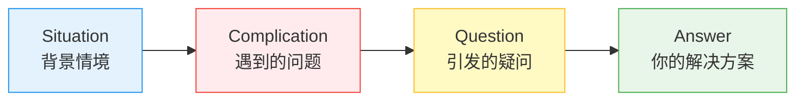

# ppt-outline Skill

**功能**：基于 Barbara Minto 金字塔原理和 McKinsey SCQA 框架，将文档转化为结构化、逻辑清晰的 PPT 大纲，提供完整的故事线设计和内容组织规范。

**职责边界**：
- ✅ **本skill负责**：大纲结构设计、Slide Type 分类、页数控制、Bullet Points 规范、Key Decision 识别、MECE 验证、故事弧设计
- 🔗 **协作skill**：
  - `ppt-visual.skill`：视觉层次设计、布局构图
  - `ppt-layout.skill`：具体 Layout Templates 实现

---

## 1. 方法论基础

### 1.1 Pyramid Principle（金字塔原理）

**Barbara Minto核心结构**：
```
           [核心结论]
          /    |    \
      [论据1][论据2][论据3]
       / \    / \    / \
     细节 细节 细节 细节 细节 细节
```

**原则**：
1. **结论先行**（Answer First）：第1-3页必须包含核心结论
2. **以上统下**（Top-Down）：上层总结下层内容
3. **归类分组**（Grouping）：相同性质的论据放一起
4. **逻辑递进**（Logical Order）：演绎（大前提→小前提→结论）或归纳（现象1+2+3→结论）

**PPT应用**：
```yaml
Slide 1: 标题页（项目名称 + 核心价值主张）
Slide 2: 执行摘要（Executive Summary - 核心结论）
Slide 3: Key Decisions（关键决策 - 必须在前5页）
Slide 4-N: 支撑论据（分3-5个部分）
Slide N+1: 下一步行动（Next Steps）
Slide N+2: 附录（Appendix - 技术细节）
```

---

### 1.2 SCQA Framework（情境-冲突-问题-答案）

**McKinsey经典框架**：


**Slide映射**：
- **Situation (1页)**："我们的系统每天处理1亿请求..."
- **Complication (1-2页)**："但P99延迟超过500ms，用户流失率上升..."
- **Question (隐含)**："如何降低延迟并保持高可用？"
- **Answer (3-5页)**："通过缓存层+异步处理，延迟降至50ms..."

**实现代码**：
```python
def apply_scqa(content):
    """识别并标注SCQA结构"""
    scqa = {
        'situation': extract_background(content),
        'complication': extract_problems(content),
        'question': infer_core_question(content),
        'answer': extract_solutions(content)
    }
    
    slides = [
        {'type': 'situation', 'title': '业务背景', 'content': scqa['situation']},
        {'type': 'complication', 'title': '面临挑战', 'content': scqa['complication']},
        {'type': 'answer', 'title': '解决方案', 'content': scqa['answer']},
    ]
    return slides
```

---

### 1.3 MECE Principle（相互独立，完全穷尽）

**定义**：
- **Mutually Exclusive**：各部分无重叠
- **Collectively Exhaustive**：覆盖所有情况

**示例**（系统架构分析）：
```
✅ MECE分类：
- 前端层（React）
- 业务逻辑层（Spring Boot）
- 数据层（MySQL + Redis）
- 基础设施层（Kubernetes）

❌ 非MECE分类：
- 用户界面
- API服务
- 数据库
- 缓存  ← 缓存属于数据层，重叠了
- 性能优化 ← 跨多层，不独立
```

**检查算法**：
```python
def check_mece(sections):
    """检查是否符合MECE原则"""
    issues = []
    
    # 检查互斥性（Mutually Exclusive）
    keywords = []
    for section in sections:
        section_keywords = extract_keywords(section)
        overlap = set(keywords) & set(section_keywords)
        if overlap:
            issues.append(f"重叠关键词: {overlap}")
        keywords.extend(section_keywords)
    
    # 检查穷尽性（Collectively Exhaustive）
    if len(sections) < 3:
        issues.append("分类过少，可能不够穷尽")
    
    return len(issues) == 0, issues
```

---

### 1.4 Story Arc（故事弧）

**经典三幕结构**：
```
强度
 ↑
 │     高潮
 │      /\
 │     /  \
 │    /    \___
 │   /         \
 │  /           \
 │ /             \
 │/_______________\___→ 时间
 起  发展  高潮  解决
```

**PPT应用**：
```yaml
Act 1 - Setup (建立背景, 20%):
  - 标题页
  - 背景介绍
  - 问题陈述

Act 2 - Confrontation (冲突展开, 60%):
  - 数据分析
  - 问题深化
  - 方案探索
  - **高潮**: 关键决策页（Key Decision）

Act 3 - Resolution (解决方案, 20%):
  - 推荐方案
  - 实施计划
  - 下一步行动
```

---

## 2. 大纲设计规范

### 2.1 Slide Type 分类

**功能**：定义8种标准 Slide 类型，确保大纲结构完整。

**标准类型**：

1. **title**: 标题页
   - 要素：项目名称、日期、作者
   - 位置：第1页

2. **executive-summary**: 执行摘要
   - 要素：核心结论（1句话）、关键数字（2-3个）
   - 位置：第2页
   - 规则：高管应该只看这一页就能决策

3. **key-decision**: 关键决策
   - 要素：决策问题、推荐方案、理由
   - 位置：前5页内（McKinsey标准）
   - 标识：🔑 图标或高亮边框

4. **section-divider**: 章节分隔
   - 要素：大标题、章节编号
   - 视觉：全屏背景色或大图

5. **content**: 内容页（最常见）
   - 子类型：
     - `bullets`: 列表
     - `two-column`: 双栏对比
     - `diagram`: 图表为主
     - `image`: 图片为主

6. **comparison**: 对比分析
   - 格式：表格或并列图表
   - 规则：最多比较3个对象

7. **timeline**: 时间线/路线图
   - 格式：水平时间轴
   - 要素：里程碑、日期、负责人

8. **appendix**: 附录
   - 内容：技术细节、完整数据、备查资料
   - 位置：最后
   - 标识：灰色标题或小字号

---

### 2.2 页数控制规则

**Guy Kawasaki 10/20/30 Rule**：

```python
SLIDE_LIMITS = {
    'executive-briefing': 10,     # 高管汇报：≤10页
    'technical-review': 20,       # 技术评审：15-20页
    'sales-pitch': 10,            # 销售演示：≤10页
    'academic': 30,               # 学术报告：≤30页
    'workshop': 50                # 培训课程：可更多
}

def control_slide_count(content, presentation_type):
    target = SLIDE_LIMITS[presentation_type]
    current = len(content.sections)
    
    if current > target * 1.2:
        # 合并相似内容
        content = merge_similar_sections(content)
    
    if current > target:
        # 移至附录
        content = move_to_appendix(content, threshold=target)
    
    return content
```

### 2.3 Bullet Points 规范

**6x6 Rule**（每页最多6条，每条最多6词）：

```yaml
bullets_per_slide:
  max: 6          # 每页最多6个bullets
  recommended: 3-5

words_per_bullet:
  max: 6-8        # 每条最多6-8个词
  recommended: 4-5

levels:
  max: 2          # 最多2级嵌套（主bullet + 子bullet）
```

**检查代码**：
```python
def validate_bullets(slide):
    """验证bullets规则"""
    issues = []
    
    if len(slide.bullets) > 6:
        issues.append(f"Bullets过多: {len(slide.bullets)} > 6")
    
    for bullet in slide.bullets:
        word_count = len(bullet.split())
        if word_count > 8:
            issues.append(f"Bullet过长: '{bullet[:30]}...' ({word_count} words)")
    
    return issues
```

### 2.4 Key Decision 识别

**功能**：自动识别关键决策内容，确保在前5页展示（McKinsey 标准）。

```python
def identify_key_decisions(content):
    """自动识别关键决策内容"""
    decision_keywords = [
        '推荐', 'recommend', '选择', 'choose',
        '决定', 'decide', '方案', 'approach',
        'go/no-go', '批准', 'approve'
    ]
    
    key_slides = []
    for section in content.sections:
        if any(kw in section.title.lower() or kw in section.text.lower() 
               for kw in decision_keywords):
            key_slides.append({
                'type': 'key-decision',
                'title': section.title,
                'content': section.text,
                'position': 'early'  # 必须放在前5页
            })
    
    return key_slides
```

---

## 3. 集成接口

### 3.1 输入格式
```json
{
  "sections": [
    {
      "level": 2,
      "title": "系统架构",
      "text": "当前系统采用微服务架构...",
      "bullets": ["推荐模块", "检索模块", "排序模块"],
      "raw": "## 系统架构\n..."
    }
  ],
  "presentation_type": "technical-review",
  "audience": "技术团队",
  "slide_target": 15
}
```

### 3.2 输出格式
```json
{
  "slides": [
    {
      "id": 1,
      "type": "title",
      "title": "在线推荐系统架构评审",
      "subtitle": "技术团队 | 2026-01-28"
    },
    {
      "id": 2,
      "type": "executive-summary",
      "title": "核心结论",
      "bullets": [
        "推荐使用缓存层优化，P99延迟降至45ms（提升62%）",
        "预计节省服务器成本30%",
        "Q1上线，无业务风险"
      ],
      "visual_hint": "chart",
      "notes": "强调性能提升和成本节省"
    },
    {
      "id": 3,
      "type": "key-decision",
      "title": "关键决策：选择Redis作为缓存层",
      "bullets": [
        "支持10万QPS（满足3倍扩展需求）",
        "P99延迟<5ms（满足45ms目标）",
        "团队已有运维经验（降低风险）"
      ],
      "decision_type": "technical",
      "icon": "🔑",
      "emphasis": true
    }
  ],
  "structure": {
    "scqa": {
      "situation": [1, 4],
      "complication": [5, 6],
      "answer": [7, 12]
    },
    "story_arc": {
      "setup": [1, 3],
      "confrontation": [4, 10],
      "climax": 3,
      "resolution": [11, 15]
    }
  },
  "validation": {
    "mece_check": true,
    "slide_count": 15,
    "key_decisions_early": true,
    "bullets_compliant": true
  }
}
```

---

## 4. 最佳实践

### 4.1 大纲组织规范

**DO**：
- ✅ **第2页放 Executive Summary**（核心结论）— Pyramid Principle
- ✅ **前5页包含 Key Decision**（关键决策）— McKinsey 标准
- ✅ **使用 SCQA 框架**组织故事（Situation → Complication → Answer）
- ✅ **确保 MECE**：各部分相互独立且完全穷尽
- ✅ **应用 Story Arc**：建立背景 → 冲突展开 → 高潮决策 → 解决方案
- ✅ **为每页生成 Speaker Notes**：辅助演讲者理解内容

**DON'T**：
- ❌ **结论放最后**：不是学术论文，商业演示结论先行
- ❌ **超过目标页数20%**：控制在合理范围（10/20/30 Rule）
- ❌ **重复内容**：违反 MECE 原则
- ❌ **没有明确故事线**：观众容易迷失

### 4.2 Slide 内容规范

**DO**：
- ✅ **控制 Bullets 数量**：≤5条（推荐3-5条）
- ✅ **Bullet 简洁**：≤6-8词/条
- ✅ **嵌套层级**：最多2级（主bullet + 子bullet）
- ✅ **一页一主题**：避免信息过载

**DON'T**：
- ❌ **每页超过6个 bullets**：6x6 Rule
- ❌ **Bullet 超过8个词**：可读性差
- ❌ **过度嵌套**：>2级难以理解

### 4.3 决策页设计规范

**DO**：
- ✅ **明确决策问题**：What decision needs to be made?
- ✅ **推荐方案清晰**：Our recommendation is...
- ✅ **提供3个理由**：Why this option? (Pyramid Principle)
- ✅ **标识重要性**：🔑 图标或高亮边框

**DON'T**：
- ❌ **模糊的建议**："可能考虑..." → "推荐使用..."
- ❌ **缺少理由**：只有结论没有支撑
- ❌ **放在后面**：Key Decision 必须在前5页

---

## 5. 综合实现示例

**完整大纲生成流程**：

```python
class OutlineGenerator:
    """PPT大纲生成器 - 整合所有方法论"""
    
    def __init__(self, presentation_type='technical-review'):
        self.type = presentation_type
        self.target_slides = self._get_slide_limit(presentation_type)
    
    def _get_slide_limit(self, ptype):
        """根据演示类型确定页数目标"""
        limits = {
            'executive-briefing': 10,     # 高管汇报
            'technical-review': 20,       # 技术评审
            'sales-pitch': 10,            # 销售演示
            'academic': 30,               # 学术报告
            'workshop': 50                # 培训课程
        }
        return limits.get(ptype, 20)
    
    def generate(self, sections):
        """生成完整PPT大纲"""
        # Step 1: 应用 Pyramid Principle - 结构化内容
        slides = self._build_pyramid(sections)
        
        # Step 2: 应用 SCQA Framework - 组织故事线
        slides = self._apply_scqa(slides)
        
        # Step 3: 识别 Key Decisions - 提前关键决策
        key_decisions = self._identify_key_decisions(slides)
        slides = self._insert_key_decisions_early(slides, key_decisions)
        
        # Step 4: 检查 MECE - 验证逻辑完整性
        is_mece, issues = self._check_mece(slides)
        if not is_mece:
            slides = self._fix_mece_issues(slides, issues)
        
        # Step 5: 应用 Story Arc - 构建情感曲线
        slides = self._apply_story_arc(slides)
        
        # Step 6: 控制页数 - 移动次要内容到附录
        if len(slides) > self.target_slides:
            slides = self._move_to_appendix(slides)
        
        # Step 7: 验证 Bullets - 6x6 Rule
        for slide in slides:
            self._validate_bullets(slide)
        
        return {
            'slides': slides,
            'structure': self._generate_structure_metadata(slides),
            'validation': self._generate_validation_report(slides)
        }
    
    def _build_pyramid(self, sections):
        """构建金字塔结构"""
        # 1. 提取核心结论（金字塔顶端）
        conclusion = self._extract_conclusion(sections)
        
        # 2. 分组论据（金字塔第二层）
        arguments = self._group_arguments(sections)
        
        # 3. 细化细节（金字塔底层）
        details = self._extract_details(sections)
        
        return [
            {'type': 'title', 'title': sections[0].title},
            {'type': 'executive-summary', 'content': conclusion},
            *arguments,
            *details
        ]
    
    def _apply_scqa(self, slides):
        """应用 SCQA 框架标注"""
        scqa_map = {'situation': [], 'complication': [], 'answer': []}
        
        for idx, slide in enumerate(slides):
            # 识别 SCQA 阶段
            if self._is_situation(slide):
                scqa_map['situation'].append(idx)
            elif self._is_complication(slide):
                scqa_map['complication'].append(idx)
            elif self._is_answer(slide):
                scqa_map['answer'].append(idx)
        
        # 在slides中添加SCQA元数据
        for slide_type, indices in scqa_map.items():
            for idx in indices:
                slides[idx]['scqa_phase'] = slide_type
        
        return slides
    
    def _identify_key_decisions(self, slides):
        """识别关键决策内容"""
        decision_keywords = [
            '推荐', 'recommend', '选择', 'choose',
            '决定', 'decide', '方案', 'approach',
            'go/no-go', '批准', 'approve'
        ]
        
        key_decisions = []
        for slide in slides:
            title = slide.get('title', '').lower()
            content = str(slide.get('content', '')).lower()
            
            if any(kw in title or kw in content for kw in decision_keywords):
                key_decisions.append({
                    **slide,
                    'type': 'key-decision',
                    'icon': '🔑',
                    'emphasis': True
                })
        
        return key_decisions
    
    def _check_mece(self, slides):
        """检查 MECE 原则"""
        # 提取各部分关键词
        sections_keywords = []
        for slide in slides:
            if slide.get('type') in ['content', 'section-divider']:
                keywords = self._extract_keywords(slide)
                sections_keywords.append(keywords)
        
        # 检查互斥性（Mutually Exclusive）
        issues = []
        for i, kw1 in enumerate(sections_keywords):
            for j, kw2 in enumerate(sections_keywords[i+1:], start=i+1):
                overlap = set(kw1) & set(kw2)
                if len(overlap) > 2:  # 允许少量共同词汇
                    issues.append(f"Section {i} and {j} overlap: {overlap}")
        
        # 检查穷尽性（Collectively Exhaustive）
        if len(sections_keywords) < 3:
            issues.append("Too few sections, may not be exhaustive")
        
        return len(issues) == 0, issues
    
    def _validate_bullets(self, slide):
        """验证 Bullet Points 规则"""
        bullets = slide.get('bullets', [])
        issues = []
        
        # 规则1: 每页最多6个bullets
        if len(bullets) > 6:
            issues.append(f"Too many bullets: {len(bullets)} > 6")
        
        # 规则2: 每条最多8个词
        for bullet in bullets:
            word_count = len(bullet.split())
            if word_count > 8:
                issues.append(f"Bullet too long: '{bullet[:30]}...' ({word_count} words)")
        
        if issues:
            slide['validation_issues'] = issues
        
        return len(issues) == 0
```

---

## 6. 资源和参考

### 6.1 核心文献

- **Barbara Minto** - *The Pyramid Principle* (1987) - McKinsey 方法论经典
- **Gene Zelazny** - *Say It With Charts* - McKinsey 图表指南
- **Nancy Duarte** - *Resonate* (2010) - 故事弧设计大师
- **Michael Alley** - *The Craft of Scientific Presentations* - Assertion-Evidence 框架
- **Guy Kawasaki** - *The 10/20/30 Rule of PowerPoint* - 页数控制黄金法则

### 6.2 McKinsey 标准

- **McKinsey & Company** - *Presentation Standards* - 专业咨询演示规范
- **MECE Framework** - 结构化思维工具
- **SCQA Framework** - 故事叙述标准

### 6.3 相关 Skills

- `ppt-visual.skill` - 视觉层次设计、Material Design 应用
- `ppt-layout.skill` - Layout Templates、Grid System
- `ppt-chart.skill` - 数据可视化、Cleveland Hierarchy
