# PPT Agent Collaboration Protocol

**Purpose**: Define the collaboration workflow, iteration limits, and quality gates for the PPT creation team to ensure efficient and high-quality presentation generation.

**Version**: 1.0  
**Last Updated**: 2026-01-28

---

## Overview

The PPT creation follows a **specialist-driven collaboration model** where each agent has a clear, focused responsibility, aligned to real-world creative industry workflows rather than software development patterns.

**Design Philosophy**:
- Visual designers handle both layouts and charts (like Apple Keynote team)
- Content strategists do self-QA on content quality (like McKinsey consultants)
- Creative directors coordinate and make final decisions (like IDEO/Pentagram)

---

## Team Structure (3-Agent Architecture)

```mermaid
graph TB
    User[👤 用户请求] --> CD[🎯 ppt-creative-director<br/>启动 + 异常仲裁]
    
    CD -->|"① launch"| CP[📝 ppt-content-planner<br/>内容策略 + 自检]
    CP -->|"② self-check pass → auto-handoff"| VD[🎨 ppt-visual-designer<br/>视觉设计 + 自检]
    VD -->|"③ self-check pass → auto-handoff"| PS[⚙️ ppt-specialist<br/>PPTX 生成 + QA]
    
    PS --> Gate{📊 自动质量门控<br/>Score≥70?<br/>Critical=0?}
    Gate -->|Yes| Deliver[✅ 自动交付<br/>PPTX + 报告]
    Gate -->|No, fixable| PS
    Gate -->|No, design issue| VD
    Gate -->|No, content issue| CP
    Gate -->|Unresolvable| CD
    
    CP -.->|"self-check fail / infeasibility"| CD
    VD -.->|"self-check fail / infeasibility"| CD
    PS -.->|"iter > 2 / critical"| CD
    CD -.->|"revision"| CP
    CD -.->|"revision"| VD
    
    style CD fill:#FFD700,stroke:#FF8C00,stroke-width:3px
    style CP fill:#87CEEB,stroke:#4682B4,stroke-width:2px
    style VD fill:#98FB98,stroke:#32CD32,stroke-width:2px
    style PS fill:#FFE0B2,stroke:#F59E0B,stroke-width:2px
    style Gate fill:#FFF9C4,stroke:#FBC02D,stroke-width:2px
    style Deliver fill:#C8E6C9,stroke:#4CAF50,stroke-width:3px
```



**Key Design Decisions**:
- ✅ **3 core roles** (vs 5 in original): content-planner, visual-designer, creative-director
- ✅ **Chart integration**: chart-specialist → visual-designer (real designers handle both layout and charts)
- ✅ **Distributed QA**: qa-reviewer → content-planner (content QA) + visual-designer (visual QA) + specialist (auto-delivery gate)
- ✅ **Pipeline mode**: CD launches, agents self-check and auto-handoff; CD only re-enters on escalated failures
- ✅ **Auto-delivery**: Specialist auto-delivers when score ≥ 70 AND critical == 0 (no CD approval needed)

**Industry Alignment**:
| Agent             | Real-World Role                | Representative Companies/People                      |
| ----------------- | ------------------------------ | ---------------------------------------------------- |
| -------           | ----------------               | --------------------------------                     |
| content-planner   | Content Strategist             | McKinsey Consultants, Barbara Minto                  |
| visual-designer   | Visual Designer + Chart Expert | Apple Keynote, Edward Tufte, Cole Nussbaumer Knaflic |
| creative-director | Creative Director              | IDEO, Pentagram, Duarte Design                       |

---

## Agent Responsibilities

### ppt-content-planner

**Role**: Content Strategist (aligned to McKinsey, Barbara Minto)

**Deliverables**: `.slides.md` + `slides_semantic.json` + `content_qa_report.json`

**Input**: User request, design documents

**Output to**: `ppt-visual-designer`

**Core Responsibilities**:
- **Content Planning**: Slide count, story flow, bullet points
- **Structure Design**: Hierarchical SCQA (macro + section-level + transitions), Pyramid Principle
- **Visual Type Assignment**: Assign visual_type from 3-level taxonomy (10 basic + 8 analytical + 6 domain-specific)
- **KPI Traceability**: Define KPIs in Key Decisions, trace through evidence and summary slides
- **Timing & Pacing Analysis**: Validate slide count fits allocated time; flag dense sections
- **Cognitive Intent Annotation**: Annotate critical visuals with primary_message, emotional_tone, attention_flow, key_contrast
- **Domain Extension Packs**: Activate domain-specific decision extraction patterns (e.g., Power Electronics, Manufacturing, Standards)
- **Content Quality Self-Check**: Logic consistency, Key Decisions completeness, bullet compliance, KPI traceability, timing feasibility

**Key Decisions**:
- Slide count and story flow
- Which slides need visualizations (with specific visual_type from taxonomy)
- Key Decisions placement (first 3-5 slides)
- Bullet points and text density (content level)
- KPI definition and traceability mapping
- Domain extension pack activation

**Quality Ownership**: Content quality (40/100 points)

**Referenced Standards**:
- `agents/ppt-content-planner.agent.md`
- Barbara Minto - *The Pyramid Principle*
- McKinsey - MECE Framework

---

### ppt-visual-designer

**Role**: Visual Designer + Chart Specialist (aligned to Apple Keynote, Edward Tufte, Cole Nussbaumer Knaflic)

**Deliverables**: 
- `.slides.md` (with theme + layouts + chart configs)
- PNG chart files

**Input**: `ppt-content-planner` output

**Output to**: `skills/ppt-generator/bin/generate_pptx.py` (pre-built renderer, ~1477 lines)

**Core Responsibilities**:
- **Visual Design**: Theme, colors, typography, layouts
- **Chart Design**: All 3 taxonomy levels — Basic (bar, line, pie, flowchart...), Analytical (waterfall, tornado, radar, sankey, bubble, treemap, pareto, funnel), Domain-Specific (engineering_schematic, kpi_dashboard, decision_tree, confidence_band, process_control)
- **Cognitive Intent Consumption**: Translate content-planner's cognitive_intent (emotional_tone, attention_flow, key_contrast) into Material Design tokens and visual specifications
- **Visual Quality Self-Check**: Contrast, aesthetic consistency, chart readability

**Key Decisions**:
- Design philosophy selection (Assertion-Evidence, Tufte, McKinsey Pyramid, etc.)
- Color scheme (primary, secondary, accent)
- Typography (fonts, sizes)
- Chart type selection and visual encoding (across 3-level taxonomy)
- Layout templates (title-only, bullet-list, two-column, full-image)
- Cognitive intent translation to design tokens

**Quality Ownership**: Visual quality (40/100 points)

**Integrated Capabilities**:
- Original visual-designer capabilities
- Original chart-specialist chart design
- Original qa-reviewer visual quality checks

**Referenced Standards**:
- `agents/ppt-visual-designer.agent.md`
- `skills/ppt-visual.skill.md`
- `skills/ppt-chart.skill.md`
- Edward Tufte - *The Visual Display of Quantitative Information*
- Cole Nussbaumer Knaflic - *Storytelling with Data*
- Cleveland Perception Hierarchy

---

### ppt-creative-director

**Role**: Creative Director (aligned to IDEO, Pentagram, Duarte Design)

**Core Responsibilities**:
- **Pipeline Launcher**: Launch the pipeline (determine session-id, create brief, handoff to CP)
- **Exception Handler**: Re-enter the flow ONLY when agents escalate failures they cannot resolve
- **Requirements Understanding**: Identify presentation_type, audience, tone
- **Quality Gating (on escalation)**: Review QA reports, apply checklists, route revisions
- **Decision Making**: Auto-deliver vs Auto-fix vs Human-review (specialist handles happy path automatically)

**Input**: User request (at launch) + escalated failures (during pipeline)

**Deliverables**: 
- Creative brief + session-id + **`visual_style`** (at launch) — visual_style is passed through CP → VD for design token resolution. See `ppt-visual-designer.agent.md § STYLE SYSTEM` for supported presets (`mckinsey`, `bcg`, `bain`, `minimal`, `corporate`, `luxury`, `tech`, `academic`, `md3`, or custom brand name).
- Revision directives (on escalation)
- Final decision (on escalation)

**Decision Framework**:
- ✅ **Auto-deliver**: Handled by specialist automatically (Score≥70 AND Critical=0)
- 🔧 **Auto-fix**: Handled by specialist automatically (Score<70 AND Critical=0 AND fixable AND iter<2)
- 👤 **Human-review**: CD decides on escalation (Critical>0 OR Score<50 OR iter>2)

**Quality Ownership**: Overall quality (20/100 points) + final gate

**Authority**: Final decision maker (but doesn't micromanage)

**Referenced Standards**:
- `agents/ppt-creative-director.agent.md`
- Nancy Duarte - *Slide:ology*
- Guy Kawasaki - 10/20/30 Rule

---

## Data Structure Guidelines

### Components vs Visual: Usage Rules

**Purpose**: Avoid content duplication and clarify data placement strategy.

**Core Principle**: **`components` for structured data → renderer fills layout**; **`visual` for charts/diagrams → designer specifies rendering**.

#### Rule 1: Single Source of Truth
- ✅ **If data is in `components`, do NOT duplicate in `visual` placeholder_data**
- ✅ **If data is in `visual` placeholder_data, do NOT duplicate in `components`**
- ❌ **FORBIDDEN**: Same data in both `components.decisions` AND `visual.placeholder_data` (causes redundant rendering)

#### Rule 2: When to Use `components`
Use `components` when slide needs **structured, semantic data** that specialist can auto-layout:
- **KPI cards**: `components.kpis[]` → renderer creates Material kpi_card layout
- **Decision matrix**: `components.decisions[]` → renderer creates decision cards OR table (depending on slide_type)
- **Comparison table**: `components.comparison_items[]` → renderer creates comparison columns
- **Timeline dots**: `components.timeline_items[]` → renderer creates timeline visualization
- **Action checklist**: `components.action_items[]` → renderer creates checklist cards
- **Risk matrix**: `components.risks[]` → renderer creates risk matrix (2x2 or table)

**Data completeness requirement**: `components` data MUST follow `standards/slides-render-schema.json@v1` field definitions (see MO-0 blocker in content-planner agent).

#### Rule 3: When to Use `visual`
Use `visual` when slide needs **charts, diagrams, or custom graphics**:
- **Charts**: Bar/line/pie/radar charts → `visual.placeholder_data.chart_config` with complete series/labels/values
- **Mermaid diagrams**: Flowcharts/sequence/architecture → `visual.placeholder_data.mermaid_code` with complete diagram syntax
- **Custom images**: Photos/icons/logos → `visual.placeholder_data.image_path`

**Data completeness requirement**: `visual.placeholder_data` MUST be render-ready (see MO-4 blocker in content-planner agent).

#### Rule 4: When to Use BOTH
Use both when slide needs **structured data rendering AND supplementary visualization**:
- ✅ **Example 1 (Decision slide)**: 
  - `components.decisions[]` → left side with detailed decision cards
  - `visual` (summary table) → right side with high-level decision matrix
  - ⚠️ **IMPORTANT**: Visual must NOT duplicate decisions data; instead, derive simplified view (e.g., decisions have full description + rationale + alternatives, visual shows only title + budget + priority)
  
- ❌ **Anti-pattern (Decision slide)**:
  ```json
  "components": {
    "decisions": [
      {"id": "D1", "title": "批准示范", "budget": "$0.5-1.5M", "priority": "P0", "timeline": "立即"}
    ]
  },
  "visual": {
    "placeholder_data": {
      "chart_config": {
        "series": [{"name": "批准示范", "data": ["示范", "$0.5-1.5M", "P0", "立即"]}]
      }
    }
  }
  ```
  ❌ **Problem**: Data duplication → both components and visual render the same information → confusing to user

- ✅ **Correct pattern (Decision slide)**:
  ```json
  "components": {
    "decisions": [
      {
        "id": "D1",
        "title": "批准示范场景与首轮预算",
        "description": "快速验证市场与工程假设，降低长期投资风险",
        "owner": "CTO",
        "budget": "$0.5-1.5M",
        "priority": "P0",
        "timeline": "立即",
        "alternatives": ["延迟至材料验证完成后决策"],
        "risks": ["市场窗口可能收窄"]
      }
    ]
  },
  "visual": {
    "type": "none"  // ✅ OR omit visual entirely
  }
  ```
  ✅ **Why better**: Single source of truth → specialist renders decisions component as cards/matrix based on slide_type

#### Rule 5: Content-Planner Responsibility
- **Primary**: Populate `components` with complete, schema-compliant data
- **Secondary**: Annotate `visual` type + placeholder_data for charts/diagrams (if needed)
- **Forbidden**: Duplicate data between components and visual
- **Check**: Run MO-0 (schema compliance) and MO-4 (visual completeness) before handoff

#### Rule 6: Visual-Designer Responsibility
- Consume `components` data structure → design layout strategy (cards, tables, columns)
- Consume `visual` annotations → specify chart rendering instructions in design_spec.json
- Do NOT re-specify data already in `components` (reference slide_id instead)
- Do NOT invent new data not in slides_semantic.json

#### Rule 7: Specialist Responsibility
- Render `components` using Material Design component library (defined in design_spec.json)
- Render `visual` using chart_config or mermaid_code (specified in design_spec.json)
- If both present: allocate layout regions (typically components on left, visual on right)
- Never duplicate content from different data sources

---

## File Convention (BINDING)

**All agents MUST read from and write to a single session directory. No files should be placed in `output/` or any other ad-hoc location.**

### Session Directory

```
docs/presentations/<session-id>/
```

**`<session-id>` naming rule**: `<topic>-<YYYYMMDD>`, derived from the presentation topic keyword (lowercase, hyphenated) + the date the session starts. Examples: `mft-20260206`, `battery-strategy-20260315`.

The creative-director determines the `<session-id>` at the start of the workflow and communicates it to all agents in the initial handoff.

### Directory Structure

```
docs/presentations/<session-id>/
│
│  ── Content Planner outputs ──
├── slides.md                    # Human-readable slide outline
├── slides_semantic.json         # Machine-readable semantic structure
├── content_qa_report.json       # Content planner self-QA report
│
│  ── Visual Designer outputs ──
├── design_spec.json             # Design system + visual specifications
├── visual_report.json           # Asset manifest + rendering status
├── images/                      # Pre-rendered visual assets
│   ├── cover_bg.jpg             #   Cover slide background image
│   └── slide_{N}_diagram.png    #   Per-slide Mermaid/diagram renders
│
│  ── Specialist outputs ──
├── <project>.pptx               # Final PPTX file
├── qa_report.json               # Post-generation QA validation
│
│  ── Creative Director outputs ──
├── decisions.json               # Decision log (date/issue/decision/rationale)
└── README.md                    # Generation summary & metadata
```

### File Naming Rules

| File | Name | Naming Rule |
|------|------|-------------|
| Slide outline | `slides.md` | Fixed name, no prefix |
| Semantic JSON | `slides_semantic.json` | Fixed name, no prefix |
| Content QA | `content_qa_report.json` | Fixed name |
| Design spec | `design_spec.json` | Fixed name |
| Visual report | `visual_report.json` | Fixed name |
| QA report | `qa_report.json` | Fixed name |
| PPTX | `<project>.pptx` | `<project>` = topic keyword, e.g., `MFT.pptx` |
| Decisions | `decisions.json` | Fixed name |
| Cover image | `images/cover_bg.jpg` | Fixed name, `.jpg` or `.png` |
| Diagram image | `images/slide_{N}_diagram.png` | `{N}` = slide number |

> ⚠️ **FORBIDDEN**: Adding topic prefixes to fixed-name files (e.g., ~~`MFT_slides_semantic.json`~~, ~~`MFT_design_spec.json`~~). All files use their canonical names — the session directory already provides namespace isolation.

### Agent I/O Path Contract

| Agent | Reads From (input) | Writes To (output) |
|-------|--------------------|--------------------|
| content-planner | Source document (user-provided, any location) | `<session-dir>/slides.md`, `slides_semantic.json`, `content_qa_report.json` |
| visual-designer | `<session-dir>/slides_semantic.json` | `<session-dir>/design_spec.json`, `visual_report.json`, `images/*` |
| specialist | `<session-dir>/slides_semantic.json`, `design_spec.json` | `<session-dir>/<project>.pptx`, `qa_report.json` |
| creative-director | All files in `<session-dir>/` | `<session-dir>/decisions.json`, `README.md` |

### Renderer CLI Convention

```bash
python3 skills/ppt-generator/bin/generate_pptx.py \
  --semantic docs/presentations/<session-id>/slides_semantic.json \
  --design   docs/presentations/<session-id>/design_spec.json \
  --output   docs/presentations/<session-id>/<project>.pptx
```

### Image Path Convention

- Images in `design_spec.json` use **relative paths from the session directory** (e.g., `"background_image": "images/cover_bg.jpg"`).
- The renderer resolves image paths relative to the `--design` file's parent directory.
- Visual designer MUST `cd` into or reference the session directory when downloading images.

---

## Workflow Steps (Pipeline Mode)

> **Design principle**: The pipeline flows **CP → VD → PS** automatically after CD launches. Each agent runs self-checks before handing off to the next. CD only re-enters the flow on **escalated failures** — NOT for routine approval gates. This eliminates 3 manual approval steps and makes the process fully automated for the happy path.

### 1. Launch (CD → CP)

```yaml
agent: ppt-creative-director
action:
  - Determine session-id (<topic>-<YYYYMMDD>)
  - Create session directory: docs/presentations/<session-id>/
  - Define creative brief (audience, goals, tone, constraints)
  - Send "content planning" handoff to ppt-content-planner
input: user_request, source_md
output_to: ppt-content-planner
note: This is the ONLY step where CD actively initiates. After this, the pipeline auto-flows.
```

### 2. Content Planning (CP → VD, auto-handoff)

```yaml
agent: ppt-content-planner
input: [user_request, source_md, presentation_type, session-id]
output: slides.md + slides_semantic.json + content_qa_report.json
self_check: content_quality (MO-0 through MO-12)
on_pass: auto-handoff → ppt-visual-designer ("visual design" handoff)
on_fail: escalate → ppt-creative-director with failure details
success_criteria:
  - Key Decisions identified
  - Slide count within limits
  - Visual needs marked
  - Logical structure (Pyramid Principle)
  - Bullets within limits
  - slides_semantic.json completeness = 100%
  - KPI traceability ≥ 80%
  - MO-6: No fabricated data (all values traceable to source)
  - MO-7: content[] does not duplicate component labels
  - MO-8: Title slide has empty components
  - MO-9: No data duplication between components and visual
  - MO-12: Cover slide title uses frontmatter title (NOT heading label)
```

### 3. Visual Design (VD → PS, auto-handoff)

```yaml
agent: ppt-visual-designer
input: slides_semantic.json (from content-planner, self-check passed)
output: design_spec.json + visual_report.json + diagram PNGs
self_check: visual_quality (MV-1 through MV-11)
on_pass: auto-handoff → ppt-specialist ("generate pptx" handoff)
on_fail: escalate → ppt-creative-director with failure details
on_infeasibility: escalate → ppt-creative-director
success_criteria:
  - Theme applied (colors, fonts)
  - Layout templates defined
  - Design philosophy selected
  - All required diagrams configured
  - Visual style consistent
  - Color contrast ≥4.5:1
  - High-resolution output (200 DPI)
  - Cognitive intent consumed
  - design_spec.json key structure valid (MV-9)
  - Cover slide background image sourced and referenced (MV-10)
```

#### design_spec.json Schema Contract (BINDING)

The renderer (`generate_pptx.py`) reads design tokens from **specific top-level keys**. Both the visual-designer (producer) and specialist (consumer) MUST adhere to this contract:

| Token Type | REQUIRED Key Path | FORBIDDEN Key Path | Consequence if Wrong |
|---|---|---|---|
| Colors | `color_system` (top-level dict) | `tokens.colors` | All colors fall back to near-black #1A1C1E |
| Typography | `typography_system.explicit_sizes` | `tokens.typography_system` | All fonts fall back to 14pt uniform |
| Grid | `grid_system` (top-level) | `design_system.grid_system` only | Grid defaults used |
| Layout | `layout_zones` (top-level) | nested anywhere | Fixed title/bottom bar heights |
| Slide types | `slide_type_layouts` (top-level) | nested anywhere | Default background for all slides |
| Slide types (title) | `slide_type_layouts.title.background_image` | n/a | Solid color only, no cover image (optional but recommended) |
| Section accents | `section_accents` (top-level) | nested anywhere | All sections use primary color |

**Pre-flight validation**: Specialist MUST verify these keys exist before running renderer. CRITICAL failures block execution.

> Note: The renderer has resilient fallbacks (`tokens.colors`, `theme_tokens.palette`, `_DEFAULTS`) but these are safety nets, not the intended path. Visual designer SHOULD output the REQUIRED structure.

### 4. PPTX Generation & Auto-QA (PS, auto-deliver / rollback / escalate)

```yaml
agent: ppt-specialist
input: slides_semantic.json + design_spec.json
steps:
  1. Run preflight_check(design_spec) → classify issues
  2. If CRITICAL design issues → rollback to visual-designer
  3. If CRITICAL content issues → rollback to content-planner
  4. If ambiguous CRITICAL → escalate to creative-director
  5. Run renderer → generate PPTX
  6. Run validation (MR-1 through MR-15)
  7. Compute qa_report.json (score + critical count)
  8. Apply auto-delivery decision logic (see below)

auto_delivery_logic:
  auto_deliver:
    condition: score ≥ 70 AND critical_issues == 0
    action: Package artifacts + deliver to user
  auto_fix:
    condition: score < 70 AND critical_issues == 0 AND fixable AND fix_iter < 2
    action: Fix renderer → re-run → re-validate (loop back to step 5)
  rollback_to_visual:
    condition: issues trace to design_spec (colors, typography, layout)
    action: Send "rollback design" handoff to visual-designer
  rollback_to_content:
    condition: issues trace to content (missing slides, bad structure)
    action: Send "rollback content" handoff to content-planner
  escalate:
    condition: critical_issues > 0 AND fix_iter ≥ 2 OR unresolvable
    action: Escalate to creative-director with full qa_report.json
```

#### Auto-Delivery Decision Tree

```
preflight_check(design_spec)
├─ CRITICAL (design) → rollback to VD (max 1 round)
├─ CRITICAL (content) → rollback to CP (max 1 round)
├─ CRITICAL (ambiguous) → escalate to CD
└─ PASS → run renderer
    ├─ score ≥ 70 AND critical == 0 → ✅ AUTO-DELIVER
    ├─ score < 70 AND critical == 0 AND fixable → 🔧 AUTO-FIX (≤2 iter)
    │   └─ after fix → re-validate
    │       ├─ score ≥ 70 → ✅ AUTO-DELIVER
    │       └─ still < 70 → escalate to CD
    ├─ critical > 0 AND design-related → rollback to VD
    ├─ critical > 0 AND content-related → rollback to CP
    └─ critical > 0 AND iter ≥ 2 → escalate to CD → human-review
```

#### Rollback Classification Rules

| Issue Pattern | Rollback Target | Examples |
|---|---|---|
| Missing/wrong color tokens, typography, layout_zones | visual-designer | MV-9 key structure, contrast failures |
| Missing/wrong slide_type_layouts, component_library | visual-designer | Preflight CRITICAL on slide types |
| Missing slides, bad SCQA structure, empty components | content-planner | MO-7, MO-8, MO-9 violations |
| Section count mismatch, KPI gaps | content-planner | MR-5, MO-11 violations |
| Renderer bug (code issue, not data) | specialist self-fix | MR-1 through MR-15 code fixes |
| Ambiguous / cross-cutting | creative-director | Multiple agents' artifacts at fault |

---

## Iteration Limits

### Rule 1: Maximum Iterations = 2

Any feedback loop between two agents is limited to **2 iterations**.

| Interaction                                | Max Iterations  | Escalation                    |
| ------------------------------------------ | --------------- | ----------------------------- |
| -------------                              | --------------- | -----------                   |
| content-planner ↔ visual-designer          | 2               | creative-director arbitration |
| creative-director → auto-fix → re-evaluate | 2               | human-review required         |

### Rule 2: Iteration Counting

```text
Iteration 1: content-planner → visual-designer (initial submission)
Iteration 2: visual-designer → content-planner (feedback / change request)
Iteration 3: ❌ Exceeded - escalate to creative-director
```

### Rule 3: Iteration Tracking Template

Every feedback message MUST include the iteration count:

```markdown
## Feedback (Iteration 1/2)

**From**: @ppt-visual-designer
**To**: @ppt-content-planner
**Remaining Iterations**: 1

**Issue**: Slide 4 has 8 bullets, exceeds limit of 5 for technical-review

**Request**: Split Slide 4 into two slides or convert to visual diagram

**Reason**: presentation_type = technical-review requires max_bullets = 5
           Visual diagram more effective for complex comparisons

---
⚠️ Note: If not resolved, next iteration escalates to @ppt-creative-director
```

---

## Quality Gates

### Content Quality (Self-Check by ppt-content-planner)

- ✅ Key Decisions in first 3-5 slides (with KPIs defined)
- ✅ Bullet points ≤ max_bullets (per presentation_type)
- ✅ Text density ≤ max_chars (per slide)
- ✅ Speaker notes coverage ≥ 80%
- ✅ Logical structure (Hierarchical SCQA + Pyramid Principle)
- ✅ KPI traceability ≥ 80% (all defined KPIs traced through evidence slides)
- ✅ Timing feasibility (avg ≤1.5 min/slide; no section >2× average)
- ✅ slides_semantic.json completeness (100% slide coverage)
- ✅ Cognitive intent on ≥3 critical visuals
- ✅ Domain extension packs activated appropriately

### Visual Quality (Self-Check by ppt-visual-designer)

- ✅ Color contrast ratio ≥ 4.5:1 (WCAG AA)
- ✅ Visual coverage ≥ 30% (charts/images)
- ✅ Aesthetic consistency (same theme)
- ✅ Chart quality (Cleveland Hierarchy) across all 3 taxonomy levels
- ✅ Layout balance (white space)
- ✅ Cognitive intent consumed (emotional_tone → design tokens applied)
- ✅ Level 2/3 visual types rendered correctly

### Overall Quality (Final Gate by ppt-creative-director)

**Blocking Conditions** (prevent delivery):
- ❌ Final Score < 70
- ❌ Critical issues > 0
- ❌ Key Decisions missing
- ❌ slides_semantic.json missing or empty
- ❌ KPI defined in Key Decisions but never referenced in evidence slides

**Warning Conditions** (deliver with notes):
- ⚠️ Major issues > 2
- ⚠️ Visual coverage < 30%
- ⚠️ KPI traceability < 80%
- ⚠️ Timing feasibility = warning (sections pacing > 1.5× average)
- ⚠️ Cognitive intent missing on >50% of critical visuals

---

## Evaluation Formula

```python
# Content Quality (40分)
content_score = 40 * (
    0.20 * key_decisions_score +      # 关键决策 8分
    0.20 * bullets_compliance +        # bullets规范 8分
    0.15 * speaker_notes_coverage +    # speaker notes 6分
    0.10 * text_density_compliance +   # 文本密度 4分
    0.15 * kpi_traceability +          # KPI 可追溯性 6分 (NEW)
    0.10 * timing_feasibility +        # 时间/节奏 4分 (NEW)
    0.10 * semantic_json_completeness  # slides_semantic.json 完整性 4分 (NEW)
)

# Visual Quality (40分)
visual_score = 40 * (
    0.25 * color_contrast +            # 对比度 10分
    0.25 * visual_coverage +           # 可视化覆盖 10分
    0.15 * aesthetic_consistency +     # 美学一致性 6分
    0.15 * chart_quality +             # 图表质量 6分
    0.10 * cognitive_intent_applied +  # 认知意图消费 4分 (NEW)
    0.10 * visual_type_diversity       # 视觉类型多样性 4分 (NEW)
)

# Overall Quality (20分)
overall_score = 20 * (
    0.4 * slide_count_compliance +     # 页数 8分
    0.3 * design_philosophy_match +    # 哲学符合 6分
    0.3 * domain_pack_appropriateness  # 领域包适当性 6分 (NEW)
)

final_score = content_score + visual_score + overall_score
passed = (final_score >= 70) and (critical_issues == 0)
```

---

## Success Metrics

Target KPIs for PPT generation workflow:

- ✅ End-to-end automation rate ≥80%
- ✅ Average generation time <60 seconds
- ✅ Quality score ≥70 in 90% of cases
- ✅ Human intervention rate <20%
- ✅ Agent iteration overruns <5%
- ✅ Content-planner self-check pass rate ≥95%
- ✅ Visual-designer self-check pass rate ≥88%

---

## Anti-patterns

### ❌ Anti-pattern 1: Iteration Overflow

```text
content-planner → visual-designer → content-planner → visual-designer → ...
```

**Problem**: No iteration limit leads to never-ending cycles

**Correct approach**: Escalate to creative-director after 2 iterations

### ❌ Anti-pattern 2: Skipping Self-Check

```text
content-planner → visual-designer (without content quality check)
```

**Problem**: Low-quality content flows downstream, wasting visual-designer time

**Correct approach**: Always run self-check before submitting to next agent

### ❌ Anti-pattern 3: Unnecessary CD Approval Gates

```text
CP → CD (approve) → VD → CD (approve) → PS → CD (approve) → deliver
```

**Problem**: CD inserted as approval gate at every step, adding latency without value (all checks are mechanical JSON/score validations)

**Correct approach**: Pipeline mode — agents self-check and auto-handoff; CD only re-enters on escalated failures

### ❌ Anti-pattern 4: Ignoring Quality Gates

```text
Final score = 65, Critical = 1
Action: Auto-deliver ❌
```

**Problem**: Delivering low-quality PPT damages reputation

**Correct approach**: Trigger human-review when gates fail

---

## Degraded Output Strategies

When user input is incomplete, employ graceful degradation:

### Strategy 1: Assumptions with Placeholders

```markdown
## Degraded Output Declaration

**Reason**: User did not specify target audience

**Assumptions Made**:
- Audience: Technical team (default for design docs)
- Presentation type: technical-review
- Tone: Professional

**Placeholders**:
- Slide 1: [Company Logo] - replace with actual logo
- Slide 15: [Contact Info] - replace with actual contact

⚠️ **User**: Please confirm assumptions or provide corrections
```

### Strategy 2: Minimal Viable PPT

```markdown
## MVP Delivery

Due to incomplete input, delivering minimal viable version:

### Phase 1: Completed ✅
- Core content structure (10 slides)
- Key Decisions slide
- Basic theme applied

### Phase 2: Pending User Input ⏳
- Custom branding (logo, colors)
- Detailed speaker notes
- Custom charts (need data)

**Required from User**:
- [ ] Company branding guidelines
- [ ] Detailed data for charts
- [ ] Speaker notes content
```

---

## Escalation to Human Review

### Automatic Triggers

1. **Critical Issues**: Any critical issue detected
2. **Low Quality**: Final score < 50
3. **Iteration Overflow**: Iterations > 2
4. **Generation Failures**: Chart generation fails >50%
5. **User Request**: User explicitly requests review

### Review Request Format

```markdown
@human-reviewer – PPT review requested

## Reason for Escalation
- [X] Critical issues detected
- [ ] Quality score below threshold
- [ ] Iteration limit exceeded
- [ ] Generation failures

## Summary
- Project: online-ps-algorithm-v1.md → PPT
- Slides Generated: 15
- Quality Score: 48/100 ⚠️
- Critical Issues: 2

## Issues Detected

### Critical (2)
1. Slide 3: Key Decision missing (required in first 5 slides)
2. Slide 8: Color contrast ratio 2.1:1 (requires ≥4.5:1)

### Major (4)
1. Slide 4: 8 bullets (limit: 5)
2. Slide 6: Text density 450 chars (limit: 300)
3. ...

## Deliverables
- preview.pptx (attached)
- quality_report.json (attached)
- slides.md (source)

## Recommendation
Fix critical issues manually or adjust design requirements
```

---

## Version History

| Version  | Date       | Changes                                                                                                                                                                                                                                                                                |
| -------- | ---------- | -------------------------------------------------------------------------------------------------------------------------------------------------------------------------------------------------------------------------------------------------------------------------------------- |
| -------- | ------     | ---------                                                                                                                                                                                                                                                                              |
| 3.0      | 2026-02-09 | Pipeline mode workflow optimization<br/>- Removed 3 manual CD approval gates (content review, visual review, final review)<br/>- Content-planner auto-handoffs to visual-designer after self-check<br/>- Visual-designer auto-handoffs to specialist after self-check<br/>- Specialist auto-delivers on score≥70 AND critical==0<br/>- CD reduced to launcher + exception handler role<br/>- Added rollback classification rules (design→VD, content→CP, ambiguous→CD)<br/>- Added auto-delivery decision tree in specialist |
| 2.0      | 2026-02-05 | Domain-agnostic upgrade<br/>- Added slides_semantic.json to content-planner deliverables<br/>- Added hierarchical SCQA, KPI traceability, timing/pacing, cognitive intent<br/>- Expanded visual type taxonomy (10→24 types across 3 levels)<br/>- Updated evaluation formula with new dimensions (KPI traceability, timing, cognitive intent, visual diversity, domain pack)<br/>- Added blocking conditions: slides_semantic.json missing, KPI inconsistency<br/>- Updated visual-designer to consume cognitive_intent<br/>- Updated quality gates with KPI and timing checks |
| 1.0      | 2026-01-28 | Initial release (3-agent architecture)<br/>- Established content-planner, visual-designer, creative-director roles<br/>- Defined quality gates and evaluation formula<br/>- Set iteration limits (2) and escalation rules<br/>- Separated from general agent-collaboration-protocol.md |
