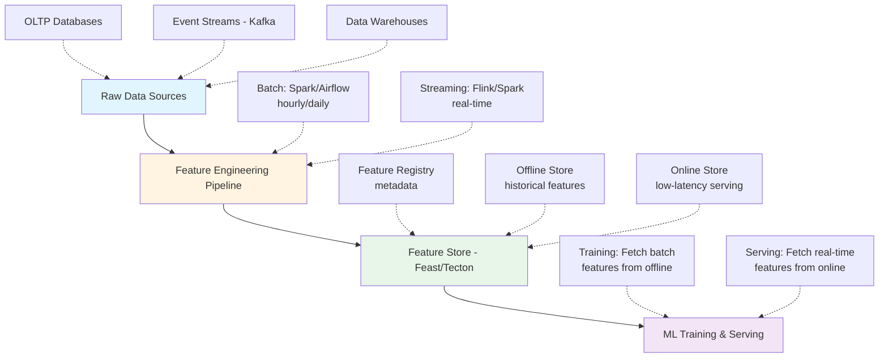

# Feature Engineering Patterns

**Purpose**: Production-ready feature engineering patterns — from feature store architecture to domain-specific transformations.

**Target Audience**: Data engineers, data scientists, ML engineers

**Last Updated**: 2026-01-27

---

## Why Feature Engineering Matters

**Andrew Ng**: "Coming up with features is difficult, time-consuming, requires expert knowledge. Applied machine learning is basically feature engineering."

**Impact**:

- **Data > Algorithms**: Better features beat better models
- **Google Research**: 80% of ML project time spent on data/features, 20% on modeling
- **Kaggle Winners**: Often win with better features, not fancier models

---

## Feature Store Architecture

### What is a Feature Store?

**Definition**: Central repository for storing, serving, and managing ML features

**Problems it solves**:

1. **Training-serving skew**: Different feature computation logic in training vs production
2. **Feature reusability**: Teams rebuild same features (waste)
3. **Point-in-time correctness**: Need historical feature values for backfilling
4. **Low-latency serving**: Online predictions need features in milliseconds

---

### Online vs Offline Feature Store

| Aspect       | Offline (Training)                   | Online (Serving)                  |
| ------------ | ------------------------------------ | --------------------------------- |
| --------     | -------------------                  | ------------------                |
| **Latency**  | Minutes to hours                     | < 10ms                            |
| **Storage**  | Data warehouse (Snowflake, BigQuery) | Key-value store (Redis, DynamoDB) |
| **Data**     | Historical batch data                | Latest feature values             |
| **Use case** | Model training                       | Real-time prediction              |

---

### Feature Store Architecture



---

### Feature Store: Point-in-Time Correctness

**Problem**: When training model on historical data, must use feature values **as they were at that time** (not future values!)

**Example**:
```
User ID | Date       | Target | Feature (WRONG) | Feature (CORRECT)
--------|------------|--------|-----------------|------------------
123     | 2024-01-01 | 1      | 100             | 50
123     | 2024-01-02 | 0      | 100             | 75
123     | 2024-01-03 | 1      | 100             | 100

WRONG: Use latest value (100) for all dates → data leakage!
CORRECT: Use feature value as of that date
```

**Implementation**:
```python
# Feast example
from feast import FeatureStore

store = FeatureStore(repo_path=".")

# Point-in-time join: Get features as they were at event_timestamp
features = store.get_historical_features(
    entity_df=events_df,  # Contains entity_id + event_timestamp
    features=[
        "user_features:avg_transaction_30d",
        "user_features:num_logins_7d"
    ]
).to_df()
```

---

## Feature Engineering by Data Type

### 1. Tabular Data (Numerical + Categorical)

#### Numerical Features

**A. Missing Value Handling**

```python
# Strategy 1: Simple imputation
from sklearn.impute import SimpleImputer

imputer = SimpleImputer(strategy='median')  # or 'mean', 'most_frequent'
X_filled = imputer.fit_transform(X)

# Strategy 2: Indicate missingness
df['age_missing'] = df['age'].isnull().astype(int)
df['age'] = df['age'].fillna(df['age'].median())

# Strategy 3: Iterative imputation
from sklearn.experimental import enable_iterative_imputer
from sklearn.impute import IterativeImputer

imputer = IterativeImputer(random_state=0)
X_filled = imputer.fit_transform(X)
```

**B. Scaling**

```python
from sklearn.preprocessing import StandardScaler, MinMaxScaler, RobustScaler

# StandardScaler: (x - mean) / std
scaler = StandardScaler()
X_scaled = scaler.fit_transform(X)

# MinMaxScaler: (x - min) / (max - min)  → [0, 1]
scaler = MinMaxScaler()
X_scaled = scaler.fit_transform(X)

# RobustScaler: Uses median and IQR (robust to outliers)
scaler = RobustScaler()
X_scaled = scaler.fit_transform(X)
```

**C. Outlier Handling**

```python
# Method 1: Clip to percentiles
lower = df['age'].quantile(0.01)
upper = df['age'].quantile(0.99)
df['age'] = df['age'].clip(lower, upper)

# Method 2: Log transform (for right-skewed data)
df['income_log'] = np.log1p(df['income'])  # log(1 + x)

# Method 3: Winsorization
from scipy.stats.mstats import winsorize
df['age'] = winsorize(df['age'], limits=[0.01, 0.01])
```

**D. Binning**

```python
# Equal-width binning
df['age_bin'] = pd.cut(df['age'], bins=5, labels=['teen', 'young', 'adult', 'senior', 'elder'])

# Equal-frequency binning (quantiles)
df['age_bin'] = pd.qcut(df['age'], q=5, labels=['q1', 'q2', 'q3', 'q4', 'q5'])

# Custom binning
bins = [0, 18, 35, 60, 100]
labels = ['minor', 'young', 'middle', 'senior']
df['age_group'] = pd.cut(df['age'], bins=bins, labels=labels)
```

---

#### Categorical Features

**A. One-Hot Encoding**

```python
from sklearn.preprocessing import OneHotEncoder

encoder = OneHotEncoder(sparse=False, handle_unknown='ignore')
encoded = encoder.fit_transform(df[['category']])

# Or with pandas
df_encoded = pd.get_dummies(df, columns=['category'], drop_first=True)
```

**B. Target Encoding (Mean Encoding)**

```python
# Average target value per category
category_means = df.groupby('category')['target'].mean()
df['category_encoded'] = df['category'].map(category_means)

# With smoothing (prevent overfitting on rare categories)
def target_encode_smooth(df, column, target, min_samples=10, smoothing=1):
    global_mean = df[target].mean()
    counts = df.groupby(column)[target].count()
    means = df.groupby(column)[target].mean()
    
    smooth = (counts * means + smoothing * global_mean) / (counts + smoothing)
    return df[column].map(smooth)

df['category_encoded'] = target_encode_smooth(df, 'category', 'target')
```

**C. Frequency Encoding**

```python
# Encode by frequency (for high-cardinality categories)
freq = df['category'].value_counts()
df['category_freq'] = df['category'].map(freq)
```

**D. Hashing (for high-cardinality)**

```python
from sklearn.feature_extraction import FeatureHasher

hasher = FeatureHasher(n_features=10, input_type='string')
hashed = hasher.transform(df['category'].astype(str))
```

---

### 2. Text Features

#### Basic Text Features

```python
# Text length
df['text_length'] = df['text'].str.len()
df['word_count'] = df['text'].str.split().str.len()

# Character counts
df['num_digits'] = df['text'].str.count(r'\d')
df['num_uppercase'] = df['text'].str.count(r'[A-Z]')
df['num_special_chars'] = df['text'].str.count(r'[^\w\s]')
```

#### TF-IDF

```python
from sklearn.feature_extraction.text import TfidfVectorizer

vectorizer = TfidfVectorizer(
    max_features=1000,
    ngram_range=(1, 2),
    min_df=5,
    max_df=0.8
)

tfidf_matrix = vectorizer.fit_transform(df['text'])
```

#### Word Embeddings (Word2Vec, GloVe, BERT)

```python
# Sentence-BERT for sentence embeddings
from sentence_transformers import SentenceTransformer

model = SentenceTransformer('all-MiniLM-L6-v2')
embeddings = model.encode(df['text'].tolist())

# Average Word2Vec
import gensim.downloader as api

w2v_model = api.load('word2vec-google-news-300')

def get_avg_word2vec(text, model):
    words = text.split()
    word_vecs = [model[w] for w in words if w in model]
    if len(word_vecs) == 0:
        return np.zeros(model.vector_size)
    return np.mean(word_vecs, axis=0)

df['text_embedding'] = df['text'].apply(lambda x: get_avg_word2vec(x, w2v_model))
```

---

### 3. Time Series Features

#### Time-based Features

```python
df['datetime'] = pd.to_datetime(df['timestamp'])

# Cyclical encoding (sine/cosine for periodicity)
df['hour'] = df['datetime'].dt.hour
df['hour_sin'] = np.sin(2 * np.pi * df['hour'] / 24)
df['hour_cos'] = np.cos(2 * np.pi * df['hour'] / 24)

df['day_of_week'] = df['datetime'].dt.dayofweek
df['dow_sin'] = np.sin(2 * np.pi * df['day_of_week'] / 7)
df['dow_cos'] = np.cos(2 * np.pi * df['day_of_week'] / 7)

# Calendar features
df['is_weekend'] = df['day_of_week'].isin([5, 6]).astype(int)
df['is_month_start'] = df['datetime'].dt.is_month_start.astype(int)
df['is_month_end'] = df['datetime'].dt.is_month_end.astype(int)
df['quarter'] = df['datetime'].dt.quarter
```

#### Lag Features

```python
# Lag features (previous values)
for lag in [1, 7, 30]:
    df[f'value_lag_{lag}'] = df.groupby('user_id')['value'].shift(lag)

# Rolling statistics
df['value_rolling_mean_7d'] = df.groupby('user_id')['value'].transform(
    lambda x: x.rolling(window=7, min_periods=1).mean()
)

df['value_rolling_std_7d'] = df.groupby('user_id')['value'].transform(
    lambda x: x.rolling(window=7, min_periods=1).std()
)

# Exponential weighted moving average
df['value_ewm_7d'] = df.groupby('user_id')['value'].transform(
    lambda x: x.ewm(span=7).mean()
)
```

#### Trend and Seasonality

```python
from statsmodels.tsa.seasonal import seasonal_decompose

# Decompose time series
result = seasonal_decompose(df['value'], model='additive', period=7)
df['trend'] = result.trend
df['seasonal'] = result.seasonal
df['residual'] = result.resid
```

---

### 4. Image Features

#### Pre-trained CNN Features

```python
from tensorflow.keras.applications import ResNet50
from tensorflow.keras.applications.resnet50 import preprocess_input

# Load pre-trained model (without top classification layer)
model = ResNet50(weights='imagenet', include_top=False, pooling='avg')

# Extract features
def extract_features(image_path):
    img = load_img(image_path, target_size=(224, 224))
    img_array = img_to_array(img)
    img_array = np.expand_dims(img_array, axis=0)
    img_array = preprocess_input(img_array)
    
    features = model.predict(img_array)
    return features.flatten()

df['image_features'] = df['image_path'].apply(extract_features)
```

---

### 5. Graph Features

```python
import networkx as nx

G = nx.Graph()
# Add edges from data
for u, v in df[['user1', 'user2']].values:
    G.add_edge(u, v)

# Node features
degree_dict = dict(G.degree())
pagerank_dict = nx.pagerank(G)
clustering_dict = nx.clustering(G)

df['degree'] = df['user_id'].map(degree_dict)
df['pagerank'] = df['user_id'].map(pagerank_dict)
df['clustering_coef'] = df['user_id'].map(clustering_dict)
```

---

## Feature Interaction

### Polynomial Features

```python
from sklearn.preprocessing import PolynomialFeatures

poly = PolynomialFeatures(degree=2, include_bias=False)
X_poly = poly.fit_transform(X)

# Example: [a, b] → [a, b, a², ab, b²]
```

### Manual Interactions

```python
# Ratio features
df['price_per_sqft'] = df['price'] / df['sqft']
df['income_per_household_member'] = df['income'] / df['household_size']

# Product features
df['age_income'] = df['age'] * df['income']

# Difference features
df['days_since_last_purchase'] = (df['current_date'] - df['last_purchase_date']).dt.days
```

---

## Feature Selection

### Filter Methods

```python
# Correlation with target
corr = df.corr()['target'].abs().sort_values(ascending=False)
top_features = corr[corr > 0.3].index.tolist()

# Mutual information
from sklearn.feature_selection import mutual_info_classif

mi_scores = mutual_info_classif(X, y)
feature_importance = pd.Series(mi_scores, index=X.columns).sort_values(ascending=False)
```

### Wrapper Methods

```python
# Recursive Feature Elimination
from sklearn.feature_selection import RFE
from sklearn.ensemble import RandomForestClassifier

model = RandomForestClassifier()
rfe = RFE(model, n_features_to_select=10)
rfe.fit(X, y)

selected_features = X.columns[rfe.support_]
```

### Embedded Methods

```python
# L1 regularization (Lasso)
from sklearn.linear_model import LassoCV

lasso = LassoCV(cv=5)
lasso.fit(X, y)

# Select features with non-zero coefficients
selected_features = X.columns[lasso.coef_ != 0]

# Tree-based feature importance
from sklearn.ensemble import RandomForestClassifier

rf = RandomForestClassifier()
rf.fit(X, y)

feature_importance = pd.Series(rf.feature_importances_, index=X.columns).sort_values(ascending=False)
top_features = feature_importance.head(20).index.tolist()
```

---

## Production Patterns

### Pattern 1: Feature Pipelines

```python
from sklearn.pipeline import Pipeline
from sklearn.compose import ColumnTransformer
from sklearn.preprocessing import StandardScaler, OneHotEncoder
from sklearn.impute import SimpleImputer

# Define transformers for different column types
numeric_features = ['age', 'income']
categorical_features = ['gender', 'city']

numeric_transformer = Pipeline(steps=[
    ('imputer', SimpleImputer(strategy='median')),
    ('scaler', StandardScaler())
])

categorical_transformer = Pipeline(steps=[
    ('imputer', SimpleImputer(strategy='constant', fill_value='missing')),
    ('onehot', OneHotEncoder(handle_unknown='ignore'))
])

# Combine transformers
preprocessor = ColumnTransformer(
    transformers=[
        ('num', numeric_transformer, numeric_features),
        ('cat', categorical_transformer, categorical_features)
    ])

# Full pipeline
pipeline = Pipeline(steps=[
    ('preprocessor', preprocessor),
    ('classifier', RandomForestClassifier())
])

pipeline.fit(X_train, y_train)
```

---

### Pattern 2: Feature Registry

```python
# features/user_features.py
from feast import Entity, Feature, FeatureView, ValueType
from datetime import timedelta

user = Entity(name="user_id", value_type=ValueType.INT64)

user_features = FeatureView(
    name="user_features",
    entities=["user_id"],
    ttl=timedelta(days=1),
    features=[
        Feature(name="avg_transaction_30d", dtype=ValueType.FLOAT),
        Feature(name="num_logins_7d", dtype=ValueType.INT64),
        Feature(name="last_purchase_days", dtype=ValueType.INT64),
    ],
    online=True,
    batch_source=batch_source,
    stream_source=stream_source
)
```

---

### Pattern 3: Feature Validation

```python
import great_expectations as ge

# Define expectations
df_ge = ge.from_pandas(df)

df_ge.expect_column_values_to_be_between('age', min_value=0, max_value=120)
df_ge.expect_column_values_to_not_be_null('user_id')
df_ge.expect_column_values_to_be_in_set('gender', ['M', 'F', 'Other'])

# Validate
results = df_ge.validate()

if not results['success']:
    print("Validation failed!")
    for result in results['results']:
        if not result['success']:
            print(f"Failed: {result['expectation_config']['expectation_type']}")
```

---

## Real-World Case Studies

### Case 1: Uber's Michelangelo

**Architecture**:
- **Offline**: Hive (batch features, daily/hourly)
- **Online**: Cassandra (real-time features, < 5ms)
- **Feature Types**: User features (trip history), geospatial features (pickup/dropoff location), temporal features (time of day, day of week)

**Key Insight**: Separate feature computation for batch (training) and streaming (serving), unified via feature store

---

### Case 2: Airbnb's Zipline

**Problem**: Training-serving skew (Python training, Scala serving)

**Solution**: 
- Define features in DSL (domain-specific language)
- Generate both Python and Scala code from DSL
- Guarantee consistency

```python
# Example DSL
FEATURE(
    name="user_avg_price_30d",
    source="bookings",
    aggregation="mean",
    window="30d",
    groupby="user_id",
    column="price"
)
```

---

### Case 3: Netflix's Feature Store

**Approach**:
- **Precomputed features**: Daily batch jobs (user watch history)
- **On-demand features**: Computed at request time (context: device, time)
- **Hybrid**: Combine precomputed + on-demand for prediction

**Key Insight**: Not all features need to be precomputed — balance latency vs storage costs

---

## Common Pitfalls

### 1. Data Leakage

**Example**: Using future information in features
```python
# WRONG: Use all data to compute mean
df['price_mean'] = df['price'].mean()

# CORRECT: Use only training data mean
train_mean = df_train['price'].mean()
df['price_mean'] = train_mean
```

---

### 2. Training-Serving Skew

**Example**: Different preprocessing in training vs serving
```python
# Training (Python)
df['age_scaled'] = (df['age'] - df['age'].mean()) / df['age'].std()

# Serving (Java) — if mean/std differ, predictions fail!
```

**Solution**: Use feature store or save preprocessing artifacts

---

### 3. High-Cardinality Categoricals

**Problem**: 1M unique user_ids → 1M features after one-hot encoding

**Solutions**:
- Target encoding
- Hashing
- Embeddings (learned via neural network)

---

## Summary Checklist

### Feature Engineering
- [ ] Handle missing values appropriately
- [ ] Scale numerical features
- [ ] Encode categorical features
- [ ] Create interaction features
- [ ] Extract time-based features for temporal data
- [ ] Generate domain-specific features

### Feature Store
- [ ] Implement point-in-time correctness
- [ ] Separate online (low-latency) and offline (batch) stores
- [ ] Version features
- [ ] Monitor feature distributions

### Production
- [ ] Use feature pipelines (sklearn.pipeline)
- [ ] Validate features with Great Expectations
- [ ] Monitor for data drift
- [ ] Log feature importance
- [ ] Document feature definitions

---

**Key Takeaway**: **Features are the leverage point** — spend 80% of time on data/features, 20% on models.

**Version**: 1.0  
**Maintainer**: Data Science Team
