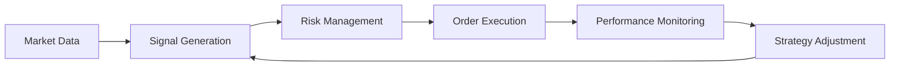

# Quantitative Trading Algorithms Guide

**Purpose**: Comprehensive guide for algorithmic trading strategies, from classical technical analysis to modern machine learning and reinforcement learning approaches.

**Primary Audience**: Data scientists working on quantitative finance, algorithmic trading, and portfolio optimization

**Last Updated**: 2026-01-27  
**Version**: 1.0

---

## Table of Contents

1. [Overview](#1-overview)
2. [Trading Strategy Categories](#2-trading-strategy-categories)
3. [Classical Technical Analysis Strategies](#3-classical-technical-analysis-strategies)
4. [Statistical Arbitrage](#4-statistical-arbitrage)
5. [Machine Learning for Trading](#5-machine-learning-for-trading)
6. [Reinforcement Learning for Portfolio Management](#6-reinforcement-learning-for-portfolio-management)
7. [Feature Engineering for Trading](#7-feature-engineering-for-trading)
8. [Backtesting Framework](#8-backtesting-framework)
9. [Risk Management](#9-risk-management)
10. [Performance Metrics](#10-performance-metrics)
11. [Common Pitfalls](#11-common-pitfalls)
12. [Production Deployment](#12-production-deployment)

---

## 1. Overview

### What is Quantitative Trading?

Quantitative trading uses mathematical models and algorithms to identify trading opportunities and execute trades systematically. Unlike discretionary trading, quant strategies rely on data-driven signals and predefined rules.

### Key Components



### When to Use Quantitative Trading

**Good Fit:**
- Large volumes of historical data available
- Identifiable patterns or inefficiencies
- Need for systematic, emotionless execution
- High-frequency or automated trading requirements

**Poor Fit:**
- Black swan events (model breaks down)
- Low liquidity markets (high slippage)
- Regulatory changes (regime shifts)
- Insufficient historical data

---

## 2. Trading Strategy Categories

### 2.1 By Time Horizon

| Category | Holding Period | Update Frequency | Typical Algorithm | Infrastructure |
|----------|----------------|------------------|-------------------|----------------|
| **High-Frequency Trading (HFT)** | Microseconds - Seconds | Sub-second | Latency arbitrage, market making | Co-location, FPGA |
| **Intraday Trading** | Minutes - Hours | Tick/minute data | Mean reversion, momentum | Low-latency feeds |
| **Swing Trading** | Days - Weeks | Daily bars | Trend following, breakout | Standard APIs |
| **Position Trading** | Weeks - Months | Daily/weekly | Factor models, ML | Batch processing |
| **Long-term Investing** | Months - Years | Monthly | Fundamental factors | Portfolio rebalancing |

### 2.2 By Strategy Type

```
Quantitative Strategies
│
├── Trend Following
│   ├── Moving Average Crossover
│   ├── Breakout Systems
│   └── Channel Trading
│
├── Mean Reversion
│   ├── Bollinger Bands
│   ├── RSI-based
│   └── Z-Score
│
├── Statistical Arbitrage
│   ├── Pairs Trading
│   ├── Cointegration
│   └── Multi-asset arbitrage
│
├── Market Making
│   ├── Bid-Ask Spread Capture
│   └── Inventory Management
│
├── Factor Investing
│   ├── Value
│   ├── Momentum
│   ├── Quality
│   └── Multi-factor
│
├── Sentiment-Based
│   ├── News Sentiment
│   ├── Social Media
│   └── Alternative Data
│
└── ML/DL-Based
    ├── Supervised Learning (XGBoost, LSTM)
    ├── Reinforcement Learning (DQN, PPO)
    └── Deep Learning Ensembles
```

---

## 3. Classical Technical Analysis Strategies

### 3.1 Moving Average Crossover (Trend Following)

**Concept**: Buy when fast MA crosses above slow MA; sell when it crosses below.

**Implementation**:
```python
import pandas as pd
import numpy as np

def moving_average_crossover(df, short_window=50, long_window=200):
    """
    Golden Cross / Death Cross strategy
    
    Args:
        df: DataFrame with 'close' column
        short_window: Fast MA period (default: 50)
        long_window: Slow MA period (default: 200)
    
    Returns:
        DataFrame with signals
    """
    df = df.copy()
    df['short_ma'] = df['close'].rolling(window=short_window).mean()
    df['long_ma'] = df['close'].rolling(window=long_window).mean()
    
    # Generate signals
    df['signal'] = 0
    df.loc[df['short_ma'] > df['long_ma'], 'signal'] = 1  # Buy
    df.loc[df['short_ma'] < df['long_ma'], 'signal'] = -1  # Sell
    
    # Detect crossovers
    df['position'] = df['signal'].diff()
    # position == 2: Golden Cross (Buy)
    # position == -2: Death Cross (Sell)
    
    return df

# Example usage
df = pd.read_csv('AAPL_daily.csv', parse_dates=['date'])
df_signals = moving_average_crossover(df)

# Calculate returns
df_signals['returns'] = df_signals['close'].pct_change()
df_signals['strategy_returns'] = df_signals['returns'] * df_signals['signal'].shift(1)
```

**Pros:**
- Simple, easy to understand
- Works well in trending markets
- Low risk of overfitting

**Cons:**
- Lags price movements (late entries/exits)
- Many false signals in sideways markets
- Requires parameter tuning

**Best Markets:** Trending markets (stocks, commodities)

---

### 3.2 Bollinger Bands (Mean Reversion)

**Concept**: Price tends to revert to the mean. Buy at lower band, sell at upper band.

**Implementation**:
```python
def bollinger_bands_strategy(df, window=20, num_std=2):
    """
    Bollinger Bands mean reversion strategy
    
    Args:
        df: DataFrame with 'close' column
        window: Rolling window for mean and std (default: 20)
        num_std: Number of standard deviations for bands (default: 2)
    
    Returns:
        DataFrame with bands and signals
    """
    df = df.copy()
    df['sma'] = df['close'].rolling(window=window).mean()
    df['std'] = df['close'].rolling(window=window).std()
    df['upper_band'] = df['sma'] + (df['std'] * num_std)
    df['lower_band'] = df['sma'] - (df['std'] * num_std)
    
    # Generate signals
    df['signal'] = 0
    df.loc[df['close'] < df['lower_band'], 'signal'] = 1   # Buy (oversold)
    df.loc[df['close'] > df['upper_band'], 'signal'] = -1  # Sell (overbought)
    
    # Exit when price crosses back to mean
    df.loc[(df['close'] > df['sma']) & (df['signal'].shift(1) == 1), 'signal'] = 0
    df.loc[(df['close'] < df['sma']) & (df['signal'].shift(1) == -1), 'signal'] = 0
    
    return df

# Calculate Bollinger Band width (volatility indicator)
def bollinger_width(df):
    return (df['upper_band'] - df['lower_band']) / df['sma']
```

**Pros:**
- Adapts to volatility (bands widen/narrow)
- Works in range-bound markets
- Visual, intuitive

**Cons:**
- Poor performance in strong trends
- Requires confirmation signals
- Not effective in all market regimes

**Best Markets:** Range-bound, low-volatility stocks or forex pairs

---

### 3.3 Relative Strength Index (RSI)

**Concept**: Momentum oscillator indicating overbought (>70) or oversold (<30) conditions.

**Implementation**:
```python
def calculate_rsi(df, period=14):
    """
    Calculate Relative Strength Index (RSI)
    
    Args:
        df: DataFrame with 'close' column
        period: RSI period (default: 14)
    
    Returns:
        Series with RSI values (0-100)
    """
    df = df.copy()
    delta = df['close'].diff()
    
    gain = delta.where(delta > 0, 0)
    loss = -delta.where(delta < 0, 0)
    
    avg_gain = gain.rolling(window=period).mean()
    avg_loss = loss.rolling(window=period).mean()
    
    rs = avg_gain / avg_loss
    rsi = 100 - (100 / (1 + rs))
    
    return rsi

def rsi_strategy(df, period=14, oversold=30, overbought=70):
    """
    RSI-based mean reversion strategy
    """
    df = df.copy()
    df['rsi'] = calculate_rsi(df, period)
    
    df['signal'] = 0
    df.loc[df['rsi'] < oversold, 'signal'] = 1   # Oversold → Buy
    df.loc[df['rsi'] > overbought, 'signal'] = -1  # Overbought → Sell
    
    return df
```

**Divergence Trading:**
```python
def rsi_divergence(df):
    """
    Detect bullish/bearish divergence between price and RSI
    """
    # Bullish divergence: Price makes lower low, RSI makes higher low
    # Bearish divergence: Price makes higher high, RSI makes lower high
    
    price_lows = df['close'].rolling(20).min()
    rsi_lows = df['rsi'].rolling(20).min()
    
    bullish_divergence = (
        (df['close'] == price_lows) & 
        (df['close'] < df['close'].shift(20)) &
        (df['rsi'] > df['rsi'].shift(20))
    )
    
    return bullish_divergence
```

**Best Use Case:** Identifying reversal points in trending markets

---

### 3.4 MACD (Moving Average Convergence Divergence)

**Implementation**:
```python
def calculate_macd(df, fast=12, slow=26, signal=9):
    """
    Calculate MACD indicator
    
    Returns:
        DataFrame with MACD line, signal line, and histogram
    """
    df = df.copy()
    ema_fast = df['close'].ewm(span=fast, adjust=False).mean()
    ema_slow = df['close'].ewm(span=slow, adjust=False).mean()
    
    df['macd'] = ema_fast - ema_slow
    df['macd_signal'] = df['macd'].ewm(span=signal, adjust=False).mean()
    df['macd_histogram'] = df['macd'] - df['macd_signal']
    
    return df

def macd_strategy(df):
    """
    MACD crossover strategy
    """
    df = calculate_macd(df)
    
    # Buy when MACD crosses above signal line
    df['signal'] = 0
    df.loc[df['macd'] > df['macd_signal'], 'signal'] = 1
    df.loc[df['macd'] < df['macd_signal'], 'signal'] = -1
    
    # Detect crossovers
    df['crossover'] = df['signal'].diff()
    
    return df
```

---

## 4. Statistical Arbitrage

### 4.1 Pairs Trading (Cointegration-Based)

**Concept**: Trade two cointegrated assets whose spread mean-reverts.

**Step 1: Test for Cointegration**
```python
from statsmodels.tsa.stattools import coint, adfuller

def test_cointegration(stock1, stock2):
    """
    Test if two price series are cointegrated
    
    Returns:
        bool: True if cointegrated (p-value < 0.05)
        float: Hedge ratio
    """
    # Engle-Granger two-step method
    score, pvalue, _ = coint(stock1, stock2)
    
    # Calculate hedge ratio using OLS
    from sklearn.linear_model import LinearRegression
    model = LinearRegression()
    model.fit(stock2.values.reshape(-1, 1), stock1.values)
    hedge_ratio = model.coef_[0]
    
    return pvalue < 0.05, hedge_ratio, pvalue

# Example: Find cointegrated pairs
def find_cointegrated_pairs(data):
    """
    Screen universe of stocks for cointegrated pairs
    
    Args:
        data: DataFrame with columns as stock tickers
    
    Returns:
        List of (ticker1, ticker2, hedge_ratio, pvalue)
    """
    n = data.shape[1]
    pairs = []
    
    for i in range(n):
        for j in range(i+1, n):
            stock1 = data.iloc[:, i]
            stock2 = data.iloc[:, j]
            
            is_coint, hedge_ratio, pvalue = test_cointegration(stock1, stock2)
            
            if is_coint:
                pairs.append((
                    data.columns[i], 
                    data.columns[j], 
                    hedge_ratio, 
                    pvalue
                ))
    
    return sorted(pairs, key=lambda x: x[3])  # Sort by p-value
```

**Step 2: Calculate Spread and Z-Score**
```python
def calculate_spread(stock1, stock2, hedge_ratio):
    """
    Calculate spread between two cointegrated stocks
    """
    spread = stock1 - hedge_ratio * stock2
    return spread

def calculate_zscore(spread, window=20):
    """
    Calculate rolling z-score of spread
    """
    mean = spread.rolling(window=window).mean()
    std = spread.rolling(window=window).std()
    zscore = (spread - mean) / std
    return zscore
```

**Step 3: Generate Trading Signals**
```python
def pairs_trading_strategy(stock1, stock2, hedge_ratio, 
                          entry_threshold=2.0, exit_threshold=0.5):
    """
    Pairs trading strategy based on z-score
    
    Args:
        stock1, stock2: Price series
        hedge_ratio: Hedge ratio from cointegration test
        entry_threshold: Z-score threshold to enter (default: 2.0)
        exit_threshold: Z-score threshold to exit (default: 0.5)
    
    Returns:
        DataFrame with signals
    """
    df = pd.DataFrame({
        'stock1': stock1,
        'stock2': stock2
    })
    
    df['spread'] = calculate_spread(stock1, stock2, hedge_ratio)
    df['zscore'] = calculate_zscore(df['spread'])
    
    # Generate signals
    df['signal'] = 0
    
    # Long spread (buy stock1, sell stock2) when z-score < -entry_threshold
    df.loc[df['zscore'] < -entry_threshold, 'signal'] = 1
    
    # Short spread (sell stock1, buy stock2) when z-score > entry_threshold
    df.loc[df['zscore'] > entry_threshold, 'signal'] = -1
    
    # Exit when z-score crosses back to near zero
    df.loc[abs(df['zscore']) < exit_threshold, 'signal'] = 0
    
    # Forward-fill signals (maintain position)
    df['position'] = df['signal'].replace(0, np.nan).ffill().fillna(0)
    
    return df

# Calculate returns
def pairs_trading_returns(df, stock1, stock2, hedge_ratio):
    """
    Calculate strategy returns for pairs trading
    """
    df['stock1_returns'] = stock1.pct_change()
    df['stock2_returns'] = stock2.pct_change()
    
    # Portfolio returns: long stock1, short hedge_ratio * stock2
    df['portfolio_returns'] = (
        df['position'] * (df['stock1_returns'] - hedge_ratio * df['stock2_returns'])
    )
    
    return df
```

**Pros:**
- Market-neutral (hedged against market risk)
- Lower volatility than directional strategies
- Exploits temporary mispricings

**Cons:**
- Cointegration can break down (regime change)
- Transaction costs eat into profits
- Requires constant monitoring and rebalancing

**Best Use Case:** Highly correlated stocks (e.g., PEP vs KO, XOM vs CVX)

---

### 4.2 Statistical Arbitrage with Multiple Assets

**Concept**: Extend pairs trading to portfolios using PCA or factor models.

```python
from sklearn.decomposition import PCA

def statistical_arbitrage_pca(returns, n_components=3):
    """
    Use PCA to identify common factors and trade residuals
    
    Args:
        returns: DataFrame of asset returns (assets as columns)
        n_components: Number of principal components
    
    Returns:
        Trading signals based on residual mean reversion
    """
    pca = PCA(n_components=n_components)
    factors = pca.fit_transform(returns)
    
    # Reconstruct returns using factors
    reconstructed = pca.inverse_transform(factors)
    
    # Calculate residuals (idiosyncratic returns)
    residuals = returns - reconstructed
    
    # Trade based on residual z-scores
    z_scores = (residuals - residuals.mean()) / residuals.std()
    
    # Signal: buy when z-score < -2, sell when > 2
    signals = pd.DataFrame(index=returns.index, columns=returns.columns)
    signals[z_scores < -2] = 1
    signals[z_scores > 2] = -1
    signals = signals.fillna(0)
    
    return signals, z_scores
```

---

## 5. Machine Learning for Trading

### 5.1 Price Direction Prediction (Classification)

**Concept**: Predict whether next-period price will go up or down.

**Feature Engineering:**
```python
def create_trading_features(df):
    """
    Create technical indicators as features
    
    Returns:
        DataFrame with features for ML model
    """
    df = df.copy()
    
    # Returns
    df['returns'] = df['close'].pct_change()
    df['returns_5d'] = df['close'].pct_change(5)
    df['returns_20d'] = df['close'].pct_change(20)
    
    # Volatility
    df['volatility_5d'] = df['returns'].rolling(5).std()
    df['volatility_20d'] = df['returns'].rolling(20).std()
    
    # Moving averages
    df['sma_5'] = df['close'].rolling(5).mean()
    df['sma_20'] = df['close'].rolling(20).mean()
    df['sma_50'] = df['close'].rolling(50).mean()
    df['sma_ratio_5_20'] = df['sma_5'] / df['sma_20']
    df['sma_ratio_20_50'] = df['sma_20'] / df['sma_50']
    
    # RSI
    df['rsi'] = calculate_rsi(df, period=14)
    
    # MACD
    df = calculate_macd(df)
    
    # Bollinger Bands
    df['bb_position'] = (df['close'] - df['lower_band']) / (df['upper_band'] - df['lower_band'])
    
    # Volume features
    df['volume_ratio'] = df['volume'] / df['volume'].rolling(20).mean()
    df['volume_ma_5'] = df['volume'].rolling(5).mean()
    
    # Momentum
    df['momentum_5'] = df['close'] - df['close'].shift(5)
    df['momentum_20'] = df['close'] - df['close'].shift(20)
    
    return df

def create_target(df, horizon=1):
    """
    Create target variable (price direction)
    
    Args:
        df: DataFrame with 'close' column
        horizon: Prediction horizon in periods (default: 1)
    
    Returns:
        Binary target (1: up, 0: down)
    """
    df = df.copy()
    df['target'] = (df['close'].shift(-horizon) > df['close']).astype(int)
    return df
```

**Model Training:**
```python
from xgboost import XGBClassifier
from sklearn.model_selection import TimeSeriesSplit
from sklearn.metrics import classification_report, roc_auc_score

def train_price_direction_model(df, features, target='target', n_splits=5):
    """
    Train XGBoost model for price direction prediction
    
    Args:
        df: DataFrame with features and target
        features: List of feature column names
        target: Target column name
        n_splits: Number of time series CV splits
    
    Returns:
        Trained model and evaluation metrics
    """
    # Remove NaN values
    df_clean = df.dropna()
    
    X = df_clean[features]
    y = df_clean[target]
    
    # Time series cross-validation
    tscv = TimeSeriesSplit(n_splits=n_splits)
    
    results = []
    for train_idx, val_idx in tscv.split(X):
        X_train, X_val = X.iloc[train_idx], X.iloc[val_idx]
        y_train, y_val = y.iloc[train_idx], y.iloc[val_idx]
        
        # Train model
        model = XGBClassifier(
            n_estimators=100,
            max_depth=5,
            learning_rate=0.1,
            random_state=42,
            eval_metric='logloss'
        )
        model.fit(X_train, y_train)
        
        # Evaluate
        y_pred = model.predict(X_val)
        y_pred_proba = model.predict_proba(X_val)[:, 1]
        
        auc = roc_auc_score(y_val, y_pred_proba)
        results.append(auc)
        
    print(f"Average AUC: {np.mean(results):.4f} ± {np.std(results):.4f}")
    
    # Train final model on all data
    final_model = XGBClassifier(
        n_estimators=100,
        max_depth=5,
        learning_rate=0.1,
        random_state=42
    )
    final_model.fit(X, y)
    
    return final_model, results

# Feature importance
def plot_feature_importance(model, features):
    import matplotlib.pyplot as plt
    
    importance = model.feature_importances_
    indices = np.argsort(importance)[::-1][:20]  # Top 20
    
    plt.figure(figsize=(10, 6))
    plt.bar(range(len(indices)), importance[indices])
    plt.xticks(range(len(indices)), [features[i] for i in indices], rotation=45)
    plt.title('Feature Importance')
    plt.tight_layout()
    plt.show()
```

**Trading Strategy Based on ML Predictions:**
```python
def ml_trading_strategy(df, model, features, threshold=0.6):
    """
    Generate trading signals based on ML predictions
    
    Args:
        df: DataFrame with features
        model: Trained model
        features: List of feature names
        threshold: Probability threshold for trading (default: 0.6)
    
    Returns:
        DataFrame with signals
    """
    df = df.copy()
    
    # Predict probabilities
    X = df[features].fillna(method='ffill')
    df['pred_proba'] = model.predict_proba(X)[:, 1]
    
    # Generate signals
    df['signal'] = 0
    df.loc[df['pred_proba'] > threshold, 'signal'] = 1  # Buy
    df.loc[df['pred_proba'] < (1 - threshold), 'signal'] = -1  # Sell
    
    return df
```

**Pros:**
- Can learn complex, non-linear patterns
- Incorporates multiple features simultaneously
- Adaptable to new data

**Cons:**
- Risk of overfitting
- Requires substantial training data
- Black-box (hard to interpret)

**Best Use Case:** Markets with identifiable patterns, sufficient historical data

---

### 5.2 LSTM for Time Series Prediction

**Concept**: Use LSTM neural networks to capture temporal dependencies.

```python
import torch
import torch.nn as nn
from torch.utils.data import Dataset, DataLoader

class LSTMPricePredictor(nn.Module):
    def __init__(self, input_size, hidden_size=64, num_layers=2, dropout=0.2):
        super(LSTMPricePredictor, self).__init__()
        
        self.hidden_size = hidden_size
        self.num_layers = num_layers
        
        self.lstm = nn.LSTM(
            input_size, 
            hidden_size, 
            num_layers, 
            batch_first=True,
            dropout=dropout
        )
        self.fc = nn.Linear(hidden_size, 1)
        self.sigmoid = nn.Sigmoid()
    
    def forward(self, x):
        # x shape: (batch, seq_len, input_size)
        lstm_out, _ = self.lstm(x)
        
        # Take last time step
        last_output = lstm_out[:, -1, :]
        
        # Predict probability of price increase
        out = self.fc(last_output)
        out = self.sigmoid(out)
        
        return out

class TimeSeriesDataset(Dataset):
    def __init__(self, data, seq_length=20):
        self.data = data
        self.seq_length = seq_length
    
    def __len__(self):
        return len(self.data) - self.seq_length
    
    def __getitem__(self, idx):
        X = self.data[idx:idx+self.seq_length, :-1]  # Features
        y = self.data[idx+self.seq_length, -1]  # Target
        return torch.FloatTensor(X), torch.FloatTensor([y])

def train_lstm_model(df, features, target, seq_length=20, epochs=50):
    """
    Train LSTM model for price prediction
    """
    # Prepare data
    data = df[features + [target]].dropna().values
    
    # Normalize
    from sklearn.preprocessing import StandardScaler
    scaler = StandardScaler()
    data_scaled = scaler.fit_transform(data)
    
    # Split train/val
    train_size = int(0.8 * len(data_scaled))
    train_data = data_scaled[:train_size]
    val_data = data_scaled[train_size:]
    
    # Create datasets
    train_dataset = TimeSeriesDataset(train_data, seq_length)
    val_dataset = TimeSeriesDataset(val_data, seq_length)
    
    train_loader = DataLoader(train_dataset, batch_size=64, shuffle=False)
    val_loader = DataLoader(val_dataset, batch_size=64, shuffle=False)
    
    # Initialize model
    model = LSTMPricePredictor(input_size=len(features))
    criterion = nn.BCELoss()
    optimizer = torch.optim.Adam(model.parameters(), lr=0.001)
    
    # Training loop
    for epoch in range(epochs):
        model.train()
        train_loss = 0
        for X_batch, y_batch in train_loader:
            optimizer.zero_grad()
            y_pred = model(X_batch)
            loss = criterion(y_pred, y_batch)
            loss.backward()
            optimizer.step()
            train_loss += loss.item()
        
        # Validation
        model.eval()
        val_loss = 0
        with torch.no_grad():
            for X_batch, y_batch in val_loader:
                y_pred = model(X_batch)
                loss = criterion(y_pred, y_batch)
                val_loss += loss.item()
        
        if (epoch + 1) % 10 == 0:
            print(f"Epoch {epoch+1}/{epochs}, "
                  f"Train Loss: {train_loss/len(train_loader):.4f}, "
                  f"Val Loss: {val_loss/len(val_loader):.4f}")
    
    return model, scaler
```

---

## 6. Reinforcement Learning for Portfolio Management

### 6.1 Problem Formulation

**State**: Portfolio holdings, prices, technical indicators  
**Action**: Buy, sell, hold (and quantities)  
**Reward**: Portfolio returns (adjusted for risk)

### 6.2 Deep Q-Network (DQN) for Trading

```python
import gym
from gym import spaces
from stable_baselines3 import PPO, A2C

class TradingEnv(gym.Env):
    """
    Custom trading environment for RL
    """
    def __init__(self, df, initial_balance=10000, transaction_cost=0.001):
        super(TradingEnv, self).__init__()
        
        self.df = df.reset_index(drop=True)
        self.initial_balance = initial_balance
        self.transaction_cost = transaction_cost
        
        self.n_features = len(df.columns) - 1  # Exclude date
        
        # Action space: [0: sell, 1: hold, 2: buy]
        self.action_space = spaces.Discrete(3)
        
        # Observation space: balance, shares, price, technical indicators
        self.observation_space = spaces.Box(
            low=-np.inf, 
            high=np.inf, 
            shape=(self.n_features + 2,),  # +2 for balance and shares
            dtype=np.float32
        )
        
        self.reset()
    
    def reset(self):
        self.balance = self.initial_balance
        self.shares = 0
        self.current_step = 0
        self.total_profit = 0
        
        return self._get_observation()
    
    def _get_observation(self):
        """
        Return current state
        """
        obs = np.array([
            self.balance / self.initial_balance,  # Normalized balance
            self.shares,
        ])
        
        # Add market features (price, indicators)
        market_features = self.df.iloc[self.current_step].values
        obs = np.concatenate([obs, market_features])
        
        return obs.astype(np.float32)
    
    def step(self, action):
        """
        Execute action and return next state, reward
        """
        current_price = self.df.iloc[self.current_step]['close']
        
        # Execute action
        if action == 0:  # Sell
            if self.shares > 0:
                self.balance += self.shares * current_price * (1 - self.transaction_cost)
                self.shares = 0
        
        elif action == 2:  # Buy
            if self.balance > 0:
                shares_to_buy = self.balance // (current_price * (1 + self.transaction_cost))
                cost = shares_to_buy * current_price * (1 + self.transaction_cost)
                self.shares += shares_to_buy
                self.balance -= cost
        
        # Move to next step
        self.current_step += 1
        done = self.current_step >= len(self.df) - 1
        
        # Calculate reward (portfolio value change)
        next_price = self.df.iloc[self.current_step]['close']
        portfolio_value = self.balance + self.shares * next_price
        reward = (portfolio_value / self.initial_balance - 1) * 100  # Percentage return
        
        obs = self._get_observation()
        
        return obs, reward, done, {}
    
    def render(self, mode='human'):
        current_price = self.df.iloc[self.current_step]['close']
        portfolio_value = self.balance + self.shares * current_price
        profit = portfolio_value - self.initial_balance
        
        print(f"Step: {self.current_step}")
        print(f"Balance: ${self.balance:.2f}")
        print(f"Shares: {self.shares}")
        print(f"Current Price: ${current_price:.2f}")
        print(f"Portfolio Value: ${portfolio_value:.2f}")
        print(f"Profit: ${profit:.2f} ({profit/self.initial_balance*100:.2f}%)")

# Train RL agent
def train_rl_trading_agent(df, total_timesteps=100000):
    """
    Train PPO agent for trading
    
    Args:
        df: DataFrame with price and technical indicators
        total_timesteps: Total training steps
    
    Returns:
        Trained model
    """
    env = TradingEnv(df)
    
    # Use PPO (Proximal Policy Optimization)
    model = PPO(
        'MlpPolicy', 
        env, 
        verbose=1,
        learning_rate=0.0003,
        n_steps=2048,
        batch_size=64,
        n_epochs=10,
        gamma=0.99,
        gae_lambda=0.95
    )
    
    model.learn(total_timesteps=total_timesteps)
    
    return model

# Evaluate RL agent
def evaluate_rl_agent(model, df):
    """
    Evaluate trained RL agent
    """
    env = TradingEnv(df)
    obs = env.reset()
    
    total_reward = 0
    done = False
    
    while not done:
        action, _ = model.predict(obs, deterministic=True)
        obs, reward, done, _ = env.step(action)
        total_reward += reward
    
    env.render()
    print(f"Total Reward: {total_reward:.2f}")
    
    return total_reward
```

### 6.3 Actor-Critic for Continuous Actions

For portfolio allocation (continuous weights):

```python
class PortfolioEnv(gym.Env):
    """
    Environment for portfolio allocation (continuous actions)
    """
    def __init__(self, returns_df):
        super(PortfolioEnv, self).__init__()
        
        self.returns_df = returns_df
        self.n_assets = len(returns_df.columns)
        
        # Action: portfolio weights (sum to 1)
        self.action_space = spaces.Box(
            low=0, high=1, shape=(self.n_assets,), dtype=np.float32
        )
        
        # Observation: recent returns
        self.observation_space = spaces.Box(
            low=-np.inf, high=np.inf, 
            shape=(self.n_assets * 20,),  # Last 20 days of returns
            dtype=np.float32
        )
        
        self.reset()
    
    def reset(self):
        self.current_step = 20  # Start after 20 days of history
        return self._get_observation()
    
    def _get_observation(self):
        # Return last 20 days of returns for all assets
        obs = self.returns_df.iloc[self.current_step-20:self.current_step].values.flatten()
        return obs.astype(np.float32)
    
    def step(self, action):
        # Normalize weights to sum to 1
        weights = action / action.sum()
        
        # Calculate portfolio return
        asset_returns = self.returns_df.iloc[self.current_step].values
        portfolio_return = np.dot(weights, asset_returns)
        
        # Reward: Sharpe-like (return - risk penalty)
        reward = portfolio_return - 0.5 * (weights.std())
        
        self.current_step += 1
        done = self.current_step >= len(self.returns_df) - 1
        
        obs = self._get_observation()
        
        return obs, reward, done, {}

# Train with A2C (Actor-Critic)
def train_portfolio_agent(returns_df):
    env = PortfolioEnv(returns_df)
    
    model = A2C('MlpPolicy', env, verbose=1)
    model.learn(total_timesteps=50000)
    
    return model
```

**Pros:**
- Can learn complex, non-stationary strategies
- Adapts to changing market conditions
- Optimizes for long-term cumulative reward

**Cons:**
- Requires extensive training (sample inefficiency)
- Difficult to tune and debug
- May not generalize to unseen market regimes

**Best Use Case:** Portfolio management, dynamic hedging

---

## 7. Feature Engineering for Trading

### 7.1 Price-Based Features

```python
def create_price_features(df):
    """
    Comprehensive price-based features
    """
    df = df.copy()
    
    # Returns at multiple horizons
    for period in [1, 5, 10, 20, 60]:
        df[f'returns_{period}d'] = df['close'].pct_change(period)
    
    # Log returns
    df['log_returns'] = np.log(df['close'] / df['close'].shift(1))
    
    # High-Low range
    df['high_low_range'] = (df['high'] - df['low']) / df['close']
    
    # Close relative to daily range
    df['close_position'] = (df['close'] - df['low']) / (df['high'] - df['low'])
    
    # Gap (open vs previous close)
    df['gap'] = (df['open'] - df['close'].shift(1)) / df['close'].shift(1)
    
    return df
```

### 7.2 Volatility Features

```python
def create_volatility_features(df):
    """
    Volatility and realized variance features
    """
    df = df.copy()
    
    # Historical volatility (multiple windows)
    for window in [5, 10, 20, 60]:
        df[f'volatility_{window}d'] = df['returns'].rolling(window).std()
    
    # Parkinson volatility (uses high-low)
    df['parkinson_vol'] = np.sqrt(
        (1 / (4 * np.log(2))) * 
        ((np.log(df['high'] / df['low'])) ** 2)
    ).rolling(20).mean()
    
    # Average True Range (ATR)
    df['tr'] = np.maximum(
        df['high'] - df['low'],
        np.maximum(
            abs(df['high'] - df['close'].shift(1)),
            abs(df['low'] - df['close'].shift(1))
        )
    )
    df['atr_14'] = df['tr'].rolling(14).mean()
    
    return df
```

### 7.3 Volume Features

```python
def create_volume_features(df):
    """
    Volume and liquidity features
    """
    df = df.copy()
    
    # Volume ratios
    for window in [5, 20]:
        df[f'volume_ratio_{window}d'] = df['volume'] / df['volume'].rolling(window).mean()
    
    # Volume-weighted average price (VWAP)
    df['vwap'] = (df['close'] * df['volume']).cumsum() / df['volume'].cumsum()
    
    # Price vs VWAP
    df['price_vs_vwap'] = (df['close'] - df['vwap']) / df['vwap']
    
    # On-Balance Volume (OBV)
    df['obv'] = (np.sign(df['close'].diff()) * df['volume']).cumsum()
    
    # Money Flow Index (MFI)
    typical_price = (df['high'] + df['low'] + df['close']) / 3
    money_flow = typical_price * df['volume']
    
    positive_flow = money_flow.where(df['close'] > df['close'].shift(1), 0).rolling(14).sum()
    negative_flow = money_flow.where(df['close'] < df['close'].shift(1), 0).rolling(14).sum()
    
    df['mfi'] = 100 - (100 / (1 + positive_flow / negative_flow))
    
    return df
```

### 7.4 Microstructure Features

```python
def create_microstructure_features(df):
    """
    Features from order book and tick data
    
    Note: Requires bid/ask data
    """
    df = df.copy()
    
    # Bid-ask spread
    df['spread'] = df['ask'] - df['bid']
    df['spread_pct'] = df['spread'] / df['mid_price']
    
    # Roll model (implicit spread from price changes)
    df['roll_spread'] = 2 * np.sqrt(abs(df['close'].diff().rolling(20).cov(df['close'].diff().shift(1))))
    
    # Order imbalance
    df['order_imbalance'] = (df['bid_volume'] - df['ask_volume']) / (df['bid_volume'] + df['ask_volume'])
    
    return df
```

### 7.5 Alternative Data Features

```python
def create_sentiment_features(news_df, price_df):
    """
    Sentiment features from news/social media
    
    Args:
        news_df: DataFrame with columns ['date', 'sentiment_score']
        price_df: DataFrame with price data
    """
    # Aggregate daily sentiment
    daily_sentiment = news_df.groupby('date').agg({
        'sentiment_score': ['mean', 'std', 'count']
    })
    
    # Merge with price data
    price_df = price_df.merge(daily_sentiment, left_on='date', right_index=True, how='left')
    
    # Rolling sentiment features
    price_df['sentiment_ma_5d'] = price_df['sentiment_score_mean'].rolling(5).mean()
    price_df['sentiment_momentum'] = price_df['sentiment_score_mean'].diff(5)
    
    return price_df
```

---

## 8. Backtesting Framework

### 8.1 Vectorized Backtesting

```python
def vectorized_backtest(df, signal_column='signal', initial_capital=10000, 
                       commission=0.001):
    """
    Fast vectorized backtesting
    
    Args:
        df: DataFrame with 'close' and signal_column
        signal_column: Column with signals (1: long, -1: short, 0: flat)
        initial_capital: Starting capital
        commission: Transaction cost as fraction (0.001 = 0.1%)
    
    Returns:
        DataFrame with portfolio value over time
    """
    df = df.copy()
    
    # Calculate returns
    df['returns'] = df['close'].pct_change()
    
    # Strategy returns (apply signal)
    df['strategy_returns'] = df[signal_column].shift(1) * df['returns']
    
    # Apply transaction costs
    df['position_change'] = df[signal_column].diff().abs()
    df['transaction_costs'] = df['position_change'] * commission
    df['strategy_returns_net'] = df['strategy_returns'] - df['transaction_costs']
    
    # Calculate cumulative returns
    df['cumulative_returns'] = (1 + df['returns']).cumprod()
    df['cumulative_strategy_returns'] = (1 + df['strategy_returns_net']).cumprod()
    
    # Portfolio value
    df['portfolio_value'] = initial_capital * df['cumulative_strategy_returns']
    
    return df

# Performance metrics
def calculate_performance_metrics(df):
    """
    Calculate comprehensive performance metrics
    """
    returns = df['strategy_returns_net'].dropna()
    
    # Total return
    total_return = df['cumulative_strategy_returns'].iloc[-1] - 1
    
    # Annualized return
    n_days = len(df)
    n_years = n_days / 252  # Trading days per year
    annualized_return = (1 + total_return) ** (1 / n_years) - 1
    
    # Volatility
    annualized_vol = returns.std() * np.sqrt(252)
    
    # Sharpe ratio (assume risk-free rate = 0)
    sharpe_ratio = annualized_return / annualized_vol if annualized_vol > 0 else 0
    
    # Maximum drawdown
    cumulative = df['cumulative_strategy_returns']
    running_max = cumulative.expanding().max()
    drawdown = (cumulative - running_max) / running_max
    max_drawdown = drawdown.min()
    
    # Sortino ratio (downside deviation)
    downside_returns = returns[returns < 0]
    downside_std = downside_returns.std() * np.sqrt(252)
    sortino_ratio = annualized_return / downside_std if downside_std > 0 else 0
    
    # Calmar ratio
    calmar_ratio = annualized_return / abs(max_drawdown) if max_drawdown != 0 else 0
    
    # Win rate
    win_rate = (returns > 0).sum() / len(returns)
    
    # Profit factor
    gross_profit = returns[returns > 0].sum()
    gross_loss = abs(returns[returns < 0].sum())
    profit_factor = gross_profit / gross_loss if gross_loss > 0 else np.inf
    
    metrics = {
        'Total Return': f"{total_return * 100:.2f}%",
        'Annualized Return': f"{annualized_return * 100:.2f}%",
        'Annualized Volatility': f"{annualized_vol * 100:.2f}%",
        'Sharpe Ratio': f"{sharpe_ratio:.2f}",
        'Sortino Ratio': f"{sortino_ratio:.2f}",
        'Calmar Ratio': f"{calmar_ratio:.2f}",
        'Max Drawdown': f"{max_drawdown * 100:.2f}%",
        'Win Rate': f"{win_rate * 100:.2f}%",
        'Profit Factor': f"{profit_factor:.2f}"
    }
    
    return metrics
```

### 8.2 Event-Driven Backtesting (More Realistic)

```python
class Backtest:
    """
    Event-driven backtesting with realistic order execution
    """
    def __init__(self, data, strategy, initial_capital=10000, 
                 commission=0.001, slippage=0.0005):
        self.data = data
        self.strategy = strategy
        self.initial_capital = initial_capital
        self.commission = commission
        self.slippage = slippage
        
        self.cash = initial_capital
        self.positions = {}
        self.portfolio_value = []
        self.trades = []
    
    def execute_trade(self, symbol, quantity, price, side):
        """
        Execute a trade with commission and slippage
        
        Args:
            symbol: Asset symbol
            quantity: Number of shares
            price: Execution price
            side: 'buy' or 'sell'
        """
        # Apply slippage
        if side == 'buy':
            execution_price = price * (1 + self.slippage)
        else:
            execution_price = price * (1 - self.slippage)
        
        # Calculate cost/proceeds
        cost = quantity * execution_price
        commission_cost = cost * self.commission
        
        if side == 'buy':
            self.cash -= (cost + commission_cost)
            self.positions[symbol] = self.positions.get(symbol, 0) + quantity
        else:
            self.cash += (cost - commission_cost)
            self.positions[symbol] = self.positions.get(symbol, 0) - quantity
        
        self.trades.append({
            'symbol': symbol,
            'quantity': quantity,
            'price': execution_price,
            'side': side,
            'commission': commission_cost
        })
    
    def run(self):
        """
        Run backtest
        """
        for i, row in self.data.iterrows():
            # Get signal from strategy
            signal = self.strategy.generate_signal(row)
            
            # Execute trades based on signal
            if signal == 'buy':
                # Buy with all available cash
                shares_to_buy = int(self.cash / (row['close'] * (1 + self.commission + self.slippage)))
                if shares_to_buy > 0:
                    self.execute_trade('stock', shares_to_buy, row['close'], 'buy')
            
            elif signal == 'sell':
                # Sell all positions
                if 'stock' in self.positions and self.positions['stock'] > 0:
                    self.execute_trade('stock', self.positions['stock'], row['close'], 'sell')
            
            # Calculate portfolio value
            position_value = self.positions.get('stock', 0) * row['close']
            total_value = self.cash + position_value
            self.portfolio_value.append(total_value)
        
        return self.portfolio_value, self.trades
```

### 8.3 Walk-Forward Analysis

```python
def walk_forward_analysis(df, strategy_func, train_period=252, test_period=63, step=63):
    """
    Walk-forward optimization and testing
    
    Args:
        df: Full dataset
        strategy_func: Function that trains strategy and returns model
        train_period: Training window size
        test_period: Testing window size
        step: Step size for rolling window
    
    Returns:
        Out-of-sample results
    """
    results = []
    
    start = 0
    while start + train_period + test_period <= len(df):
        # Training period
        train_data = df.iloc[start:start + train_period]
        
        # Optimize strategy on training data
        model = strategy_func(train_data)
        
        # Test period
        test_data = df.iloc[start + train_period:start + train_period + test_period]
        
        # Generate signals with trained model
        test_signals = model.predict(test_data)
        
        # Backtest on test period
        test_backtest = vectorized_backtest(test_data.assign(signal=test_signals))
        test_return = test_backtest['cumulative_strategy_returns'].iloc[-1] - 1
        
        results.append({
            'start_date': test_data.index[0],
            'end_date': test_data.index[-1],
            'return': test_return
        })
        
        start += step
    
    results_df = pd.DataFrame(results)
    print(f"Walk-Forward Results:")
    print(f"Average OOS Return: {results_df['return'].mean() * 100:.2f}%")
    print(f"Std Dev: {results_df['return'].std() * 100:.2f}%")
    print(f"Win Rate: {(results_df['return'] > 0).mean() * 100:.2f}%")
    
    return results_df
```

---

## 9. Risk Management

### 9.1 Position Sizing

**Kelly Criterion:**
```python
def kelly_criterion(win_rate, avg_win, avg_loss):
    """
    Calculate optimal position size using Kelly Criterion
    
    Args:
        win_rate: Fraction of winning trades (0-1)
        avg_win: Average profit per winning trade
        avg_loss: Average loss per losing trade (positive number)
    
    Returns:
        Fraction of capital to risk per trade
    """
    if avg_loss == 0:
        return 0
    
    kelly = win_rate - ((1 - win_rate) / (avg_win / avg_loss))
    
    # Use fractional Kelly (more conservative)
    return max(0, min(kelly * 0.25, 1))  # Quarter Kelly

# Example usage
trades_df = pd.DataFrame({
    'pnl': [100, -50, 150, -30, 80, -40, 120, -60]
})

win_rate = (trades_df['pnl'] > 0).mean()
avg_win = trades_df[trades_df['pnl'] > 0]['pnl'].mean()
avg_loss = abs(trades_df[trades_df['pnl'] < 0]['pnl'].mean())

kelly_fraction = kelly_criterion(win_rate, avg_win, avg_loss)
print(f"Optimal position size: {kelly_fraction * 100:.2f}% of capital")
```

**Fixed Fractional:**
```python
def fixed_fractional_position_size(capital, risk_per_trade=0.02, stop_loss_pct=0.05):
    """
    Calculate position size with fixed fractional risk
    
    Args:
        capital: Total capital
        risk_per_trade: Fraction of capital to risk (default: 2%)
        stop_loss_pct: Stop loss as fraction (default: 5%)
    
    Returns:
        Number of shares to trade
    """
    risk_amount = capital * risk_per_trade
    position_size = risk_amount / stop_loss_pct
    
    return position_size
```

### 9.2 Stop-Loss and Take-Profit

```python
def trailing_stop_loss(df, initial_stop_pct=0.05, trail_pct=0.03):
    """
    Implement trailing stop-loss
    
    Args:
        df: DataFrame with 'close' and 'signal' columns
        initial_stop_pct: Initial stop loss (5%)
        trail_pct: Trailing distance (3%)
    
    Returns:
        DataFrame with stop-loss signals
    """
    df = df.copy()
    df['stop_loss'] = 0.0
    df['take_profit'] = 0.0
    
    in_position = False
    entry_price = 0
    highest_price = 0
    
    for i in range(len(df)):
        if df['signal'].iloc[i] == 1 and not in_position:  # Enter long
            in_position = True
            entry_price = df['close'].iloc[i]
            highest_price = entry_price
            df.loc[df.index[i], 'stop_loss'] = entry_price * (1 - initial_stop_pct)
        
        elif in_position:
            # Update highest price
            if df['close'].iloc[i] > highest_price:
                highest_price = df['close'].iloc[i]
            
            # Update trailing stop
            trailing_stop = highest_price * (1 - trail_pct)
            df.loc[df.index[i], 'stop_loss'] = max(
                entry_price * (1 - initial_stop_pct),  # Initial stop
                trailing_stop  # Trailing stop
            )
            
            # Check if stop hit
            if df['close'].iloc[i] < df['stop_loss'].iloc[i]:
                in_position = False
                df.loc[df.index[i], 'signal'] = 0  # Exit
    
    return df
```

### 9.3 Portfolio-Level Risk

```python
def calculate_portfolio_var(returns, confidence=0.95):
    """
    Calculate Value at Risk (VaR)
    
    Args:
        returns: Portfolio returns
        confidence: Confidence level (default: 95%)
    
    Returns:
        VaR as a percentage
    """
    var = np.percentile(returns, (1 - confidence) * 100)
    return var

def calculate_cvar(returns, confidence=0.95):
    """
    Calculate Conditional Value at Risk (CVaR) / Expected Shortfall
    
    Args:
        returns: Portfolio returns
        confidence: Confidence level
    
    Returns:
        CVaR as a percentage
    """
    var = calculate_portfolio_var(returns, confidence)
    cvar = returns[returns <= var].mean()
    return cvar

# Portfolio optimization with risk constraints
from scipy.optimize import minimize

def optimize_portfolio_with_risk_constraint(returns, max_volatility=0.15):
    """
    Optimize portfolio weights with volatility constraint
    
    Args:
        returns: DataFrame of asset returns
        max_volatility: Maximum portfolio volatility (annualized)
    
    Returns:
        Optimal weights
    """
    n_assets = len(returns.columns)
    
    # Objective: minimize negative Sharpe ratio
    def negative_sharpe(weights):
        portfolio_return = np.sum(returns.mean() * weights) * 252
        portfolio_vol = np.sqrt(np.dot(weights.T, np.dot(returns.cov() * 252, weights)))
        return -portfolio_return / portfolio_vol if portfolio_vol > 0 else 0
    
    # Constraint: volatility <= max_volatility
    def volatility_constraint(weights):
        portfolio_vol = np.sqrt(np.dot(weights.T, np.dot(returns.cov() * 252, weights)))
        return max_volatility - portfolio_vol
    
    # Constraints
    constraints = [
        {'type': 'eq', 'fun': lambda w: np.sum(w) - 1},  # Weights sum to 1
        {'type': 'ineq', 'fun': volatility_constraint}   # Vol constraint
    ]
    
    # Bounds: 0 <= w_i <= 1 (long-only)
    bounds = tuple((0, 1) for _ in range(n_assets))
    
    # Initial guess: equal weights
    initial_weights = np.array([1/n_assets] * n_assets)
    
    # Optimize
    result = minimize(
        negative_sharpe,
        initial_weights,
        method='SLSQP',
        bounds=bounds,
        constraints=constraints
    )
    
    return result.x
```

---

## 10. Performance Metrics

### 10.1 Risk-Adjusted Returns

| Metric | Formula | Interpretation | Target |
|--------|---------|----------------|--------|
| **Sharpe Ratio** | $(R_p - R_f) / \sigma_p$ | Return per unit of risk | > 1 (good), > 2 (excellent) |
| **Sortino Ratio** | $(R_p - R_f) / \sigma_{downside}$ | Return per unit of downside risk | > 1.5 |
| **Calmar Ratio** | $R_p / MaxDD$ | Return per unit of max drawdown | > 0.5 |
| **Information Ratio** | $(R_p - R_b) / TE$ | Excess return per unit of tracking error | > 0.5 |
| **Omega Ratio** | $\frac{\int_\tau^\infty (1-F(r))dr}{\int_{-\infty}^\tau F(r)dr}$ | Probability-weighted gains vs losses | > 1.5 |

### 10.2 Implementation

```python
def calculate_all_metrics(returns, benchmark_returns=None, risk_free_rate=0.0):
    """
    Calculate comprehensive performance metrics
    
    Args:
        returns: Strategy returns (daily)
        benchmark_returns: Benchmark returns (optional)
        risk_free_rate: Annual risk-free rate
    
    Returns:
        Dictionary of metrics
    """
    # Annualization factor
    annual_factor = 252
    
    # Total return
    total_return = (1 + returns).prod() - 1
    
    # Annualized return
    n_years = len(returns) / annual_factor
    annualized_return = (1 + total_return) ** (1/n_years) - 1
    
    # Volatility
    annualized_vol = returns.std() * np.sqrt(annual_factor)
    
    # Sharpe ratio
    excess_return = annualized_return - risk_free_rate
    sharpe = excess_return / annualized_vol if annualized_vol > 0 else 0
    
    # Sortino ratio
    downside_returns = returns[returns < 0]
    downside_std = downside_returns.std() * np.sqrt(annual_factor)
    sortino = excess_return / downside_std if downside_std > 0 else 0
    
    # Maximum drawdown
    cumulative = (1 + returns).cumprod()
    running_max = cumulative.expanding().max()
    drawdown = (cumulative - running_max) / running_max
    max_dd = drawdown.min()
    
    # Calmar ratio
    calmar = annualized_return / abs(max_dd) if max_dd != 0 else 0
    
    # Win rate
    win_rate = (returns > 0).mean()
    
    # Profit factor
    gross_profit = returns[returns > 0].sum()
    gross_loss = abs(returns[returns < 0].sum())
    profit_factor = gross_profit / gross_loss if gross_loss > 0 else np.inf
    
    # Average win/loss
    avg_win = returns[returns > 0].mean()
    avg_loss = returns[returns < 0].mean()
    
    metrics = {
        'Total Return': total_return,
        'Annualized Return': annualized_return,
        'Annualized Volatility': annualized_vol,
        'Sharpe Ratio': sharpe,
        'Sortino Ratio': sortino,
        'Calmar Ratio': calmar,
        'Max Drawdown': max_dd,
        'Win Rate': win_rate,
        'Profit Factor': profit_factor,
        'Avg Win': avg_win,
        'Avg Loss': avg_loss,
        'Avg Win/Loss Ratio': avg_win / abs(avg_loss) if avg_loss != 0 else np.inf
    }
    
    # If benchmark provided, calculate alpha and beta
    if benchmark_returns is not None:
        # Align returns
        aligned = pd.DataFrame({
            'strategy': returns,
            'benchmark': benchmark_returns
        }).dropna()
        
        # Beta
        covariance = aligned.cov().loc['strategy', 'benchmark'] * annual_factor
        benchmark_var = aligned['benchmark'].var() * annual_factor
        beta = covariance / benchmark_var if benchmark_var > 0 else 0
        
        # Alpha (Jensen's alpha)
        benchmark_annual_return = (1 + benchmark_returns).prod() ** (1/n_years) - 1
        alpha = annualized_return - (risk_free_rate + beta * (benchmark_annual_return - risk_free_rate))
        
        # Information ratio
        active_returns = aligned['strategy'] - aligned['benchmark']
        tracking_error = active_returns.std() * np.sqrt(annual_factor)
        information_ratio = (annualized_return - benchmark_annual_return) / tracking_error if tracking_error > 0 else 0
        
        metrics['Beta'] = beta
        metrics['Alpha'] = alpha
        metrics['Information Ratio'] = information_ratio
        metrics['Tracking Error'] = tracking_error
    
    return metrics

# Pretty print metrics
def print_metrics(metrics):
    print("=" * 50)
    print("PERFORMANCE METRICS")
    print("=" * 50)
    for key, value in metrics.items():
        if isinstance(value, float):
            if 'Ratio' in key or 'Rate' in key or 'Return' in key or 'Volatility' in key or 'Drawdown' in key or 'Alpha' in key or 'Beta' in key or 'Error' in key:
                print(f"{key:.<30} {value*100:>8.2f}%")
            else:
                print(f"{key:.<30} {value:>8.2f}")
        else:
            print(f"{key:.<30} {value}")
    print("=" * 50)
```

---

## 11. Common Pitfalls

### 11.1 Look-Ahead Bias

**Problem**: Using future information in past decisions.

**Example (WRONG)**:
```python
# ❌ WRONG: Using future data
df['sma'] = df['close'].rolling(20).mean()  # This is fine
df['signal'] = (df['close'] > df['sma']).astype(int)  # ❌ Using current close with current SMA

# The issue: In real trading, you'd make decision at close[t-1] based on SMA[t-1]
```

**Correct Implementation**:
```python
# ✅ CORRECT: Shift signals to prevent look-ahead
df['sma'] = df['close'].rolling(20).mean()
df['signal'] = (df['close'] > df['sma']).shift(1).astype(int)  # ✅ Decision made with yesterday's data

# Or more explicitly
df['signal'] = 0
df.loc[df['close'].shift(1) > df['sma'].shift(1), 'signal'] = 1
```

### 11.2 Survivorship Bias

**Problem**: Only using stocks that survived to present day.

**Solution**:
```python
# Include delisted stocks in backtest database
# Use point-in-time universe (stocks that existed at time t)

def get_point_in_time_universe(date, all_stocks_df):
    """
    Get stocks that were trading on a specific date
    
    Args:
        date: Target date
        all_stocks_df: DataFrame with columns ['ticker', 'list_date', 'delist_date']
    
    Returns:
        List of tickers active on that date
    """
    active = all_stocks_df[
        (all_stocks_df['list_date'] <= date) &
        ((all_stocks_df['delist_date'].isna()) | (all_stocks_df['delist_date'] > date))
    ]
    return active['ticker'].tolist()
```

### 11.3 Overfitting

**Signs of Overfitting**:
- Too many parameters relative to data
- Perfect in-sample, poor out-of-sample
- Strategy changes drastically with small parameter changes

**Solutions**:
```python
# 1. Use walk-forward analysis (shown earlier)

# 2. Parameter stability test
def parameter_stability_test(df, strategy_func, param_name, param_values):
    """
    Test strategy performance across parameter range
    """
    results = []
    
    for param_value in param_values:
        # Run backtest with this parameter
        signals = strategy_func(df, **{param_name: param_value})
        backtest_df = vectorized_backtest(df.assign(signal=signals))
        sharpe = calculate_performance_metrics(backtest_df['strategy_returns_net'])['Sharpe Ratio']
        
        results.append({
            param_name: param_value,
            'sharpe': sharpe
        })
    
    results_df = pd.DataFrame(results)
    
    # Check if performance is stable across parameters
    sharpe_std = results_df['sharpe'].std()
    if sharpe_std > 0.5:
        print(f"⚠️ Warning: Strategy is sensitive to {param_name} (std={sharpe_std:.2f})")
    else:
        print(f"✅ Strategy is robust to {param_name} changes")
    
    return results_df

# 3. Limit strategy complexity
# - Use cross-validation
# - Penalize model complexity (AIC, BIC)
# - Require minimum # of trades per parameter
```

### 11.4 Transaction Costs and Slippage

**Realistic Cost Modeling**:
```python
def realistic_transaction_costs(df, signal_col='signal'):
    """
    Model realistic transaction costs
    
    Commission: 0.1% per trade
    Slippage: 0.05% (market impact)
    Spread: 0.02% (bid-ask)
    """
    df = df.copy()
    
    # Detect trades
    df['position_change'] = df[signal_col].diff().abs()
    
    # Commission (fixed percentage)
    df['commission'] = df['position_change'] * 0.001 * df['close']
    
    # Slippage (depends on order size and liquidity)
    df['slippage'] = df['position_change'] * 0.0005 * df['close']
    
    # Spread (half-spread for each trade)
    df['spread_cost'] = df['position_change'] * 0.0001 * df['close']
    
    # Total cost
    df['total_cost'] = df['commission'] + df['slippage'] + df['spread_cost']
    df['cost_pct'] = df['total_cost'] / (df['position_change'] * df['close'])
    
    return df
```

### 11.5 Data Snooping Bias

**Problem**: Testing too many strategies on the same dataset.

**Solution**:
```python
# Bonferroni correction for multiple testing
def bonferroni_correction(p_values, alpha=0.05):
    """
    Adjust significance level for multiple tests
    
    Args:
        p_values: List of p-values from multiple tests
        alpha: Desired family-wise error rate
    
    Returns:
        Adjusted alpha threshold
    """
    n_tests = len(p_values)
    adjusted_alpha = alpha / n_tests
    
    significant = [p < adjusted_alpha for p in p_values]
    
    print(f"Tested {n_tests} strategies")
    print(f"Adjusted alpha: {adjusted_alpha:.4f}")
    print(f"Significant strategies: {sum(significant)}")
    
    return adjusted_alpha

# White's Reality Check
# - Reserve holdout data
# - Test strategy on completely unseen period
# - Bootstrap confidence intervals
```

---

## 12. Production Deployment

### 12.1 Real-Time Data Pipeline

```python
import asyncio
import websockets
import json

class RealTimeDataFeed:
    """
    Real-time market data feed handler
    """
    def __init__(self, symbols, callback):
        self.symbols = symbols
        self.callback = callback
        self.connection = None
    
    async def connect(self, websocket_url):
        """
        Connect to market data websocket
        """
        self.connection = await websockets.connect(websocket_url)
        
        # Subscribe to symbols
        subscribe_msg = {
            'action': 'subscribe',
            'symbols': self.symbols
        }
        await self.connection.send(json.dumps(subscribe_msg))
    
    async def listen(self):
        """
        Listen for incoming market data
        """
        async for message in self.connection:
            data = json.loads(message)
            
            # Process tick data
            await self.callback(data)
    
    async def disconnect(self):
        if self.connection:
            await self.connection.close()

# Example callback
async def on_market_data(data):
    """
    Handle incoming market data
    """
    symbol = data['symbol']
    price = data['price']
    volume = data['volume']
    
    # Update strategy state
    # Generate signals
    # Execute trades
    
    print(f"{symbol}: {price} ({volume} shares)")
```

### 12.2 Order Execution

```python
class OrderExecutor:
    """
    Smart order execution with algorithms
    """
    def __init__(self, broker_api):
        self.broker_api = broker_api
        self.pending_orders = []
    
    def execute_limit_order(self, symbol, quantity, limit_price, side):
        """
        Place limit order
        """
        order = {
            'symbol': symbol,
            'quantity': quantity,
            'price': limit_price,
            'side': side,  # 'buy' or 'sell'
            'type': 'limit'
        }
        
        order_id = self.broker_api.place_order(order)
        self.pending_orders.append(order_id)
        
        return order_id
    
    def execute_twap(self, symbol, total_quantity, duration_minutes, side):
        """
        Time-Weighted Average Price execution
        
        Split large order into equal slices over time
        """
        n_slices = duration_minutes
        slice_quantity = total_quantity // n_slices
        
        for i in range(n_slices):
            # Place market order for slice
            order_id = self.broker_api.place_order({
                'symbol': symbol,
                'quantity': slice_quantity,
                'side': side,
                'type': 'market'
            })
            
            # Wait 1 minute
            time.sleep(60)
        
        # Place order for remainder
        remainder = total_quantity - (slice_quantity * n_slices)
        if remainder > 0:
            self.broker_api.place_order({
                'symbol': symbol,
                'quantity': remainder,
                'side': side,
                'type': 'market'
            })
    
    def execute_vwap(self, symbol, total_quantity, historical_volume_profile, side):
        """
        Volume-Weighted Average Price execution
        
        Allocate order quantity proportional to historical volume
        """
        total_volume = sum(historical_volume_profile.values())
        
        for time_slice, volume in historical_volume_profile.items():
            # Calculate quantity for this slice
            slice_quantity = int((volume / total_volume) * total_quantity)
            
            if slice_quantity > 0:
                self.broker_api.place_order({
                    'symbol': symbol,
                    'quantity': slice_quantity,
                    'side': side,
                    'type': 'market'
                })
```

### 12.3 Monitoring and Alerting

```python
import logging
from datetime import datetime, timedelta

class StrategyMonitor:
    """
    Monitor strategy performance and generate alerts
    """
    def __init__(self, strategy_name, alert_thresholds):
        self.strategy_name = strategy_name
        self.alert_thresholds = alert_thresholds
        self.metrics_history = []
        
        # Setup logging
        logging.basicConfig(
            filename=f'{strategy_name}_monitor.log',
            level=logging.INFO,
            format='%(asctime)s - %(levelname)s - %(message)s'
        )
    
    def log_metrics(self, metrics):
        """
        Log current strategy metrics
        """
        self.metrics_history.append({
            'timestamp': datetime.now(),
            **metrics
        })
        
        logging.info(f"Metrics: {metrics}")
        
        # Check for alerts
        self.check_alerts(metrics)
    
    def check_alerts(self, metrics):
        """
        Check if any alert thresholds are breached
        """
        # Max drawdown alert
        if metrics.get('current_drawdown', 0) < self.alert_thresholds.get('max_drawdown', -0.1):
            self.send_alert(
                level='CRITICAL',
                message=f"Max drawdown exceeded: {metrics['current_drawdown']*100:.2f}%"
            )
        
        # Daily loss alert
        if metrics.get('daily_return', 0) < self.alert_thresholds.get('daily_loss_limit', -0.05):
            self.send_alert(
                level='WARNING',
                message=f"Daily loss limit hit: {metrics['daily_return']*100:.2f}%"
            )
        
        # Sharpe ratio degradation
        if metrics.get('rolling_sharpe', 0) < self.alert_thresholds.get('min_sharpe', 0.5):
            self.send_alert(
                level='INFO',
                message=f"Sharpe ratio below threshold: {metrics['rolling_sharpe']:.2f}"
            )
    
    def send_alert(self, level, message):
        """
        Send alert via email, SMS, or messaging platform
        """
        alert_msg = f"[{level}] {self.strategy_name}: {message}"
        logging.warning(alert_msg)
        
        # Send to alerting system (email, PagerDuty, Slack, etc.)
        # self.alert_client.send(alert_msg)
        print(alert_msg)
    
    def generate_daily_report(self):
        """
        Generate daily performance report
        """
        today = datetime.now().date()
        today_metrics = [m for m in self.metrics_history 
                        if m['timestamp'].date() == today]
        
        if not today_metrics:
            return
        
        report = f"""
        Daily Performance Report - {self.strategy_name}
        Date: {today}
        
        Trades: {len(today_metrics)}
        Total Return: {sum([m.get('return', 0) for m in today_metrics]) * 100:.2f}%
        Win Rate: {sum([1 for m in today_metrics if m.get('return', 0) > 0]) / len(today_metrics) * 100:.1f}%
        Max Drawdown: {min([m.get('current_drawdown', 0) for m in today_metrics]) * 100:.2f}%
        
        Status: {'✅ HEALTHY' if all([m.get('return', 0) > -0.05 for m in today_metrics]) else '⚠️ ATTENTION NEEDED'}
        """
        
        logging.info(report)
        print(report)
```

### 12.4 Model Versioning and Rollback

```python
import joblib
from pathlib import Path

class ModelRegistry:
    """
    Manage model versions and enable rollback
    """
    def __init__(self, models_dir='./models'):
        self.models_dir = Path(models_dir)
        self.models_dir.mkdir(exist_ok=True)
    
    def save_model(self, model, version, metadata=None):
        """
        Save model with version and metadata
        """
        model_path = self.models_dir / f"model_v{version}.pkl"
        metadata_path = self.models_dir / f"model_v{version}_metadata.json"
        
        # Save model
        joblib.dump(model, model_path)
        
        # Save metadata
        if metadata is None:
            metadata = {}
        metadata['version'] = version
        metadata['saved_at'] = datetime.now().isoformat()
        
        with open(metadata_path, 'w') as f:
            json.dump(metadata, f, indent=2)
        
        logging.info(f"Model v{version} saved")
    
    def load_model(self, version):
        """
        Load specific model version
        """
        model_path = self.models_dir / f"model_v{version}.pkl"
        
        if not model_path.exists():
            raise ValueError(f"Model v{version} not found")
        
        model = joblib.load(model_path)
        logging.info(f"Model v{version} loaded")
        
        return model
    
    def rollback(self, from_version, to_version):
        """
        Rollback from current version to previous version
        """
        logging.warning(f"Rolling back from v{from_version} to v{to_version}")
        
        # Load previous version
        model = self.load_model(to_version)
        
        # Mark current version as rolled back
        # (implementation depends on deployment system)
        
        return model
```

---

## Summary

This guide covers:

1. **Classical Strategies**: Moving averages, Bollinger Bands, RSI, MACD
2. **Statistical Arbitrage**: Pairs trading, cointegration, PCA-based
3. **Machine Learning**: XGBoost classification, LSTM, feature engineering
4. **Reinforcement Learning**: DQN, PPO, portfolio optimization
5. **Backtesting**: Vectorized, event-driven, walk-forward
6. **Risk Management**: Position sizing, stop-loss, portfolio VaR
7. **Performance Metrics**: Sharpe, Sortino, Calmar, Information Ratio
8. **Common Pitfalls**: Look-ahead bias, overfitting, survivorship bias
9. **Production**: Real-time data, order execution, monitoring

### Next Steps

- **Start Simple**: Begin with moving average crossover, validate pipeline
- **Add Features**: Incorporate volume, volatility, sentiment
- **Iterate**: Test ML models, optimize parameters with walk-forward
- **Deploy Carefully**: Paper trade first, monitor closely, have rollback plan

### Further Reading

- **Books**: "Algorithmic Trading" by Ernest Chan, "Advances in Financial Machine Learning" by Marcos López de Prado
- **Papers**: Fama-French factor models, momentum strategies, pairs trading research
- **Platforms**: QuantConnect, Zipline, Backtrader
- **Data**: Alpha Vantage, Yahoo Finance, Quandl

---

**Version**: 1.0  
**Last Updated**: 2026-01-27  
**Feedback**: Report issues or suggest improvements
