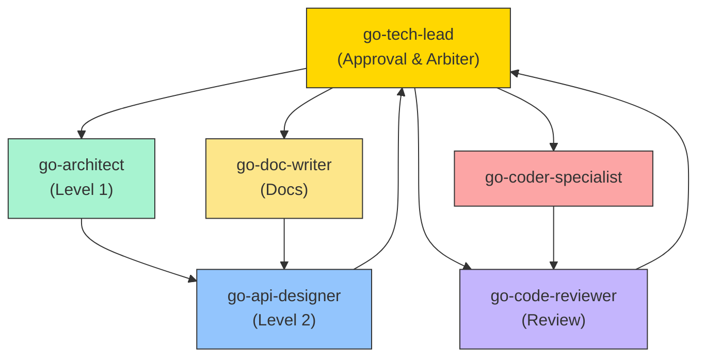

# Agent Collaboration Protocol and Iteration Control (Go)

**Purpose**: Define the collaboration workflow, iteration limits, and escalation mechanisms among Go development Agents to prevent infinite loops and ensure productive collaboration.

**Version**: 1.0  
**Last Updated**: 2026-01-26

---

## Collaboration Workflow Overview



---

## Iteration Limits

### Rule 1: Maximum Iterations = 3

Any feedback loop between two Agents is limited to **3 iterations**.

| Scenario | Allowed Iterations | After Limit |
| -------------------------- | ----------------- | ---------------- |
| architect ↔ api-designer | 3 | Escalate to tech-lead |
| api-designer ↔ coder | 3 | Escalate to tech-lead |
| coder ↔ code-reviewer | 3 | Escalate to tech-lead |
| doc-writer ↔ api-designer | 3 | Escalate to tech-lead |

### Rule 2: Iteration Counting

```text
Iteration 1: Agent A → Agent B (initial request)
Iteration 2: Agent B → Agent A (feedback / change request)
Iteration 3: Agent A → Agent B (resubmission after changes)
Iteration 4: ❌ Exceeded - must escalate to tech-lead
```

### Rule 3: Iteration Tracking Template

Every feedback message MUST include the iteration count:

```markdown
## Feedback (Iteration 2/3)

**From**: @go-coder-specialist
**To**: @go-api-designer
**Remaining Iterations**: 1

**Issue**: [short description of the problem]

**Request**: [what you need from the recipient]

---
⚠️ Note: If the issue persists after this change, the next feedback will automatically
escalate to @go-tech-lead
```

---

## Escalation Mechanism

### Automatic Escalation Triggers

1. **Iterations exceeded**: Iteration count > 3
2. **Explicit request**: An Agent declares it cannot proceed
3. **Stalemate**: Conflicting positions that cannot be resolved between Agents
4. **Blocking timeout**: Waiting for a response > 24 hours

### Escalation Message Template

```markdown
@go-tech-lead – arbitration requested

## Escalation Type
- [ ] Iterations exceeded (Iteration > 3)
- [ ] Unable to proceed
- [ ] Conflicting positions
- [ ] Blocking timeout

## Involved Agents
- @agent1
- @agent2

## Issue Description
[Detailed description of the problem]

## Iteration History Summary
| Iteration | From | To | Summary |
|-----------|------|-----|---------|
| 1 | @agent1 | @agent2 | [Initial request] |
| 2 | @agent2 | @agent1 | [Feedback: issue X] |
| 3 | @agent1 | @agent2 | [Resubmission after changes] |
| 4 | @agent2 | @agent1 | [Still issue Y] ← exceeded limit |

## Positions
**@agent1 position**: [description]
**@agent2 position**: [description]

## Request
Please make a final decision.
```

---

## Degraded Output Strategies

When design documents or upstream inputs are incomplete, do not fully block; instead, employ a degraded delivery strategy.

### Strategy 1: Minimal Viable Output (MVP Output)

```markdown
## Degraded Output Declaration

**Reason**: [specific reason why upstream input is incomplete]

**Degraded Content**:
This output is based on incomplete input; the following items are marked as "to be completed":
- [ ] [item to be completed 1]
- [ ] [item to be completed 2]

**When upstream provides the missing information**:
Please @[upstream-agent] supply the missing items; I will update the output accordingly:
- [required info 1]
- [required info 2]
```

### Strategy 2: Assumptions with Annotations

```markdown
## Output Based on Assumptions

Because upstream did not specify the following, I produce output based on reasonable assumptions:

| Item | Assumed Value | Impact if Wrong |
|------|---------------|-----------------|
| Error handling strategy | return nil with error | may require return handling changes |
| Concurrency requirement | 1000 QPS | may require goroutine-safety changes |

⚠️ **Risk**: If an assumption is incorrect, rework will be required

@[upstream-agent] Please confirm these assumptions
```

### Strategy 3: Phased Delivery

```markdown
## Phased Delivery

Due to incomplete upstream output, phased delivery approach:

### Phase 1: Completed ✅
- [completed parts]

### Phase 2: Pending upstream input ⏳
- Dependencies: [required upstream input]
- Estimated completion: Within 1 day after receiving upstream input

### Phase 3: Optional optimizations 📋
- [parts that can be optimized later]
```

---

## Quality Gates

### Gate 1: Design Approved

**Entry Criteria**:

- [ ] Level 1 Architecture Design completed
- [ ] Level 2 API Specification completed
- [ ] Approved by @go-tech-lead
- [ ] Iterations ≤ 3

**Allowed action**: @go-coder-specialist may start implementation

### Gate 2: Implementation Approved

**Entry Criteria**:

- [ ] Code implementation completed
- [ ] All static analysis passes (gofmt, go vet, staticcheck/golangci-lint)
- [ ] Test coverage ≥ 80%
- [ ] Approved by @go-tech-lead via @go-code-reviewer
- [ ] Iterations ≤ 3

**Allowed action**: @go-doc-writer may start documentation

### Gate 3: Documentation Approved

**Entry Criteria**:

- [ ] User documentation completed
- [ ] API reference completed
- [ ] Approved by @go-tech-lead

**Allowed action**: Module may be released

---

## Anti-patterns

### ❌ Anti-pattern 1: Infinite Loop

```text
coder → api-designer → coder → api-designer → ...
```

**Problem**: No iteration limit leads to never-ending cycles

**Correct approach**: Escalate to tech-lead after 3 iterations

### ❌ Anti-pattern 2: Skipping Approval

```text
architect → coder (skips api-designer)
```

**Problem**: Missing API contract may cause incorrect implementation by coder

**Correct approach**: Follow the flow architect → api-designer → coder strictly

### ❌ Anti-pattern 3: Complete Block

```text
doc-writer: "Design doc is incomplete; I cannot produce anything"
```

**Problem**: Complete blocking prevents progress

**Correct approach**: Use degraded output strategies to deliver minimal viable content

### ❌ Anti-pattern 4: Unrecorded Feedback

```text
coder: "API design is broken"
(lacks detail and iteration count)
```

**Problem**: Vague feedback is not traceable

**Correct approach**: Use the iteration tracking template to state issues and iteration count clearly

### ❌ Anti-pattern 5: Bypassing Go Standards

```text
coder: "This is good enough, no need for gofmt"
```

**Problem**: Violates non-negotiable Go formatting standard

**Correct approach**: ALL Go code MUST be gofmt-formatted, no exceptions

---

## Agent Roles and Responsibilities

### go-architect

- **Deliverable**: Level 1 Architecture Design
- **Receives feedback from**: @go-api-designer
- **Submits for approval to**: @go-tech-lead
- **Escalation condition**: Iterations with api-designer > 3

### go-api-designer

- **Deliverable**: Level 2 API Specification
- **Receives feedback from**: @go-architect, @go-coder-specialist, @go-doc-writer
- **Submits for approval to**: @go-tech-lead
- **Escalation condition**: Iterations with any agent > 3

### go-coder-specialist

- **Deliverable**: Implementation code (gofmt-formatted, following Effective Go)
- **Receives feedback from**: @go-code-reviewer, @go-api-designer
- **Submits code to**: @go-code-reviewer
- **Escalation condition**: Iterations with code-reviewer or api-designer > 3

### go-code-reviewer

- **Deliverable**: Code review report
- **Receives code from**: @go-coder-specialist
- **Submits for final approval to**: @go-tech-lead
- **Escalation condition**: Iterations with coder > 3 or critical issues remain

### go-doc-writer

- **Deliverable**: User documentation
- **Receives feedback from**: @go-api-designer
- **Submits for approval to**: @go-tech-lead
- **Escalation condition**: Iterations with api-designer > 3

### go-tech-lead

- **Responsibilities**: Approval, arbitration, quality gate enforcement
- **Receives requests from**: All agents
- **Final decision authority**: Yes

---

## Go-Specific Standards Enforcement

### Non-Negotiable Requirements

These requirements MUST be met before any approval:

1. **Formatting**: All code MUST be gofmt-formatted (no exceptions)
2. **Imports**: All imports MUST be organized with goimports
3. **Error Handling**: All errors MUST be checked (no ignored errors with `_`)
4. **Godoc**: All exported items MUST have godoc comments
5. **Testing**: Test coverage MUST be ≥ 80%
6. **Static Analysis**: 
   - `go vet ./...` → 0 issues
   - `staticcheck ./...` or `golangci-lint run` → 0 critical/high issues
   - `go build ./...` → success
   - `go test -race ./...` → pass

### Effective Go Compliance

All design and implementation decisions MUST follow [Effective Go](https://go.dev/doc/effective_go) and [Go Code Review Comments](https://github.com/golang/go/wiki/CodeReviewComments) principles:

- Naming: MixedCaps (not snake_case)
- Interfaces: Small and focused (prefer one-method interfaces)
- Concurrency: Use goroutines and channels appropriately
- Error handling: Return errors as last return value
- Context: Pass context.Context as first parameter

---

## Workflow Example

### Scenario: Implementing a User Service

```text
1. Requirements gathering
   ↓
2. @go-architect creates Level 1 design
   ↓
3. @go-tech-lead reviews → ✅ Approved
   ↓
4. @go-api-designer creates Level 2 API spec
   ↓
5. @go-tech-lead reviews → 🔄 Revision needed (Iteration 1/3)
   ↓
6. @go-api-designer revises
   ↓
7. @go-tech-lead reviews → ✅ Approved (Gate 1 passed)
   ↓
8. @go-coder-specialist implements
   ↓
9. @go-code-reviewer reviews → 🔄 Issues found (Iteration 1/3)
   ↓
10. @go-coder-specialist fixes
    ↓
11. @go-code-reviewer reviews → ✅ Ready for approval
    ↓
12. @go-tech-lead final approval → ✅ Approved (Gate 2 passed)
    ↓
13. @go-doc-writer creates docs
    ↓
14. @go-tech-lead reviews → ✅ Approved (Gate 3 passed)
    ↓
15. Module released
```

---

## Version History

| Version | Date | Changes |
| -------- | ------ | --------- |
| 1.0 | 2026-01-26 | Initial release for Go development workflow |

---

## References

- [Effective Go](https://go.dev/doc/effective_go) - Official Go best practices
- [Go Code Review Comments](https://github.com/golang/go/wiki/CodeReviewComments) - Style guide
- [Go Static Analysis Setup](./static-analysis-setup.md) - Tool configuration
- [Google Design Doc Standards](../standards/google-design-doc-standards.md) - Design standards
