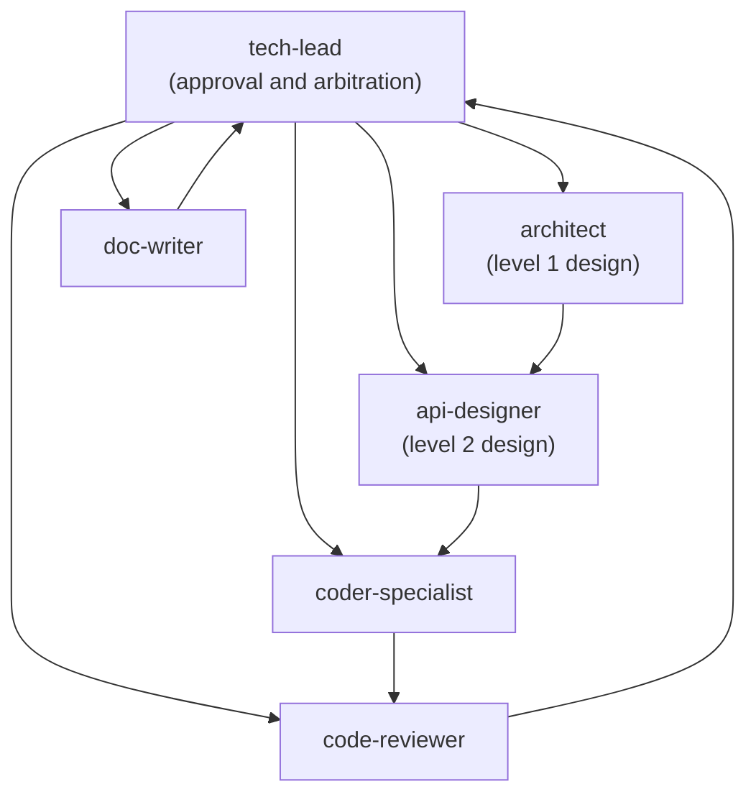

# Agent Collaboration Protocol and Iteration Control

**Purpose**: Define a shared collaboration workflow, iteration limits, and escalation rules for all engineering agents to prevent infinite loops and keep delivery moving.

**Version**: 2.0  
**Last Updated**: 2026-03-12

---

## Source of Truth

This document is the single source of truth for agent collaboration protocol.

Language directories may keep small supplements only:

- `knowledge/standards/engineering/go/agent-collaboration-protocol.md`
- `knowledge/standards/engineering/python/agent-collaboration-protocol.md`

Supplements must not duplicate the full protocol.

---

## Collaboration Workflow Overview



---

## Iteration Limits

### Rule 1: Maximum Iterations = 3

Any two-agent feedback loop is limited to **3 iterations**.

| Scenario                    | Allowed Iterations | After Limit           |
| --------------------------- | ------------------ | --------------------- |
| architect ↔ api-designer    | 3                  | Escalate to tech-lead |
| api-designer ↔ coder        | 3                  | Escalate to tech-lead |
| coder ↔ code-reviewer       | 3                  | Escalate to tech-lead |
| doc-writer ↔ api-designer   | 3                  | Escalate to tech-lead |

### Rule 2: Iteration Counting

```text
Iteration 1: Agent A -> Agent B (initial request)
Iteration 2: Agent B -> Agent A (feedback/change request)
Iteration 3: Agent A -> Agent B (resubmission)
Iteration 4: Exceeded -> must escalate
```

### Rule 3: Required Feedback Header

```markdown
## Feedback (Iteration 2/3)

**From**: @[agent]
**To**: @[agent]
**Remaining Iterations**: 1

**Issue**: [short description]
**Request**: [specific action needed]
```

---

## Escalation Mechanism

### Automatic Escalation Triggers

1. Iteration count exceeds 3.
2. An agent cannot proceed with available inputs.
3. Positions conflict and cannot be resolved in-loop.
4. Blocking timeout exceeds 24 hours.

### Escalation Message Template

```markdown
@[tech-lead-agent] - arbitration requested

**Escalation Type**:
- [ ] Iterations exceeded
- [ ] Unable to proceed
- [ ] Conflicting positions
- [ ] Blocking timeout

**Involved Agents**: @[agent1], @[agent2]
**Issue**: [concise description]

**Iteration History**:
1. [what was tried]
2. [what changed]
3. [why still blocked]

**Options**:
1. [option A]
2. [option B]

Please make a final decision.
```

---

## Degraded Delivery (Do Not Fully Block)

When upstream output is incomplete, use one of these strategies instead of stopping delivery:

1. **MVP Output**: deliver minimum usable result and mark missing sections.
2. **Assumption-Based Output**: list assumptions and explicit risk if assumptions are wrong.
3. **Phased Delivery**: split into completed now vs pending upstream input.

---

## Quality Gates

### Gate 1: Design Approved

- [ ] Level 1 architecture exists
- [ ] Level 2 API spec exists
- [ ] Approved by tech-lead
- [ ] Iterations <= 3

### Gate 2: Implementation Approved

- [ ] Code implementation completed
- [ ] Required static analysis passed
- [ ] Tests passed and coverage target met
- [ ] Approved by tech-lead (with reviewer input)
- [ ] Iterations <= 3

### Gate 3: Documentation Approved

- [ ] User documentation completed
- [ ] API reference completed
- [ ] Approved by tech-lead

---

## Anti-Patterns

1. Infinite feedback loops without escalation.
2. Skipping design/review gates.
3. Full delivery block because inputs are incomplete.
4. Unrecorded decisions that cannot be audited later.

---

## Enforcement

If any team-specific document conflicts with this protocol, this document wins.
Language supplements may tighten constraints, but must not weaken these rules.
