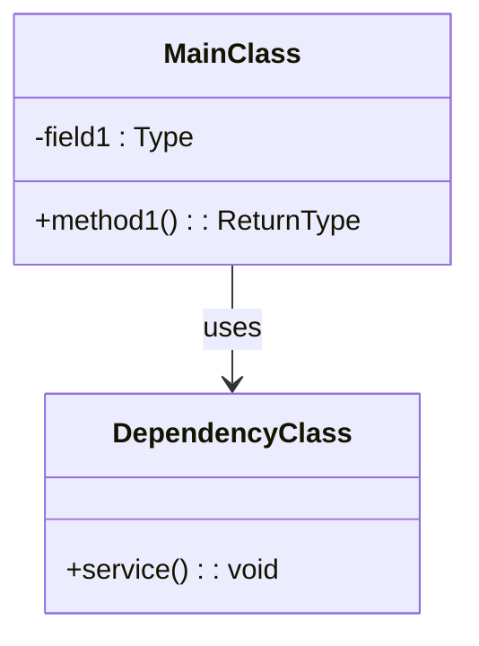
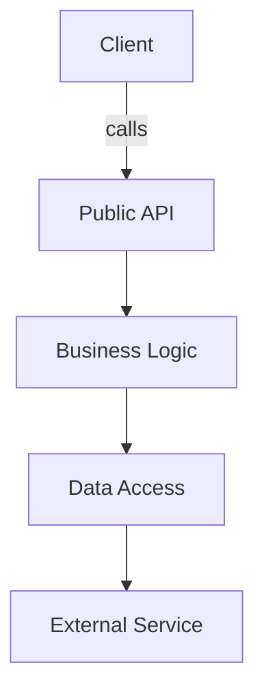
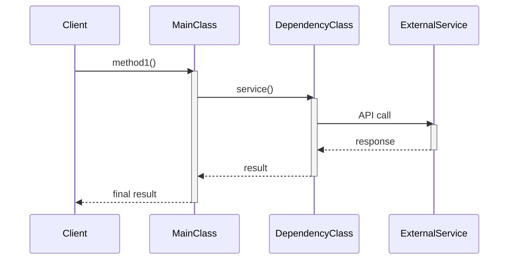
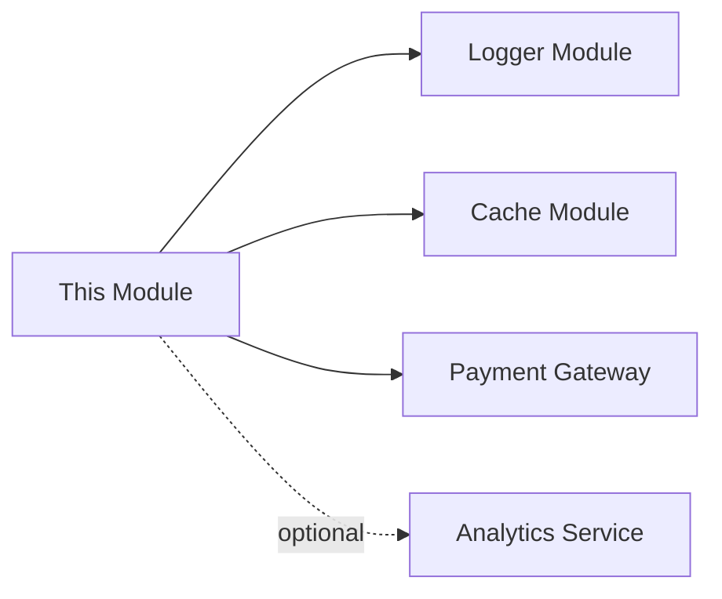

# [Module Name] Design Document

| Key               | Value                        |
| ----------------- | ---------------------------- |
| ----------------- | ---------------------------- |
| **Author**        | [Architect Name]             |
| **Date**          | [YYYY-MM-DD]                 |
| **Status**        | Draft / Review / Approved    |
| **Related Issue** | [Issue Link if applicable]   |

---

## 1. Module Overview

**Purpose:**  
[Summarize the module's core purpose and business value]

**Scope:**  
[Define the module boundary: what is included and excluded]

**Key Features:**

- [Feature 1: summary]
- [Feature 2: summary]
- [Feature 3: summary]

**Success Criteria:**

- [Performance metric, e.g., QPS > 1000]
- [Quality metric, e.g., test coverage > 80%]
- [Maintainability metric, e.g., cyclomatic complexity < 10]

---

## 2. Architecture Diagram

### 2.1 Class Diagram



### 2.2 Component Diagram



**Architecture Decisions:**

- [Decision 1: why choose this architecture pattern?]
- [Decision 2: why use this dependency relationship?]

---

## 3. Class Lifecycle

| Class Name     | Lifecycle      | Justification                      |
| -------------- | -------------- | ---------------------------------- |
| -------------- | -------------- | ---------------------------------- |
| MainClass      | Singleton      | Globally shared configuration; stateless               |
| HelperClass    | Prototype      | Create a new instance per request to avoid state pollution   |
| CacheService   | Singleton      | Global cache; data must be shared across requests       |
| RequestHandler | Request-Scoped | Per-request instance containing request context   |

**Instantiation Strategy:**

- **Singleton Classes**: [How is it instantiated? Builder pattern, enum, or lazy initialization?]
- **Prototype Classes**: [Who creates instances? Factory or constructor?]
- **Lifecycle Management**: [Who destroys instances? How are resources cleaned up?]

---

## 4. Concurrency Requirements

### 4.1 Concurrency Scenarios

| Scenario                         | Concurrent Access | Expected QPS | Peak QPS |
| -------------------------------- | ----------------- | ------------ | -------- |
| -------------------------------- | ----------------- | ------------ | -------- |
| User subscription verification   | Yes               | 100          | 500      |
| Periodic cache refresh           | No                | N/A          | N/A      |
| Configuration update             | Single-threaded   | N/A          | N/A      |

### 4.2 Thread Safety Strategy

| Class Name    | Concurrency Model          | Implementation Details              |
| ------------- | -------------------------- | ----------------------------------- |
| ------------- | -------------------------- | ----------------------------------- |
| MainClass     | Thread-Safe (Stateless)    | All methods are stateless; no synchronization needed            |
| CacheService  | Thread-Safe (Synchronized) | Use ConcurrentHashMap and atomic variables |
| ConfigManager | Single-threaded            | Initialized only at startup; no concurrent access        |

**Synchronization Rules:**

- **No Synchronization**: [Which classes do not require synchronization, and why?]
- **Synchronized Methods**: [Which methods require synchronization, and what lock contention is expected?]
- **Lock-Free Design**: [Use atomic variables? Why?]
- **Immutable Objects**: [Which classes are immutable, and why?]

**Performance Considerations:**

- [Expected response time: < 100ms]
- [Lock contention assessment: low/medium/high]
- [Scaling strategy: vertical/horizontal]

---

## 5. Call Sequence

### 5.1 Primary Use Case: [Use Case Name]



**Call Flow Description:**

1. [Step 1: Client calls MainClass.method1()]
2. [Step 2: MainClass calls DependencyClass.service()]
3. [Step 3: DependencyClass calls ExternalService API]
4. [Step 4: Return result to Client]

**Error Handling:**

- [Exception 1: ExternalService timeout -> how to handle?]
- [Exception 2: data validation failure -> how to handle?]

---

## 6. Dependencies

### 6.1 Internal Module Dependencies

**Dependency Table:**

| Dependency Module | Required Interface | Interface Contract     | Integration Strategy  | Failure Handling     |
| ----------------- | ------------------ | ---------------------- | --------------------- | -------------------- |
| ----------------- | ------------------ | ---------------------- | --------------------- | -------------------- |
| ConfigLoader      | ConfigProvider     | Config getConfig()     | Constructor injection | Fail-fast on startup |
| HttpClient        | HttpSender         | Response send(Request) | Constructor injection | Retry 3 times        |

**Interface Contracts:**

```java
// ConfigLoader interface required from this dependency
public interface ConfigProvider {
    /**
     * Get configuration object
     * @return immutable configuration object
     * @ThreadSafe Yes（safe for concurrent calls）
     * @throws ConfigException config load failure
     */
    Config getConfig() throws ConfigException;
}

// HttpClient interface required from this dependency
public interface HttpSender {
    /**
     * Send HTTP request
     * @param request request object
     * @return response object
     * @throws IOException network exception
     * @ThreadSafe Yes（safe for concurrent calls）
     */
    Response send(Request request) throws IOException;
}
```

**Integration Strategy:**

- Dependency injection: constructor injection (follows dependency inversion principle)
- Initialization order: ConfigLoader -> HttpClient -> [Current module]
- Lifecycle management: all dependencies must be ready before this module initializes

**Circular Dependency Detection:**

- [Are there circular dependencies? How are they removed?]

### 6.2 Internal Utility Dependencies

| Dependency Module | Type   | Purpose  | Failure Handling       |
| ----------------- | ------ | -------- | ---------------------- |
| ----------------- | ------ | -------- | ---------------------- |
| Logger Module     | Strong | Logging | N/A (Always available) |
| Cache Module      | Weak   | Performance optimization | Degrade to direct query         |

### 6.3 External Dependencies

| External Service  | Type   | SLA   | Timeout | Retry Strategy              |
| ----------------- | ------ | ----- | ------- | --------------------------- |
| ----------------- | ------ | ----- | ------- | --------------------------- |
| Payment Gateway   | Strong | 99.9% | 5s      | 3 retries with backoff      |
| Analytics Service | Weak   | 95%   | 2s      | Best effort (no retry)      |

**Dependency Graph:**



**Failure Scenarios:**

- [Scenario 1: Payment Gateway timeout]
  - Impact: [Users cannot complete payment]
  - Mitigation: [Retry 3 times and show a user-friendly error message]
  
- [Scenario 2: Cache module unavailable]
  - Impact: [Performance degrades by 20%]
  - Mitigation: [Degrade to direct database queries]

**Circuit Breaker Strategy:**

- [Use a circuit breaker? What thresholds?]

---

## 7. Public APIs

### 7.1 API Contract

```java
/**
 * [API description]
 * 
 * @param param1 [Parameter description]
 * @return [Return value description]
 * @throws ExceptionType [Exception scenario]
 * @ThreadSafe [Thread-safe?]
 * @Idempotent [Idempotent?]
 */
public ReturnType methodName(ParamType param1) throws ExceptionType;
```

### 7.2 API List

| API Method           | Purpose        | Thread-Safe | Idempotent | Exception Handling |
| -------------------- | -------------- | ----------- | ---------- | ------------------ |
| -------------------- | -------------- | ----------- | ---------- | ------------------ |
| verifySubscription() | Verify subscription status   | Yes         | Yes        | Return false         |
| startMonitor()       | Start periodic checks | No          | Yes        | Throw exception           |

**API Design Decisions:**

- [Decision 1: why is this API designed as synchronous?]
- [Decision 2: why return Optional instead of null?]

**Backward Compatibility:**

- [How is API backward compatibility ensured?]
- [Migration strategy for deprecated APIs?]

---

## 8. Implementation Constraints

### 8.1 Performance Requirements

- **Response Time**: [< 100ms for 95th percentile]
- **Throughput**: [> 1000 QPS]
- **Memory Usage**: [< 500MB heap]
- **CPU Usage**: [< 50% on 4-core machine]

**Performance Optimization Strategies:**

- [Strategy 1: use object pooling to reduce GC]
- [Strategy 2: handle non-critical paths asynchronously]

### 8.2 Security Requirements

- **Authentication**: [How is identity verified? JWT or OAuth?]
- **Authorization**: [How is authorization controlled? RBAC or ABAC?]
- **Data Encryption**: [Which data must be encrypted? In transit and at rest?]
- **Input Validation**: [How are injection attacks prevented?]

### 8.3 Compatibility Requirements

- **Java Version**: [Minimum: Java 8, Target: Java 11]
- **Dependencies**: [Spring Boot 3.2.x, Jackson 2.15.x]
- **Platform**: [Linux, macOS, Windows]

### 8.4 Testing Requirements

- **Unit Test Coverage**: [> 80%]
- **Integration Test**: [Scenarios that must be covered]
- **Performance Test**: [Load test with 1000 QPS]
- **Concurrency Test**: [Stress test with 100 threads]

---

## 9. Implementation Notes

### 9.1 Critical Implementation Details

**Concurrency Implementation:**

```java
// Example: how to implement thread safety
private final ConcurrentHashMap<String, Value> cache = new ConcurrentHashMap<>();
private final AtomicInteger counter = new AtomicInteger(0);
```

**Lifecycle Management:**

```java
// Example: how to implement singleton
public class Singleton {
    private static final Singleton INSTANCE = new Singleton();
    private Singleton() {}
    public static Singleton getInstance() { return INSTANCE; }
}
```

### 9.2 Known Limitations

- [Limitation 1: distributed scenarios are not currently supported]
- [Limitation 2: cache size is limited to 1000 entries]

### 9.3 Future Enhancements

- [Enhancement 1: support asynchronous APIs]
- [Enhancement 2: add metrics and tracing]

---

## 10. Review and Approval

**Architecture Review:**

- [ ] Lifecycle design is reasonable
- [ ] Concurrency model matches real scenarios
- [ ] Dependencies are clear
- [ ] Performance requirements are achievable
- [ ] Security requirements are addressed

**Reviewed By:**

- [Reviewer 1 Name]: [Date] - [Comments]
- [Reviewer 2 Name]: [Date] - [Comments]

**Approval:**

- [ ] Tech Lead: [Name] [Date]
- [ ] Architect: [Name] [Date]

---

## Appendix A: Glossary

| Term       | Definition               |
| ---------- | ------------------------ |
| ---------- | ------------------------ |
| QPS        | Queries Per Second       |
| SLA        | Service Level Agreement  |
| Idempotent | An operation that produces the same result when executed multiple times   |

## Appendix B: References

- [Alibaba Java Coding Guidelines](https://github.com/alibaba/p3c)
- [Java Concurrency in Practice](https://jcip.net/)
- [Effective Java (3rd Edition)](https://www.oreilly.com/library/view/effective-java-3rd/9780134686097/)
