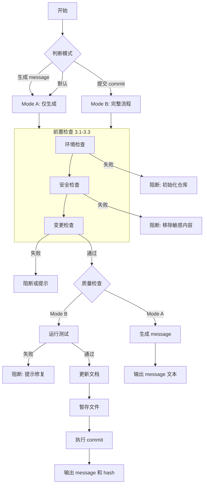

基于实际代码变更，按照开源贡献工作流生成并（可选）执行 git commit，message 使用中文。

---

## 0. 执行流程



---

## 1. Patterns & Anti-Patterns

> 以下 Pattern/Anti-Pattern 适用模式：**A + B** 表示两种模式都适用，**仅 B** 表示仅完整提交流程适用。

### 1.1 Patterns

| Pattern | Description | 适用模式 |
|---------|-------------|---------|
| Atomic commit | 每个 commit 只做一件事（单一 type/scope） | A + B |
| Conventional format | 严格遵循 `type(scope): summary` 格式 | A + B |
| Explain WHY | Body 重点解释变更原因，而非实现细节 | A + B |
| Reference issues | 关联 Issue/PR 便于追溯 | A + B |
| Verify before commit | 提交前运行相关测试/lint | B（A 建议） |
| Update docs | 行为变更时同步更新文档 | **仅 B** |

### 1.2 Anti-Patterns

| Anti-Pattern | Description | 适用模式 |
|--------------|-------------|---------|
| Mixed concerns | 一个 commit 混合多种不相关变更（feat + fix + refactor） | A + B |
| Vague summary | 模糊的摘要如 "update code" / "fix bug" / "修改代码" | A + B |
| No context | 只有 WHAT 没有 WHY | A + B |
| Giant commit | 单次提交修改过多文件（>10 个） | A + B |
| Commit secrets | 提交密钥、凭证等敏感信息 | A + B |
| No verification | 功能变更没有测试或手动验证说明 | A + B |

---

## 2. 输出模式

### 2.1 模式说明

| 模式 | 说明 | 行为 |
|-----|------|------|
| **Mode A** | 仅生成 Message（默认） | 输出 commit message 文本，不修改文件，不执行 git 命令 |
| **Mode B** | 完整提交流程 | 更新文档 → 生成 message → 执行 git add/commit → 输出 hash |

### 2.2 模式触发关键词

| 用户输入关键词 | 触发模式 |
|--------------|---------|
| "生成 message" / "写 commit message" / "draft" / "帮我写" / "just the message" / "only message" | Mode A |
| "提交" / "commit" / "帮我 commit" / "提交代码" / "commit these" / "commit changes" / "make a commit" | Mode B |
| 无明确指令 | Mode A（默认） |

### 2.3 Mode A 边界

- ✅ 执行 `git status` / `git diff` 查看变更（只读操作）
- ✅ 生成 commit message 文本
- ❌ 不修改任何文件（README/CHANGELOG 也不改）
- ❌ 不执行 `git add` / `git commit`

---

## 3. 前置检查（按顺序执行，Mode A + B）

> ⚠️ 以下检查必须按顺序执行，任何一项失败都将阻断后续操作

### 3.1 环境检查

**检查项**：
```bash
git rev-parse --is-inside-work-tree  # 1. 确认在 git 仓库中
git symbolic-ref --short HEAD        # 2. 确认不在 detached HEAD
```

| 检查结果 | 处理 |
|---------|------|
| 不在 git 仓库 | **阻断**：提示用户先初始化仓库 (`git init`) |
| Detached HEAD | **警告**：建议用户先切换到命名分支（可继续） |

### 3.2 安全检查

**禁止提交的内容**：
- ❌ Secrets、tokens、private keys、credentials
- ❌ Large binaries（大文件）
- ❌ 环境特定路径（如 `/Users/xxx/`、`C:\Users\`）

**敏感信息检测模式**：

*Key 名称模式*（检查代码/配置中的变量名）：
```
- api_key / apikey / API_KEY / API-KEY
- password / passwd / pwd / PASS
- secret / secret_key / SECRET
- token / access_token / auth_token / refresh_token
- private_key / privateKey / PRIVATE_KEY
- aws_access_key_id / aws_secret_access_key
```

*敏感文件路径模式*：
```
- .env / .env.local / .env.production / .env.*.local
- credentials.json / secrets.json / config.secrets.json
- *.pem / *.key / *.p12 / *.pfx
- id_rsa / id_ed25519 / id_ecdsa
- service-account.json / gcp-credentials.json
```

*内容模式*：
```
- -----BEGIN.*PRIVATE KEY-----
- AWS Key ID: AKIA[0-9A-Z]{16}
- GitHub Token: ghp_[a-zA-Z0-9]{36}
- JWT-like: eyJ[a-zA-Z0-9_-]*\.eyJ[a-zA-Z0-9_-]*
```

**检测范围与 .gitignore 处理**：
- 扫描 `git diff` / `git diff --staged` 的输出内容
- 文件已被 `.gitignore` 排除 → 不检测该文件内容，跳过
- 文件在变更列表中且包含敏感信息 → **阻断**

| 检测结果 | 处理 |
|---------|------|
| 发现敏感信息 | **立即阻断**，列出检测到的敏感内容，提示用户移除后再继续 |
| 通过检查 | 继续执行变更检查 |

### 3.3 变更检查

**变更状态检测**：
```bash
git diff --staged                    # 检查已暂存的变更
git status                           # 检查仓库状态
git diff                             # 检查未暂存的变更
```

**文件状态说明**：
| `git status --porcelain` 输出 | 含义 |
|------------------------------|------|
| `M  file` | 已修改并暂存 |
| ` M file` | 已修改未暂存 |
| `?? file` | 未跟踪文件 |

**已暂存文件优先**：
- 如果有已暂存文件 → 使用这些文件作为 commit 范围
- 如果无已暂存文件 → 检查未暂存变更和未跟踪文件

**未跟踪文件检测**：
```bash
git status --porcelain | grep "^??"  # 检测未跟踪文件
```

| 场景 | 处理 |
|-----|------|
| 有已暂存文件 | 使用已暂存文件（忽略未跟踪文件） |
| 无已暂存文件 + 有未跟踪文件 | 提示用户"检测到未跟踪文件：[列表]，是否需要添加？" |
| 无已暂存文件 + 有未暂存变更 | 使用未暂存变更 |

**部分暂存提醒**：
- 如果有已暂存文件 + 有未暂存变更/未跟踪文件
- 提示用户："当前仅包含已暂存的文件，还有 X 个文件未暂存，是否需要一起提交？"

**Merge Conflict 检测**：
```bash
git status --porcelain | grep "^UU\|^AA\|^DD"  # 检测冲突文件
```

| 状态码 | 含义 |
|-------|------|
| `UU` | both modified（双方修改） |
| `AA` | both added（双方添加） |
| `DD` | both deleted（双方删除） |

| 检测结果 | 处理 |
|---------|------|
| 有冲突文件（有输出） | **阻断**：提示用户先解决冲突后再提交 |
| 无冲突（无输出） | 继续执行 |

**无变更处理**：
- Mode A: 提示用户 "当前没有可提交的变更"，不生成 message
- Mode B: 提示用户 "当前没有可提交的变更"，询问是否需要先执行 `git add`

---

## 4. Commit Message 规范

### 4.1 格式模板

```text
type(scope): 中文摘要（<=50字符）

Changes:
- 中文描述变更内容（每行<=72字符）
- 解释 WHY（为什么需要这个变更）

Testing:
- 测试方法或手动验证步骤（用中文）
- 如确实无法验证，说明原因

# Optional footer:
BREAKING CHANGE: 中文描述破坏性变更
Issue: #123
PR: #456
```

### 4.2 Type 选择指南

| 变更类型 | type | 示例 scope | 说明 |
|---------|------|-----------|------|
| 新增功能 | feat | api, cli, core | 用户可见的新能力 |
| 修复 bug | fix | auth, parser | 修复已有功能的问题 |
| 文档变更 | docs | - | README, 注释, 文档文件 |
| 代码风格 | style | - | 格式化、不影响逻辑 |
| 重构代码 | refactor | utils, config | 不改变功能的代码改进 |
| 性能优化 | perf | query, render | 提升性能的优化 |
| 测试相关 | test | - | 添加或修改测试 |
| 构建相关 | build | - | 构建系统、依赖更新 |
| CI 配置 | ci | - | CI/CD 配置变更 |
| 维护杂项 | chore | deps | 其他不修改 src 的变更 |
| 回退提交 | revert | - | 回退先前的 commit |

**多类型变更优先级**: `fix` > `feat` > `refactor` > `style` > `chore` > `docs` > `test`

### 4.3 Scope 推断规则

| 变更范围 | scope 判断 | 标准 |
|---------|-----------|------|
| 单模块（所有文件在同一子目录） | 使用模块名 | `src/auth/*.go` → `auth` |
| 跨 2 个模块 | 选择影响更大的模块 | 按变更行数判断；行数相近按重要性（core > api > utils） |
| 跨 3+ 模块 | **省略 scope** | auth + api + db → 无 scope |
| 纯文档/测试变更 | 通常省略 scope | `README.md` → 无 scope |
| 全局配置变更 | 可省略或用 `deps` | 更新所有依赖 → `deps` |

**跨模块判断示例**：
- auth +5 行 / api +100 行 → `api`（行数差异大）
- auth +50 行 / api +60 行 → `auth`（行数相近，auth 更核心）

### 4.4 消息规则

| 规则 | 要求 |
|-----|------|
| **摘要** | 必须用中文，<= 50 字符，禁止模糊描述 |
| **段落标签** | 使用英文（`Changes:`, `Testing:`），与 `.gitmessage` 一致 |
| **正文内容** | 使用中文，每行 <= 72 字符 |
| **重点** | 解释 WHAT 和 WHY，只在必要时说明 HOW |
| **Testing 段落** | **必须包含**。如无自动化测试，描述手动验证步骤；如确实无法验证，说明原因 |
| **破坏性变更** | **同时使用两种标记**：① type 后加 `!`（如 `feat(api)!:`）；② footer 添加 `BREAKING CHANGE:` 详细说明 |
| **关联引用** | 在末尾添加 Issue/PR（如 `Issue: #123`） |

### 4.5 特殊类型：Revert

**获取原始 commit 信息**：
```bash
git log --oneline -1 <commit-hash>  # 获取摘要
git show --stat <commit-hash>       # 获取变更范围
```

**摘要处理规则**：
- 原始 commit 摘要**保持原样**（不翻译成中文）
- 前缀使用中文："撤销"

**格式模板**：
```text
revert: 撤销 "原始 commit 摘要（保持原样）"

This reverts commit <original-commit-hash>.

Changes:
- 撤销的原因（为什么要回退）

Testing:
- 验证回退后系统正常
```

**示例**：
```text
revert: 撤销 "fix(auth): resolve token expiration bug"

This reverts commit abc123def456.

Changes:
- 该修复引入了新的兼容性问题，需要重新评估方案

Testing:
- 回退后运行认证模块测试套件
```

---

## 5. 工作流（前置检查通过后执行）

### 5.1 质量检查 [Mode B 强制，Mode A 建议]

- Mode B: 必须运行项目配置的测试 / linter / formatter
- Mode A: 建议检查，但不强制
- 如果没有自动化测试，在 `Testing:` 段落描述手动验证步骤
- 如果 lint/test 失败，提示用户修复后重试

### 5.2 更新文档 [仅 Mode B]

| 文件 | 更新时机 | 说明 |
|-----|---------|------|
| `README.md` | 行为/用法/安装方式变更时 | 保持简洁，使用中文 |
| `CHANGELOG.md` | 用户可见变更时 | 添加到 `## Unreleased` 下 |

**CHANGELOG 注意事项**：
- 不要在 CHANGELOG 中添加 commit id（避免循环依赖）
- commit id 在发布时由 changelog-specialist 统一补充

### 5.3 提交 [仅 Mode B]

**暂存文件**：
- 仅暂存相关文件（避免无关噪音）

**执行提交**：
- 提交到当前分支

**Hook 处理**：
- 如果 pre-commit hook 失败，展示 hook 输出内容，提示用户修复
- **禁止**自动使用 `--no-verify` 绕过 hooks
- 如用户明确要求绕过，需二次确认

**输出结果**：
- 输出 commit hash

---

## 6. 异常处理

### 6.1 阻断性异常（必须停止）

| 情况 | Mode A | Mode B |
|-----|--------|--------|
| 不在 git 仓库 | **阻断** | **阻断** |
| 检测到 secrets/credentials | **阻断** | **阻断** |
| Merge conflict 存在 | **阻断** | **阻断** |

### 6.2 交互性异常（需用户确认）

| 情况 | Mode A | Mode B |
|-----|--------|--------|
| 变更文件数 > 10 | **建议**拆分，继续生成 | **询问**，等待确认后继续 |
| Detached HEAD | **警告**，继续生成 | **警告**，建议切换分支 |
| 有未跟踪文件 | **提示**，询问是否添加 | **提示**，询问是否添加 |
| 部分暂存（有未暂存变更） | **提示**，询问是否一起提交 | **提示**，询问是否一起提交 |

### 6.3 非阻断性异常（提示后可继续）

| 情况 | Mode A | Mode B |
|-----|--------|--------|
| 无变更（无暂存文件或无未暂存变更） | **提示**，不生成 | **提示**，询问是否需要 `git add` |
| 仅 whitespace/格式变更 | **建议**合并或跳过 | **建议**合并或跳过 |
| Lint/Test 失败 | **警告**，继续生成 | **阻断**，等待修复 |

### 6.4 特殊处理

| 情况 | 处理方式 |
|-----|---------|
| Revert commit | 使用 4.5 节特殊格式 |
| pre-commit hook 失败 | 展示输出，不自动绕过 |

---

## 7. 输出模板

> 注意：输出时**不要包含** `---` 分隔符和 `text` 标记，它们仅用于本文档展示。

### 7.1 示例 1：功能提交

```text
feat(auth): 添加 OAuth2.0 社交登录支持

Changes:
- 集成 Google 和 GitHub OAuth2.0 Provider
- 添加用户绑定/解绑社交账号的 API
- 用户首次社交登录时自动创建账号

Testing:
- 手动测试 Google/GitHub 登录流程
- 验证账号绑定/解绑功能正常
- 运行 auth 模块单元测试: go test ./pkg/auth/...

Issue: #42
```

### 7.2 示例 2：Bug 修复

```text
fix(parser): 修复 JSON 解析时空指针异常

Changes:
- 添加对 null 值的检查，避免解析空对象时崩溃
- 原因：上游 API 偶尔返回 null 字段导致服务中断

Testing:
- 添加 null 值处理的单元测试
- 本地复现并验证修复有效

Issue: #128
```

### 7.3 示例 3：文档更新

```text
docs: 更新安装文档中的依赖版本要求

Changes:
- Node.js 最低版本从 14 更新到 18
- 添加 pnpm 安装方式说明

Testing:
- 在全新环境中按文档验证安装流程
```

### 7.4 示例 4：破坏性变更

```text
feat(api)!: 重构用户 API 响应格式

Changes:
- 统一 API 响应结构为 { code, data, message }
- 移除废弃的 v1 端点
- 重构原因：原有响应格式不统一，前端处理复杂

Testing:
- 更新 API 集成测试
- 验证所有端点返回格式一致

BREAKING CHANGE: API 响应格式已变更，前端需要适配新格式。
- 旧的 { success, result } 格式不再支持
- 请在 2024-03-01 前完成迁移

Issue: #200
```

---

## 8. 输出要求

| 模式 | 输出内容 |
|-----|---------|
| Mode A | 仅输出 commit message 文本（无额外解释，无 markdown 代码块包裹） |
| Mode B | commit message + 执行结果（已暂存文件列表、commit hash） |

格式必须符合 `.gitmessage` 模板结构。