Execute the task identified by `${input:taskId}` from the task list. The agent reads all execution parameters from the task document generated by `plan-breakdown-to-task`.

## Input

- `${input:taskId}` (string, required): The task to execute (e.g., `Task-1.1`, `Task-2.3`).
- `${input:taskListPath}` (string, required): Path to the task list directory or file. Examples:
  - `docs/tasks/user-auth/` (directory)
  - `docs/tasks/user-auth/task-list.md` (main task list file)
- `${input:dryRun}` (boolean, optional): If true, simulate execution without making actual changes.

## Output

- Update `${input:taskListPath}` with task status in Simplified Chinese.
- Mark all items in `checklist` as completed (`[x]`) after verification.
- Optional: Create individual task file `docs/tasks/{plan-name}/{taskId}.md` with execution evidence.

## Task Status Flow

```mermaid
stateDiagram-v2
    [*] --> pending: Task created
    pending --> in_progress: Start execution
    in_progress --> testing: Implementation done
    testing --> completed: All criteria passed
    testing --> testing_failed: Tests/CI failed
    in_progress --> failed: Error occurred
    testing_failed --> [*]: Fast fail
    failed --> [*]: Fast fail
    completed --> [*]
    
    pending: 待执行
    in_progress: 执行中
    testing: 测试中
    testing_failed: 测试失败
    completed: 已完成
    failed: 失败
```



| Status | Chinese | When |
|--------|---------|------|
| `pending` | 待执行 | Initial state |
| `in_progress` | 执行中 | Step 4 (implementation started) |
| `testing` | 测试中 | Step 5 (running tests) |
| `testing_failed` | 测试失败 | Tests or quality gates failed |
| `completed` | 已完成 | All criteria passed |
| `failed` | 失败 | Error during execution |
| `dry_run_completed` | 模拟完成 | dryRun mode finished |

## dryRun Mode

When `${input:dryRun}` is true:
- Simulate all execution steps.
- Do NOT make actual file changes.
- Do NOT run actual commands.
- Show expected actions and results.
- Update task status as `dry_run_completed` (模拟完成).

## Execution Flow

1. **Locate Task Document** 🔍
   - Read `${input:taskListPath}` to find the task with `${input:taskId}`.
   - If directory path provided, look for `task-list.md` first, then `{taskId}.md`.
   - Extract `Execution Parameters` section from the task document.

2. **Validate Parameters** ✅
   - Parse `Execution Parameters` from YAML/JSON in the task document.
   - Required fields: `taskId`, `acceptanceCriteria`.
   - If validation fails, **return error and STOP**.

3. **Preflight Checks** 🔍
   - Confirm `workspacePath` exists and is accessible.
   - Check `dependencies`: ensure all dependent tasks are marked as completed.
   - Verify `testCommands` can run (if provided).

4. **Implement Changes** ✍️
   - Update task status to `in_progress` (执行中).
   - Execute `runCommands` (if provided) or follow implementation points.
   - Ensure code follows repository style and lint rules.
   - Produce/update files listed in `artifacts`.

5. **Run Tests & Verify Criteria** ✅
   - Update task status to `testing` (测试中).
   - Run `testCommands` within `timeoutMinutes`.
   - If timeout exceeded, cancel tests and fail fast.
   - Run static analysis / linters.
   - Ensure all `acceptanceCriteria` are satisfied.

6. **Update Task Status** 📝
   - If all criteria passed:
     - Update status to `completed` (已完成).
     - Mark all `checklist` items as `[x]`.
     - Include verification evidence.
   - If any criteria failed:
     - Update status to `testing_failed` (测试失败).
     - Document failure details.

## Error Handling

Fail fast on any error. Do not retry.

| Scenario | Action |
|----------|--------|
| Task not found | Return error with available taskIds, status → `failed` |
| Task already completed | Return warning, no action needed |
| Missing required fields | Return `status: "error"`, `missing: [...]`, status → `failed` |
| Dependencies not complete | Return error with incomplete dependencies, status → `failed` |
| Timeout exceeded | Cancel execution, document partial progress, status → `failed` |
| Tests fail | Document failure details, status → `testing_failed` |
| Quality gates fail | List issues, status → `testing_failed` |

Error response format (Chinese + English):
```json
{
  "status": "error",
  "taskId": "Task-1.2",
  "missing": ["acceptanceCriteria"],
  "message": {
    "zh": "缺少必填字段: acceptanceCriteria",
    "en": "Missing required field: acceptanceCriteria"
  }
}
```

## Patterns & Anti-Patterns

| Pattern | Description |
|---------|-------------|
| Read From Document | All parameters come from task document, not manual input |
| Single Task Focus | Execute only the specified taskId |
| Validate First | Always validate before implementation |
| Chinese Updates | Task status updated in Simplified Chinese |
| Fail Fast | Stop immediately on error, no retry |
| Checklist Verification | Mark checklist items complete after verification |

| Anti-Pattern | Description |
|--------------|-------------|
| Manual Parameters | Do not accept manual parameter input; read from document |
| Multi-Task Execution | Execute only one task at a time |
| Skip Validation | Skipping validation leads to runtime errors |
| Missing Update | Forgetting to update task status breaks traceability |
| Summary Generation | Do not generate summaries after task execution |
| Plain Text Secrets | Never store credentials in plain text; request secure credentials |
| Guessing Parameters | Do not guess parameters; read from task document only |
| Retry on Error | Fail fast; do not retry automatically |