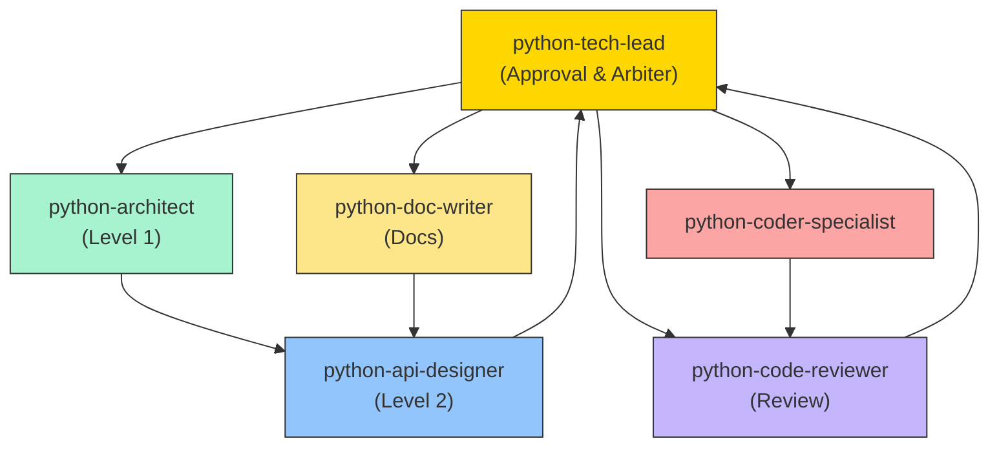

# Agent Collaboration Protocol and Iteration Control (Python)

**Purpose**: Define the collaboration workflow, iteration limits, and escalation mechanisms among Python development Agents to prevent infinite loops and ensure productive collaboration.

**Version**: 1.0  
**Last Updated**: 2026-02-10

---

## Collaboration Workflow Overview



---

## Iteration Limits

### Rule 1: Maximum Iterations = 3

Any feedback loop between two Agents is limited to **3 iterations**.

| Scenario                     | Allowed Iterations | After Limit           |
| ---------------------------- | ------------------ | --------------------- |
| architect ↔ api-designer     | 3                  | Escalate to tech-lead |
| api-designer ↔ coder         | 3                  | Escalate to tech-lead |
| coder ↔ code-reviewer        | 3                  | Escalate to tech-lead |
| doc-writer ↔ api-designer    | 3                  | Escalate to tech-lead |

### Rule 2: Iteration Counting

```text
Iteration 1: Agent A → Agent B (initial request)
Iteration 2: Agent B → Agent A (feedback / change request)
Iteration 3: Agent A → Agent B (resubmission after changes)
Iteration 4: ❌ Exceeded - must escalate to tech-lead
```

### Rule 3: Iteration Tracking Template

Every feedback message MUST include the iteration count:

```markdown
## Feedback (Iteration 2/3)

**From**: @python-coder-specialist
**To**: @python-api-designer
**Remaining Iterations**: 1

**Issue**: [short description of the problem]

**Request**: [what you need from the recipient]

---
⚠️ Note: If the issue persists after this change, the next feedback will automatically
escalate to @python-tech-lead
```

---

## Escalation Mechanism

### Automatic Escalation Triggers

1. **Iterations exceeded**: Iteration count > 3
2. **Explicit request**: An Agent declares it cannot proceed
3. **Stalemate**: Conflicting positions that cannot be resolved between Agents
4. **Blocking timeout**: Waiting for a response > 24 hours

### Escalation Message Template

```markdown
@python-tech-lead – arbitration requested

**From**: [agent name]
**Issue**: [brief description]
**Iteration History**: [summary of what was tried]
**Blocking**: [what is blocked and why]

**Options**:
1. [Option A description]
2. [Option B description]

Please arbitrate.
```

---

## Workflow by Complexity

### Simple Module (< 5 APIs, single responsibility)

```
python-architect → python-api-designer → python-coder-specialist → python-code-reviewer → python-tech-lead
```

- Skip separate doc-writer if single API
- Architect + API designer can be one pass

### Medium Module (5-15 APIs)

```
python-architect (Level 1) → python-tech-lead review
→ python-api-designer (Level 2) → python-tech-lead review
→ python-coder-specialist + python-doc-writer (parallel)
→ python-code-reviewer → python-tech-lead final approval
```

### Complex Module (> 15 APIs or cross-service)

```
python-architect (Level 1) + stakeholder input → python-tech-lead review
→ python-api-designer (Level 2) → python-tech-lead review
→ python-coder-specialist (phased) → python-code-reviewer (per phase)
→ python-doc-writer → python-tech-lead final approval
```

---

## Quality Gates

| Gate   | Owner          | Inputs                         | Decision                           |
| ------ | -------------- | ------------------------------ | ---------------------------------- |
| Gate 1 | python-tech-lead | Level 1 + Level 2 design docs  | Approve / Revise / Escalate        |
| Gate 2 | python-tech-lead | Code + review report           | Approve / Revise / Reject          |
| Gate 3 | python-tech-lead | User documentation             | Approve / Revise                   |

---

## Anti-Patterns

| Anti-Pattern              | Symptom                             | Prevention                                    |
| ------------------------- | ----------------------------------- | --------------------------------------------- |
| Infinite Loop             | > 3 iterations with no resolution   | Strict iteration counting + auto-escalation   |
| Scope Creep               | Agent adds features during review   | Reference design doc; out-of-scope = new task |
| Bypassing Quality Gates   | Coder ships without review          | Tech-lead enforces gate checkpoints           |
| Design After Coding       | Implementation diverges from design | Reject deviations; update design doc first    |
| Unrecorded Decisions      | Verbal agreements later disputed    | Record all decisions in design doc Appendix   |
