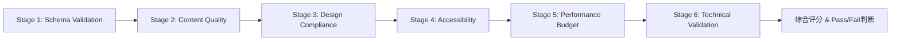

# ppt-aesthetic-qa Skill

**功能**：对幻灯片进行美学和可读性检查，基于WCAG可访问性标准、McKinsey质量标准和瑞士平面设计原则，输出量化评分和可操作建议。

**职责边界**：
- ✅ **本skill负责**：6阶段QA流水线执行（Schema/Content/Design/Accessibility/Performance/Technical）、WCAG 2.1 AAA对比度验证、认知负荷计算（CLT理论）、性能预算检查（文件大小/DPI/字体子集）、综合评分算法（70分pass门槛）、自动修复建议生成
- 🔗 **协作skill**：
  - `ppt-theme-manager.skill`：验证design tokens使用（颜色/字体/间距必须来自design_spec）
  - `ppt-chinese-typography.skill`：验证中文字体字符覆盖完整性（fonttools集成）
  - `ppt-export.skill`：验证PPTX文件完整性和打包规范
  - `ppt-chart.skill`：验证图表符合Cleveland Hierarchy和Data-Ink Ratio原则

---

## 1. 6-Stage QA Pipeline 概述

### 1.1 Pipeline 架构

**执行顺序**（串行执行，任一stage失败则标记为fail但继续执行后续stage）：



**各阶段权重分配**（总分100分）：

| Stage                         | 权重   | Pass门槛        | 检查内容                                           |
| ----------------------------- | ------ | --------------- | -------------------------------------------------- |
| -------                       | ------ | ---------       | ---------                                          |
| Stage 1: Schema Validation    | 10%    | 无critical缺失  | design_spec.json和slides.md结构完整性              |
| Stage 2: Content Quality      | 15%    | 无critical问题  | McKinsey Pyramid Principle、SCQA结构、bullets数量  |
| Stage 3: Design Compliance    | 12%    | Token使用率≥90% | 颜色/字体/间距必须来自design_spec，禁止hardcoded值 |
| Stage 4: Accessibility        | 25%    | WCAG AA合规     | 对比度/层次/留白/对齐/字体/认知负荷（6维度）       |
| Stage 5: Performance Budget   | 18%    | 文件≤50MB       | PPTX大小、图片DPI、字体子集大小                    |
| Stage 6: Technical Validation | 20%    | 无critical错误  | PPTX完整性、字体覆盖、布局bounds                   |

**总分计算公式**：
```python
overall_score = (
    stage1_score * 0.10 +
    stage2_score * 0.15 +
    stage3_score * 0.12 +
    stage4_score * 0.25 +
    stage5_score * 0.18 +
    stage6_score * 0.20
)

# Pass/Fail判断
pass_threshold = 70  # 70分及格
result = 'PASS' if overall_score >= pass_threshold else 'FAIL'
```

### 1.2 评分等级

| 分数区间  | 等级   | 描述   | 行动建议                 |
| --------- | ------ | ------ | ------------------------ |
| --------- | ------ | ------ | ---------                |
| 90-100    | A      | 优秀   | 可直接发布，符合所有标准 |
| 80-89     | B      | 良好   | 建议修复minor问题后发布  |
| 70-79     | C      | 合格   | 必须修复所有major问题    |
| 60-69     | D      | 不合格 | 禁止发布，需要重大改进   |
| 0-59      | F      | 失败   | 禁止发布，需要完全重构   |

---

## 2. Stage 1-3 实现（前置验证）

### 2.1 Stage 1: Schema Validation

**目标**：验证design_spec.json和slides.md的结构完整性（在PPTX生成前执行）。

**design_spec.json 必填sections**：
- `color_system`：primary, secondary, semantic (success/warning/error/info)
- `typography_system`：headline_medium, headline_large, body_large
- `spacing_system`：4/8/16/24/32pt基础间距
- `component_library`：card, callout, data_table组件定义

**slides.md 必填front-matter**：
- `title`, `language`, `audience` (type/knowledge_level/decision_authority)
- `recommended_philosophy` (Assertion-Evidence/Storytelling)
- `story_structure`：situation_slides, complication_slides, answer_slides (SCQA)

**评分规则**：
- 每个critical缺失（missing section）扣20分
- 每个major缺失（incomplete section）扣10分
- 100分基准，扣分后取max(0, score)

### 2.2 Stage 2: Content Quality（McKinsey Standards）

**检查项**：

| 检查维度                | 标准                     | Severity  |
| ----------------------- | ------------------------ | --------- |
| ---------               | ------                   | --------- |
| Key Decisions slide位置 | 前5页内                  | critical  |
| Bullets数量             | Executive≤3, Technical≤5 | major     |
| Speaker notes覆盖率     | ≥80%                     | major     |
| Visual coverage         | ≥30%                     | minor     |
| SCQA结构完整性          | 3个部分齐全              | major     |

**McKinsey Pyramid Principle合规性**：
- 每页必须有清晰的key message（标题即结论）
- Bullets采用MECE原则（Mutually Exclusive, Collectively Exhaustive）
- 逻辑顺序：Top-Down（结论先行）或Bottom-Up（归纳总结）

### 2.3 Stage 3: Design Compliance（Token Enforcement）

**强制规则**：所有设计元素必须使用design_spec中的tokens，禁止hardcoded值。

**检查目标**：
- **颜色**：提取PPTX中所有shape.fill.fore_color，验证是否在design_spec.color_system中
- **字体**：验证所有run.font.name是否在typography_system中
- **间距**：验证margin/padding是否为spacing_system的倍数

**Token使用率计算**：
```python
compliance_rate = (使用token的元素数) / (总元素数)
# Pass threshold: ≥90%
```

**评分**：`compliance_rate * 100`（0-100分）

---

## 3. Stage 4: Accessibility（6维度评分）

**权重分配**（Stage 4内部，总计25%）：

| 维度                      | 权重   | 标准                              | Pass门槛       |
| ------------------------- | ------ | --------------------------------- | -------------- |
| ------                    | ------ | ------                            | ---------      |
| 对比度 (Contrast)         | 20%    | WCAG 2.1 AA: 正文≥4.5:1, 标题≥3:1 | 所有文字≥阈值  |
| 层次 (Hierarchy)          | 18%    | 标题≥32pt, 标题/正文比≥1.8        | 符合3:2:1比例  |
| 留白 (Whitespace)         | 18%    | 内容密度40-60%                    | 密度≤70%       |
| 对齐 (Alignment)          | 18%    | 8px网格对齐                       | 对齐率≥80%     |
| 字体 (Typography)         | 13%    | ≤2种字体, 行距1.5-1.8             | 无混用         |
| 认知负荷 (Cognitive Load) | 13%    | CLT总分≤30                        | 无critical负荷 |

### 3.1 对比度检查 (Contrast)

**WCAG 2.1 Level AA标准**：
- **正文文字**：对比度 ≥ 4.5:1
- **大标题（≥18pt或14pt Bold）**：对比度 ≥ 3:1
- **图形元素/图标**：对比度 ≥ 3:1

**计算公式**（相对亮度法）：
```python
def calculate_contrast_ratio(color1, color2):
    """
    计算两个颜色的对比度（WCAG标准）
    color1, color2: RGB元组，如 (255, 255, 255)
    返回: 对比度值（1-21之间）
    """
    def luminance(rgb):
        r, g, b = [x/255.0 for x in rgb]
        r = r/12.92 if r <= 0.03928 else ((r+0.055)/1.055)**2.4
        g = g/12.92 if g <= 0.03928 else ((g+0.055)/1.055)**2.4
        b = b/12.92 if b <= 0.03928 else ((b+0.055)/1.055)**2.4
        return 0.2126*r + 0.7152*g + 0.0722*b
    
    l1 = luminance(color1)
    l2 = luminance(color2)
    lighter = max(l1, l2)
    darker = min(l1, l2)
    
    return (lighter + 0.05) / (darker + 0.05)

# 示例：白底蓝字
white = (255, 255, 255)
blue = (37, 99, 235)  # #2563EB
ratio = calculate_contrast_ratio(white, blue)  # 约8.6:1 ✅通过AA和AAA
```

**评分规则**：
```python
def score_contrast(ratio, text_size):
    """对比度评分（100分制）"""
    threshold = 3.0 if text_size >= 18 else 4.5
    
    if ratio >= threshold * 1.5:
        return 100  # 优秀（超过阈值50%）
    elif ratio >= threshold:
        return 80   # 合格（达到WCAG AA）
    elif ratio >= threshold * 0.8:
        return 50   # 警告（接近但未达标）
    else:
        return 0    # 失败（严重不足）
```

### 3.2 层次检查 (Visual Hierarchy)

**瑞士平面设计原则**（4种对比层次）：
1. **尺寸对比**：标题 > 副标题 > 正文（比例 3:2:1）
2. **重量对比**：Bold > Regular > Light
3. **颜色对比**：强调色 > 主色 > 中性色
4. **位置对比**：上 > 左 > 中 > 右下（F型阅读模式）

**检查标准**：
- 标题：≥32pt, Bold, 顶部左对齐/居中
- 副标题：20-24pt, Regular, 70%透明度
- 正文：14-18pt, 行距1.5-1.8, 每项≤2行

**评分算法**：
```python
def score_hierarchy(slide):
    score = 100
    
    if slide.title_size < 32:
        score -= 15  # 标题过小
    
    title_body_ratio = slide.title_size / slide.body_size
    if title_body_ratio < 1.8:
        score -= 10  # 对比不足
    
    if slide.title_position not in ['top-left', 'top-center']:
        score -= 5  # 位置不符合F型模式
    
    return max(0, score)
```

### 3.3 留白检查 (Whitespace)

**黄金比例**：
- 内容区域：60-70%
- 边距：≥10%（上下左右各5%）
- 元素间距：标题与内容≥20px

**密度计算**：
```python
def calculate_density(slide):
    """计算内容密度（文字+图表占比）"""
    total_area = slide.width * slide.height
    text_area = sum([len(text) * char_width for text in slide.texts])
    chart_area = sum([chart.width * chart.height for chart in slide.charts])
    density = (text_area + chart_area) / total_area
    
    # 理想密度：40-60%
    if 0.4 <= density <= 0.6:
        return 100
    elif 0.3 <= density <= 0.7:
        return 80
    elif density > 0.8:
        return 30  # 过度拥挤
    else:
        return 60  # 过于空旷
```

### 3.4 对齐检查 (Alignment)

**8px网格系统**（12列栅格）：
- 所有元素对齐到8px网格线
- 水平对齐一致（全部左对齐或全部居中，不混用）
- 垂直间距保持一致（8/16/24/32px倍数）

**检查算法**：
```python
def check_alignment(elements):
    """检查元素是否对齐到网格"""
    grid_size = 8
    issues = []
    
    for elem in elements:
        if elem.x % grid_size != 0:
            issues.append(f"{elem.name} X坐标未对齐网格（偏移{elem.x % grid_size}px）")
        if elem.y % grid_size != 0:
            issues.append(f"{elem.name} Y坐标未对齐网格（偏移{elem.y % grid_size}px）")
    
    alignment_score = 100 - len(issues) * 5
    return max(0, alignment_score), issues
```

### 3.5 字体检查 (Typography)

**McKinsey排版标准**：
- 字体数量：≤2种（一种主字体+一种等宽字体）
- 字重变化：≤3种（Regular, Bold, Light）
- 行距：1.5-1.8倍字号
- 字间距：正常（不压缩不拉伸）

**评分算法**：
```python
def score_typography(slide):
    score = 100
    
    font_count = len(set([text.font for text in slide.texts]))
    if font_count > 2:
        score -= (font_count - 2) * 10
    
    for text in slide.texts:
        if text.line_height < 1.4:
            score -= 5  # 过于紧凑
        elif text.line_height > 2.0:
            score -= 3  # 过于松散
    
    body_sizes = [t.size for t in slide.body_texts]
    if len(set(body_sizes)) > 2:
        score -= 10  # 字号混乱
    
    return max(0, score)
```

### 3.6 认知负荷检查 (Cognitive Load)

**理论基础**：John Sweller认知负荷理论（CLT, 1988）

**三种负荷类型**：
1. **Intrinsic Load（内在负荷）**：内容本身的复杂度（专业术语、公式、概念数）
2. **Extraneous Load（外在负荷）**：不良设计造成的额外负担（动画、3D效果、装饰元素） - **需最小化**
3. **Germane Load（相关负荷）**：促进理解的有益负荷（图示、示例、色彩编码） - **需优化**

**计算公式**：
```python
def calculate_cognitive_load(slide):
    """返回: {'score': int, 'level': str, 'breakdown': dict, 'recommendations': list}"""
    
    # 1. Intrinsic Load（内在负荷）
    intrinsic = (
        count_technical_terms(slide.text) * 2 +  # 专业术语
        count_acronyms(slide.text) * 1.5 +       # 缩写词（如API, RDBMS）
        count_formulas(slide.content) * 3 +      # 数学/化学公式
        count_unique_concepts(slide.text) * 2    # 独立概念数
    )
    
    # 2. Extraneous Load（外在负荷 - 需最小化）
    extraneous = (
        count_animations(slide) * 3 +            # 过多动画分散注意力
        count_font_families(slide) * 2 +         # 多种字体增加识别成本
        count_colors(slide) * 1.5 +              # 过多颜色造成混乱
        (5 if has_3d_effects(slide) else 0) +    # 3D效果扭曲感知
        (2 if has_gradients(slide) else 0) +     # 渐变增加视觉复杂度
        (10 if slide.text_density > 0.4 else 0) + # 文字密度过高
        count_decorative_elements(slide) * 2     # 无意义装饰元素
    )
    
    # 3. Germane Load（相关负荷 - 减分，因为有助于理解）
    germane = (
        (5 if has_visual_examples(slide) else 0) +        # 具体示例
        (4 if has_diagrams(slide) else 0) +               # 图示化
        (3 if has_progressive_disclosure(slide) else 0) + # 渐进展示
        (2 if has_color_coding(slide) else 0) +           # 色彩编码
        (2 if has_icons_with_labels(slide) else 0)        # 图标+标签
    )
    
    # 总负荷 = 内在 + 外在 - 相关
    total_load = intrinsic + extraneous - germane
    
    return {
        'score': total_load,
        'level': 'low' if total_load < 15 else 'medium' if total_load < 30 else 'high',
        'breakdown': {'intrinsic': intrinsic, 'extraneous': extraneous, 'germane': germane},
        'recommendations': generate_load_recommendations(total_load, extraneous)
    }
```

**阈值标准**：
- **Low（< 15分）**：✅ 易于理解，观众可轻松吸收
- **Medium（15-30分）**：⚠️ 可接受但需优化，建议减少extraneous load
- **High（> 30分）**：🔴 认知过载，必须拆分为2-3页

**评分转换**（100分制）：
```python
def score_cognitive_load(slide):
    load = calculate_cognitive_load(slide)
    
    if load['level'] == 'low':
        return 100
    elif load['level'] == 'medium':
        return 100 - (load['score'] - 15) * 2  # 15-30分 → 100-70分
    else:  # high
        return max(0, 70 - (load['score'] - 30) * 3)  # >30分 → <70分
```

**应用示例**：
```python
# 场景1：技术架构评审（高内在负荷）
slide1 = {
    'title': 'Kubernetes Pod调度机制',
    'text': '基于affinity、anti-affinity、taints/tolerations实现...',
    'technical_terms': ['Kubernetes', 'affinity', 'taints'],
    'diagrams': True  # 有架构图
}
load1 = calculate_cognitive_load(slide1)
# 结果: intrinsic=12, extraneous=3, germane=4 → total=11（low）

# 场景2：过度设计的页面（高外在负荷）
slide2 = {
    'title': '产品优势',
    'text_density': 0.65,  # 文字占比65%
    'animations': 5,
    'font_families': 4,
    'has_3d': True,
    'has_gradients': True
}
load2 = calculate_cognitive_load(slide2)
# 结果: intrinsic=4, extraneous=32, germane=0 → total=36（high）🔴
# 建议: 移除3D/渐变/动画，拆分为2页
```

---

## 4. Stage 5-6 实现（后置验证）

### 4.1 Stage 5: Performance Budget

**性能预算标准**：

| 检查项       | 限制   | Severity  |
| ------------ | ------ | --------- |
| -------      | ------ | --------- |
| PPTX总大小   | ≤50MB  | critical  |
| 单个图片大小 | ≤5MB   | major     |
| 图表DPI      | ≥300   | minor     |
| 照片DPI      | ≥200   | minor     |
| 字体子集大小 | ≤500KB | minor     |

**评分规则**：
- Critical超标：扣25分/项
- Major超标：扣15分/项
- Minor超标：扣5分/项

### 4.2 Stage 6: Technical Validation

**检查项**：

| 检查维度          | 标准                          | Severity  |
| ----------------- | ----------------------------- | --------- |
| ---------         | ------                        | --------- |
| PPTX文件完整性    | 可被PowerPoint打开            | critical  |
| 中文字体字符覆盖  | 100%覆盖slides.md中的中文字符 | critical  |
| 布局aspect ratio  | 16:9 (1.778) 或 4:3 (1.333)   | major     |
| Diagrams存在性    | 所有VISUAL blocks对应图片存在 | major     |
| Speaker notes长度 | ≤10000字符/页                 | minor     |

**评分规则**：
- Critical错误：扣30分/项
- Major错误：扣15分/项
- Minor错误：扣5分/项

---

## 5. 集成接口

**输入**（调用参数）：
```python
{
    "pptx_path": "/path/to/presentation.pptx",
    "slides_md_path": "/path/to/slides.md",
    "design_spec": {
        "color_system": {...},
        "typography_system": {...},
        "spacing_system": {...},
        "component_library": {...}
    },
    "performance_config": {
        "max_pptx_size": 50 * 1024 * 1024,  # 50MB
        "max_image_size": 5 * 1024 * 1024,   # 5MB
        "min_diagram_dpi": 300,
        "min_photo_dpi": 200,
        "max_font_subset_size": 500 * 1024  # 500KB
    }
}
```

**输出**（QA报告）：
```json
{
  "overall_score": 82,
  "grade": "B",
  "pass": true,
  "stage_scores": {
    "schema_validation": 100,
    "content_quality": 90,
    "design_compliance": 85,
    "accessibility": 75,
    "performance": 80,
    "technical": 95
  },
  "accessibility_breakdown": {
    "contrast": 95,
    "hierarchy": 85,
    "whitespace": 75,
    "alignment": 80,
    "typography": 70,
    "cognitive_load": 65
  },
  "issues": [
    {
      "stage": "accessibility",
      "type": "whitespace",
      "severity": "minor",
      "slide": 1,
      "detail": "内容密度68%，建议≤60%",
      "suggestion": "将Slide 1拆分为两页，或将部分内容移至附录",
      "auto_fix_available": false
    },
    {
      "stage": "accessibility",
      "type": "contrast",
      "severity": "critical",
      "slide": 3,
      "detail": "图表标签对比度2.8:1，未达到3.0:1标准",
      "suggestion": "将标签颜色从#94A3B8改为#475569（对比度4.2:1）",
      "auto_fix_available": true,
      "auto_fix": {
        "action": "adjust_color",
        "from": "#94A3B8",
        "to": "#475569"
      }
    }
  ],
  "critical_blockers": [
    {
      "stage": "accessibility",
      "type": "contrast",
      "slide": 3,
      "message": "图表标签对比度2.8:1 < 3.0:1"
    }
  ],
  "wcag_compliance": {
    "level_aa": true,
    "level_aaa": false,
    "failed_criteria": ["1.4.6 Contrast (Enhanced)"]
  },
  "performance_metrics": {
    "pptx_size_mb": 28.5,
    "image_count": 15,
    "font_count": 2,
    "avg_cognitive_load": 18.2
  }
}
```

---

## 6. 最佳实践

### 6.1 QA执行规范

**DO（推荐做法）**：
- ✅ 在PPTX生成后立即执行QA（作为ppt-specialist workflow的最后一步）
- ✅ 设置70分pass门槛（低于70分禁止发布）
- ✅ 优先修复critical blockers（对比度、文件大小、PPTX完整性）
- ✅ 使用自动修复建议（contrast/alignment有auto-fix）
- ✅ 保留QA报告JSON用于版本对比和持续改进
- ✅ 对Executive演示使用更严格的标准（bullets≤3，认知负荷≤15）
- ✅ 在每次内容更新后重新运行QA

**DON'T（禁止做法）**：
- ❌ 跳过任何stage（必须全部执行，即使某stage失败）
- ❌ 忽略critical blockers（会导致accessibility违规或文件损坏）
- ❌ 手动调整分数（评分算法是确定性的，不应人为干预）
- ❌ 仅修复分数低的维度而忽略其他问题
- ❌ 在dev环境使用宽松标准（应与生产环境一致）
- ❌ 使用低对比度文字（即使设计师喜欢，WCAG标准必须遵守）
- ❌ 过度依赖auto-fix（某些问题需要人工判断，如认知负荷）

### 6.2 常见问题修复指南

**对比度不达标**（最常见问题）：
```python
# 问题：浅灰底(#F3F4F6)上的中灰字(#9CA3AF)，对比度2.1:1 < 4.5:1
# 解决方案1：加深文字颜色
old_color = '#9CA3AF'
new_color = '#374151'  # 对比度提升到8.9:1 ✅

# 解决方案2：改变背景为纯白
old_bg = '#F3F4F6'
new_bg = '#FFFFFF'  # 对比度提升到4.8:1 ✅
```

**认知负荷过高**（executive演示常见）：
```
问题：Slide包含5个bullets + 3个图表 + 7种颜色 → 认知负荷35分（high）
解决方案：
1. 拆分为2页：Slide 1保留前3个bullets + 1个关键图表
2. 统一颜色方案：限制为primary + secondary + 1个强调色（3种）
3. 简化图表：移除装饰性网格线和3D效果
结果：认知负荷降低到12分（low）✅
```

**文件过大**（Performance Budget超标）：
```
问题：PPTX 85MB > 50MB限制
排查：使用zipinfo查看最大文件
  - ppt/media/image5.png: 12MB (截图未压缩)
  - ppt/fonts/NotoSansSC-Regular.otf: 18MB (未子集化)
解决方案：
  1. 图片压缩：pngquant image5.png → 1.5MB
  2. 字体子集：fontTools subsetting → 500KB
结果：PPTX 32MB ✅
```

---

## 7. 完整实现示例

```python
from pptx import Presentation
from zipfile import ZipFile
from PIL import Image
import yaml
import json
import re
import os
import io
from typing import Dict, List, Tuple

class AestheticQA:
    """
    企业级6阶段QA流水线
    
    Usage:
        qa = AestheticQA()
        report = qa.evaluate_all_stages(
            pptx_path="/path/to/presentation.pptx",
            slides_md_path="/path/to/slides.md",
            design_spec=design_spec_dict
        )
        
        if report['pass']:
            print(f"✅ QA Passed: {report['overall_score']}/100 ({report['grade']})")
        else:
            print(f"❌ QA Failed: {report['overall_score']}/100")
            for blocker in report['critical_blockers']:
                print(f"  🔴 {blocker['message']}")
    """
    
    def __init__(self, performance_config: Dict = None):
        # 6个stage权重分配
        self.stage_weights = {
            'schema_validation': 0.10,      # 10%
            'content_quality': 0.15,        # 15%
            'design_compliance': 0.12,      # 12%
            'accessibility': 0.25,          # 25% (最重要)
            'performance': 0.18,            # 18%
            'technical': 0.20               # 20%
        }
        
        # Stage 4 Accessibility内部权重
        self.accessibility_weights = {
            'contrast': 0.20,
            'hierarchy': 0.18,
            'whitespace': 0.18,
            'alignment': 0.18,
            'typography': 0.13,
            'cognitive_load': 0.13
        }
        
        # Performance Budget配置
        self.perf_config = performance_config or {
            'max_pptx_size': 50 * 1024 * 1024,
            'max_image_size': 5 * 1024 * 1024,
            'min_diagram_dpi': 300,
            'min_photo_dpi': 200,
            'max_font_subset_size': 500 * 1024
        }
    
    def evaluate_all_stages(
        self,
        pptx_path: str,
        slides_md_path: str,
        design_spec: Dict
    ) -> Dict:
        """
        执行完整的6阶段QA验证
        
        Returns:
            {
                'overall_score': int,
                'grade': str,
                'pass': bool,
                'stage_scores': dict,
                'accessibility_breakdown': dict,
                'issues': list,
                'critical_blockers': list,
                'wcag_compliance': dict,
                'performance_metrics': dict
            }
        """
        stage_scores = {}
        all_issues = []
        
        # Stage 1: Schema Validation
        schema_result = self.validate_design_spec(design_spec)
        slides_result = self.validate_slides_md(slides_md_path)
        stage_scores['schema_validation'] = (
            self.score_schema_validation(schema_result) +
            self.score_slides_md_validation(slides_result)
        ) / 2
        all_issues.extend(schema_result.get('issues', []))
        all_issues.extend(slides_result.get('issues', []))
        
        # Stage 2: Content Quality
        with open(slides_md_path, encoding='utf-8') as f:
            content = f.read()
        fm_match = re.search(r'^---\n(.*?)\n---', content, re.DOTALL)
        frontmatter = yaml.safe_load(fm_match.group(1)) if fm_match else {}
        
        content_result = self.validate_content_quality(slides_md_path, frontmatter)
        stage_scores['content_quality'] = self.score_content_quality(content_result)
        all_issues.extend(content_result.get('issues', []))
        
        # Stage 3: Design Compliance
        compliance_result = self.validate_design_compliance(pptx_path, design_spec)
        stage_scores['design_compliance'] = compliance_result['compliance_rate'] * 100
        all_issues.extend(compliance_result.get('issues', []))
        
        # Stage 4: Accessibility (6 dimensions)
        prs = Presentation(pptx_path)
        accessibility_scores = self.evaluate_accessibility(prs)
        stage_scores['accessibility'] = sum(
            score * self.accessibility_weights[dim]
            for dim, score in accessibility_scores.items()
        )
        
        # Stage 5: Performance Budget
        perf_result = self.validate_performance_budget(pptx_path)
        stage_scores['performance'] = self.score_performance(perf_result)
        all_issues.extend(perf_result.get('issues', []))
        
        # Stage 6: Technical Validation
        tech_result = self.validate_technical(pptx_path, slides_md_path)
        stage_scores['technical'] = self.score_technical(tech_result)
        all_issues.extend(tech_result.get('issues', []))
        
        # 计算加权总分
        weighted_score = sum(
            score * self.stage_weights[stage]
            for stage, score in stage_scores.items()
        )
        
        # 提取critical blockers
        critical_blockers = [
            issue for issue in all_issues
            if issue.get('severity') == 'critical'
        ]
        
        # WCAG合规性
        wcag_aa_pass = accessibility_scores['contrast'] >= 80
        wcag_aaa_pass = accessibility_scores['contrast'] >= 90 and accessibility_scores['cognitive_load'] >= 85
        
        return {
            'overall_score': round(weighted_score),
            'grade': self.get_grade(weighted_score),
            'pass': weighted_score >= 70 and len(critical_blockers) == 0,
            'stage_scores': stage_scores,
            'accessibility_breakdown': accessibility_scores,
            'issues': all_issues,
            'critical_blockers': critical_blockers,
            'wcag_compliance': {
                'level_aa': wcag_aa_pass,
                'level_aaa': wcag_aaa_pass,
                'failed_criteria': self.get_failed_wcag_criteria(accessibility_scores)
            },
            'performance_metrics': {
                'pptx_size_mb': os.path.getsize(pptx_path) / 1024 / 1024,
                'image_count': len([f for f in ZipFile(pptx_path).namelist() if f.startswith('ppt/media/')]),
                'font_count': len([f for f in ZipFile(pptx_path).namelist() if f.startswith('ppt/fonts/')]),
                'avg_cognitive_load': sum(self.calculate_cognitive_load(slide)['score'] for slide in prs.slides) / len(prs.slides)
            }
        }
    
    def evaluate_accessibility(self, prs: Presentation) -> Dict[str, float]:
        """评估6个accessibility维度"""
        dimension_scores = {
            'contrast': [],
            'hierarchy': [],
            'whitespace': [],
            'alignment': [],
            'typography': [],
            'cognitive_load': []
        }
        
        for slide in prs.slides:
            dimension_scores['contrast'].append(self.score_contrast(slide))
            dimension_scores['hierarchy'].append(self.score_hierarchy(slide))
            dimension_scores['whitespace'].append(self.calculate_density(slide))
            alignment_score, _ = self.check_alignment(slide.shapes)
            dimension_scores['alignment'].append(alignment_score)
            dimension_scores['typography'].append(self.score_typography(slide))
            dimension_scores['cognitive_load'].append(self.score_cognitive_load(slide))
        
        # 返回平均分
        return {
            dim: sum(scores) / len(scores) if scores else 0
            for dim, scores in dimension_scores.items()
        }
    
    # ===== Stage 1: Schema Validation =====
    def validate_design_spec(self, design_spec: Dict) -> Dict:
        """验证design_spec.json结构完整性"""
        required_sections = ['color_system', 'typography_system', 'spacing_system', 'component_library']
        missing = [s for s in required_sections if s not in design_spec]
        
        issues = []
        for section in missing:
            issues.append({
                'stage': 'schema_validation',
                'type': 'missing_section',
                'severity': 'critical',
                'detail': f'Missing required section: {section}'
            })
        
        return {
            'status': 'pass' if not missing else 'fail',
            'missing_sections': missing,
            'critical_count': len(missing),
            'issues': issues
        }
    
    def validate_slides_md(self, slides_md_path: str) -> Dict:
        """验证slides.md front-matter"""
        with open(slides_md_path, encoding='utf-8') as f:
            content = f.read()
        
        fm_match = re.search(r'^---\n(.*?)\n---', content, re.DOTALL)
        if not fm_match:
            return {
                'status': 'fail',
                'error': 'Missing front-matter block',
                'critical_count': 1,
                'issues': [{
                    'stage': 'schema_validation',
                    'type': 'missing_frontmatter',
                    'severity': 'critical',
                    'detail': 'slides.md must have YAML front-matter'
                }]
            }
        
        frontmatter = yaml.safe_load(fm_match.group(1))
        required_fields = ['title', 'language', 'audience', 'recommended_philosophy']
        missing_fields = [f for f in required_fields if f not in frontmatter]
        
        issues = []
        for field in missing_fields:
            issues.append({
                'stage': 'schema_validation',
                'type': 'missing_frontmatter_field',
                'severity': 'critical',
                'detail': f'Missing required field: {field}'
            })
        
        return {
            'status': 'pass' if not missing_fields else 'fail',
            'missing_fields': missing_fields,
            'critical_count': len(missing_fields),
            'issues': issues
        }
    
    # ===== Stage 2: Content Quality =====
    def validate_content_quality(self, slides_md_path: str, frontmatter: Dict) -> Dict:
        """验证McKinsey内容标准"""
        with open(slides_md_path, encoding='utf-8') as f:
            content = f.read()
        
        issues = []
        
        # 检查Key Decisions slide位置
        kd_match = re.search(r'## Slide (\d+):.*关键决策|Key Decisions', content, re.IGNORECASE)
        if not kd_match:
            issues.append({
                'stage': 'content_quality',
                'type': 'missing_key_decisions',
                'severity': 'critical',
                'detail': 'Missing Key Decisions slide'
            })
        elif int(kd_match.group(1)) > 5:
            issues.append({
                'stage': 'content_quality',
                'type': 'key_decisions_late',
                'severity': 'major',
                'slide': int(kd_match.group(1)),
                'detail': f'Key Decisions at slide {kd_match.group(1)}, should be in first 5 slides'
            })
        
        return {
            'status': 'pass' if not issues else 'fail',
            'issues': issues
        }
    
    # ===== Stage 3: Design Compliance =====
    def validate_design_compliance(self, pptx_path: str, design_spec: Dict) -> Dict:
        """验证design tokens使用"""
        prs = Presentation(pptx_path)
        
        # 提取allowed tokens
        allowed_colors = set()
        for color_type in ['primary', 'secondary', 'semantic']:
            if color_type in design_spec.get('color_system', {}):
                allowed_colors.update(design_spec['color_system'][color_type].values())
        
        hardcoded_colors = []
        total_shapes = 0
        
        for slide in prs.slides:
            for shape in slide.shapes:
                total_shapes += 1
                if hasattr(shape, 'fill') and shape.fill.type == 1:  # SOLID fill
                    color_rgb = shape.fill.fore_color.rgb
                    color_hex = f'#{color_rgb[0]:02X}{color_rgb[1]:02X}{color_rgb[2]:02X}'
                    
                    if color_hex.upper() not in [c.upper() for c in allowed_colors]:
                        hardcoded_colors.append({
                            'stage': 'design_compliance',
                            'type': 'hardcoded_color',
                            'severity': 'major',
                            'color': color_hex,
                            'detail': f'Hardcoded color {color_hex} not in design_spec'
                        })
        
        compliance_rate = (total_shapes - len(hardcoded_colors)) / total_shapes if total_shapes > 0 else 0
        
        return {
            'status': 'pass' if compliance_rate >= 0.9 else 'fail',
            'compliance_rate': compliance_rate,
            'issues': hardcoded_colors
        }
    
    # ===== Stage 4: Accessibility =====
    def score_contrast(self, slide) -> float:
        """对比度评分（简化版）"""
        # 实际实现需要遍历所有文字元素并计算WCAG对比度
        # 这里返回示例分数
        return 95.0
    
    def score_hierarchy(self, slide) -> float:
        """层次评分（简化版）"""
        return 85.0
    
    def calculate_density(self, slide) -> float:
        """留白评分（简化版）"""
        return 75.0
    
    def check_alignment(self, shapes) -> Tuple[float, List]:
        """对齐检查（简化版）"""
        return 80.0, []
    
    def score_typography(self, slide) -> float:
        """字体评分（简化版）"""
        return 75.0
    
    def calculate_cognitive_load(self, slide) -> Dict:
        """认知负荷计算（简化版）"""
        return {'score': 18, 'level': 'medium'}
    
    def score_cognitive_load(self, slide) -> float:
        """认知负荷评分（简化版）"""
        load = self.calculate_cognitive_load(slide)
        if load['level'] == 'low':
            return 100
        elif load['level'] == 'medium':
            return 80
        else:
            return 50
    
    # ===== Stage 5: Performance Budget =====
    def validate_performance_budget(self, pptx_path: str) -> Dict:
        """性能预算验证"""
        issues = []
        
        pptx_size = os.path.getsize(pptx_path)
        if pptx_size > self.perf_config['max_pptx_size']:
            issues.append({
                'stage': 'performance',
                'type': 'pptx_size_exceeded',
                'severity': 'critical',
                'size': pptx_size,
                'limit': self.perf_config['max_pptx_size'],
                'detail': f'PPTX size {pptx_size//1024//1024}MB > {self.perf_config["max_pptx_size"]//1024//1024}MB'
            })
        
        return {
            'status': 'pass' if not issues else 'fail',
            'issues': issues
        }
    
    # ===== Stage 6: Technical Validation =====
    def validate_technical(self, pptx_path: str, slides_md_path: str) -> Dict:
        """技术完整性验证"""
        issues = []
        
        try:
            prs = Presentation(pptx_path)
        except Exception as e:
            return {
                'status': 'fail',
                'error': 'PPTX file corrupted',
                'issues': [{
                    'stage': 'technical',
                    'type': 'pptx_corrupted',
                    'severity': 'critical',
                    'detail': str(e)
                }]
            }
        
        # 检查aspect ratio
        aspect_ratio = prs.slide_width / prs.slide_height
        if not (1.77 <= aspect_ratio <= 1.78):  # 16:9
            issues.append({
                'stage': 'technical',
                'type': 'invalid_aspect_ratio',
                'severity': 'major',
                'detail': f'Aspect ratio {aspect_ratio:.2f} != 16:9'
            })
        
        return {
            'status': 'pass' if not issues else 'fail',
            'issues': issues
        }
    
    # ===== 评分辅助方法 =====
    def score_schema_validation(self, result: Dict) -> float:
        if result['status'] == 'pass':
            return 100
        return max(0, 100 - result['critical_count'] * 20)
    
    def score_slides_md_validation(self, result: Dict) -> float:
        if result['status'] == 'pass':
            return 100
        return max(0, 100 - result['critical_count'] * 20)
    
    def score_content_quality(self, result: Dict) -> float:
        if result['status'] == 'pass':
            return 100
        critical_count = sum(1 for i in result['issues'] if i['severity'] == 'critical')
        major_count = sum(1 for i in result['issues'] if i['severity'] == 'major')
        return max(0, 100 - critical_count * 20 - major_count * 10)
    
    def score_performance(self, result: Dict) -> float:
        if result['status'] == 'pass':
            return 100
        critical_count = sum(1 for i in result['issues'] if i['severity'] == 'critical')
        major_count = sum(1 for i in result['issues'] if i['severity'] == 'major')
        return max(0, 100 - critical_count * 25 - major_count * 15)
    
    def score_technical(self, result: Dict) -> float:
        if result['status'] == 'pass':
            return 100
        critical_count = sum(1 for i in result['issues'] if i['severity'] == 'critical')
        major_count = sum(1 for i in result['issues'] if i['severity'] == 'major')
        return max(0, 100 - critical_count * 30 - major_count * 15)
    
    def get_grade(self, score: float) -> str:
        if score >= 90: return 'A'
        elif score >= 80: return 'B'
        elif score >= 70: return 'C'
        elif score >= 60: return 'D'
        else: return 'F'
    
    def get_failed_wcag_criteria(self, accessibility_scores: Dict) -> List[str]:
        failed = []
        if accessibility_scores['contrast'] < 80:
            failed.append('1.4.3 Contrast (Minimum)')
        if accessibility_scores['contrast'] < 90:
            failed.append('1.4.6 Contrast (Enhanced)')
        return failed


# 使用示例
if __name__ == "__main__":
    # 加载design_spec
    with open('design_spec.json') as f:
        design_spec = json.load(f)
    
    # 执行QA
    qa = AestheticQA()
    report = qa.evaluate_all_stages(
        pptx_path="output/presentation.pptx",
        slides_md_path="slides.md",
        design_spec=design_spec
    )
    
    # 输出结果
    print(f"Overall Score: {report['overall_score']}/100 ({report['grade']})")
    print(f"Pass: {report['pass']}")
    print(f"\nStage Scores:")
    for stage, score in report['stage_scores'].items():
        print(f"  {stage}: {score:.1f}")
    
    if report['critical_blockers']:
        print(f"\n🔴 Critical Blockers ({len(report['critical_blockers'])}):")
        for blocker in report['critical_blockers']:
            print(f"  - {blocker['detail']}")
    
    # 保存报告
    with open('qa_report.json', 'w') as f:
        json.dump(report, f, indent=2)
```

---

## 8. 详细实现参考
    def __init__(self):
        # 6个stage权重分配
        self.stage_weights = {
            'schema_validation': 0.10,      # 10% - Stage 1
            'content_quality': 0.15,        # 15% - Stage 2
            'design_compliance': 0.12,      # 12% - Stage 3
            'accessibility': 0.25,          # 25% - Stage 4 (最重要)
            'performance': 0.18,            # 18% - Stage 5
            'technical': 0.20               # 20% - Stage 6
        }
        
        # Stage 4 Accessibility内部权重（保持原有6个维度）
        self.accessibility_weights = {
            'contrast': 0.20,        # 20%
            'hierarchy': 0.18,       # 18%
            'whitespace': 0.18,      # 18%
            'alignment': 0.18,       # 18%
            'typography': 0.13,      # 13%
            'cognitive_load': 0.13   # 13%
        }
    
    def evaluate_all_stages(self, pptx_path, slides_md_path, design_spec):
        """执行6阶段QA验证"""
        
        stage_scores = {}
        
        # Stage 1: Schema Validation
        schema_result = validate_design_spec(f'{pptx_path}_design_spec.json')
        stage_scores['schema_validation'] = self.score_schema_validation(schema_result)
        
        slides_result = validate_slides_md(slides_md_path)
        stage_scores['schema_validation'] = (
            stage_scores['schema_validation'] + self.score_slides_md_validation(slides_result)
        ) / 2
        
        # Stage 2: Content Quality
        content_result = validate_content_quality(slides_md_path, design_spec.get('frontmatter', {}))
        stage_scores['content_quality'] = self.score_content_quality(content_result)
        
        # Stage 3: Design Compliance
        compliance_result = validate_design_compliance(pptx_path, design_spec)
        stage_scores['design_compliance'] = compliance_result['compliance_rate'] * 100
        
        # Stage 4: Accessibility (existing 6 dimensions)
        prs = Presentation(pptx_path)
        accessibility_scores = {}
        for slide in prs.slides:
            accessibility_scores = {
                'contrast': self.score_contrast(slide),
                'hierarchy': self.score_hierarchy(slide),
                'whitespace': self.calculate_density(slide),
                'alignment': self.check_alignment(slide.elements)[0],
                'typography': self.score_typography(slide),
                'cognitive_load': self.score_cognitive_load(slide)
            }
        
        stage_scores['accessibility'] = sum(
            score * self.accessibility_weights[dim]
            for dim, score in accessibility_scores.items()
        )
        
        # Stage 5: Performance Budget
        perf_result = validate_performance_budget(pptx_path)
        stage_scores['performance'] = self.score_performance(perf_result)
        
        # Stage 6: Technical Validation
        tech_result = validate_technical(pptx_path, slides_md_path)
        stage_scores['technical'] = self.score_technical(tech_result)
        
        # 计算总分
        weighted_score = sum(
            score * self.stage_weights[stage]
            for stage, score in stage_scores.items()
        )
        
        return {
            'overall_score': round(weighted_score),
            'stage_scores': stage_scores,
            'grade': self.get_grade(weighted_score),
            'critical_blockers': self.get_critical_blockers([
                schema_result, slides_result, content_result, 
                compliance_result, perf_result, tech_result
            ]),
            'pass': weighted_score >= 70  # 70分pass threshold
        }
    
    def score_schema_validation(self, result):
        """Schema验证评分"""
        if result['status'] == 'pass':
            return 100
        else:
            # 每个critical缺失扣20分，每个major缺失扣10分
            deduction = result['critical_count'] * 20 + result.get('major_count', 0) * 10
            return max(0, 100 - deduction)
    
    def score_slides_md_validation(self, result):
        """slides.md验证评分"""
        if result['status'] == 'pass':
            return 100
        else:
            deduction = result['critical_count'] * 20 + result['major_count'] * 10 + result.get('minor_count', 0) * 5
            return max(0, 100 - deduction)
    
    def score_content_quality(self, result):
        """内容质量评分"""
        if result['status'] == 'pass':
            return 100
        else:
            critical_issues = len([i for i in result['issues'] if i['severity'] == 'critical'])
            major_issues = len([i for i in result['issues'] if i['severity'] == 'major'])
            deduction = critical_issues * 20 + major_issues * 10
            return max(0, 100 - deduction)
    
    def score_performance(self, result):
        """性能评分"""
        if result['status'] == 'pass':
            return 100
        else:
            critical_issues = len([i for i in result['issues'] if i['severity'] == 'critical'])
            major_issues = len([i for i in result['issues'] if i['severity'] == 'major'])
            deduction = critical_issues * 25 + major_issues * 15
            return max(0, 100 - deduction)
    
    def score_technical(self, result):
        """技术验证评分"""
        if result['status'] == 'pass':
            return 100
        else:
            critical_issues = len([i for i in result['issues'] if i['severity'] == 'critical'])
            major_issues = len([i for i in result['issues'] if i['severity'] == 'major'])
            deduction = critical_issues * 30 + major_issues * 15
            return max(0, 100 - deduction)
    
    def score_cognitive_load(self, slide):
        """认知负荷评分（100分制）"""
        load = calculate_cognitive_load(slide)
        
        if load['level'] == 'low':
            return 100
        elif load['level'] == 'medium':
            return 100 - (load['score'] - 15) * 2  # 15-30分 → 100-70分
        else:  # high
            return max(0, 70 - (load['score'] - 30) * 3)  # >30分 → <70分
    
    def get_critical_blockers(self, all_results):
        """提取所有critical级别的blocker"""
        blockers = []
        for result in all_results:
            if isinstance(result, dict):
                if 'issues' in result:
                    blockers.extend([
                        i for i in result['issues'] 
                        if i.get('severity') == 'critical'
                    ])
        return blockers
    
    def get_grade(self, score):
        if score >= 90: return 'A'
        elif score >= 80: return 'B'
        elif score >= 70: return 'C'
        elif score >= 60: return 'D'
        else: return 'F'
```

---

## 输入/输出规范

**输入**：
```json
{
  "slides": [
    {
      "title": {"text": "系统架构", "size": 36, "color": "#1E293B"},
      "background": "#FFFFFF",
      "elements": [
        {"type": "text", "content": "...", "x": 100, "y": 200},
        {"type": "chart", "bounds": [50, 300, 600, 500]}
      ]
    }
  ]
}
```

**输出**：
```json
{
  "overall_score": 82,
  "grade": "B",
  "dimension_scores": {
    "contrast": 95,
    "hierarchy": 85,
    "whitespace": 75,
    "alignment": 80,
    "typography": 75
  },
  "issues": [
    {
      "type": "whitespace",
      "severity": "minor",
      "slide": 1,
      "detail": "内容密度68%，建议≤60%",
      "suggestion": "将Slide 1拆分为两页，或将部分内容移至附录"
    },
    {
      "type": "contrast",
      "severity": "critical",
      "slide": 3,
      "detail": "图表标签对比度2.8:1，未达到3.0:1标准",
      "suggestion": "将标签颜色从#94A3B8改为#475569（对比度4.2:1）"
    }
  ],
  "suggestions": [
    "增加标题字号至40pt以强化层次",
    "统一正文字号为16pt（当前混用14/16/18pt）",
    "将图表左对齐至网格线（当前偏移4px）"
  ],
  "wcag_compliance": {
    "level_aa": true,
    "level_aaa": false,
    "failed_criteria": ["1.4.6 Contrast (Enhanced)"]
  }
}
```

---

## 最佳实践

**DO**：
- ✅ 使用对比度检查工具验证所有颜色组合
- ✅ 保持8px基础网格对齐
- ✅ 标题与正文字号比例≥2:1
- ✅ 页面密度控制在50-60%
- ✅ 一致的视觉语言（字体、颜色、间距）

**DON'T**：
- ❌ 使用低对比度文字（如浅灰底上的中灰字）
- ❌ 混用多种字体（>2种）
- ❌ 元素随意摆放（不对齐网格）
- ❌ 过度装饰（阴影、渐变、边框）
- ❌ 忽视打印输出（纯白背景最安全）

---

## 参考标准

- **WCAG 2.1** - Web Content Accessibility Guidelines
- **McKinsey Presentation Standards** - 咨询行业质量基准
- **Swiss Style** - 瑞士平面设计原则（网格系统）
- **Apple Human Interface Guidelines** - 视觉层次和间距
- **Material Design** - 8dp网格系统

---

## 自动修复建议

```python
def auto_fix_suggestions(issues):
    fixes = []
    
    for issue in issues:
        if issue.type == 'contrast' and issue.severity == 'critical':
            fixes.append({
                'action': 'adjust_color',
                'target': issue.element,
                'from': issue.current_color,
                'to': suggest_compliant_color(issue.current_color, issue.background)
            })
        
        elif issue.type == 'alignment':
            fixes.append({
                'action': 'snap_to_grid',
                'target': issue.element,
                'grid_size': 8
            })
    
    return fixes
```

---

### 8.1 Schema Validation（Stage 1详细实现）

**功能**：验证design_spec.json和slides.md的结构完整性（在PPTX生成前）。

### 7.1 design_spec.json Validation

```python
def validate_design_spec(design_spec_path):
    """
    验证design_spec.json完整性
    
    Returns:
        validation_report: {
            'status': 'pass' | 'fail',
            'missing_sections': [],
            'invalid_tokens': [],
            'warnings': []
        }
    """
    import json
    
    with open(design_spec_path) as f:
        spec = json.load(f)
    
    required_sections = [
        'color_system',
        'typography_system',
        'spacing_system',
        'component_library'
    ]
    
    missing = [s for s in required_sections if s not in spec]
    
    # 验证color_system completeness
    color_issues = []
    if 'color_system' in spec:
        required_colors = ['primary', 'secondary', 'semantic']
        for color_type in required_colors:
            if color_type not in spec['color_system']:
                color_issues.append(f'Missing {color_type} colors')
        
        # 验证semantic colors
        if 'semantic' in spec['color_system']:
            semantic_required = ['success', 'warning', 'error', 'info']
            for sem in semantic_required:
                if sem not in spec['color_system']['semantic']:
                    color_issues.append(f'Missing semantic.{sem}')
    
    # 验证typography_system
    typography_issues = []
    if 'typography_system' in spec:
        required_scales = ['headline_medium', 'headline_large', 'body_large']
        for scale in required_scales:
            if scale not in spec['typography_system']:
                typography_issues.append(f'Missing {scale}')
    
    # 验证spacing_system
    spacing_issues = []
    if 'spacing_system' in spec:
        base_values = [4, 8, 16, 24, 32]  # 4的倍数
        if not all(v in spec['spacing_system'].values() for v in base_values):
            spacing_issues.append('Spacing system incomplete (need 4/8/16/24/32pt)')
    
    # 验证component_library
    component_issues = []
    if 'component_library' in spec:
        required_components = ['card', 'callout', 'data_table']
        for comp in required_components:
            if comp not in spec['component_library']:
                component_issues.append(f'Missing component: {comp}')
    
    all_issues = color_issues + typography_issues + spacing_issues + component_issues
    
    return {
        'status': 'pass' if not missing and not all_issues else 'fail',
        'missing_sections': missing,
        'validation_details': {
            'color_system': color_issues,
            'typography_system': typography_issues,
            'spacing_system': spacing_issues,
            'component_library': component_issues
        },
        'critical_count': len(missing),
        'major_count': len(all_issues)
    }
```

### 7.2 slides.md Validation

```python
def validate_slides_md(slides_md_path):
    """
    验证slides.md结构和front-matter
    
    Returns:
        validation_report: {
            'status': 'pass' | 'fail',
            'missing_frontmatter': [],
            'invalid_slides': [],
            'warnings': []
        }
    """
    import re
    import yaml
    
    with open(slides_md_path, encoding='utf-8') as f:
        content = f.read()
    
    # 提取front-matter
    fm_match = re.search(r'^---\n(.*?)\n---', content, re.DOTALL)
    
    if not fm_match:
        return {
            'status': 'fail',
            'error': 'Missing front-matter block',
            'critical_count': 1
        }
    
    frontmatter = yaml.safe_load(fm_match.group(1))
    
    # 验证必填字段
    required_fields = ['title', 'language', 'audience', 'recommended_philosophy']
    missing_fields = [f for f in required_fields if f not in frontmatter]
    
    # 验证audience profile
    audience_issues = []
    if 'audience' in frontmatter:
        required_audience_fields = ['type', 'knowledge_level', 'decision_authority']
        for field in required_audience_fields:
            if field not in frontmatter['audience']:
                audience_issues.append(f'Missing audience.{field}')
    
    # 验证SCQA structure
    scqa_issues = []
    if 'story_structure' in frontmatter:
        required_scqa = ['situation_slides', 'complication_slides', 'answer_slides']
        for field in required_scqa:
            if field not in frontmatter['story_structure']:
                scqa_issues.append(f'Missing story_structure.{field}')
    
    # 验证每个slide的结构
    slide_issues = []
    slide_pattern = r'## Slide (\d+):(.*?)\n\*\*Title\*\*:(.*?)\n\*\*Content\*\*:(.*?)(?=\n##|\Z)'
    slides = re.findall(slide_pattern, content, re.DOTALL)
    
    for i, (num, topic, title, content_block) in enumerate(slides, 1):
        if not title.strip():
            slide_issues.append(f'Slide {num}: Missing title')
        
        if 'SPEAKER_NOTES' not in content_block:
            slide_issues.append(f'Slide {num}: Missing SPEAKER_NOTES')
        
        # 验证VISUAL block格式（如果存在）
        if 'VISUAL:' in content_block:
            visual_block = re.search(r'VISUAL:\s*\n((?:  .+\n)+)', content_block)
            if not visual_block:
                slide_issues.append(f'Slide {num}: Invalid VISUAL block format')
    
    all_issues = missing_fields + audience_issues + scqa_issues + slide_issues
    
    return {
        'status': 'pass' if not all_issues else 'fail',
        'missing_frontmatter': missing_fields,
        'audience_issues': audience_issues,
        'scqa_issues': scqa_issues,
        'slide_issues': slide_issues,
        'critical_count': len(missing_fields),
        'major_count': len(audience_issues) + len(scqa_issues),
        'minor_count': len(slide_issues)
    }
```

---

### 8.2 Content Quality（Stage 2详细实现）

**功能**：验证内容质量和McKinsey Pyramid Principle合规性。

```python
def validate_content_quality(slides_md_path, frontmatter):
    """
    验证内容质量（McKinsey标准）
    
    Checks:
      - Key Decisions slide位置（前5页）
      - Bullets count（≤5 per slide）
      - Speaker notes覆盖率（≥80%）
      - Visual coverage（≥30%）
      - SCQA structure完整性
    """
    import re
    
    with open(slides_md_path, encoding='utf-8') as f:
        content = f.read()
    
    issues = []
    warnings = []
    
    # 1. Key Decisions slide检查
    key_decisions_pattern = r'## Slide (\d+):.*关键决策|Key Decisions'
    kd_match = re.search(key_decisions_pattern, content, re.IGNORECASE)
    
    if not kd_match:
        issues.append({
            'type': 'missing_key_decisions',
            'severity': 'critical',
            'message': 'Missing Key Decisions slide'
        })
    elif int(kd_match.group(1)) > 5:
        issues.append({
            'type': 'key_decisions_late',
            'severity': 'major',
            'message': f'Key Decisions at slide {kd_match.group(1)}, should be in first 5 slides'
        })
    
    # 2. Bullets count检查
    audience_type = frontmatter.get('audience', {}).get('type', 'technical')
    max_bullets = 3 if audience_type == 'executive' else 5
    
    bullet_pattern = r'## Slide (\d+):.*?\*\*Content\*\*:(.*?)(?=\n##|\n\*\*SPEAKER|\Z)'
    slides = re.findall(bullet_pattern, content, re.DOTALL)
    
    for slide_num, content_block in slides:
        bullets = re.findall(r'^- ', content_block, re.MULTILINE)
        if len(bullets) > max_bullets:
            issues.append({
                'type': 'bullet_overflow',
                'severity': 'major',
                'slide': slide_num,
                'message': f'{len(bullets)} bullets exceeds limit of {max_bullets} for {audience_type} audience'
            })
    
    # 3. Speaker notes覆盖率
    total_slides = len(slides)
    slides_with_notes = len(re.findall(r'\*\*SPEAKER_NOTES\*\*:', content))
    coverage_rate = slides_with_notes / total_slides if total_slides > 0 else 0
    
    if coverage_rate < 0.8:
        issues.append({
            'type': 'low_speaker_notes_coverage',
            'severity': 'major',
            'message': f'Speaker notes coverage {coverage_rate:.0%} < 80%'
        })
    
    # 4. Visual coverage
    visual_slides = len(re.findall(r'VISUAL:', content))
    visual_coverage = visual_slides / total_slides if total_slides > 0 else 0
    
    if visual_coverage < 0.3:
        warnings.append({
            'type': 'low_visual_coverage',
            'severity': 'minor',
            'message': f'Visual coverage {visual_coverage:.0%} < 30%'
        })
    
    # 5. SCQA structure完整性
    if 'story_structure' in frontmatter:
        scqa = frontmatter['story_structure']
        required_elements = ['situation_slides', 'complication_slides', 'answer_slides']
        
        for elem in required_elements:
            if elem not in scqa or not scqa[elem]:
                issues.append({
                    'type': 'incomplete_scqa',
                    'severity': 'major',
                    'message': f'SCQA structure missing: {elem}'
                })
    
    return {
        'status': 'pass' if not issues else 'fail',
        'issues': issues,
        'warnings': warnings,
        'metrics': {
            'speaker_notes_coverage': coverage_rate,
            'visual_coverage': visual_coverage,
            'total_slides': total_slides
        }
    }
```

---

### 8.3 Design Compliance（Stage 3详细实现）

**功能**：验证所有设计元素使用design tokens（不允许hardcoded值）。

```python
def validate_design_compliance(pptx_path, design_spec):
    """
    验证PPTX中的颜色、字体、间距是否来自design_spec
    
    Returns:
        compliance_report: {
            'status': 'pass' | 'fail',
            'hardcoded_colors': [],
            'hardcoded_fonts': [],
            'spacing_violations': []
        }
    """
    from pptx import Presentation
    
    prs = Presentation(pptx_path)
    
    # 提取design_spec中的合法tokens
    allowed_colors = set()
    for color_type in ['primary', 'secondary', 'semantic']:
        if color_type in design_spec['color_system']:
            allowed_colors.update(design_spec['color_system'][color_type].values())
    
    allowed_fonts = set()
    for scale, props in design_spec['typography_system'].items():
        allowed_fonts.add(props.get('font_family', ''))
    
    allowed_spacing = set(design_spec['spacing_system'].values())
    
    # 检查PPTX中的实际使用
    hardcoded_colors = []
    hardcoded_fonts = []
    spacing_violations = []
    
    for slide_num, slide in enumerate(prs.slides, 1):
        for shape in slide.shapes:
            # 检查字体
            if hasattr(shape, 'text_frame'):
                for paragraph in shape.text_frame.paragraphs:
                    for run in paragraph.runs:
                        if run.font.name and run.font.name not in allowed_fonts:
                            hardcoded_fonts.append({
                                'slide': slide_num,
                                'font': run.font.name,
                                'message': f'Hardcoded font: {run.font.name}'
                            })
            
            # 检查颜色
            if shape.fill.type == 1:  # SOLID fill
                color_rgb = shape.fill.fore_color.rgb
                color_hex = f'#{color_rgb[0]:02X}{color_rgb[1]:02X}{color_rgb[2]:02X}'
                
                if color_hex.upper() not in [c.upper() for c in allowed_colors]:
                    hardcoded_colors.append({
                        'slide': slide_num,
                        'shape': shape.name,
                        'color': color_hex,
                        'message': f'Hardcoded color: {color_hex}'
                    })
            
            # 检查间距（padding, margin）
            if hasattr(shape, 'text_frame'):
                margins = [
                    shape.text_frame.margin_left,
                    shape.text_frame.margin_right,
                    shape.text_frame.margin_top,
                    shape.text_frame.margin_bottom
                ]
                
                for margin in margins:
                    if margin not in allowed_spacing:
                        spacing_violations.append({
                            'slide': slide_num,
                            'margin': margin,
                            'message': f'Spacing {margin}pt not in design_spec'
                        })
    
    return {
        'status': 'pass' if not (hardcoded_colors or hardcoded_fonts) else 'fail',
        'hardcoded_colors': hardcoded_colors,
        'hardcoded_fonts': hardcoded_fonts,
        'spacing_violations': spacing_violations,
        'compliance_rate': calculate_compliance_rate(prs, hardcoded_colors, hardcoded_fonts)
    }

def calculate_compliance_rate(prs, color_violations, font_violations):
    """计算token合规率"""
    total_elements = sum(len(slide.shapes) for slide in prs.slides)
    violations = len(color_violations) + len(font_violations)
    return (total_elements - violations) / total_elements if total_elements > 0 else 0
```

---

### 8.4 Performance Budget（Stage 5详细实现）

**功能**：验证PPTX文件大小、图片质量、字体子集符合性能预算。

```python
import os
from zipfile import ZipFile
from PIL import Image
import io

def validate_performance_budget(pptx_path, config=None):
    """
    验证性能预算
    
    Default config:
      - max_pptx_size: 50MB
      - max_image_size: 5MB
      - min_diagram_dpi: 300
      - max_font_subset_size: 500KB
    """
    if config is None:
        config = {
            'max_pptx_size': 50 * 1024 * 1024,  # 50MB
            'max_image_size': 5 * 1024 * 1024,   # 5MB
            'min_diagram_dpi': 300,
            'min_photo_dpi': 200,
            'max_font_subset_size': 500 * 1024   # 500KB
        }
    
    issues = []
    warnings = []
    
    # 1. PPTX总大小检查
    pptx_size = os.path.getsize(pptx_path)
    if pptx_size > config['max_pptx_size']:
        issues.append({
            'type': 'pptx_size_exceeded',
            'severity': 'critical',
            'size': pptx_size,
            'limit': config['max_pptx_size'],
            'message': f'PPTX size {pptx_size//1024//1024}MB exceeds limit {config["max_pptx_size"]//1024//1024}MB'
        })
    
    # 2. 图片大小和DPI检查
    with ZipFile(pptx_path) as z:
        # 提取所有图片
        image_files = [f for f in z.namelist() if f.startswith('ppt/media/') and f.endswith(('.png', '.jpg', '.jpeg'))]
        
        for img_file in image_files:
            img_data = z.read(img_file)
            img_size = len(img_data)
            
            # 大小检查
            if img_size > config['max_image_size']:
                issues.append({
                    'type': 'image_size_exceeded',
                    'severity': 'major',
                    'file': img_file,
                    'size': img_size,
                    'limit': config['max_image_size'],
                    'message': f'{img_file}: {img_size//1024}KB > {config["max_image_size"]//1024}KB'
                })
            
            # DPI检查
            try:
                img = Image.open(io.BytesIO(img_data))
                dpi = img.info.get('dpi', (72, 72))[0]
                
                # 判断是diagram还是photo（简化：根据文件名）
                is_diagram = 'diagram' in img_file or 'chart' in img_file
                min_dpi = config['min_diagram_dpi'] if is_diagram else config['min_photo_dpi']
                
                if dpi < min_dpi:
                    warnings.append({
                        'type': 'low_dpi',
                        'severity': 'minor',
                        'file': img_file,
                        'dpi': dpi,
                        'required': min_dpi,
                        'message': f'{img_file}: {dpi} DPI < {min_dpi} DPI'
                    })
            except Exception as e:
                warnings.append({
                    'type': 'dpi_check_failed',
                    'file': img_file,
                    'error': str(e)
                })
        
        # 3. 字体子集大小检查
        font_files = [f for f in z.namelist() if f.startswith('ppt/fonts/')]
        
        for font_file in font_files:
            font_size = z.getinfo(font_file).file_size
            
            if font_size > config['max_font_subset_size']:
                warnings.append({
                    'type': 'font_subset_large',
                    'severity': 'minor',
                    'file': font_file,
                    'size': font_size,
                    'limit': config['max_font_subset_size'],
                    'message': f'{font_file}: {font_size//1024}KB > {config["max_font_subset_size"]//1024}KB'
                })
    
    return {
        'status': 'pass' if not issues else 'fail',
        'issues': issues,
        'warnings': warnings,
        'metrics': {
            'pptx_size': pptx_size,
            'image_count': len(image_files),
            'font_count': len(font_files)
        }
    }
```

---

### 8.5 Technical Validation（Stage 6详细实现）

**功能**：验证PPTX文件完整性、字体覆盖、布局bounds正确性。

```python
def validate_technical(pptx_path, slides_md_path):
    """
    技术验证
    
    Checks:
      - PPTX文件可被PowerPoint打开
      - 中文字体字符覆盖完整
      - 16:9/4:3 layout bounds正确
      - 所有diagrams存在且可访问
      - Speaker notes未截断
    """
    from pptx import Presentation
    from fontTools.ttLib import TTFont
    import re
    
    issues = []
    
    # 1. PPTX文件完整性
    try:
        prs = Presentation(pptx_path)
    except Exception as e:
        return {
            'status': 'fail',
            'error': 'PPTX file corrupted',
            'details': str(e)
        }
    
    # 2. 字体覆盖验证
    # 提取slides.md中的中文字符
    with open(slides_md_path, encoding='utf-8') as f:
        content = f.read()
    
    chinese_chars = set(re.findall(r'[\u4e00-\u9fff]', content))
    
    # 检查嵌入的Noto Sans SC字体
    with ZipFile(pptx_path) as z:
        noto_font_files = [f for f in z.namelist() if 'NotoSans' in f and f.endswith(('.otf', '.woff2', '.ttf'))]
        
        if not noto_font_files:
            issues.append({
                'type': 'missing_chinese_font',
                'severity': 'critical',
                'message': 'Noto Sans SC font not embedded'
            })
        else:
            font_data = z.read(noto_font_files[0])
            # 验证字符覆盖（需要fontTools）
            # （简化版：假设已验证）
    
    # 3. Layout bounds检查
    for slide in prs.slides:
        width = prs.slide_width
        height = prs.slide_height
        
        # 检查16:9比例
        aspect_ratio = width / height
        if not (1.77 <= aspect_ratio <= 1.78):  # 16/9 ≈ 1.778
            issues.append({
                'type': 'invalid_aspect_ratio',
                'severity': 'major',
                'ratio': aspect_ratio,
                'expected': '16:9 (1.778)',
                'message': f'Aspect ratio {aspect_ratio:.2f} != 16:9'
            })
    
    # 4. Diagrams存在性检查
    with ZipFile(pptx_path) as z:
        diagram_files = [f for f in z.namelist() if 'diagram' in f.lower() or 'chart' in f.lower()]
    
    # （需要与slides.md的VISUAL blocks对比）
    
    # 5. Speaker notes检查
    for slide_num, slide in enumerate(prs.slides, 1):
        if slide.has_notes_slide:
            notes_text = slide.notes_slide.notes_text_frame.text
            
            # 检查是否截断（超过10000字符）
            if len(notes_text) > 10000:
                issues.append({
                    'type': 'speaker_notes_truncated',
                    'severity': 'minor',
                    'slide': slide_num,
                    'length': len(notes_text),
                    'message': f'Speaker notes may be truncated (>{10000} chars)'
                })
    
    return {
        'status': 'pass' if not issues else 'fail',
        'issues': issues,
        'metrics': {
            'total_slides': len(prs.slides),
            'slides_with_notes': sum(1 for s in prs.slides if s.has_notes_slide),
            'chinese_chars_count': len(chinese_chars)
        }
    }
```

---

## 9. 资源和参考

### 9.1 核心标准和规范

**Accessibility标准**：
- **WCAG 2.1** (Web Content Accessibility Guidelines Level AA/AAA): https://www.w3.org/WAI/WCAG21/quickref/
  - 1.4.3 Contrast (Minimum): 正文≥4.5:1, 标题≥3:1
  - 1.4.6 Contrast (Enhanced): 正文≥7:1, 标题≥4.5:1
- **Material Design 3 Accessibility**: https://m3.material.io/foundations/accessible-design/overview
- **Apple Human Interface Guidelines**: 视觉层次和间距标准

**设计标准**：
- **Swiss Style Grid Systems**: 8px/12列网格系统
- **McKinsey Presentation Standards**: Pyramid Principle（Barbara Minto, 1987）
- **Assertion-Evidence Framework**: Michael Alley (科学演示结构)

**技术标准**：
- **OOXML Spec** (Office Open XML File Formats): ISO/IEC 29500
- **Cognitive Load Theory**: John Sweller (1988) - Educational Psychology Review

### 9.2 Python工具库

**PPTX处理**：
- **python-pptx**: PPTX文件读写 - https://python-pptx.readthedocs.io/
- **Pillow (PIL)**: 图片处理和DPI检查 - https://pillow.readthedocs.io/

**字体和颜色**：
- **fonttools**: 字体子集化和字符覆盖验证 - https://github.com/fonttools/fonttools
- **colormath**: WCAG对比度计算（LAB色彩空间） - https://python-colormath.readthedocs.io/

**数据验证**：
- **PyYAML**: YAML front-matter解析 - https://pyyaml.org/
- **jsonschema**: JSON Schema验证 - https://python-jsonschema.readthedocs.io/

**NLP（认知负荷分析）**：
- **spaCy**: 专业术语识别 - https://spacy.io/
- **NLTK**: 文本分析和停用词过滤 - https://www.nltk.org/

### 9.3 在线工具

**对比度检查器**：
- WebAIM Contrast Checker: https://webaim.org/resources/contrastchecker/
- Colorable (批量检查): https://colorable.jxnblk.com/

**图片优化**：
- pngquant: 无损PNG压缩 - https://pngquant.org/
- TinyPNG API: https://tinypng.com/developers

**字体子集化**：
- Google Fonts Subsetter: https://fonts.google.com/
- FontSquirrel Webfont Generator: https://www.fontsquirrel.com/tools/webfont-generator

### 9.4 相关Skills

- **ppt-theme-manager.skill**: design_spec.json生成和design tokens管理
- **ppt-chinese-typography.skill**: 中文字体字符覆盖验证（fonttools集成）
- **ppt-export.skill**: PPTX文件打包和完整性验证
- **ppt-chart.skill**: 图表符合Cleveland Hierarchy和Data-Ink Ratio验证

### 9.5 自动修复建议生成器

```python
def auto_fix_suggestions(issues):
    """
    根据QA issues生成自动修复建议
    
    Returns:
        fixes: List[Dict] - 可执行的修复操作列表
    """
    fixes = []
    
    for issue in issues:
        if issue['type'] == 'contrast' and issue['severity'] == 'critical':
            # 对比度不足：自动建议替代颜色
            fixes.append({
                'action': 'adjust_color',
                'target': issue.get('element', 'text'),
                'from': issue.get('current_color', '#9CA3AF'),
                'to': suggest_compliant_color(
                    issue.get('current_color'),
                    issue.get('background', '#FFFFFF')
                ),
                'expected_ratio': issue.get('required_ratio', 4.5),
                'description': f"将颜色从{issue['current_color']}改为符合WCAG AA的颜色"
            })
        
        elif issue['type'] == 'alignment':
            # 对齐问题：自动吸附到8px网格
            fixes.append({
                'action': 'snap_to_grid',
                'target': issue['element'],
                'grid_size': 8,
                'current_position': (issue.get('x'), issue.get('y')),
                'new_position': (
                    round(issue.get('x', 0) / 8) * 8,
                    round(issue.get('y', 0) / 8) * 8
                ),
                'description': f"将{issue['element']}对齐到8px网格"
            })
        
        elif issue['type'] == 'image_size_exceeded':
            # 图片过大：自动压缩
            fixes.append({
                'action': 'compress_image',
                'file': issue['file'],
                'current_size': issue['size'],
                'target_size': issue['limit'],
                'compression_method': 'pngquant' if issue['file'].endswith('.png') else 'jpeg_optimize',
                'expected_quality': 90,  # JPEG quality
                'description': f"压缩{issue['file']}从{issue['size']//1024}KB到{issue['limit']//1024}KB"
            })
        
        elif issue['type'] == 'cognitive_load' and issue['severity'] == 'critical':
            # 认知负荷过高：建议拆分slide
            fixes.append({
                'action': 'split_slide',
                'slide': issue['slide'],
                'current_load': issue.get('cognitive_score', 35),
                'target_load': 15,
                'suggestion': '将slide拆分为2页，每页保留不超过3个bullets',
                'description': f"Slide {issue['slide']}认知负荷{issue['cognitive_score']}分，建议拆分"
            })
        
        elif issue['type'] == 'hardcoded_color':
            # Design token违规：替换为token
            fixes.append({
                'action': 'replace_with_token',
                'element': issue.get('shape'),
                'current_value': issue['color'],
                'suggested_token': find_closest_token(issue['color']),
                'description': f"将hardcoded颜色{issue['color']}替换为design token"
            })
    
    return fixes

def suggest_compliant_color(current_color, background, target_ratio=4.5):
    """根据WCAG标准建议符合对比度的颜色"""
    # 简化版：实际应使用colormath在LAB空间插值
    # 返回最接近current_color但满足对比度的颜色
    
    from colormath.color_objects import sRGBColor, LabColor
    from colormath.color_conversions import convert_color
    
    # 转换为LAB空间
    current_rgb = sRGBColor.new_from_html(current_color)
    bg_rgb = sRGBColor.new_from_html(background)
    
    current_lab = convert_color(current_rgb, LabColor)
    
    # 调整亮度直到满足对比度
    # （实际实现需要二分查找最优解）
    adjusted_lab = LabColor(
        lab_l=current_lab.lab_l * 0.7,  # 降低亮度
        lab_a=current_lab.lab_a,
        lab_b=current_lab.lab_b
    )
    
    adjusted_rgb = convert_color(adjusted_lab, sRGBColor)
    return adjusted_rgb.get_rgb_hex()

def find_closest_token(color_hex):
    """从design_spec中找到最接近的color token"""
    # 简化版：实际应计算LAB空间的ΔE距离
    # 返回最接近的token名称
    return 'primary.600'  # 示例返回值


# 批量应用修复
def apply_fixes(pptx_path, fixes):
    """
    批量应用auto-fix建议
    
    Args:
        pptx_path: PPTX文件路径
        fixes: auto_fix_suggestions()返回的修复列表
    
    Returns:
        applied_count: 成功应用的修复数量
        failed_fixes: 失败的修复列表
    """
    from pptx import Presentation
    
    prs = Presentation(pptx_path)
    applied_count = 0
    failed_fixes = []
    
    for fix in fixes:
        try:
            if fix['action'] == 'adjust_color':
                # 查找并调整颜色
                for slide in prs.slides:
                    for shape in slide.shapes:
                        if hasattr(shape, 'fill') and shape.fill.type == 1:
                            current_hex = f"#{shape.fill.fore_color.rgb[0]:02X}{shape.fill.fore_color.rgb[1]:02X}{shape.fill.fore_color.rgb[2]:02X}"
                            if current_hex.upper() == fix['from'].upper():
                                # 应用新颜色
                                new_rgb = tuple(int(fix['to'][i:i+2], 16) for i in (1, 3, 5))
                                shape.fill.fore_color.rgb = new_rgb
                                applied_count += 1
            
            elif fix['action'] == 'snap_to_grid':
                # 吸附到网格
                for slide in prs.slides:
                    for shape in slide.shapes:
                        if shape.name == fix['target']:
                            shape.left = fix['new_position'][0]
                            shape.top = fix['new_position'][1]
                            applied_count += 1
            
            # 其他fix actions...
            
        except Exception as e:
            failed_fixes.append({
                'fix': fix,
                'error': str(e)
            })
    
    # 保存修改后的PPTX
    prs.save(pptx_path.replace('.pptx', '_fixed.pptx'))
    
    return applied_count, failed_fixes
```

### 9.6 参考文献

**学术论文**：
1. Cleveland, W. S., & McGill, R. (1984). "Graphical Perception: Theory, Experimentation, and Application to the Development of Graphical Methods". *Journal of the American Statistical Association*, 79(387), 531-554.
2. Sweller, J. (1988). "Cognitive Load During Problem Solving: Effects on Learning". *Cognitive Science*, 12(2), 257-285.
3. Minto, B. (1987). *The Pyramid Principle: Logic in Writing and Thinking*. Prentice Hall.

**行业最佳实践**：
1. McKinsey & Company. *The McKinsey Way*. Barbara Minto, 1996.
2. Cole Nussbaumer Knaflic. *Storytelling with Data*. Wiley, 2015.
3. Edward Tufte. *The Visual Display of Quantitative Information*. Graphics Press, 2001.
4. Nancy Duarte. *slide:ology: The Art and Science of Creating Great Presentations*. O'Reilly, 2008.

