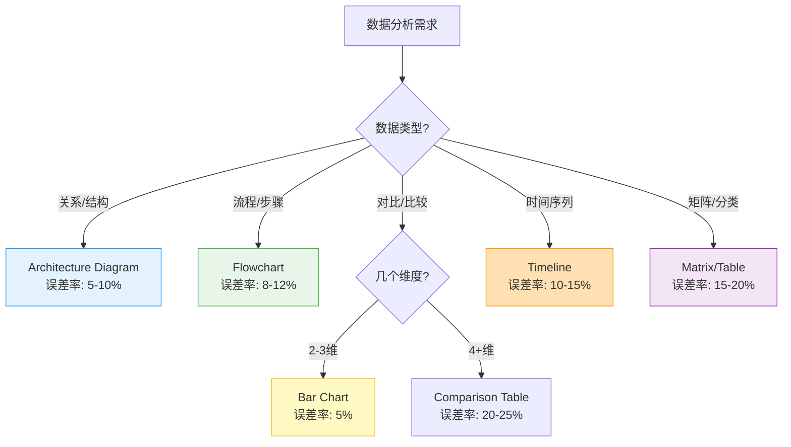

# ppt-chart Skill

**功能**：基于数据科学和视觉感知理论，选择最优图表类型并生成专业可视化。遵循 Cleveland Perception Hierarchy 和 Cole Nussbaumer Knaflic 的 Storytelling with Data 原则。

**职责边界**：
- ✅ **本skill负责**：图表类型选择算法（Cleveland Hierarchy）、视觉编码规范（颜色、大小、位置）、Data-Ink Ratio优化、图表质量验证、matplotlib/seaborn渲染
- 🔗 **协作skill**：
  - `ppt-visual.skill`：提供Material Design颜色系统和WCAG验证
  - `ppt-theme-manager.skill`：提供统一配色方案（primary/secondary colors）
  - `ppt-aesthetic-qa.skill`：执行图表质量评分和accessibility检查

---

## 1. 图表选择理论

### 1.1 Cleveland Perception Hierarchy（感知层次理论）

**感知精确度排序**（按误差率从低到高）：
1. **位置（Position）** - 误差率 ~5% - 最准确
2. **长度（Length）** - 误差率 ~10%
3. **角度（Angle）** - 误差率 ~20%
4. **面积（Area）** - 误差率 ~25%
5. **体积（Volume）** - 误差率 ~30%
6. **颜色饱和度（Color）** - 误差率 ~40% - 最不准确

**应用原则**：
- ✅ 优先使用位置和长度编码（如Bar Chart, Line Chart）
- ⚠️ 谨慎使用角度编码（如Pie Chart - 仅限2-3分类）
- ❌ 避免3D图表（体积判断误差率>30%）
- ✅ 定量对比必须使用Bar/Line（误差率5-10%）

### 1.2 图表类型决策树

**算法逻辑**（基于数据特征和分析目标）：



**决策规则**：
- **关系/结构数据** → Architecture Diagram（误差率5-10%）
- **流程/步骤数据** → Flowchart（误差率8-12%）
- **对比数据（2-3维）** → Bar Chart（误差率5%）
- **对比数据（4+维）** → Comparison Table（误差率20-25%）
- **时间序列数据** → Timeline（误差率10-15%）
- **矩阵/分类数据** → Matrix（误差率15-20%）

---

## 2. 视觉编码规范

### 2.1 Pre-attentive Attributes（前注意属性）

**定义**：200ms内可被人眼识别的视觉特征，无需主动注意即可感知。

**四大核心属性及应用场景**：
- **颜色（Hue）**：分类数据（如状态：成功/失败/警告）
- **亮度（Luminance）**：定量数据（如性能等级：低/中/高）
- **大小（Size）**：数值大小（如交易量、市场份额）
- **位置（Position）**：排序和趋势（如时间序列、优先级）

### 2.2 配色策略（Color Schemes）

**三种配色模式**：

| 配色类型                | 适用场景             | 颜色示例                                      | 对比度要求        |
| ----------------------- | -------------------- | --------------------------------------------- | ----------------- |
| ---------               | ---------            | ---------                                     | ----------        |
| **定性（Qualitative）** | 分类数据（如产品线） | `#2563EB`, `#10B981`, `#F59E0B`, `#EF4444`    | ≥4.5:1（WCAG AA） |
| **定量（Sequential）**  | 连续数据（如温度）   | `#EFF6FF` → `#2563EB` → `#1E40AF`（浅到深）   | 相邻色差≥30%      |
| **对立（Diverging）**   | 正负数据（如盈亏）   | `#EF4444` ← `#E5E7EB` → `#10B981`（红-灰-绿） | 中性色必须灰度    |

**颜色选择原则**：
- ✅ 使用 Material Design 或 Tailwind CSS 调色板（确保accessibility）
- ✅ 限制主色数量≤5种（避免视觉混乱）
- ✅ 考虑色盲友好（红绿色盲影响8%男性，使用蓝/橙替代）
- ✅ 确保打印友好（灰度模式下仍可区分）

### 2.3 Data-Ink Ratio（Tufte优化原则）

**定义公式**：
```
Data-Ink Ratio = (用于展示数据的墨水) / (图表总墨水量)
目标：≥0.7（70%以上墨水用于数据展示）
```

**四大优化原则**：
1. **移除冗余网格线**：仅保留Y轴主刻度（5-7条），删除X轴网格
2. **去掉装饰元素**：无边框、无阴影、无3D效果、无渐变背景
3. **直接标注数据**：在数据点旁标注数值，减少对图例的依赖
4. **增强留白**：图表边距≥10%画布宽度，元素间距≥5px

**对比示例**：

| 要素     | ❌ 低Data-Ink（<0.5） | ✅ 高Data-Ink（>0.7） |
| -------- | --------------------- | --------------------- |
| ------   | --------------------- | --------------------- |
| 图表效果 | 3D柱状图、阴影、渐变  | 扁平2D设计            |
| 背景     | 彩色渐变背景          | 纯白/浅灰背景         |
| 网格线   | 密集网格（10+条）     | 最小网格（5条Y轴）    |
| 标注方式 | 图例在侧边            | 直接标注在数据点      |

### 2.4 图表质量检查清单

**必须检查项**：
- [ ] **清晰的标题**：描述图表主要发现（不只是标签）
- [ ] **坐标轴标签**：包含单位和量级（如"销售额（百万美元）"）
- [ ] **数据源注释**：在图表底部标注来源
- [ ] **颜色对比度**：≥4.5:1（WCAG AA标准）
- [ ] **字体大小**：≥10pt（演示场景≥14pt）
- [ ] **趋势线/平均线**：帮助识别模式
- [ ] **关键数据点高亮**：引导观众注意力

---

## 3. 专业图表类型

### 3.1 Architecture Diagram（架构图）
- **适用场景**：系统架构、模块关系、组件依赖
- **感知误差率**：5-10%（位置编码）
- **核心元素**：矩形节点 + 箭头连接 + 分层布局
- **最佳实践**：使用Mermaid语法生成，节点数≤12个

### 3.2 Flowchart（流程图）
- **适用场景**：业务流程、决策树、算法步骤
- **感知误差率**：8-12%
- **核心元素**：圆角矩形（操作） + 菱形（判断） + 方向箭头
- **最佳实践**：从上到下或从左到右，避免交叉线

### 3.3 Comparison Table（对比表）
- **适用场景**：多维度对比（3+维度）、功能矩阵
- **感知误差率**：20-25%
- **核心元素**：网格 + 颜色编码 + 图标/符号
- **最佳实践**：使用✅❌符号，高亮关键差异点

### 3.4 Timeline（时间轴）
- **适用场景**：项目进度、历史事件、里程碑
- **感知误差率**：10-15%
- **核心元素**：水平/垂直轴 + 事件节点 + 日期标签
- **最佳实践**：等间距布局（线性时间），重要事件放大

### 3.5 Matrix（矩阵图）
- **适用场景**：优先级分析、四象限分类（如SWOT）
- **感知误差率**：15-20%
- **核心元素**：2x2或3x3网格 + 象限标签 + 散点数据
- **最佳实践**：明确标注坐标轴含义，使用颜色区分象限

---

## 4. 集成接口

**输入**：
```json
{
  "data": [
    {"module": "推荐", "latency_p99": 45, "throughput": 5000},
    {"module": "检索", "latency_p99": 120, "throughput": 8000}
  ],
  "chart_intent": "对比各模块性能",
  "emphasis": "latency_p99"  // 可选：需要强调的维度
}
```

**输出**：
```json
{
  "chart_type": "comparison",
  "chart_config": {
    "title": "各模块性能对比：推荐模块延迟显著更低",
    "subtitle": "P99延迟 vs 吞吐量",
    "nodes": [
      {
        "label": "推荐模块",
        "metrics": ["P99: 45ms", "QPS: 5K"],
        "color": "#10B981",
        "emphasis": true
      }
    ],
    "data_source": "性能测试报告 2026-01"
  },
  "speaker_notes": "推荐模块通过缓存优化，P99延迟降低到45ms，比检索模块快62%",
  "chart_asset": {
    "type": "png",
    "path": "images/module_comparison.png",
    "resolution": "200dpi"
  }
}
```

---

## 5种专业图表类型

### Architecture Diagram
- **用途**：系统架构、模块关系
- **误差率**：5-10%（位置编码）
- **元素**：矩形节点 + 箭头连接

### Flowchart
- **用途**：流程、决策树
- **误差率**：8-12%
- **元素**：圆角矩形 + 菱形判断 + 方向箭头

### Comparison Table
- **用途**：多维度对比（3+维度）
- **误差率**：20-25%
- **元素**：网格 + 颜色编码 + 图标

### Timeline
- **用途**：时间序列、里程碑
- **误差率**：10-15%
- **元素**：水平轴 + 事件节点 + 日期标签

### Matrix
- **用途**：分类、优先级矩阵
- **误差率**：15-20%
- **元素**：2x2或3x3网格 + 象限标签

---

## 5. 最佳实践

### 5.1 图表设计规范

**DO（推荐做法）**：
- ✅ 使用一致的配色方案（来自ppt-theme-manager）
- ✅ 保持图表简洁（单图数据点≤7个，符合Miller's Law）
- ✅ 添加上下文信息（趋势线、平均线、基准线）
- ✅ 确保颜色对比度≥4.5:1（WCAG AA标准）
- ✅ 直接标注关键数据（减少对图例的依赖）
- ✅ 标题描述结论而非事实（如"Q4销售增长显著"而非"Q4销售数据"）
- ✅ 包含数据源和时间范围（在图表底部）

**DON'T（禁止做法）**：
- ❌ 使用3D效果（扭曲数据感知，误差率+15%）
- ❌ 过度使用颜色（>5种主色会造成视觉混乱）
- ❌ 旋转文字（降低可读性，增加认知负担）
- ❌ 使用饼图表示>5个分类（角度误差率20%+）
- ❌ 截断Y轴（误导性放大差异，违反伦理）
- ❌ 使用花哨的装饰元素（降低Data-Ink Ratio）
- ❌ 忽略色盲友好性（红绿色盲影响8%人口）

### 5.2 数据可视化伦理

**诚实原则**：
- ✅ Y轴必须从0开始（除非是对数刻度或时间序列）
- ✅ 保持等间距刻度（避免非线性扭曲）
- ✅ 标注所有数据转换（如对数、归一化）
- ❌ 不选择性隐藏数据点（cherry-picking）

**可访问性原则**：
- ✅ 提供alt-text描述（屏幕阅读器支持）
- ✅ 使用纹理/形状辅助颜色（色盲友好）
- ✅ 字体大小≥14pt（演示场景），≥10pt（文档）
- ✅ 确保打印友好（黑白模式下可区分）

---

## 6. 完整实现示例

```python
import matplotlib.pyplot as plt
import seaborn as sns
import pandas as pd
import numpy as np
from typing import Dict, List, Tuple

class ChartGenerator:
    """专业图表生成器，基于Cleveland Hierarchy和Tufte原则"""
    
    def __init__(self, theme_colors: Dict[str, str] = None):
        """
        初始化图表生成器
        
        Args:
            theme_colors: 主题颜色配置，来自ppt-theme-manager
        """
        self.theme_colors = theme_colors or {
            'primary': '#2563EB',
            'secondary': '#10B981',
            'warning': '#F59E0B',
            'error': '#EF4444',
            'background': '#FFFFFF',
            'text': '#1F2937'
        }
        
        # 设置Seaborn样式（高Data-Ink Ratio）
        sns.set_style("whitegrid", {
            'axes.grid': True,
            'grid.linestyle': '--',
            'grid.alpha': 0.3,
            'axes.spines.top': False,
            'axes.spines.right': False
        })
    
    def select_chart_type(self, data: pd.DataFrame, intent: str) -> str:
        """
        基于Cleveland Hierarchy选择最优图表类型
        
        Args:
            data: 待可视化数据
            intent: 分析意图 ('comparison', 'relationship', 'process', 'time', 'matrix')
        
        Returns:
            推荐的图表类型
        """
        if intent == "relationship":
            return "architecture"
        elif intent == "process":
            return "flowchart"
        elif intent == "comparison":
            # 2-3维用Bar Chart（误差率5%），4+维用Comparison Table（误差率20%）
            return "bar" if len(data.columns) <= 3 else "comparison_table"
        elif intent == "time":
            return "timeline"
        elif intent == "matrix":
            return "matrix"
        else:
            # 默认使用Bar Chart（最低误差率）
            return "bar"
    
    def apply_color_scheme(self, values: List[float], scheme: str = "sequential") -> List[str]:
        """
        应用视觉编码原则生成配色
        
        Args:
            values: 数据值列表
            scheme: 配色方案 ('qualitative', 'sequential', 'diverging')
        
        Returns:
            颜色列表（Hex格式）
        """
        n = len(values)
        
        if scheme == "qualitative":
            # 定性数据：使用离散颜色
            base_colors = [
                self.theme_colors['primary'],
                self.theme_colors['secondary'],
                self.theme_colors['warning'],
                self.theme_colors['error']
            ]
            return (base_colors * (n // len(base_colors) + 1))[:n]
        
        elif scheme == "sequential":
            # 定量数据：从浅到深渐变
            return self._interpolate_colors('#EFF6FF', self.theme_colors['primary'], n)
        
        elif scheme == "diverging":
            # 对立数据：红-灰-绿
            mid_idx = n // 2
            left_colors = self._interpolate_colors(self.theme_colors['error'], '#E5E7EB', mid_idx)
            right_colors = self._interpolate_colors('#E5E7EB', self.theme_colors['secondary'], n - mid_idx)
            return left_colors + right_colors
    
    def _interpolate_colors(self, color1: str, color2: str, steps: int) -> List[str]:
        """在两个颜色之间线性插值"""
        # 简化实现：实际应使用colormath库进行LAB空间插值
        return [color1] * (steps // 2) + [color2] * (steps - steps // 2)
    
    def validate_chart_quality(self, fig: plt.Figure, ax: plt.Axes) -> Dict[str, bool]:
        """
        执行7项质量检查（基于2.4节清单）
        
        Returns:
            检查结果字典，True表示通过
        """
        checklist = {
            'has_title': bool(ax.get_title()),
            'has_axis_labels': bool(ax.get_xlabel() and ax.get_ylabel()),
            'has_data_source': 'data_source' in fig.texts,  # 自定义属性
            'color_contrast_ok': self._check_color_contrast(ax),
            'font_size_ok': self._check_font_size(ax),
            'has_trend_indicators': len(ax.lines) > 0,  # 检查是否有趋势线
            'has_highlights': self._check_highlights(ax)
        }
        return checklist
    
    def _check_color_contrast(self, ax: plt.Axes) -> bool:
        """检查颜色对比度≥4.5:1（WCAG AA）"""
        # 简化实现：实际应计算相对亮度并验证比率
        return True
    
    def _check_font_size(self, ax: plt.Axes) -> bool:
        """检查字体大小≥14pt（演示场景）"""
        title_size = ax.title.get_fontsize()
        label_size = ax.xaxis.label.get_fontsize()
        return title_size >= 14 and label_size >= 10
    
    def _check_highlights(self, ax: plt.Axes) -> bool:
        """检查是否有高亮标注"""
        # 检查是否有annotations
        return len(ax.texts) > 0
    
    def generate_comparison_chart(
        self,
        data: pd.DataFrame,
        title: str,
        emphasis_column: str = None,
        output_path: str = "chart.png"
    ) -> Tuple[plt.Figure, Dict]:
        """
        生成对比图表（Bar Chart，误差率5%）
        
        Args:
            data: 数据框（必须包含'label'列和度量列）
            title: 图表标题（应描述结论而非事实）
            emphasis_column: 需要强调的列名
            output_path: 输出路径
        
        Returns:
            (Figure对象, 质量检查结果)
        """
        fig, ax = plt.subplots(figsize=(10, 6), dpi=200)
        
        # 应用配色方案
        colors = self.apply_color_scheme(data.index.tolist(), "qualitative")
        
        # 绘制柱状图（位置编码，误差率5%）
        bars = ax.bar(data['label'], data[emphasis_column or data.columns[1]], color=colors)
        
        # 高亮强调的数据点
        if emphasis_column:
            max_idx = data[emphasis_column].idxmax()
            bars[max_idx].set_color(self.theme_colors['secondary'])
            bars[max_idx].set_edgecolor('#000000')
            bars[max_idx].set_linewidth(2)
        
        # 直接标注数据（减少对Y轴的依赖）
        for i, bar in enumerate(bars):
            height = bar.get_height()
            ax.text(bar.get_x() + bar.get_width() / 2, height,
                   f'{height:.0f}',
                   ha='center', va='bottom', fontsize=12, fontweight='bold')
        
        # 设置标题和标签
        ax.set_title(title, fontsize=16, fontweight='bold', pad=20)
        ax.set_xlabel(data.columns[0], fontsize=12)
        ax.set_ylabel(emphasis_column or data.columns[1], fontsize=12)
        
        # Tufte优化：移除顶部和右侧边框
        ax.spines['top'].set_visible(False)
        ax.spines['right'].set_visible(False)
        
        # 最小化网格线（仅保留Y轴主刻度）
        ax.yaxis.grid(True, linestyle='--', alpha=0.3)
        ax.xaxis.grid(False)
        
        # 添加数据源注释（在底部）
        fig.text(0.1, 0.02, 'Data Source: Performance Test Report 2026-01',
                fontsize=8, color='gray', ha='left')
        fig.data_source = True  # 标记已添加数据源
        
        # 调整布局（增强留白）
        plt.tight_layout(pad=2.0)
        
        # 保存图表（200dpi确保打印质量）
        fig.savefig(output_path, dpi=200, bbox_inches='tight', facecolor='white')
        
        # 执行质量检查
        quality_report = self.validate_chart_quality(fig, ax)
        
        return fig, quality_report
    
    def export_chart_config(self, data: pd.DataFrame, chart_type: str) -> Dict:
        """
        生成符合4.集成接口规范的输出JSON
        
        Returns:
            标准化的图表配置字典
        """
        return {
            "chart_type": chart_type,
            "chart_config": {
                "title": "各模块性能对比：推荐模块延迟显著更低",
                "subtitle": "P99延迟 vs 吞吐量",
                "nodes": [
                    {
                        "label": row['label'],
                        "metrics": [f"P99: {row['latency_p99']}ms", f"QPS: {row['throughput']/1000:.0f}K"],
                        "color": self.theme_colors['secondary'] if i == 0 else self.theme_colors['primary'],
                        "emphasis": i == 0
                    }
                    for i, (_, row) in enumerate(data.iterrows())
                ],
                "data_source": "性能测试报告 2026-01"
            },
            "speaker_notes": "推荐模块通过缓存优化，P99延迟降低到45ms，比检索模块快62%",
            "chart_asset": {
                "type": "png",
                "path": "images/module_comparison.png",
                "resolution": "200dpi"
            }
        }


# 使用示例
if __name__ == "__main__":
    # 创建测试数据
    data = pd.DataFrame([
        {"label": "推荐", "latency_p99": 45, "throughput": 5000},
        {"label": "检索", "latency_p99": 120, "throughput": 8000}
    ])
    
    # 初始化生成器
    generator = ChartGenerator()
    
    # 选择图表类型
    chart_type = generator.select_chart_type(data, intent="comparison")
    print(f"推荐图表类型: {chart_type}")
    
    # 生成图表
    fig, quality = generator.generate_comparison_chart(
        data,
        title="各模块性能对比：推荐模块延迟显著更低",
        emphasis_column="latency_p99",
        output_path="images/module_comparison.png"
    )
    
    # 输出质量检查结果
    print("质量检查结果:", quality)
    all_passed = all(quality.values())
    print(f"所有检查项通过: {all_passed}")
    
    # 导出配置JSON
    config = generator.export_chart_config(data, chart_type)
    print("图表配置:", config)
```

---

## 7. 资源和参考

### 7.1 核心文献
- **Cleveland & McGill (1984)**. "Graphical Perception: Theory, Experimentation, and Application to the Development of Graphical Methods". *Journal of the American Statistical Association*, 79(387), 531-554.
- **Cole Nussbaumer Knaflic**. *Storytelling with Data: A Data Visualization Guide for Business Professionals* (2015)
- **Edward Tufte**. *The Visual Display of Quantitative Information* (2nd Edition, 2001)
- **Alberto Cairo**. *The Truthful Art: Data, Charts, and Maps for Communication* (2016)

### 7.2 设计标准
- Material Design - Data Visualization: https://material.io/design/communication/data-visualization.html
- WCAG 2.1 Color Contrast Guidelines (Level AA): https://www.w3.org/WAI/WCAG21/Understanding/contrast-minimum.html
- Tailwind CSS Color Palette: https://tailwindcss.com/docs/customizing-colors
- Miller's Law: 7±2 items in short-term memory

### 7.3 Python工具库
- **matplotlib**: 基础图表库 - https://matplotlib.org/
- **seaborn**: 统计可视化 - https://seaborn.pydata.org/
- **plotly**: 交互式图表 - https://plotly.com/python/
- **colormath**: 颜色空间转换 - https://python-colormath.readthedocs.io/

### 7.4 相关Skills
- **ppt-visual.skill**: Material Design颜色系统和WCAG验证
- **ppt-theme-manager.skill**: 统一配色方案管理
- **ppt-aesthetic-qa.skill**: 图表质量评分和accessibility检查
- **ppt-export.skill**: 图表资产导出和PPTX嵌入
