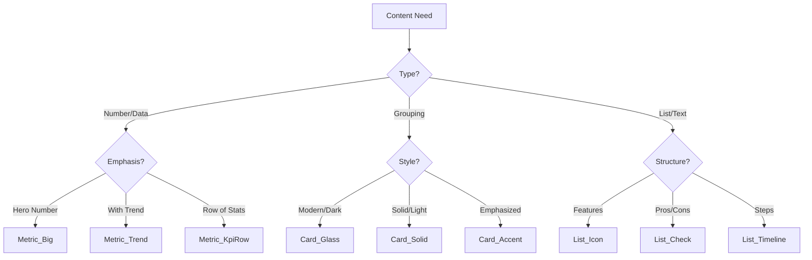

# PPT Component Library

## Overview

This skill provides a **standardized set of UI components (Micro-Layouts)** to ensure visual consistency and code efficiency across presentation slides. It bridges the gap between page-level layouts (`ppt-slide-layout-library`) and raw HTML/CSS implementation.

**Core Philosophy**: 
- **Consistency**: All similar elements (e.g., "Key Insight Cards") must look identical across 40+ slides.
- **Modularity**: Components are independent HTML snippets that can be dropped into any layout container.
- **Theme-Aware**: Components use utility classes (Tailwind) compatible with the global `slide-theme.css`.

## When to Use This Skill

- When a layout (`side_by_side`, `dashboard_grid`) needs content to fill its regions.
- When the user asks for specific visual elements like "Scorecards," "Status Badges," or "Process Steps."
- When replacing ad-hoc `div` structures with standardized, professional UI patterns.

## Component Categories

| Category | Prefix | Purpose | Examples |
| :--- | :--- | :--- | :--- |
| **Containers** | `Card_` | Grouping related content | `Card_Glass`, `Card_Solid`, `Card_Accent` |
| **Metrics** | `Metric_` | Displaying key numbers | `Metric_Big`, `Metric_Trend`, `Metric_KpiRow` |
| **Lists** | `List_` | Structured text items | `List_Icon`, `List_Check`, `List_Timeline` |
| **Badges** | `Badge_` | Status or category labels | `Badge_Status`, `Badge_Tag`, `Badge_Pill` |
| **Visuals** | `Visual_` | Decorative or explanatory graphics | `Visual_Arrow`, `Visual_DottedLine`, `Visual_Glow` |

## core_components.yml Access

All HTML templates are stored in `assets/core_components.yml`. 
**Action**: Read this file to get the exact HTML structure for a requested component.

## Usage Guidelines

1.  **Select**: Choose a component based on the content density and purpose.
2.  **Embed**: Copy the HTML structure from `core_components.yml` into the slide's main content area.
3.  **Customize**:
    -   Replace placeholder text (`{{title}}`, `{{value}}`).
    -   Adjust colors using standard Tailwind palette (e.g., `bg-blue-900` -> `bg-red-900` for alerts).
    -   **NEVER** change the padding, margin, or border-radius values to maintain rhythm.

## Design System Rules

### 1. Depth & Layering (Z-Index Strategy)
-   **Level 0 (Background)**: `bg-slate-900` / `bg-black`.
-   **Level 1 (Card_Base)**: `bg-slate-800` or `bg-white/5` (Glass).
-   **Level 2 (Card_Hover/Pop)**: `shadow-lg`, `border-slate-600`.
-   **Level 3 (Text/Icon)**: `text-white`, `text-blue-500`.

### 2. Semantic Colors
-   **Primary/Info**: `blue-500` / `cyan-500` (Technology, US, Future).
-   **Success/Growth**: `emerald-500` (Energy, Sustainability, Profit).
-   **Warning/Risk**: `amber-500` (Tension, Watchlist, Caution).
-   **Danger/Decline**: `red-500` / `rose-500` (Crisis, Debt, Russia/China Threat).
-   **Neutral/Structure**: `slate-500` / `gray-400` (Borders, Secondary Text).

### 3. Typography Scale (Desktop 1280x720)
-   **Metric Big**: `text-5xl font-bold tracking-tighter`
-   **Card Title**: `text-lg font-bold mb-2`
-   **Body Text**: `text-xs leading-relaxed text-slate-400`
-   **Label/Tag**: `text-[10px] uppercase tracking-widest font-bold`

## Decision Tree

