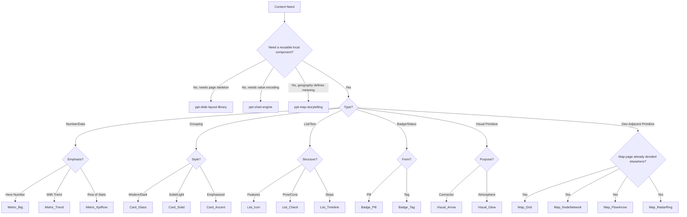

# PPT Component Library

## Overview

This skill provides a **standardized set of UI components (Micro-Layouts)** to ensure visual consistency and code efficiency across presentation slides. It bridges the gap between page-level layouts (`ppt-slide-layout-library`) and raw HTML/CSS implementation.

**Core Philosophy**:

- **Consistency**: All similar elements (e.g., "Key Insight Cards") must look identical across 40+ slides.
- **Modularity**: Components are independent HTML snippets that can be dropped into any layout container.
- **Theme-Aware**: Components use utility classes (Tailwind) compatible with the global `slide-theme.css`.

## Boundary Contract

This skill owns **local UI primitives and reusable micro-layouts**, not whole-page structure.

This skill does own:

- reusable cards, metrics, lists, badges, and visual primitives
- local HTML skeletons that can be embedded inside an existing layout region
- component-level rhythm rules such as padding, corner radius, label scale, and local emphasis

This skill does not own:

- page skeletons, regional composition, or four-zone page structure
- chart selection, chart contracts, or chart rendering logic
- map narrative archetypes, geographic scope, basemap source, or render engine choice
- brand palette definition or style-profile-specific color systems

Use adjacent PPT skills as follows:

- `ppt-slide-layout-library`: decides page skeleton and region structure
- `ppt-chart-engine`: decides chart type, chart contract, and chart rendering constraints
- `ppt-map-storytelling`: decides whether the page is a true map page and how map narrative is structured
- `ppt-brand-style-system`: defines semantic tokens, typography direction, and style-profile-specific color behavior

## When to Use This Skill

- When a layout (`side_by_side`, `dashboard_grid`) needs content to fill its regions.
- When the user asks for specific visual elements like "Scorecards," "Status Badges," or "Process Steps."
- When replacing ad-hoc `div` structures with standardized, professional UI patterns.

Do not use this skill as a shortcut for:

- inventing a whole page without first selecting a layout
- forcing a chart problem into cards or badges
- forcing a true map page into abstract geo snippets
- bypassing brand-style semantic tokens with ad hoc color decisions

## Thinking Alignment

For component-led or component-assisted slides, pair this skill with:

- `knowledge/templates/ppt-slide-thinking-template.md` for the base Thinking structure
- `knowledge/templates/ppt-thinking-examples.md` for component-led worked examples

Before implementation, the Thinking file should explicitly declare:

1. `component_selection`
2. `semantic_roles`
3. `resolver_source`

If any selected component relies on semantic payload resolution, also confirm:

1. `component_family`
2. `required_semantic_fields`
3. `resolver_checklist`

If the components are placed inside a standard layout, the Thinking file should also declare:

1. `layout_key`
2. `layout_contract_source`
3. `overflow_recovery_order`
4. `fallback_layouts`

Do not enter component implementation until these fields are stable.

Machine-readable source order:

1. `assets/index.yml` narrows candidate components.
2. `assets/examples.yml` provides the payload skeleton, `component_family`, `required_semantic_fields`, resolver checklist, and worked examples for candidate generation + packing.
3. `../ppt-brand-style-system/assets/component_semantic_mappings.yml` is the semantic resolution truth for role-to-slot mapping.
4. `assets/core_components.yml` is the HTML skeleton truth.

If these sources disagree, prefer the more specific source closer to implementation: semantic mapping and component skeleton beat prose guidance in this file.

## Decision Gate

Before selecting a component, decide whether the problem is really a component problem.

1. If the page needs a whole-page skeleton, use `ppt-slide-layout-library` first.
2. If the page needs value encoding, axes, legends, or data relationships, use `ppt-chart-engine` first.
3. If geography determines the page meaning, use `ppt-map-storytelling` first.
4. Use this component library only when the page already has a region and now needs a reusable local UI structure.
5. If a one-off HTML block is simpler and lower-risk than bending a standard component out of shape, prefer raw HTML over fake reuse.

## Selection Questions

After the gate passes, choose a component by answering these questions in order:

1. Is the content primarily a container, metric, list, badge, visual primitive, or geo-adjacent primitive?
2. Is the component acting as a supporting element or carrying the main reading task?
3. Is the component compatible with the chosen layout region and content density?
4. Can the component be expressed using semantic tokens from `ppt-brand-style-system`?
5. Will the component still read correctly if the active style profile changes?

## Component Categories

| Category | Prefix | Purpose | Examples |
| :--- | :--- | :--- | :--- |
| **Containers** | `Card_` | Grouping related content | `Card_Glass`, `Card_Solid`, `Card_Accent` |
| **Metrics** | `Metric_` | Displaying key numbers | `Metric_Big`, `Metric_Trend`, `Metric_KpiRow` |
| **Lists** | `List_` | Structured text items | `List_Icon`, `List_Check`, `List_Timeline` |
| **Badges** | `Badge_` | Status or category labels | `Badge_Status`, `Badge_Tag`, `Badge_Pill` |
| **Visuals** | `Visual_` | Decorative or explanatory graphics | `Visual_Arrow`, `Visual_DottedLine`, `Visual_Glow` |
| **Geo Primitives** | `Map_` | Abstract geo-adjacent primitives, not full map pages | `Map_Grid`, `Map_NodeNetwork`, `Map_FlowArrow`, `Map_RadarRing` |

`Map_*` assets must be treated as **abstract geo visuals or overlay primitives**, not as a replacement for `ppt-map-storytelling` or a full map layout.

## core_components.yml Access

All HTML templates are stored in `assets/core_components.yml`.
**Action**: Read this file to get the exact HTML structure for a requested component.

This file is currently the component source of truth. Over time it should evolve from raw snippets into a contract-driven asset file.

Use supporting assets as follows:

- `assets/index.yml`: fast lookup by category, layout fit, and use case
- `assets/examples.yml`: minimal payload skeletons for standard component instantiation, including `component_family` alignment and a semantic payload layer
- `../ppt-brand-style-system/assets/component_semantic_mappings.yml`: resolve semantic payload roles into style-profile-compatible class payloads before relying on raw fallback classes, and use the component family contract there to confirm the right slot set

Resolver consumption rule:

1. Read the candidate component example in `assets/examples.yml`.
2. If the region is budget-sensitive, read the worked `candidate_generation_examples` in `assets/examples.yml` first.
3. Validate `component_family` and `required_semantic_fields`.
4. Resolve semantic roles through `component_semantic_mappings.yml`.
5. Use `payload` classes only as safe fallback.
6. Only then copy the HTML skeleton from `assets/core_components.yml`.

## Usage Guidelines

1. **Select**: Choose a component only after layout, chart, and map-level decisions are already stable.
2. **Validate**: Confirm the component matches the reading task, content density, and layout region.
3. **Embed**: Copy the HTML skeleton from `assets/core_components.yml` into the target region.
4. **Fill**: Replace placeholders with page-specific content and semantic meaning.
5. **Style Safely**:
   - Prefer semantic tokens and style-profile-compatible classes.
   - If `semantic_payload` is present, resolve it via `ppt-brand-style-system/assets/component_semantic_mappings.yml` first.
   - Avoid ad hoc color rewrites that break brand-style switching.
   - Keep spacing, radius, and local rhythm stable unless the component contract explicitly allows a variant.
6. **Escalate or Downgrade**:
   - If the component is carrying too much complexity, move back to layout or chart.
   - If the component needs too many exceptions, use raw HTML instead of corrupting the standard skeleton.

If components destabilize the page budget inside a standard layout, do not invent component-local recovery order. Apply the chosen layout asset's `overflow_recovery_order` first, then reduce component density, and only then switch to a fallback layout if the layout contract allows it.

## Design System Rules

### 1. Depth & Layering (Z-Index Strategy)

- **Level 0 (Background)**: inherited from page layout or style profile.
- **Level 1 (Component Base)**: local surface, border, or soft fill.
- **Level 2 (Component Emphasis)**: local highlight, accent edge, subtle shadow, or elevated chip.
- **Level 3 (Text/Icon)**: foreground content, icons, labels, or semantic markers.

### 2. Semantic Colors

- Components should consume semantic roles, not define fixed geopolitical or industry meanings.
- Recommended semantic roles:
  - `primary`: default emphasis or brand-led accent
  - `info`: explanatory or neutral-positive highlight
  - `positive`: progress, gain, completion, upside
  - `warning`: watchpoint, caution, emerging stress
  - `critical`: loss, threat, rupture, severe downside
  - `neutral`: structure, border, helper text, low-emphasis chrome
- Final color mapping belongs to `ppt-brand-style-system`, not this skill.

### 3. Typography Scale (Desktop 1280x720)

- **Metric Big**: `text-5xl font-bold tracking-tighter`
- **Card Title**: `text-lg font-bold mb-2`
- **Body Text**: `text-xs leading-relaxed`
- **Label/Tag**: `text-[10px] uppercase tracking-widest font-bold`

Typography tone may shift by style profile, but relative hierarchy should remain stable.

## Current Gaps

This skill is usable today, but the current asset layer still has known limitations:

- component contracts are implicit rather than explicit
- some geo primitives still retain intentional dark-surface defaults for contrast-heavy overlays
- some geo-adjacent components currently blur the boundary with `ppt-map-storytelling`

Treat this skill as a controlled library, not yet a fully normalized design-token system.

## Cross-Skill Recovery Contract

This skill does not override layout recovery.

When a standard component is placed inside a standard layout:

1. `ppt-slide-layout-library` decides whether the region and layout are still valid.
2. `layout_contract` decides the recovery order and allowed fallback layouts.
3. `ppt-component-library` decides which component family and resolver payload best fit that stabilized region.

Component fallback must not skip layout recovery. If a card row, KPI strip, timeline list, or badge cluster causes density failure, first apply the layout asset's `overflow_recovery_order` before replacing the component family or abandoning semantic resolution.

## Decision Tree

