```mermaid
graph LR
    A[用户] --> B[推荐系统]
    B --> C[数据库]
```

# ppt-markdown-parser Skill

**功能**：解析 Markdown 文档（slides.md）为结构化的 sections，提取标题、文本、列表、代码块、mermaid 图表、表格和 speaker notes。

**职责边界**：
- ✅ **本skill负责**：Markdown 解析、section 结构提取、front-matter 解析、mermaid/VISUAL/NOTE 块识别
- 🔗 **协作skill**：
  - `ppt-visual.skill`：处理 VISUAL block 中的图表规范
  - `ppt-outline.skill`：验证 slide 结构是否符合大纲规范

---

## 1. 核心功能

### 1.1 解析目标

**将 Markdown 转换为结构化数据**：
```
输入: slides.md (Markdown文本)
     ↓
  [解析引擎]
     ↓
输出: sections (JSON数组)
```

**支持的元素**：
- ✅ Front-matter（YAML 元数据）
- ✅ 标题（H1-H6）
- ✅ 段落文本
- ✅ 列表（有序/无序/嵌套）
- ✅ 代码块（带语言标识）
- ✅ Mermaid 图表
- ✅ 表格
- ✅ 图片链接
- ✅ 特殊块（VISUAL, NOTE）

### 1.2 输出结构

**Section 对象定义**：
```python
Section = {
    'level': int,           # 标题级别（1-6）
    'title': str,           # 标题文本
    'text': str,            # 正文内容
    'bullets': List[str],   # 列表项（扁平化）
    'code_blocks': List[dict],  # 代码块
    'mermaid': str,         # mermaid代码
    'table': List[dict],    # 表格数据
    'images': List[str],    # 图片URL
    'visual_block': dict,   # VISUAL块（如果有）
    'speaker_notes': str,   # Speaker Notes（如果有）
    'raw': str              # 原始Markdown文本
}
```

---

## 2. 解析规范

### 2.1 Front-matter 解析

**格式**（YAML 1.2）：
```markdown
---
title: "在线推荐系统架构评审"
date: 2026-01-28
author: 技术团队
presentation_type: technical-review
slide_count: 15
---

## 第一页内容...
```

**解析规则**：
```python
import yaml
import re

def parse_front_matter(md_text):
    """提取YAML front-matter"""
    # 匹配 --- ... --- 块
    fm_pattern = r'^---\s*\n(.*?)\n---\s*\n'
    match = re.match(fm_pattern, md_text, re.DOTALL)
    
    if match:
        yaml_text = match.group(1)
        front_matter = yaml.safe_load(yaml_text)
        
        # 移除front-matter，返回剩余内容
        content = md_text[match.end():]
        return front_matter, content
    
    return {}, md_text
```

### 2.2 标题层级解析

**规则**：
- H1 (`#`) → Section Divider（章节分隔）
- H2 (`##`) → Slide Title（幻灯片标题）
- H3 (`###`) → Slide Subtitle（幻灯片副标题）
- H4-H6 → Content Headings（内容小标题）

**示例**：
```markdown
# 第一部分：背景介绍    ← Section Divider

## 系统架构概览          ← Slide 1 Title

### 核心组件             ← Slide 1 Subtitle

#### 推荐模块            ← Content Heading
```

**解析代码**：
```python
def parse_headings(md_text):
    """提取标题层级"""
    sections = []
    current_section = None
    
    for line in md_text.split('\n'):
        # 匹配标题（# 开头）
        heading_match = re.match(r'^(#{1,6})\s+(.+)', line)
        
        if heading_match:
            level = len(heading_match.group(1))
            title = heading_match.group(2).strip()
            
            # 新建section
            if level <= 2:  # H1/H2 创建新section
                if current_section:
                    sections.append(current_section)
                
                current_section = {
                    'level': level,
                    'title': title,
                    'text': '',
                    'bullets': [],
                    'raw': line + '\n'
                }
            else:  # H3-H6 作为子标题
                if current_section:
                    current_section['text'] += f"{'#' * level} {title}\n"
                    current_section['raw'] += line + '\n'
        else:
            # 累积内容
            if current_section:
                current_section['raw'] += line + '\n'
    
    if current_section:
        sections.append(current_section)
    
    return sections
```

### 2.3 列表解析

**支持格式**：
- 无序列表：`-`, `*`, `+`
- 有序列表：`1.`, `2.`
- 嵌套列表（最多3级）

**解析规则**：
```python
def parse_bullets(section_text):
    """提取列表项（扁平化）"""
    bullets = []
    
    for line in section_text.split('\n'):
        # 匹配列表项（无序）
        bullet_match = re.match(r'^\s*[-*+]\s+(.+)', line)
        if bullet_match:
            bullets.append(bullet_match.group(1).strip())
        
        # 匹配列表项（有序）
        ordered_match = re.match(r'^\s*\d+\.\s+(.+)', line)
        if ordered_match:
            bullets.append(ordered_match.group(1).strip())
    
    return bullets
```

**扁平化处理**：
```markdown
输入（嵌套列表）：
- 推荐系统
  - 召回模块
  - 排序模块
- 搜索系统

输出（扁平化）：
['推荐系统', '召回模块', '排序模块', '搜索系统']
```

### 2.4 代码块解析

**格式**（支持语言标识）：
````markdown
```python
def hello():
    print("Hello, World!")
```
````

**解析代码**：
```python
def parse_code_blocks(section_text):
    """提取代码块"""
    code_blocks = []
    
    # 匹配 ```language ... ```
    pattern = r'```(\w+)?\n(.*?)```'
    matches = re.finditer(pattern, section_text, re.DOTALL)
    
    for match in matches:
        language = match.group(1) or 'text'
        code = match.group(2).strip()
        
        code_blocks.append({
            'language': language,
            'code': code
        })
    
    return code_blocks
```

### 2.5 表格解析

**Markdown 表格格式**：
```markdown
| 指标 | 优化前 | 优化后 | 提升 |
|------|--------|--------|------|
| P99延迟 | 500ms | 45ms | 91% |
| QPS | 5000 | 10000 | 100% |
```

**解析代码**：
```python
def parse_table(section_text):
    """提取表格数据"""
    lines = section_text.split('\n')
    table_lines = [l for l in lines if l.strip().startswith('|')]
    
    if len(table_lines) < 2:
        return None
    
    # 提取表头
    headers = [h.strip() for h in table_lines[0].split('|')[1:-1]]
    
    # 跳过分隔符行（第二行）
    # 提取数据行
    rows = []
    for line in table_lines[2:]:
        cells = [c.strip() for c in line.split('|')[1:-1]]
        row = dict(zip(headers, cells))
        rows.append(row)
    
    return {'headers': headers, 'rows': rows}
```

---

## 3. 特殊块处理

### 3.1 Mermaid 图表

**格式**：
````markdown

````

**提取代码**：
```python
def extract_mermaid(section_text):
    """提取mermaid代码"""
    pattern = r'```mermaid\n(.*?)```'
    match = re.search(pattern, section_text, re.DOTALL)
    
    if match:
        return match.group(1).strip()
    
    return None
```

### 3.2 VISUAL Block（特殊标注）

**格式**（由 ppt-content-planner 生成）：
```markdown
VISUAL:
  type: "sequence"
  title: "用户交互流程"
  priority: "critical"
  content_requirements:
    - "Show Browser → WASM → Backend AI path"
    - "Label <50ms latency requirement"
```

**解析代码**：
```python
def extract_visual_block(section_text):
    """提取VISUAL块（YAML格式）"""
    pattern = r'VISUAL:\s*\n((?:  .+\n)+)'
    match = re.search(pattern, section_text, re.MULTILINE)
    
    if match:
        yaml_text = match.group(1)
        try:
            visual_spec = yaml.safe_load(yaml_text)
            return visual_spec
        except yaml.YAMLError:
            return None
    
    return None
```

### 3.3 Speaker Notes（演讲者备注）

**格式**（Markdown 注释或特殊标记）：
```markdown
## 系统架构

正文内容...

NOTE:
> 强调性能提升62%，这是关键卖点。
> 提醒听众缓存层是核心优化。
```

**解析代码**：
```python
def extract_speaker_notes(section_text):
    """提取Speaker Notes"""
    # 格式1: NOTE: 块
    note_pattern = r'NOTE:\s*\n((?:>.+\n)+)'
    match = re.search(note_pattern, section_text, re.MULTILINE)
    
    if match:
        # 移除 > 符号，合并为纯文本
        lines = match.group(1).split('\n')
        notes = '\n'.join(line.lstrip('> ').strip() for line in lines if line.strip())
        return notes
    
    # 格式2: HTML注释
    comment_pattern = r'<!--\s*NOTE:\s*(.*?)\s*-->'
    match = re.search(comment_pattern, section_text, re.DOTALL)
    
    if match:
        return match.group(1).strip()
    
    return None
```

---

## 4. 集成接口

### 4.1 输入格式

```python
{
    "md_text": str,              # Markdown文本（完整的slides.md内容）
    "extract_front_matter": bool, # 是否提取front-matter（默认True）
    "flatten_bullets": bool,      # 是否扁平化列表（默认True）
    "parse_special_blocks": bool  # 是否解析VISUAL/NOTE块（默认True）
}
```

**示例**：
```json
{
  "md_text": "---\ntitle: Test\n---\n\n## Slide 1\n- Bullet 1\n- Bullet 2",
  "extract_front_matter": true,
  "flatten_bullets": true,
  "parse_special_blocks": true
}
```

### 4.2 输出格式

```python
{
    "front_matter": dict,        # YAML front-matter（如果有）
    "sections": List[Section],   # 解析后的sections
    "metadata": {
        "total_sections": int,
        "total_slides": int,       # H2标题数量
        "has_mermaid": bool,
        "has_visual_blocks": bool,
        "has_speaker_notes": bool
    }
}
```

**完整示例**：
```json
{
  "front_matter": {
    "title": "系统架构评审",
    "date": "2026-01-28"
  },
  "sections": [
    {
      "level": 2,
      "title": "系统概览",
      "text": "当前系统采用微服务架构...",
      "bullets": ["认证模块", "限流模块", "推荐模块"],
      "code_blocks": [],
      "mermaid": "graph LR\n  A --> B",
      "table": null,
      "images": [],
      "visual_block": {
        "type": "architecture",
        "title": "系统架构图",
        "priority": "high"
      },
      "speaker_notes": "强调微服务的扩展性优势",
      "raw": "## 系统概览\n\n当前系统..."
    }
  ],
  "metadata": {
    "total_sections": 1,
    "total_slides": 1,
    "has_mermaid": true,
    "has_visual_blocks": true,
    "has_speaker_notes": true
  }
}
```

---

## 5. 最佳实践

### 5.1 Markdown 编写规范

**DO**：
- ✅ **使用标准 CommonMark 语法**：确保兼容性
- ✅ **H2 作为 Slide 标题**：每个 H2 对应一页幻灯片
- ✅ **添加 front-matter**：提供元数据（title, date, author）
- ✅ **为代码块指定语言**：```python 而非 ```
- ✅ **使用 NOTE: 块**：提供 speaker notes
- ✅ **VISUAL 块使用 YAML 格式**：缩进2空格

**DON'T**：
- ❌ **混用 H1/H2**：H1 用于章节分隔，H2 用于幻灯片
- ❌ **过度嵌套列表**：最多3级
- ❌ **忘记空行**：Markdown 元素之间需要空行
- ❌ **使用 HTML 标签**：保持纯 Markdown

### 5.2 解析错误处理

**DO**：
- ✅ **验证 YAML 格式**：使用 `yaml.safe_load` 捕获异常
- ✅ **容错处理**：格式错误时返回部分数据 + 警告
- ✅ **保留原始文本**：`raw` 字段确保信息不丢失
- ✅ **记录解析失败位置**：帮助调试

**DON'T**：
- ❌ **静默失败**：必须返回错误信息
- ❌ **丢弃无法解析的内容**：标记为未知类型保留

---

## 6. 完整实现示例

```python
import re
import yaml
from typing import List, Dict, Any

class MarkdownParser:
    """Markdown文档解析器 - 专用于slides.md"""
    
    def __init__(self):
        self.front_matter = {}
        self.sections = []
    
    def parse(self, md_text: str) -> Dict[str, Any]:
        """主解析函数"""
        # Step 1: 提取 front-matter
        self.front_matter, content = self._parse_front_matter(md_text)
        
        # Step 2: 按H2拆分sections
        self.sections = self._split_sections(content)
        
        # Step 3: 解析每个section的内容
        for section in self.sections:
            self._parse_section_content(section)
        
        # Step 4: 生成metadata
        metadata = self._generate_metadata()
        
        return {
            'front_matter': self.front_matter,
            'sections': self.sections,
            'metadata': metadata
        }
    
    def _parse_front_matter(self, md_text: str) -> tuple:
        """提取YAML front-matter"""
        fm_pattern = r'^---\s*\n(.*?)\n---\s*\n'
        match = re.match(fm_pattern, md_text, re.DOTALL)
        
        if match:
            try:
                yaml_text = match.group(1)
                front_matter = yaml.safe_load(yaml_text)
                content = md_text[match.end():]
                return front_matter, content
            except yaml.YAMLError as e:
                print(f"Front-matter parse error: {e}")
                return {}, md_text
        
        return {}, md_text
    
    def _split_sections(self, content: str) -> List[dict]:
        """按H2拆分sections"""
        sections = []
        current_section = None
        
        for line in content.split('\n'):
            # 检测H1/H2标题
            heading_match = re.match(r'^(#{1,2})\s+(.+)', line)
            
            if heading_match:
                level = len(heading_match.group(1))
                title = heading_match.group(2).strip()
                
                # 保存上一个section
                if current_section:
                    sections.append(current_section)
                
                # 创建新section
                current_section = {
                    'level': level,
                    'title': title,
                    'text': '',
                    'bullets': [],
                    'code_blocks': [],
                    'mermaid': None,
                    'table': None,
                    'images': [],
                    'visual_block': None,
                    'speaker_notes': None,
                    'raw': line + '\n'
                }
            else:
                # 累积内容
                if current_section:
                    current_section['raw'] += line + '\n'
        
        # 保存最后一个section
        if current_section:
            sections.append(current_section)
        
        return sections
    
    def _parse_section_content(self, section: dict):
        """解析section内容"""
        raw = section['raw']
        
        # 解析bullets
        section['bullets'] = self._extract_bullets(raw)
        
        # 解析代码块
        section['code_blocks'] = self._extract_code_blocks(raw)
        
        # 解析mermaid
        section['mermaid'] = self._extract_mermaid(raw)
        
        # 解析表格
        section['table'] = self._extract_table(raw)
        
        # 解析图片
        section['images'] = self._extract_images(raw)
        
        # 解析VISUAL块
        section['visual_block'] = self._extract_visual_block(raw)
        
        # 解析Speaker Notes
        section['speaker_notes'] = self._extract_speaker_notes(raw)
        
        # 提取纯文本（移除特殊块）
        section['text'] = self._extract_plain_text(raw)
    
    def _extract_bullets(self, text: str) -> List[str]:
        """提取列表项"""
        bullets = []
        for line in text.split('\n'):
            # 无序列表
            bullet_match = re.match(r'^\s*[-*+]\s+(.+)', line)
            if bullet_match:
                bullets.append(bullet_match.group(1).strip())
            
            # 有序列表
            ordered_match = re.match(r'^\s*\d+\.\s+(.+)', line)
            if ordered_match:
                bullets.append(ordered_match.group(1).strip())
        
        return bullets
    
    def _extract_code_blocks(self, text: str) -> List[dict]:
        """提取代码块"""
        code_blocks = []
        pattern = r'```(\w+)?\n(.*?)```'
        matches = re.finditer(pattern, text, re.DOTALL)
        
        for match in matches:
            language = match.group(1) or 'text'
            code = match.group(2).strip()
            
            # 排除mermaid块
            if language != 'mermaid':
                code_blocks.append({
                    'language': language,
                    'code': code
                })
        
        return code_blocks
    
    def _extract_mermaid(self, text: str) -> str:
        """提取mermaid代码"""
        pattern = r'```mermaid\n(.*?)```'
        match = re.search(pattern, text, re.DOTALL)
        return match.group(1).strip() if match else None
    
    def _extract_table(self, text: str) -> dict:
        """提取表格"""
        lines = text.split('\n')
        table_lines = [l for l in lines if l.strip().startswith('|')]
        
        if len(table_lines) < 2:
            return None
        
        # 提取表头
        headers = [h.strip() for h in table_lines[0].split('|')[1:-1]]
        
        # 提取数据行
        rows = []
        for line in table_lines[2:]:
            cells = [c.strip() for c in line.split('|')[1:-1]]
            row = dict(zip(headers, cells))
            rows.append(row)
        
        return {'headers': headers, 'rows': rows} if rows else None
    
    def _extract_images(self, text: str) -> List[str]:
        """提取图片链接"""
        pattern = r'!\[.*?\]\((.*?)\)'
        return re.findall(pattern, text)
    
    def _extract_visual_block(self, text: str) -> dict:
        """提取VISUAL块"""
        pattern = r'VISUAL:\s*\n((?:  .+\n)+)'
        match = re.search(pattern, text, re.MULTILINE)
        
        if match:
            try:
                yaml_text = match.group(1)
                return yaml.safe_load(yaml_text)
            except yaml.YAMLError:
                return None
        
        return None
    
    def _extract_speaker_notes(self, text: str) -> str:
        """提取Speaker Notes"""
        # 格式1: NOTE: 块
        note_pattern = r'NOTE:\s*\n((?:>.+\n)+)'
        match = re.search(note_pattern, text, re.MULTILINE)
        
        if match:
            lines = match.group(1).split('\n')
            notes = '\n'.join(line.lstrip('> ').strip() for line in lines if line.strip())
            return notes
        
        return None
    
    def _extract_plain_text(self, text: str) -> str:
        """提取纯文本（移除特殊块）"""
        # 移除代码块
        text = re.sub(r'```.*?```', '', text, flags=re.DOTALL)
        # 移除VISUAL块
        text = re.sub(r'VISUAL:.*?(?=\n[A-Z]|\n##|\Z)', '', text, flags=re.DOTALL)
        # 移除NOTE块
        text = re.sub(r'NOTE:.*?(?=\n[A-Z]|\n##|\Z)', '', text, flags=re.DOTALL)
        # 移除标题
        text = re.sub(r'^#{1,6}\s+.+$', '', text, flags=re.MULTILINE)
        # 移除列表标记
        text = re.sub(r'^\s*[-*+]\s+', '', text, flags=re.MULTILINE)
        text = re.sub(r'^\s*\d+\.\s+', '', text, flags=re.MULTILINE)
        
        return text.strip()
    
    def _generate_metadata(self) -> dict:
        """生成metadata"""
        return {
            'total_sections': len(self.sections),
            'total_slides': len([s for s in self.sections if s['level'] == 2]),
            'has_mermaid': any(s.get('mermaid') for s in self.sections),
            'has_visual_blocks': any(s.get('visual_block') for s in self.sections),
            'has_speaker_notes': any(s.get('speaker_notes') for s in self.sections)
        }


# 使用示例
if __name__ == '__main__':
    parser = MarkdownParser()
    
    md_text = """---
title: "系统架构评审"
date: 2026-01-28
---

## 系统概览

- 认证模块
- 限流模块
- 推荐模块

```mermaid
graph LR
    A[用户] --> B[系统]
```



NOTE:
> 强调微服务架构的优势
"""
    
    result = parser.parse(md_text)
    print(result)
```

---

## 7. Implementation Interface (Python)

### 7.1 Core Function

#### `parse_slides_md(file_path: str) -> Tuple[dict, List[SlideData]]`

解析slides.md文件为结构化数据（front-matter + slides列表）。

**Parameters**:
- `file_path`: slides.md文件路径（绝对路径或相对路径）

**Returns**:
- `front_matter`: YAML front-matter as dict
- `slides_data`: List of `SlideData` objects

**SlideData Schema**:
```python
from dataclasses import dataclass
from typing import List, Tuple, Optional

@dataclass
class SlideData:
    """Structured representation of a single slide"""
    number: int                          # Slide序号（1-based）
    title: str                           # from **Title**: "..."
    subtitle: str                        # from ## Slide X: ...
    content: List[Tuple[str, str]]       # [('bullet', 'text'), ('bold', 'text'), ...]
    speaker_notes: str                   # from **SPEAKER_NOTES**: block
    visual: Optional[dict]               # from **VISUAL**: YAML block
    metadata: Optional[dict]             # from **METADATA**: JSON block
    raw_content: str                     # 原始markdown文本（用于fallback）
```

**Front-matter Schema**:
```python
{
    'title': str,
    'author': str,
    'date': str,
    'language': str,
    'audience': dict,                # Audience profile
    'content_strategy': dict,        # Content adaptation
    'recommended_philosophy': str,   # Design philosophy
    'story_structure': dict,         # SCQA mapping
    # ... 其他自定义字段
}
```

**Implementation Example**:
```python
import re
import yaml
import json
from typing import Tuple, List, Optional
from dataclasses import dataclass

@dataclass
class SlideData:
    number: int
    title: str
    subtitle: str
    content: List[Tuple[str, str]]
    speaker_notes: str
    visual: Optional[dict]
    metadata: Optional[dict]
    raw_content: str

def parse_slides_md(file_path: str) -> Tuple[dict, List[SlideData]]:
    """
    解析slides.md为结构化数据
    
    Example:
        front_matter, slides = parse_slides_md('docs/presentations/.../slides.md')
        for slide in slides:
            print(f"Slide {slide.number}: {slide.title}")
    """
    with open(file_path, 'r', encoding='utf-8') as f:
        content = f.read()
    
    # 1. Extract YAML front-matter
    front_matter = {}
    yaml_match = re.match(r'^---\n(.*?)\n---\n', content, re.DOTALL)
    if yaml_match:
        front_matter = yaml.safe_load(yaml_match.group(1))
        content = content[yaml_match.end():].strip()
    
    # 2. Split by slide separator (---\n)
    slide_blocks = content.split('\n---\n')
    
    slides_data = []
    for i, slide_text in enumerate(slide_blocks):
        slide_text = slide_text.strip()
        if not slide_text or len(slide_text) < 10:
            continue
        
        slide = SlideData(
            number=i + 1,
            title='',
            subtitle='',
            content=[],
            speaker_notes='',
            visual=None,
            metadata=None,
            raw_content=slide_text
        )
        
        # 3. Extract slide heading (## Slide X: Title)
        heading_match = re.search(r'^##\s+Slide\s+\d+:\s*(.+?)$', slide_text, re.MULTILINE)
        if heading_match:
            slide.subtitle = heading_match.group(1).strip()
        
        # 4. Extract **Title**: "..."
        title_match = re.search(r'^\*\*Title\*\*:\s*[""""](.+?)[""""]', slide_text, re.MULTILINE)
        if title_match:
            slide.title = title_match.group(1).strip()
        
        # 5. Extract **Content**: bullets (from **Content**: to next **SECTION**)
        content_match = re.search(r'^\*\*Content\*\*:\s*\n((?:^-\s+.+?$\n?)+)', slide_text, re.MULTILINE)
        if content_match:
            content_lines = content_match.group(1).strip().split('\n')
            for line in content_lines:
                if line.strip().startswith('- '):
                    slide.content.append(('bullet', line.strip()[2:]))
        
        # 6. Extract **SPEAKER_NOTES**: block
        notes_match = re.search(
            r'^\*\*SPEAKER_NOTES\*\*:\s*\n(.*?)(?=\n\*\*[A-Z_]+\*\*:|\n```|\Z)',
            slide_text,
            re.MULTILINE | re.DOTALL
        )
        if notes_match:
            slide.speaker_notes = notes_match.group(1).strip()
        
        # 7. Extract **VISUAL**: YAML block
        visual_match = re.search(
            r'^\*\*VISUAL\*\*:\s*\n```yaml\n(.*?)\n```',
            slide_text,
            re.MULTILINE | re.DOTALL
        )
        if visual_match:
            try:
                slide.visual = yaml.safe_load(visual_match.group(1))
            except yaml.YAMLError:
                slide.visual = None
        
        # 8. Extract **METADATA**: JSON block
        metadata_match = re.search(
            r'^\*\*METADATA\*\*:\s*\n```json\n(.*?)\n```',
            slide_text,
            re.MULTILINE | re.DOTALL
        )
        if metadata_match:
            try:
                slide.metadata = json.loads(metadata_match.group(1))
            except json.JSONDecodeError:
                slide.metadata = None
        
        slides_data.append(slide)
    
    return front_matter, slides_data
```

**Usage Example**:
```python
from skills.ppt_markdown_parser import parse_slides_md

# Parse slides.md
front_matter, slides = parse_slides_md('docs/presentations/online-ps-2026-01-28/slides.md')

# Access front-matter
print(f"Title: {front_matter['title']}")
print(f"Philosophy: {front_matter['recommended_philosophy']}")

# Process each slide
for slide in slides:
    print(f"\nSlide {slide.number}: {slide.title}")
    print(f"  Subtitle: {slide.subtitle}")
    print(f"  Bullets: {len(slide.content)}")
    print(f"  Visual: {slide.visual['type'] if slide.visual else 'none'}")
    print(f"  Metadata: {slide.metadata['slide_type'] if slide.metadata else 'none'}")
    
    # Example: Select layout based on metadata
    if slide.metadata:
        layout_type = select_layout_template(
            slide_type=slide.metadata.get('slide_type', 'bullet-list'),
            requires_diagram=slide.metadata.get('requires_diagram', False),
            bullet_count=len(slide.content)
        )
        print(f"  Layout: {layout_type}")
```

---

### 7.2 Validation Functions (Optional)

#### `validate_slide_structure(slide: SlideData) -> List[str]`

验证slide结构完整性，返回warnings列表。

**Validation Rules**:
- Title必须存在且≤10 words
- Content bullets ≤5（技术评审）或≤3（高管演讲）
- Speaker notes ≥50 characters（如果存在）
- VISUAL block必须有type和priority字段
- METADATA必须有slide_type字段

```python
def validate_slide_structure(slide: SlideData) -> List[str]:
    warnings = []
    
    if not slide.title:
        warnings.append(f"Slide {slide.number}: Missing title")
    elif len(slide.title.split()) > 10:
        warnings.append(f"Slide {slide.number}: Title too long (>{10} words)")
    
    if len(slide.content) > 5:
        warnings.append(f"Slide {slide.number}: Too many bullets ({len(slide.content)})")
    
    if slide.speaker_notes and len(slide.speaker_notes) < 50:
        warnings.append(f"Slide {slide.number}: Speaker notes too short")
    
    if slide.visual:
        if 'type' not in slide.visual:
            warnings.append(f"Slide {slide.number}: VISUAL missing 'type'")
        if 'priority' not in slide.visual:
            warnings.append(f"Slide {slide.number}: VISUAL missing 'priority'")
    
    if slide.metadata:
        if 'slide_type' not in slide.metadata:
            warnings.append(f"Slide {slide.number}: METADATA missing 'slide_type'")
    
    return warnings
```

---

## 8. 资源和参考

### 7.1 标准文档

- **CommonMark** - [Markdown规范](https://commonmark.org/)
- **YAML 1.2** - [YAML语法](https://yaml.org/spec/1.2/spec.html)
- **Mermaid.js** - [图表语法](https://mermaid.js.org/)

### 7.2 Python 库

- **markdown** - 官方Markdown解析器
- **mistune** - 快速且支持扩展的解析器
- **PyYAML** - YAML解析库
- **python-frontmatter** - Front-matter专用解析器

### 7.3 相关 Skills

- `ppt-visual.skill` - 处理 VISUAL block 中的图表规范
- `ppt-outline.skill` - 验证 slide 结构和大纲规范
- `ppt-content-planner.skill` - 生成 slides.md 文件
