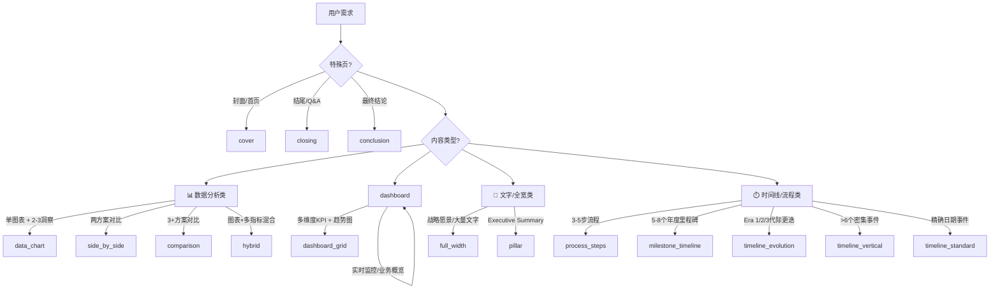

# PPT Slide Layout Library

## Overview

This skill provides **14 professional HTML slide layout templates** with a comprehensive specification system:

| Spec Type | Purpose | Example |
|-----------|---------|---------|
| `selection_criteria` | When to use / not use | "单主题 + 图表 + 2-3 洞察 → data_chart" |
| `spec` | Layout dimensions | "left_chart: col-span-7, height: 220px" |
| `content_spec` | Content limits | "cards: title ≤ 20 chars, body 42-120 chars" |
| `constraints` | Hard rules | "图表优先：左侧 ≥ 58%" |
| `template` | HTML code | Full Tailwind HTML template |

## When to Use This Skill

- Create new HTML slides
- Select appropriate layout type for content
- Apply layout constraints and specifications
- Handle page vertical budget
- Ensure layout deduplication and visual balance

## General Constraints

Each page must contain "Title Area + Main Content Area + Insight Area + Footer Area" four-part structure (except cover/ending pages). Missing any part requires explanation and visual equivalent alternative.

## Layout Implementation Standards (Header-Main-Footer Pages)

For any page using the standard comparison/timeline/data layout (typically utilizing a Header-Main-Footer structure), stability is key. The layout must prevent the main content area from resizing unpredictably based on content volume.

1.  **Container Structure (MANDATORY)**: The root `.slide-container` **MUST** use Flexbox layout:
    -   `display: flex`
    -   `flex-direction: column`
    -   `justify-content: space-between`
    -   `height: 100%` (or fixed slide height)

2.  **Section Constraints**:
    -   **Header**: Must have a fixed height for all slides within a single presentation (e.g., consistent 80px).
    -   **Footer**: Must have a fixed height for all slides within a single presentation (e.g., consistent 40px).
    -   **Main**: **MUST** use `flex: 1` (`flex-grow: 1`) to automatically fill the remaining vertical space. This ensures the Main area size is determined by the container space, not the content size, providing a consistent canvas for all slides.

3.  **Exemptions**:
    -   Pages that do not follow the Header-Main-Footer pattern (e.g., Cover, Section Break, Full-screen Image) are **exempt** from this specific Flexbox structure and may use any CSS layout method (Grid, Absolute, etc.) ("Free to innovate").

4.  **Content Overflow**:
    -   The Main area should handle overflow gracefully (e.g., scale content, or use internal scrolling if permitted by design guidelines), but the container structure itself must remain rigid due to `flex-1`.

## Layout Type Quick Reference

| # | Layout Type | YAML Key | Trigger Keywords (中文业务语义) |
|---|-------------|----------|--------------------------------|
| 1 | Cover | `cover` | PPT首页/品牌展示/章节分隔 |
| 2 | Data Chart | `data_chart` | 单主题+图表+2-3洞察/深度数据分析 |
| 3 | Dashboard Grid | `dashboard_grid` | 多维度KPI+趋势图/综合仪表盘 |
| 4 | Side by Side | `side_by_side` | 两方案对比/A/B测试/竞品一对一 |
| 5 | Full Width | `full_width` | 战略愿景/趋势展示/大量文字叙事 |
| 6 | Hybrid | `hybrid` | 图表+多维度指标混合/分层数据 |
| 7 | Dashboard | `dashboard` | 实时监控/KPI追踪/业务概览 |
| 8 | Pillar | `pillar` | Executive Summary/核心支柱/关键结论 |
| 9 | Process Steps | `process_steps` | 3-5步流程/简单时间线 |
| 10 | Milestone Timeline | `milestone_timeline` | 年度事件(5-8个)/关键里程碑 |
| 11 | Timeline Evolution | `timeline_evolution` | Era 1/2/3代际更迭/战略演进 |
| 12 | Timeline Vertical | `timeline_vertical` | 密集事件(>6个)/高密度叙事 |
| 13 | Timeline Standard | `timeline_standard` | 精确日期事件/高精度时间点 |
| 14 | Comparison | `comparison` | 3+方案对比/多维度竞品分析 |
| 15 | Closing | `closing` | PPT结束/致谢/Q&A |
| 16 | Conclusion | `conclusion` | 最终结论/战略收尾 |

---

### 决策树 (Decision Tree)



---

### 业务语义对照表

| Trigger Keyword | 业务场景 | 推荐布局 |
|-----------------|----------|----------|
| 单主题+图表+2-3洞察 | 深度分析某指标 | data_chart |
| 两方案对比 | 方案A vs 方案B | side_by_side |
| 3+方案对比 | 多个竞品/方案 | comparison |
| 多维度KPI | 业务综述/仪表盘 | dashboard_grid |
| 战略愿景 | 未来规划/愿景展示 | full_width |
| Executive Summary | 摘要页/核心观点 | pillar |
| 3-5步骤流程 | 操作步骤/方法论 | process_steps |
| 年度事件 | 历程回顾/里程碑 | milestone_timeline |
| Era/代际更迭 | 阶段演进/版本迭代 | timeline_evolution |
| 密集事件 | 详尽时间线 | timeline_vertical |
| 精确日期 | 具体日期事件 | timeline_standard |

## Layout Selection Guide

| Content Type | Recommended Layout | Scenario Description |
|--------------|-------------------|---------------------|
| Single insight | `data_chart` | Deep analysis of single data point |
| Comparative analysis | `side_by_side` | A/B testing, competitor comparison |
| Panoramic display | `full_width` | Strategic vision, overall overview |
| Complex analysis | `hybrid` | Multi-layer data display |
| Process explanation | `process` | Workflow, timeline display |
| Milestone narrative | `milestone_timeline` | Annual event evolution, key nodes |
| Monitoring report | `dashboard` | Real-time monitoring, KPI tracking |
| Comprehensive data view | `dashboard_grid` | Complex multi-dimensional data analysis |
| Core pillars | `pillar` | Executive Summary |
| Simple steps | `process_steps` | Simple timeline |
| Competitor comparison | `comparison` | Competitor analysis, solution comparison |

## Core Layout Details

### 1. Cover Layout (cover)

**Constraint Rules:**
- Homepage must use cover layout by default
- Body Suppression: Cover must not contain large analysis text (≤2 short sentences, total ≤80 characters)
- Hierarchy Structure: Must include eyebrow + main title + subtitle/English title + meta info four layers
- Visual Focus: Title and brand elements as focal point
- Footer Strategy: Simplified footer may be retained, analysis-type footnotes not allowed

### 2. Data Chart Layout (data_chart)

**Constraint Rules:**
- Chart Priority: Left chart area width must be ≥ 58% (col-span-7 in 12-column Grid)
- Right Alignment: Right insight cards recommended 2-3, total height auto-fill
- Layout Constraint: Must use Grid (grid-cols-12) instead of Flex to avoid conflicts with global CSS

**Page Budget:**
- Maximum Vertical Budget: 582px
- Default Chart Height: 220px
- Maximum Right Cards: 3
- Max List Items Per Card: 5

### 3. Side by Side Layout (side_by_side)

**Constraint Rules:**
- Default Same Height: Both main chart containers must have consistent height
- Primary/Secondary Exception: Only when explicitly marked 'primary/secondary' chart, height difference ≤15% allowed
- Bottom Alignment: Side by side cards must be bottom-aligned
- Top/Bottom Whitespace Threshold: Within each card difference ≤24px
- Chart Area Ratio Floor: Chart container height occupies 70%-82% of card available height

**Page Budget:**
- Per Column Chart Height: 210px
- Maximum Bottom KPI Rows: 3

### 4. Dashboard Grid Layout (dashboard_grid)

**Constraint Rules:**
- Grid Alignment: Must strictly follow 12-column grid system
- Density Red Line: When cards ≥6 and each card has <30 characters, must downgrade to list layout
- Font Restraint: Except core KPI numbers, body text must not exceed text-base
- Whitespace Mandatory: 2x3 or 3x2 grid must use gap-6 or gap-8
- Chart-Text Ratio: At least 1/3 area must be data charts

### 5. Full Width Layout (full_width)

**Constraint Rules:**
- Main Chart Semantic Anchor: Full-width trend page main chart must have title or口径 short note
- KPI Card Minimum Fields: Metric name + time point + value + comparison baseline at least three items
- Full Width Fill Rate ≥ 86%
- Bottom Half Budget Range: Insight cards + KPI columns total height occupies 44%-52% of main content area

## Layout Deduplication Rules

1. Consecutive Same Structure Forbidden: Any two adjacent pages must not use same main layout type
2. Main Layout Determination: Determined by largest proportion layout module in main content area
3. Conflict Priority: Second page must switch to visual equivalent alternative
4. Cover and Ending Exception: Not参与 consecutive page same structure validation

## Page-Level Constraints

### Layout Balance Hard Constraints

- Left/Right Column Occupancy: Main chart column and narrative column content height both need ≥ 85%
- Whitespace Difference Control: Left/Right column visible whitespace rate difference must not exceed 10%
- Trigger Failure Priority: Increase main chart container height or add structured items

### Vertical Budget

- Single Page Height Budget: header + main + footer <= slide_height
- Main Area Safety Upper Limit: 1280×720 canvas main available height not exceeding 540px
- Footer Safety Zone: Main content area bottom reserve at least 8px safety margin

### Content Overflow Handling Strategy

1. Card Overflow Strategy Required: Long text cards must explicitly declare overflow-auto
2. Body Line Limit: Each card default ≤ 5 lines of body text
3. Overlimit Downgrade Order: First compress text → reduce auxiliary blocks → lower chart container height

## Page Budget Archive

### Global Configuration

- Canvas Size: 1280×720px
- Header Height: 80px
- Footer Height: 50px
- Main Padding: 80px
- Main Area External Available: 590px
- Main Area Internal Available: 510px

### Per-Layout Budget

| Layout | Max Vertical Budget | Default Chart Height | Max Cards |
|--------|---------------------|---------------------|-----------|
| data_chart | 582px | 220px | 3 |
| side_by_side | 582px | 210px | - |
| full_width | 582px | - | 4 KPI |
| hybrid | 582px | 230px | 3 |
| process | 582px | - | 5 steps |
| dashboard | 582px | 232px | 4 KPI |
| milestone_timeline | 582px | - | 6 cards |

## Dependencies

- **ppt-brand-system**: Brand colors/fonts/CSS variables
- **ppt-chart-engine**: Chart containers and rendering rules

## Resource Files

### 模块化布局文件 (v2.0)

```
assets/layouts/
├── index.yml              # 索引 + 快速选择决策表
├── cover.yml              # 封面布局
├── data_chart.yml         # 数据图表布局 (最常用)
├── side_by_side.yml       # 并排比较布局
├── dashboard_grid.yml     # 仪表盘网格布局
├── full_width.yml         # 全宽重点布局
├── pillar.yml             # 支柱型布局 (Executive Summary)
├── process_steps.yml      # 流程步骤布局
├── milestone_timeline.yml # 里程碑时间线
├── timeline_evolution.yml # 演进型时间轴
├── timeline_vertical.yml  # 垂直时间轴
├── comparison.yml         # 对比型布局
├── hybrid.yml             # 混合布局
└── closing.yml            # 尾页布局
```

### 使用方法

1. **选择布局**: 读取 `assets/layouts/index.yml` → `quick_selection` 决策表
2. **读取规格**: 根据返回的 `file` 字段读取具体布局 yml
3. **遵循约束**: 严格执行 `content_spec` 中的字符数/数据点限制

### 关键规格说明

| 规格类型 | 说明 | 示例 |
|---------|------|------|
| `selection_criteria` | 何时使用/不使用 | `when_to_use`, `when_not_to_use` |
| `spec.regions` | 布局尺寸 | `left_chart: width_pct: 58, height_range_px: {min:180, max:280}` |
| `content_spec` | 内容限制 | `cards.per_card.body_min_chars: 42, body_max_chars: 120` |
| `constraints` | 硬性约束 | `"图表优先：左侧 ≥ 58%"` |

**旧版文件**: `assets/layouts.yml` (保留，但推荐使用新版模块化文件)
