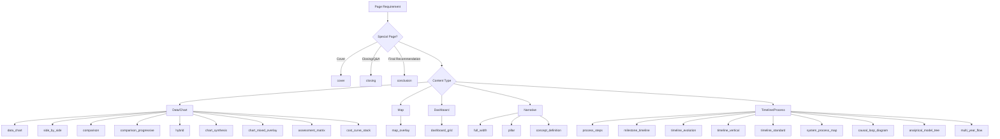

# PPT Slide Layout Library

## Overview

This skill provides professional HTML slide layout contracts for PPT generation.

Source of truth:

- `assets/layouts/index.yml` for inventory and categories
- each `assets/layouts/*.yml` file for layout-level rules and templates

If this file conflicts with layout assets, layout assets win.

## When to Use

Use this skill when you need to:

- choose a layout for a page
- enforce layout constraints and budgets
- control overflow and geometry stability
- avoid repetitive page composition
- map narrative intent to layout archetypes

## Inventory Discipline

Before picking a layout:

1. Read `assets/layouts/index.yml` first.
2. Use category and quick-selection filters to narrow candidates.
3. Open only relevant layout asset files.
4. Treat unindexed layouts as unavailable.

## Unified Layout Contract

Each indexed layout should expose a machine-readable `layout_contract`.

Canonical fields:

- `required_thinking_fields`
- `narrative_fit`
- `compatible_chart_families`
- `compatible_component_families`
- `compatible_map_archetypes`
- `fallback_layouts`
- `overflow_recovery_order`

## Thinking-Phase Consumption Contract

Thinking files should explicitly store:

- `layout_key`
- `layout_contract_source`
- `narrative_fit_match`
- `required_thinking_fields_check`
- `overflow_recovery_order`
- `fallback_layouts`

Rules:

1. `index.yml` is discovery only.
2. selected layout asset is the implementation contract.
3. required thinking fields must be satisfied before implementation.
4. overflow fixes must follow recovery order before switching layout.
5. switch layout only when stabilization fails and fallback is listed.

## Global Page Constraints

Default page structure (except cover/closing variants):

- Title Area
- Main Content Area
- Insight Area
- Footer Area

If one area is omitted, provide explicit structural equivalent and rationale.

## Header-Main-Footer Stability Standard

For standard structured slides:

1. Root `.slide-container` must use vertical Flex.
2. Header and Footer heights must be fixed across one deck.
3. Main must use `flex: 1`.
4. Cover/fullscreen/special transition pages may opt out.

## Geometry Hard Rules

1. **Header Budget Rule**
   - Reserve a fixed header budget for title/subtitle combinations.
2. **Single Coordinate Rule**
   - Timeline axis and milestone nodes must share one coordinate anchor.
3. **Connector Safe-Zone Rule**
   - Connectors/arrows must travel through whitespace lanes only.
4. **Directional Consistency Rule**
   - Connector semantics must remain visually consistent.
5. **Recovery Order Rule**
   - increase region budget -> reduce density -> switch layout.

## Layout Quick Reference

| Layout Type | YAML Key | Trigger Signals |
| --- | --- | --- |
| Cover | `cover` | title page, section opener |
| Data Chart | `data_chart` | one chart + insights |
| Dashboard Grid | `dashboard_grid` | multi-KPI + trend overview |
| Side by Side | `side_by_side` | two-option comparison |
| Full Width | `full_width` | narrative-heavy page |
| Hybrid | `hybrid` | mixed chart + metric cards |
| Pillar | `pillar` | executive summary / key pillars |
| Process Steps | `process_steps` | 3-5 step process |
| Milestone Timeline | `milestone_timeline` | yearly milestones |
| Timeline Evolution | `timeline_evolution` | era-based evolution |
| Timeline Vertical | `timeline_vertical` | high-density event timeline |
| Timeline Standard | `timeline_standard` | precise dated timeline |
| Comparison | `comparison` | 3+ option comparison |
| Closing | `closing` | ending / thanks / Q&A |
| Conclusion | `conclusion` | final recommendation page |
| Map Overlay | `map_overlay` | map-first strategic narrative |
| Progressive Comparison | `comparison_progressive` | staged progression comparison |
| Assessment Matrix | `assessment_matrix` | qualitative multi-axis assessment |
| System Process Map | `system_process_map` | ecosystem/system flow |
| Chart Synthesis | `chart_synthesis` | single chart + strong conclusion |
| Mixed Chart Overlay | `chart_mixed_overlay` | blended chart overlays |
| Concept Definition | `concept_definition` | concept/policy definition page |
| Causal Loop Diagram | `causal_loop_diagram` | feedback-loop reasoning |
| Analytical Model Tree | `analytical_model_tree` | logic/value driver tree |
| Cost Curve Stack | `cost_curve_stack` | cost-supply curve narrative |
| Multi-year Flow | `multi_year_flow` | multi-year flow model |
| Nesting in the Bowl | `nesting_in_the_bowl` | dual-track nested-wave narrative |
| Methodology Funnel + Venn | `methodology_funnel_venn` | funnel + overlap narrative |
| Radial Cube Layout | `radial_cube_layout` | central hub + radial explanation |

## Layout Selection Decision Tree

```mermaid
flowchart TD
    Start["Page Requirement"] --> Special{"Special Page?"}
    Special -->|"Cover"| Cover["cover"]
    Special -->|"Closing/Q&A"| Closing["closing"]
    Special -->|"Final Recommendation"| Conclusion["conclusion"]
    Special --> Content{"Content Type"}

    Content --> Chart["Data/Chart"]
    Content --> Map["Map"]
    Content --> Dashboard["Dashboard"]
    Content --> Text["Narrative"]
    Content --> Timeline["Timeline/Process"]

    Map --> MapOverlay["map_overlay"]

    Chart --> DataChart["data_chart"]
    Chart --> SideBySide["side_by_side"]
    Chart --> Comparison["comparison"]
    Chart --> ProgComp["comparison_progressive"]
    Chart --> Hybrid["hybrid"]
    Chart --> Synth["chart_synthesis"]
    Chart --> Mixed["chart_mixed_overlay"]
    Chart --> Assess["assessment_matrix"]
    Chart --> Cost["cost_curve_stack"]

    Dashboard --> DashboardGrid["dashboard_grid"]

    Text --> FullWidth["full_width"]
    Text --> Pillar["pillar"]
    Text --> ConceptDef["concept_definition"]

    Timeline --> Steps["process_steps"]
    Timeline --> Milestone["milestone_timeline"]
    Timeline --> Evo["timeline_evolution"]
    Timeline --> Vert["timeline_vertical"]
    Timeline --> Std["timeline_standard"]
    Timeline --> SystemMap["system_process_map"]
    Timeline --> Causal["causal_loop_diagram"]
    Timeline --> ModelTree["analytical_model_tree"]
    Timeline --> MultiYear["multi_year_flow"]
```

## Narrative Signal Mapping

| Narrative Signal | Preferred Layout |
| --- | --- |
| one chart + 2-3 insights | `data_chart` |
| multi-dimensional KPI story | `dashboard_grid` |
| A/B strategic comparison | `side_by_side` |
| three-or-more scheme comparison | `comparison` |
| progressive capability evolution | `comparison_progressive` |
| map-first strategic positioning | `map_overlay` |
| complex system flow | `system_process_map` |
| feedback dynamics | `causal_loop_diagram` |

## Core Layout Details (Examples)

### Cover (`cover`)

- large title hierarchy
- minimal body content
- brand-consistent emphasis only

### Data Chart (`data_chart`)

- dominant chart region
- insight strip/cards
- chart readability and label collision protection required

### Side by Side (`side_by_side`)

- balanced two-column structure
- strict symmetry on spacing and emphasis levels

### Dashboard Grid (`dashboard_grid`)

- KPI + trend + explanation blocks
- avoid card overload; prioritize hierarchy

### Full Width (`full_width`)

- narrative-led page
- avoid oversized decorative UI blocks

## Deduplication Rules

- do not repeat the same `layout_key` across too many consecutive pages
- vary emphasis method and column ratio across nearby pages
- alternate dense analytical pages with lighter narrative pages when possible

## Page Budget Rules

### Vertical Budget

`header + main + footer <= slide_height`

Main area must not intrude into footer safety zone.

### Overflow Handling Strategy

1. tune spacing and internal ratios
2. simplify content density (items, label length, chart complexity)
3. apply contract-defined fallback layout

### Balance Constraints

- left/right occupancy should be visually balanced
- avoid large dead zones
- avoid collapsed cards/charts

## Map Overlay Addendum

For `map_overlay` pages:

- map is a narrative surface, not decoration
- overlays (callouts, arrows, markers) must preserve map readability
- connectors must route through safe whitespace lanes

## Dependency Skills

- `skills/ppt-chart-engine/SKILL.md`
- `skills/ppt-brand-style-system/SKILL.md`
- `skills/ppt-map-storytelling/SKILL.md`
- `skills/ppt-visual-qa/SKILL.md`

## Resource Files

Primary resources:

- `assets/layouts/index.yml`
- `assets/layouts/*.yml`

Supporting templates:

- `knowledge/templates/ppt-slide-thinking-template.md`
- `knowledge/templates/ppt-map-page-thinking-template.md`
- `knowledge/templates/ppt-thinking-examples.md`
- `knowledge/templates/ppt-chart-thinking-examples.md`

## Usage Flow

1. discover candidates via index
2. pick layout by narrative fit
3. read selected layout contract
4. complete thinking fields
5. implement with budget constraints
6. run QA and recover via contract order

## Final Guidance

This library is contract-first, not prose-first.

Always prioritize:

- contract compliance
- geometry stability
- narrative clarity
- cross-page visual consistency

over one-off visual tricks.
