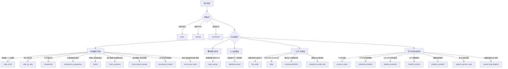

# PPT Slide Layout Library

## Overview

This skill provides **30 professional HTML slide layout templates** with a comprehensive specification system.

The authoritative inventory lives in `assets/layouts/index.yml`. If the quick reference in this file and the index ever drift, treat the index as the source of truth and update this file.

Current inventory summary:

- `special`: 3 layouts
- `chart`: 8 layouts
- `dashboard`: 1 layout
- `narrative`: 6 layouts
- `timeline_process`: 7 layouts
- `map`: 1 layout
- `analytical`: 3 layouts

| Spec Type | Purpose | Example |
|-----------|---------|---------|
| `selection_criteria` | When to use / not use | "单主题 + 图表 + 2-3 洞察 → data_chart" |
| `spec` | Layout dimensions | "left_chart: col-span-7, height: 220px" |
| `content_spec` | Content limits | "cards: title ≤ 20 chars, body 42-120 chars" |
| `constraints` | Hard rules | "图表优先：左侧 ≥ 58%" |
| `template` | HTML code | Full Tailwind HTML template |

For budget-sensitive layouts, some assets now also expose `worked_layout_example` blocks showing a concrete end-to-end chain from region budget to component/chart candidates to final packing.

## When to Use This Skill

- Create new HTML slides
- Select appropriate layout type for content
- Apply layout constraints and specifications
- Handle page vertical budget
- Ensure layout deduplication and visual balance

## Inventory Discipline

Before selecting a layout:

1. Read `assets/layouts/index.yml` first to narrow the candidate set.
2. Use the category and quick-selection tables there before opening individual layout files.
3. Treat directory-only layouts as unavailable until they are indexed.
4. Do not rely on old mental models such as "the library mainly has 14 core layouts". The library now contains 30 indexed layouts, including advanced analytical and synthesis layouts.

## Unified Layout Contract

Core layouts should expose a `layout_contract` block so layout selection can be orchestrated rather than inferred from prose.

Current canonical contract fields:

- `required_thinking_fields`: fields that must appear in the Thinking phase before implementation
- `narrative_fit`: what kind of reading task the layout is optimized for
- `compatible_chart_families`: chart families this layout can host safely
- `compatible_component_families`: component families this layout commonly composes with
- `compatible_map_archetypes`: map narrative archetypes this layout can host, if any
- `fallback_layouts`: preferred downgrade or alternate layouts when the chosen layout becomes unstable
- `overflow_recovery_order`: ordered recovery sequence when content density breaks the layout budget

`layout_contract` is now the default machine-readable contract layer for all indexed layout assets. Treat the specific layout file as the final source of truth whenever this document, the index, and a layout asset do not say exactly the same thing.

## Thinking Template Consumption Contract

The Thinking phase must consume layout contracts explicitly rather than implicitly.

When a page selects a standard layout, the Thinking file should record at least:

- `layout_key`
- `layout_contract_source`
- `narrative_fit_match`
- `required_thinking_fields_check`
- `overflow_recovery_order`
- `fallback_layouts`

Consumption rules:

1. `index.yml` is only a candidate-discovery layer.
2. The chosen layout asset's `layout_contract` is the machine-readable source of truth.
3. `required_thinking_fields` must be reflected in the Thinking file before implementation.
4. Overflow fixes must follow `overflow_recovery_order` before switching layouts.
5. Layout switching is only valid when the page can no longer be stabilized through contract-defined recovery and the next choice is listed in `fallback_layouts`.
7. If the chosen asset exposes `worked_layout_example`, consult it before inventing a fresh packing strategy for the same region structure.

Template alignment:

- `templates/ppt-slide-thinking-template.md`
- `templates/ppt-map-page-thinking-template.md`
- `templates/ppt-thinking-examples.md`
- `templates/ppt-chart-thinking-examples.md`

If these templates and a layout asset diverge, update the templates to match the layout asset contract, not the other way around.

## General Constraints

Each page must contain "Title Area + Main Content Area + Insight Area + Footer Area" four-part structure (except cover/ending pages). Missing any part requires explanation and visual equivalent alternative.

## Layout Implementation Standards (Header-Main-Footer Pages)

For any page using the standard comparison/timeline/data layout (typically utilizing a Header-Main-Footer structure), stability is key. The layout must prevent the main content area from resizing unpredictably based on content volume.

1.  **Container Structure (MANDATORY)**: The root `.slide-container` **MUST** use Flexbox layout:
    -   `display: flex`
    -   `flex-direction: column`
    -   `justify-content: space-between`
    -   `height: 100%` (or fixed slide height)

2.  **Section Constraints**:
    -   **Header**: Must have a fixed height for all slides within a single presentation (e.g., consistent 80px).
    -   **Footer**: Must have a fixed height for all slides within a single presentation (e.g., consistent 40px).
    -   **Main**: **MUST** use `flex: 1` (`flex-grow: 1`) to automatically fill the remaining vertical space. This ensures the Main area size is determined by the container space, not the content size, providing a consistent canvas for all slides.

3.  **Exemptions**:
    -   Pages that do not follow the Header-Main-Footer pattern (e.g., Cover, Section Break, Full-screen Image) are **exempt** from this specific Flexbox structure and may use any CSS layout method (Grid, Absolute, etc.) ("Free to innovate").

4.  **Content Overflow**:
    -   The Main area should handle overflow gracefully (e.g., scale content, or use internal scrolling if permitted by design guidelines), but the container structure itself must remain rigid due to `flex-1`.

## Geometry Hard Rules

The following geometry rules are mandatory for generated slides and should be treated as contract-level constraints rather than implementation suggestions.

1. **Header Budget Rule**:
  - English title + subtitle pages must assume a larger fixed header budget than legacy 80px examples.
  - If the page has `eyebrow + title + subtitle`, the implementation must reserve a fixed header height that can hold two lines of title plus one subtitle line without pushing the main region upward unpredictably.
  - Agents must not rely on content staying short enough to fit a legacy compact header.

2. **Single Coordinate Rule for Timelines**:
  - Timeline axes and milestone nodes must be positioned from the same anchor.
  - Forbidden: axis placed with one `top` value while nodes are placed with unrelated `mt-*` offsets.
  - Preferred: one SVG coordinate system, or one wrapper with axis and node centers derived from the same vertical centerline.

3. **Connector Safe-Zone Rule**:
  - Arrows, curves, dashed connectors, and feedback loops must travel only through whitespace lanes.
  - Forbidden: connectors crossing card bodies, text blocks, or badge areas.
  - If the page uses absolute positioning, the Thinking file must explicitly record the safe zone used by each connector family.

4. **Directional Consistency Rule**:
  - Vertical connectors must visually match the page's horizontal connector language unless the legend explicitly differentiates them.
  - Decorative dashed lines without directional meaning are forbidden on process, roadmap, and system-flow pages.

5. **Geometry Recovery Order**:
  - When a layout becomes visually unstable, recover in this order: enlarge fixed region budget, simplify content density, then change layout.
  - Do not patch geometry by ad hoc one-off offsets until the budget and coordinate rules above have been checked.

## Layout Type Quick Reference

| # | Layout Type | YAML Key | Trigger Keywords (中文业务语义) |
|---|-------------|----------|--------------------------------|
| 1 | Cover | `cover` | PPT首页/品牌展示/章节分隔 |
| 2 | Data Chart | `data_chart` | 单主题+图表+2-3洞察/深度数据分析 |
| 3 | Dashboard Grid | `dashboard_grid` | 多维度KPI+趋势图/综合仪表盘 |
| 4 | Side by Side | `side_by_side` | 两方案对比/A/B测试/竞品一对一 |
| 5 | Full Width | `full_width` | 战略愿景/趋势展示/大量文字叙事 |
| 6 | Hybrid | `hybrid` | 图表+多维度指标混合/分层数据 |
| 7 | Pillar | `pillar` | Executive Summary/核心支柱/关键结论 |
| 8 | Process Steps | `process_steps` | 3-5步流程/简单时间线 |
| 9 | Milestone Timeline | `milestone_timeline` | 年度事件(5-8个)/关键里程碑 |
| 10 | Timeline Evolution | `timeline_evolution` | Era 1/2/3代际更迭/战略演进 |
| 11 | Timeline Vertical | `timeline_vertical` | 密集事件(>6个)/高密度叙事 |
| 12 | Timeline Standard | `timeline_standard` | 精确日期事件/高精度时间点 |
| 13 | Comparison | `comparison` | 3+方案对比/多维度竞品分析 |
| 14 | Closing | `closing` | PPT结束/致谢/Q&A |
| 15 | Conclusion | `conclusion` | 最终结论/战略收尾 |
| 16 | Map Overlay | `map_overlay` | 地图背景+悬浮/地理战略/全球布局 |
| 17 | Progressive Comparison | `comparison_progressive` | 方案演进/逐步增强/阶梯式对比 |
| 18 | Assessment Matrix | `assessment_matrix` | 定性评估/哈维球对比/多维度评级 |
| 19 | System Process Map | `system_process_map` | 复杂系统流程/生态全景/多层级流转 |
| 20 | Chart Synthesis | `chart_synthesis` | 核心图表+底部强结论/单图深度洞察 |
| 21 | Mixed Chart Overlay | `chart_mixed_overlay` | 混合图表+悬浮洞察/趋势波动分析 |
| 22 | Concept Definition | `concept_definition` | 概念定义/政策详情/结构化文本 |
| 23 | Causal Loop Diagram | `causal_loop_diagram` | 因果回路图/系统动力学/正负反馈循环 |
| 24 | Analytical Model Tree | `analytical_model_tree` | 算术逻辑树/供需模型/价值驱动树 |
| 25 | Cost Curve Stack | `cost_curve_stack` | 成本供给曲线/变宽柱状图/市场分层堆叠 |
| 26 | Multi-year Flow | `multi_year_flow` | 多年份分层流程/模型输入-输出演示 |
| 27 | Nesting in the Bowl | `nesting_in_the_bowl` | 嵌碗式波浪线/节点水平居中/上下图文双轨防重叠排版 |
| 28 | Methodology Funnel + Venn | `methodology_funnel_venn` | 方法论 3 步 + 漏斗/重叠分析 |
| 29 | Radial Cube Layout | `radial_cube_layout` | 中心立方体+左右半圆说明 |

---

### 决策树 (Decision Tree)


```mermaid
flowchart TD
    Start[用户需求] --> Special{特殊页?}
    
    Special -->|封面/首页| Cover[cover]
    Special -->|结尾/Q&A| Closing[closing]
    Special -->|最终结论| Conclusion[conclusion]
    
    Special --> Content{内容类型?}
    
    Content --> Chart[📊 数据分析类]
    Content --> Map[🌍 地图分析类]
    Content --> Dashboard[📈 仪表盘类]
    Content --> Text[📝 文字/全宽类]
    Content --> Timeline[⏱️ 时间线/流程类]
    
    Map -->|"地理战略+悬浮卡片"| MapOverlay[map_overlay]
    
    Chart -->|"单图表 + 2-3洞察"| DataChart[data_chart]
    Chart -->|"两方案对比"| SideBySide[side_by_side]
    Chart -->|"3+方案对比"| Comparison[comparison]
    Chart -->|"方案演进/阶梯式"| ProgComparison[comparison_progressive]
    Chart -->|"图表+多指标混合"| Hybrid[hybrid]
    Chart -->|"核心图表+底部强结论"| Synthesis[chart_synthesis]
    Chart -->|"混合图表+悬浮洞察"| MixedOverlay[chart_mixed_overlay]
    Chart -->|"定性评估/哈维球"| Assessment[assessment_matrix]
    Chart -->|"供给成本曲线/变宽柱图"| CostStack[cost_curve_stack]
    
    Dashboard -->|"多维度KPI + 趋势图"| DashboardGrid[dashboard_grid]
    
    Text -->|"战略愿景/大量文字"| FullWidth[full_width]
    Text -->|"Executive Summary"| Pillar[pillar]
    Text -->|"概念定义/政策详情"| Concept[concept_definition]
    Text -->|"逻辑公式/驱动树"| AnalytModel[analytical_model_tree]
    
    Timeline -->|"3-5步流程"| ProcessSteps[process_steps]
    Timeline -->|"5-8个年度里程碑"| Milestone[milestone_timeline]
    Timeline -->|"Era 1/2/3代际更迭"| Evolution[timeline_evolution]
    Timeline -->|">6个密集事件"| Vertical[timeline_vertical]
    Timeline -->|"精确日期事件"| Standard[timeline_standard]
    Timeline -->|"复杂系统流程"| SystemMap[system_process_map]
    Timeline -->|"因果回路/正负反馈"| CausalLoop[causal_loop_diagram]
```

---

### 业务语义对照表

| Trigger Keyword | 业务场景 | 推荐布局 |
|-----------------|----------|----------|
| 单主题+图表+2-3洞察 | 深度分析某指标 | data_chart |
| 两方案对比 | 方案A vs 方案B | side_by_side |
| 3+方案对比 | 多个竞品/方案 | comparison |
| 多维度KPI | 业务综述/仪表盘 | dashboard_grid |
| 战略愿景 | 未来规划/愿景展示 | full_width |
| Executive Summary | 摘要页/核心观点 | pillar |
| 3-5步骤流程 | 操作步骤/方法论 | process_steps |
| 年度事件 | 历程回顾/里程碑 | milestone_timeline |
| Era/代际更迭 | 阶段演进/版本迭代 | timeline_evolution |
| 密集事件 | 详尽时间线 | timeline_vertical |
| 精确日期 | 具体日期事件 | timeline_standard |
| 复杂系统流程 | 生态/供应链全景 | system_process_map |
| 因果回路/反馈循环 | 政策影响/系统动力学 | causal_loop_diagram |
| 供需平衡/逻辑树 | 成本模型/驱动因子分析 | analytical_model_tree |
| 成本曲线/供给堆栈 | 市场分层/边际成本分析 | cost_curve_stack |

## Layout Selection Guide

| Content Type | Recommended Layout | Scenario Description |
|--------------|-------------------|---------------------|
| Single insight | `data_chart` | Deep analysis of single data point |
| Comparative analysis | `side_by_side` | A/B testing, competitor comparison |
| Panoramic display | `full_width` | Strategic vision, overall overview |
| Complex analysis | `hybrid` | Multi-layer data display |
| Process explanation | `process_steps` | Workflow, timeline display |
| Milestone narrative | `milestone_timeline` | Annual event evolution, key nodes |
| Comprehensive data view | `dashboard_grid` | Complex multi-dimensional data analysis |
| Core pillars | `pillar` | Executive Summary |
| Simple steps | `process_steps` | Simple timeline |
| Competitor comparison | `comparison` | Competitor analysis, solution comparison |
| Evolution analysis | `comparison_progressive` | Solution evolution, step-by-step enhancement |
| Qualitative rating | `assessment_matrix` | Multi-dimensional qualitative assessment |
| System Process | `system_process_map` | Complex system diagram |
| Deep Dive + Synthesis | `chart_synthesis` | Single large chart with strong bottom takeaway |
| Seasonality / Fluctuations | `chart_mixed_overlay` | Mixed chart with annotated fluctuations |
| Concept Definition | `concept_definition` | Policy details, structured attributes |
| Causal Analysis | `causal_loop_diagram` | Feedback loops, system dynamics, policy intervention |
| Model Logic | `analytical_model_tree` | Value driver tree, supply/demand balance check |
| Multi-year staged flow | `multi_year_flow` | Multi-period input-output or stage transfer story |
| Nested wave narrative | `nesting_in_the_bowl` | Layered double-track storyline with centered nodes |
| Method funnel + overlap | `methodology_funnel_venn` | Three-step method and overlap explanation |
| Radial explanatory core | `radial_cube_layout` | Central concept with bilateral explanatory arcs |

## Index First Workflow

Use the layout skill in this order:

1. Read `assets/layouts/index.yml` to identify category and candidate layouts.
2. Use `quick_selection` and `exclusion_rules` to reduce false positives.
3. Open the chosen layout asset only after the candidate set is narrow.
4. Treat the chosen asset's `layout_contract` as the machine-readable source of truth.
5. Mirror the asset's `required_thinking_fields`, `overflow_recovery_order`, and `fallback_layouts` into the Thinking file before implementation.
6. If the page is map-led, route through `ppt-map-storytelling` first and only then pick `map_overlay` or another compatible skeleton.
7. If the page is chart-led, confirm chart contract viability before locking a chart-heavy skeleton.

Contract consumption rule:

- `index.yml` narrows candidates.
- `layout_contract` decides whether the candidate is valid.
- `template`, `spec`, and `content_spec` are implementation layers, not selection truth.
- If trigger prose and `layout_contract` conflict, prefer `layout_contract`.

## Core Layout Details

### 1. Cover Layout (cover)

**Constraint Rules:**
- Homepage must use cover layout by default
- Body Suppression: Cover must not contain large analysis text (≤2 short sentences, total ≤80 characters)
- Hierarchy Structure: Must include eyebrow + main title + subtitle/English title + meta info four layers
- Visual Focus: Title and brand elements as focal point
- Footer Strategy: Simplified footer may be retained, analysis-type footnotes not allowed

### 2. Data Chart Layout (data_chart)

**Constraint Rules:**
- Chart Priority: Left chart area width must be ≥ 58% (col-span-7 in 12-column Grid)
- Right Alignment: Right insight cards recommended 2-3, total height auto-fill
- Layout Constraint: Must use Grid (grid-cols-12) instead of Flex to avoid conflicts with global CSS

**Page Budget:**
- Maximum Vertical Budget: 582px
- Default Chart Height: 220px
- Maximum Right Cards: 3
- Max List Items Per Card: 5

### 3. Side by Side Layout (side_by_side)

**Constraint Rules:**
- Default Same Height: Both main chart containers must have consistent height
- Primary/Secondary Exception: Only when explicitly marked 'primary/secondary' chart, height difference ≤15% allowed
- Bottom Alignment: Side by side cards must be bottom-aligned
- Top/Bottom Whitespace Threshold: Within each card difference ≤24px
- Chart Area Ratio Floor: Chart container height occupies 70%-82% of card available height

**Page Budget:**
- Per Column Chart Height: 210px
- Maximum Bottom KPI Rows: 3

### 4. Dashboard Grid Layout (dashboard_grid)

**Constraint Rules:**
- Grid Alignment: Must strictly follow 12-column grid system
- Density Red Line: When cards ≥6 and each card has <30 characters, must downgrade to list layout
- Font Restraint: Except core KPI numbers, body text must not exceed text-base
- Whitespace Mandatory: 2x3 or 3x2 grid must use gap-6 or gap-8
- Chart-Text Ratio: At least 1/3 area must be data charts

### 5. Full Width Layout (full_width)

**Constraint Rules:**
- Main Chart Semantic Anchor: Full-width trend page main chart must have title or口径 short note
- KPI Card Minimum Fields: Metric name + time point + value + comparison baseline at least three items
- Full Width Fill Rate ≥ 86%
- Bottom Half Budget Range: Insight cards + KPI columns total height occupies 44%-52% of main content area

## Layout Deduplication Rules

1. Consecutive Same Structure Forbidden: Any two adjacent pages must not use same main layout type
2. Main Layout Determination: Determined by largest proportion layout module in main content area
3. Conflict Priority: Second page must switch to visual equivalent alternative
4. Cover and Ending Exception: Not参与 consecutive page same structure validation

## Page-Level Constraints

### Layout Balance Hard Constraints

- Left/Right Column Occupancy: Main chart column and narrative column content height both need ≥ 85%
- Whitespace Difference Control: Left/Right column visible whitespace rate difference must not exceed 10%
- Trigger Failure Priority: Increase main chart container height or add structured items

### Vertical Budget

- Single Page Height Budget: header + main + footer <= slide_height
- Main Area Safety Upper Limit: 1280×720 canvas main available height not exceeding 540px
- Footer Safety Zone: Main content area bottom reserve at least 8px safety margin

### Content Overflow Handling Strategy

1. Card Overflow Strategy Required: Long text cards must explicitly declare overflow-auto
2. Body Line Limit: Each card default ≤ 5 lines of body text
3. Overlimit Downgrade Order: First compress text → reduce auxiliary blocks → lower chart container height

## Page Budget Archive

### Global Configuration

- Canvas Size: 1280×720px
- Header Height: 80px
- Footer Height: 50px
- Main Padding: 80px
- Main Area External Available: 590px
- Main Area Internal Available: 510px

### Per-Layout Budget

| Layout | Max Vertical Budget | Default Chart Height | Max Cards |
|--------|---------------------|---------------------|-----------|
| data_chart | 582px | 220px | 3 |
| side_by_side | 582px | 210px | - |
| full_width | 582px | - | 4 KPI |
| hybrid | 582px | 230px | 3 |
| process_steps | 582px | - | 5 steps |
| dashboard_grid | 582px | 232px | 4 KPI |
| milestone_timeline | 582px | - | 6 cards |
| map_overlay | Full | - | 3-5 floating cards |

## Map Overlay Specs (Layout v2.1)

### Visual Architecture
- **Layer 0 (Base)**: Full-screen interactive map (ECharts Geo). Use `absolute inset-0 z-0`.
- **Layer 1 (Data)**: ECharts Series (Scatter/Lines/Heatmap).
- **Layer 2 (UI)**: Floating containers (`absolute z-10`).
  - **Header**: Standard slide header (transparent bg).
  - **KPI Card**: Top-right or Bottom-left (`backdrop-blur`).
  - **Narrative**: Floating text block (max-width 300px).

### Interaction Policy
- **Zoom/Pan**: Enabled but constrained (min/max zoom levels).
- **Tooltips**: Custom HTML tooltips for rich data.
- **Responsive**: Auto-resize on window change.

## Dependencies

- **ppt-brand-style-system**: Brand-style colors/fonts/CSS variables
- **ppt-chart-engine**: Chart containers and rendering rules
- **ppt-map-storytelling**: Map narrative archetypes, overlay grammar, and crop decisions for map-first pages

## Resource Files

### 模块化布局文件 (v2.0)

```
assets/layouts/
├── index.yml              # 索引 + 快速选择决策表
├── cover.yml              # 封面布局
├── data_chart.yml         # 数据图表布局 (最常用)
├── side_by_side.yml       # 并排比较布局
├── dashboard_grid.yml     # 仪表盘网格布局
├── full_width.yml         # 全宽重点布局
├── pillar.yml             # 支柱型布局 (Executive Summary)
├── process_steps.yml      # 流程步骤布局
├── milestone_timeline.yml # 里程碑时间线
├── timeline_evolution.yml # 演进型时间轴
├── timeline_vertical.yml  # 垂直时间轴
├── comparison.yml         # 对比型布局
├── hybrid.yml             # 混合布局
├── closing.yml            # 尾页布局
├── map_overlay.yml        # 地图背景布局 (Global/Regional)
├── comparison_progressive.yml # [新增] 渐进式对比布局
├── assessment_matrix.yml      # [新增] 定性评估矩阵布局
├── system_process_map.yml     # [新增] 系统流程图布局
├── chart_synthesis.yml        # [新增] 核心图表+底部强结论布局
├── chart_mixed_overlay.yml    # [新增] 混合图表+悬浮洞察布局
├── concept_definition.yml     # [新增] 概念定义/政策详情布局
```

### 使用方法

1. **选择布局**: 读取 `assets/layouts/index.yml` → `quick_selection` 决策表
2. **读取规格**: 根据返回的 `file` 字段读取具体布局 yml
3. **遵循约束**: 严格执行 `content_spec` 中的字符数/数据点限制

### 关键规格说明

| 规格类型 | 说明 | 示例 |
|---------|------|------|
| `selection_criteria` | 何时使用/不使用 | `when_to_use`, `when_not_to_use` |
| `spec.regions` | 布局尺寸 | `left_chart: width_pct: 58, height_range_px: {min:180, max:280}` |
| `content_spec` | 内容限制 | `cards.per_card.body_min_chars: 42, body_max_chars: 120` |
| `constraints` | 硬性约束 | `"图表优先：左侧 ≥ 58%"` |

**旧版文件**: `assets/layouts.yml` (保留，但推荐使用新版模块化文件)

## Progressive Comparison Specs (Layout v2.2)

### Visual Architecture
- **Concept**: A matrix layout designed to show the evolution or enhancement of options (e.g., Basic -> Enhanced -> Premium).
- **Grid Structure**: CSS Grid with 4 distinct zones:
  - **Zone A (Row Headers)**: Leftmost column (approx 15-20%) containing numbered indicators (Successive integer circles 1, 2, 3...) and category labels.
  - **Zone B (Option I)**: First option column (Basic/Current State).
  - **Zone C (Option II)**: Second option column (intermediate state), often connected to I and III with chevron arrows.
  - **Zone D (Option III)**: Third option column (Target/Ideal State).
- **Visual Elements**:
  - **Number Badges**: Circular badges with white numbers on dark background (Brand Color) to index the criteria rows.
  - **Progression Arrows**: Large, block-style chevron arrows (`>`) placed between option columns to indicate the "flow" of value addition.
  - **Dashed Borders**: Horizontal dashed lines separating each evaluation criterion row.
  - **Spanning Cells**: Capabilities shared across options must use merged cells (colspan) to visually group them.

### Constraint Rules
- **Column Count**: Strictly 3 comparison columns + 1 label column layout.
- **Row Limit**: Maximum 6 content rows to maintain vertical rhythm.
- **Header Hierarchy**: 
  - Level 1: Option Name (e.g., "I: Basic Plan")
  - Level 2: Descriptive Subtitle / Essence
- **Typography strategy**: Content text should be `text-sm` or `text-xs` to accommodate detailed descriptions.

### HTML Implementation Hints
- Use `grid-cols-12` system:
  - Label Column: `col-span-2`
  - Option Columns: `col-span-3` (approx) with gap for arrows or overlap for chevron effect.
- **Cell Merging**: Use `col-span-X` utility classes for shared features.
- **Chevron Borders**: Use CSS `clip-path: polygon(...)` or SVG background images to create the arrow-shaped column headers or separators.

## Assessment Matrix Specs (Layout v2.3)

### Visual Architecture
- **Concept**: A qualitative assessment grid using status indicators (Harvey Balls, Pie Charts, Traffic Lights) to visualize performance across multiple dimensions and timeframes.
- **Key Components**:
  - **Left Row Headers**: Vertical blocks (colored background, white text) defining the evaluation criteria (e.g., "Environment", "Port Operations").
  - **Column Groups**: Hierarchical headers.
    - Level 1: Scenario/Plan (e.g., "I: Basic Plan")
    - Level 2: Timeframe/Detail (e.g., "Short term", "Long term")
  - **Data Cells**: Centered icons representing the qualitative score.
  - **Separators**: Dashed vertical lines separating major scenario groups.
- **Legend**: Essential bottom-right component explaining the icon scale (e.g., Empty = Worse, Full = Better).

### Constraint Rules
- **Icon Consistency**: Must use the same set of icons (SVG) throughout the matrix.
- **Header Alignment**: Text in column headers must be center-aligned. Row headers must be vertically centered.
- **Row Height**: All data rows must have equal height.
- **Group Separation**: Different high-level options (Plans I, II, III) must be visually separated by `border-l-2 border-dashed border-gray-300`.

### Content Specifications
- **Max Columns**: 8 data columns (excluding row headers).
- **Max Rows**: 5 criteria rows.
- **Label Conciseness**: Top-level headers ≤ 2 lines. Sub-headers ≤ 1 line.

### HTML Implementation Hints
- **Grid Layout**: Use `grid` with `auto-rows-fr` to ensure equal row heights.
- **Row Header Styling**: Use a distinct background color (e.g., Brand Primary) for the first column to anchor the row.
- **Icon Sizing**: Icons should be scalable SVGs, typically `w-8 h-8` or `w-10 h-10`.
- **Vertical Rhythm**: Use `items-center` for all grid cells.

## System Process Map Specs (Layout v2.4)

### Visual Architecture
- **Concept**: A non-linear diagram mapping complex system flows, typically involving multiple layers (e.g., Governance, Operations, Support) and multiple entity types.
- **Key Components**:
  - **Layers**: Horizontal bands or zones grouping entities by function (e.g., "Government" at top, "Physical Flow" in middle, "Financial Flow" at bottom).
  - **Nodes**: Rectangular or shaped containers representing system actors (Manufacturers, Ports, Shippers).
  - **Edges**:
    - **Solid Arrows**: Main physical flow or primary process.
    - **Dashed Arrows**: Information flow, permitting, or soft dependencies.
    - **Curved Lines**: Financial flows or indirect influence (often spanning multiple steps).
  - **Groups**: Visual containers wrapping multiple nodes (e.g., "Drayage + Rail" wrapped in "LMC").
  - **Callouts**: Speech bubbles or pointers highlighting specific definitions or insights.

### Constraint Rules
- **Flow Direction**: Primary physical flow (`Solid`) should generally move Left-to-Right.
- **Hierarchy**: Governance/Oversight entities should start at the Top. Support/Financial entities often at the Bottom.
- **Edge Clarity**: Different line styles (solid, dashed, dotted) must be distinguishable and explained in a Legend.
- **Node Spacing**: Maintain consistent horizontal spacing between process steps.

### Content Specifications
- **Max Nodes**: Recommended 10-15 nodes max per slide to avoid clutter.
- **Text Specs**: Node labels < 20 chars. Callouts < 100 chars.
- **Color Coding**: Use brand colors to distinguish actor types (e.g., Green for Ops, Grey for Admin).

### HTML Implementation Hints
- **Positioning**: Use `relative` container and `absolute` positioning for nodes to allow precise placement. Alternatively, use CSS Grid if the flow is regular.
- **Arrows**:
  - Simple straight arrows: Use CSS borders and pseudo-elements.
  - Complex/Curved arrows: Use an inline SVG overlay (`<svg class="absolute inset-0 pointer-events-none">`) with `<path>` elements and markers.
- **Z-Index**: Ensure floating elements (Callouts, Legend) have higher z-index than base nodes.

## Chart Synthesis Specs (Layout v2.5)

### Visual Architecture
- **Concept**: A layout prioritizing a single, large chart (often time-series or complex curve) followed by a prominent bottom conclusion box (Kicker).
- **Core Areas**:
  - **Upper Canvas (Chart)**: Occupies top 70-80% of main area. Annotations (brackets, arrows) are key.
  - **Bottom Kicker (Synthesis)**: Full-width colored container with white text, summarizing the "So What".
  - **Annotation Layer**: Floating text labels and connectors overlaying the chart.
- **Styling**:
  - **Chart**: Minimal grid, direct labelling (no legend if possible), brand colors.
  - **Kicker**: Brand primary or secondary color background, bold text.

### Constraint Rules
- **Chart Height**: Must be at least 400px to allow detailed data rendering.
- **Kicker Visibility**: The bottom conclusion must be distinct from the chart area (using background color).
- **Footnotes**: Sources and method notes go below the Kicker in the footer area.

### Content Specifications
- **Chart Complexity**: Supports high-density data (20+ points, multiple series).
- **Kicker Text**: Max 2 lines (approx 150 chars). Should be an actionable insight, not just a description.
- **Annotations**: Essential component. Use overlay markers to guide attention.

### HTML Implementation Hints
- **Flex Column**: Use `flex flex-col` for the main area.
- **Chart Container**: `flex-1` (grow to fill available space).
- **Kicker Container**: Fixed or auto height at the bottom, e.g., `p-4 mt-4 bg-brand-primary text-white rounded`.
- **ECharts MarkAreas**: Use ECharts `markLine`, `markArea`, and `graphic` components for brackets and arrows.

## Mixed Chart Overlay Specs (Layout v2.6)

### Visual Architecture
- **Concept**: A data-heavy layout featuring a large mixed-type chart (Bars + Lines) where the core insight is presented as a floating "Callout Box" physically pointing to relevant data segments.
- **Key Components**:
  - **Full-Width Chart Canvas**: Supports time-series data (e.g., Monthly Seasonality).
  - **Floating Insight Box**: A styled container (rounded, shadow) overlaying the chart, explaining specific phenomena (e.g., "Peak-trough fluctuations").
  - **Connectors**: Thin lines or arrows linking the Insight Box to specific data points (peaks/valleys).
  - **Reference Lines**: Horizontal or vertical lines (e.g., Mean, Targets) for context.

### Constraint Rules
- **Chart Type**: Ideally Mixed (Bar + Line) or Multi-Line. Pure Bar charts may be less suitable for this "fluctuation" emphasis.
- **Data Density**: High data density (12+ months/periods) is recommended to justify the full width.
- **Legend Position**: Place legend at the **bottom** to maximize vertical chart space.

### Content Specifications
- **Title**: Focus on the "Movement" or "Fluctuation" (e.g., "Large fluctuations in demand...").
- **Insight Box**: Concise text (bullet points), < 30 words.
- **Series Count**: Supports 3-8 comparable series (e.g., Multi-year data).

### HTML Implementation Hints
- **Container**: `relative` div for the chart area.
- **Callout Box**: `absolute` positioning with `z-10`. use `backdrop-blur-sm` if covering grid lines.
- **Connectors**: SVG overlay or simple CSS borders.
- **ECharts**: Use `series[type='line']` for the mean/trend and `series[type='bar']` for periodic data.

## Concept Definition Specs (Layout v2.7)

### Visual Architecture
- **Concept**: A highly structured text layout designed for presenting a single concept, policy, or initiative in detail. It uses a prominent "Hero Definition" block followed by a breakdown of key attributes.
- **Key Components**:
  - **Definition Hero**: A split container at the top. 
    - Left (Label): Brand primary color background, white text, centered.
    - Right (Content): Light grey background, black text, descriptive.
  - **Attribute Grid**: A two-column structure below the hero.
    - Left Column (Labels): Attribute names (e.g., Criteria, Timing), bold text.
    - Right Column (Details): Detailed descriptions, bullet points.
  - **Section Headers**: Distinct underlying labels (e.g., "Levers", "Illustrative range of choices") separating the definition from attributes.

### Constraint Rules
- **Hero Dominance**: The definition block must be the visual anchor.
- **Alignment**: Attribute labels (Left) and details (Right) must be strictly top-aligned.
- **Grid Consistency**: Attribute rows should follow a consistent vertical rhythm.
- **Typography**: Definition content should be larger/prominent. Attribute details `text-sm`.

### Content Specifications
- **Definition Text**: Concise, 2-3 lines max.
- **Attributes**: 3-5 key attributes recommended.
- **Bullets**: Use standard bullets for details.

### HTML Implementation Hints
- **Flex Row**: Use for the Hero Definition (`w-1/4` + `w-3/4`).
- **Grid / Table**: Use CSS Grid `grid-cols-[1fr_3fr]` for the attribute section to ensure alignment.
- **Borders**: heavy top borders (`border-t-4`) for section headers to create visual separation.


