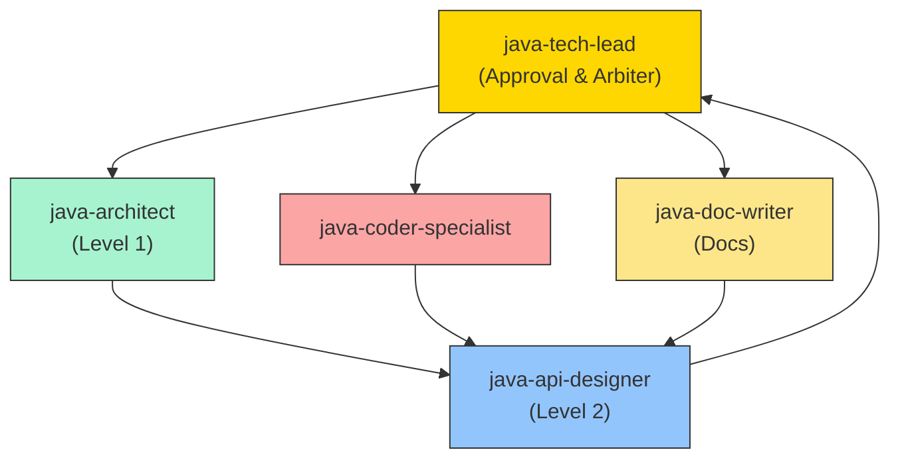

# Agent Collaboration Protocol and Iteration Control

**Purpose**: Define the collaboration workflow, iteration limits, and escalation
mechanisms among Java development Agents to prevent infinite loops and ensure
productive collaboration.

**Version**: 1.0  
**Last Updated**: 2026-01-24

---

## Collaboration Workflow Overview



---

## Iteration Limits

### Rule 1: Maximum Iterations = 3

Any feedback loop between two Agents is limited to **3 iterations**.

| Scenario | Allowed Iterations | After Limit |
| -------------------------- | ----------------- | ---------------- |
| architect ↔ api-designer | 3 | Escalate to tech-lead |
| api-designer ↔ coder | 3 | Escalate to tech-lead |
| coder ↔ api-designer | 3 | Escalate to tech-lead |
| doc-writer ↔ api-designer | 3 | Escalate to tech-lead |

### Rule 2: Iteration Counting

```text
Iteration 1: Agent A → Agent B (initial request)
Iteration 2: Agent B → Agent A (feedback / change request)
Iteration 3: Agent A → Agent B (resubmission after changes)
Iteration 4: ❌ Exceeded - must escalate to tech-lead
```

### Rule 3: Iteration Tracking Template

Every feedback message MUST include the iteration count:

```markdown
## Feedback (Iteration 2/3)

**From**: @java-coder-specialist
**To**: @java-api-designer
**Remaining Iterations**: 1

**Issue**: [short description of the problem]

**Request**: [what you need from the recipient]

---
⚠️ Note: If the issue persists after this change, the next feedback will automatically
escalate to @java-tech-lead
```

---

## Escalation Mechanism

### Automatic Escalation Triggers

1. **Iterations exceeded**: Iteration count > 3
2. **Explicit request**: An Agent declares it cannot proceed
3. **Stalemate**: Conflicting positions that cannot be resolved between Agents
4. **Blocking timeout**: Waiting for a response > 24 hours

### Escalation Message Template

```markdown
@java-tech-lead – arbitration requested

## Escalation Type
- [ ] Iterations exceeded (Iteration > 3)
- [ ] Unable to proceed
- [ ] Conflicting positions
- [ ] Blocking timeout

## Involved Agents
- @agent1
- @agent2

## Issue Description
[Detailed description of the problem]

## Iteration History Summary
| Iteration | From | To | Summary |
|-----------|------|-----|---------|
| 1 | @agent1 | @agent2 | [Initial request] |
| 2 | @agent2 | @agent1 | [Feedback: issue X] |
| 3 | @agent1 | @agent2 | [Resubmission after changes] |
| 4 | @agent2 | @agent1 | [Still issue Y] ← exceeded limit |

## Positions
**@agent1 position**: [description]
**@agent2 position**: [description]

## Request
Please make a final decision.
```

---

## Degraded Output Strategies

When design documents or upstream inputs are incomplete, do not fully block; instead,
employ a degraded delivery strategy.

### Strategy 1: Minimal Viable Output (MVP Output)

```markdown
## Degraded Output Declaration

**Reason**: [specific reason why upstream input is incomplete]

**Degraded Content**:
This output is based on incomplete input; the following items are marked as "to be
completed":
- [ ] [item to be completed 1]
- [ ] [item to be completed 2]

**When upstream provides the missing information**:
Please @[upstream-agent] supply the missing items; I will update the output accordingly:
- [required info 1]
- [required info 2]
```

### Strategy 2: Assumptions with Annotations

```markdown
## Output Based on Assumptions

Because upstream did not specify the following, I produce output based on reasonable
assumptions:

| Item | Assumed Value | Impact if Wrong |
|------|---------------|-----------------|
| Error handling strategy | return null | may require changes to return handling |
| Concurrency requirement | 100 QPS | may require synchronization changes |

⚠️ **Risk**: If an assumption is incorrect, rework will be required

@[upstream-agent] Please confirm these assumptions
```

### Strategy 3: Phased Delivery

```markdown
## Phased Delivery

由于上游产出不完整，采用分阶段交付：

### 阶段 1: 已完成 ✅
- [已完成的部分]

### 阶段 2: 待上游补充后完成 ⏳
- 依赖: [需要的上游输入]
- 预计完成: 收到上游补充后 1 天内

### 阶段 3: 可选优化 📋
- [后续可优化的部分]
```

---

## Quality Gates

### Gate 1: Design Approved

**Entry Criteria**:

- [ ] Level 1 Architecture Design completed
- [ ] Level 2 API Specification completed
- [ ] Approved by @java-tech-lead
- [ ] Iterations ≤ 3

**Allowed action**: @java-coder-specialist may start implementation

### Gate 2: Implementation Approved

**Entry Criteria**:

- [ ] Code implementation completed
- [ ] All static analysis passes
- [ ] Test coverage ≥ 80%
- [ ] Approved by @java-tech-lead
- [ ] Iterations ≤ 3

**Allowed action**: @java-doc-writer may start documentation

### Gate 3: Documentation Approved

**Entry Criteria**:

- [ ] User documentation completed
- [ ] API reference completed
- [ ] Approved by @java-tech-lead

**Allowed action**: Module may be released

---

## Anti-patterns

### ❌ Anti-pattern 1: Infinite Loop

```text
coder → api-designer → coder → api-designer → ...
```

**Problem**: No iteration limit leads to never-ending cycles

**Correct approach**: Escalate to tech-lead after 3 iterations

### ❌ Anti-pattern 2: Skipping Approval

```text
architect → coder (skips api-designer)
```

**Problem**: Missing API contract may cause incorrect implementation by coder

**Correct approach**: Follow the flow architect → api-designer → coder strictly

### ❌ Anti-pattern 3: Complete Block

```text
doc-writer: "Design doc is incomplete; I cannot produce anything"
```

**Problem**: Complete blocking prevents progress

**Correct approach**: Use degraded output strategies to deliver minimal viable content

### ❌ Anti-pattern 4: Unrecorded Feedback

```text
coder: "API design is broken"
(lacks detail and iteration count)
```

**Problem**: Vague feedback is not traceable

**Correct approach**: Use the iteration tracking template to state issues and iteration count clearly

---

## Agent Roles and Responsibilities

### java-architect

- **Deliverable**: Level 1 Architecture Design
- **Receives feedback from**: @java-api-designer
- **Submits for approval to**: @java-tech-lead
- **Escalation condition**: Iterations with api-designer > 3

### java-api-designer

- **Deliverable**: Level 2 API Specification
- **Receives feedback from**: @java-architect, @java-coder-specialist, @java-doc-writer
- **Submits for approval to**: @java-tech-lead
- **Escalation condition**: Iterations with any agent > 3

### java-coder-specialist

- **Deliverable**: Implementation code
- **Receives feedback from**: @java-api-designer
- **Submits for approval to**: @java-tech-lead
- **Escalation condition**: Iterations with api-designer > 3

### java-doc-writer

- **Deliverable**: User documentation
- **Receives feedback from**: @java-api-designer
- **Submits for approval to**: @java-tech-lead
- **Escalation condition**: Iterations with api-designer > 3

### java-tech-lead

- **Responsibilities**: Approval, arbitration, quality gate
- **Receives requests from**: All agents
- **Final decision authority**: Yes

---

## Version History

| Version | Date | Changes |
| -------- | ------ | --------- |
| 1.1 | 2026-01-28 | Separated PPT collaboration to ppt-agent-collaboration-protocol.md |
| 1.0 | 2026-01-24 | Initial release (Java/Go teams) |
