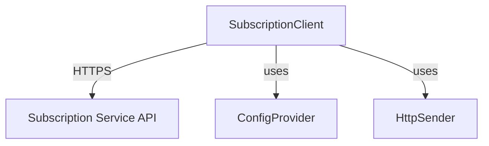

# Java Module Design & API Specification Standards

**Purpose**: Define standards for Java module design documents, covering two levels: Architecture Design and API Specification. These standards ensure architects, API designers, developers, and technical writers can collaborate under a single, consistent format.

**Scope**: Applies to design and API specifications for all Java modules.

**Version**: 2.1  
**Last Updated**: 2026-01-24

---

## Relationship to Google Practices

This standard is based on Google Design Doc practices, with the following enhancements:

### ✅ Alignments with Google practices

1. **Design-doc-driven development**: Design first, implement later (Google: Tech Lead writes design doc → Implementation)
1. **Context & Alternatives**: Clarify problem context and trade-offs (core sections in Google design docs)
1. **Review & Approval**: Design documents require approval before implementation (Google: at least 2 LGTMs)
1. **ADR mechanism**: Record architecture decisions and rationale (Architecture Decision Records)

### 🔧 Enhancements and differences

#### Enhancement 1: Dedicated API Designer role

- **Google practice**: Tech Lead or senior engineer often handles API design
- **This standard**: Introduces a separate `java-api-designer` role
- **Why**:
  - ✅ Separates the responsibilities of architecture (What & Why) and API contracts (How)
  - ✅ Detailed Design Rationale (Contract + Caller Guidance) reduces implementation errors
  - ⚠️ Trade-off: More roles and higher coordination overhead

#### Enhancement 2: Include executable Caller Guidance in the Design Doc

- **Google practice**: Design docs define API behavior; code examples live in API reference
- **This standard**: Section 10.2 Design Rationale includes 50–100 lines of executable code
- **Why**:
  - ✅ Developers see complete error-handling examples, reducing implementation mistakes
  - ✅ Technical writers can extract examples directly from the design doc
  - ⚠️ Trade-off: Longer design docs (may reach 20–30 pages)

#### Enhancement 3: Systematic Concurrency Strategy table

- **Google practice**: Performance requirements may be scattered across sections
- **This standard**: Section 6.2 consolidates design patterns, thread-safety, caching, etc.
- **Why**:
  - ✅ Developers clearly see concurrency requirements per component
  - ✅ Reduces repetitive questions about whether something must be thread-safe

#### Enhancement 4: User-Facing Guidelines (Section 9.7)

- **Google practice**: User guidance usually lives in user docs and not the design doc
- **This standard**: Design docs include actionable configuration recommendations
- **Why**:
  - ✅ Technical writers produce more accurate performance guidance
  - ✅ Ensures documentation aligns with system design
  - ⚠️ Trade-off: Architects must also consider user-facing perspectives

### 📊 When to use this standard

**Use this enhanced standard when**:

- ✅ Your team has a dedicated API design expert
- ✅ You require high-quality user documentation (SDKs, public APIs)
- ✅ Multi-role collaboration (architects, implementers, and writers are separate)
- ✅ Project complexity is high (>10 APIs, multi-system integration)

**Simplify to Google-style practice when**:

- 🔄 Small teams (<5 people)
- 🔄 Internal tools or prototype projects
- 🔄 Fast-iteration scenarios

**How to simplify**: Combine the architect and API designer roles and omit the 50–100 line Caller Guidance requirement.

---

## Document Scope and Levels

This standard defines two levels of design document content that map to different roles and workflows:

### Level 1: Architecture Design (High-level)

**Role**: java-architect  
**Corresponding Google practice**: Tech Lead authoring the design doc (5–10 pages)  
**Primary contents**:

- Context and Scope (problem background, system boundary)
- Goals and Non-Goals (what to do, what not to do)
- Design Overview (component architecture, module dependencies)
- Alternatives Considered (technology choices and trade-offs)
- Cross-cutting Concerns (performance, security, observability)

**Output**: High-level design document → Saved to `docs/design/[module]-design.md`

### Level 2: API Specification (Detailed)

**Role**: java-api-designer  
**Corresponding Google practice**: Engineer authoring Protocol Buffers (.proto files) + AIP-style guidelines  
**Primary contents**:

- API Interface Definition (complete Java interface code)
- Design Rationale (precise behavior contract + Caller Guidance)
- Dependency Interfaces
- Concurrency Requirements (QPS, latency, thread-safety)
- Data Model (entity definitions)

**Output**: API Specification → Append to `docs/design/[module]-design.md`

---

## Workflow: Two-Agent Architecture

### Option A: Separate Agents (Recommended for Large Projects)

```text
java-architect (Level 1: Architecture Design)
  ↓ generates Design Document
  ↓ handoff to
java-api-designer (Level 2: API Specification)
  ↓ appends API Specification
  ↓ handoff to (both)
  ├→ java-coder-specialist (implements)
  └→ java-doc-writer (generates user docs)
```

**Advantages**:

- ✅ Clear separation of responsibilities (architect focuses on architecture, api-designer focuses on API contracts)
- ✅ Aligns with Google practice (Tech Lead → Engineer separation)
- ✅ Suitable for large projects (architecture and API design can proceed in parallel)

**Trade-off**:

- ⚠️ Requires two handoffs (increases coordination overhead)
- ⚠️ Requires two agents (increases maintenance overhead)

### Option B: Combined Agent (Recommended for Small/Medium Projects)

```text
java-architect (Level 1 + Level 2)
  ↓ generates Design Document + API Specification
  ↓ handoff to (both)
  ├→ java-coder-specialist (implements)
  └→ java-doc-writer (generates user docs)
```

**Advantages**:

- ✅ Single cohesive document
- ✅ One handoff, simpler coordination
- ✅ Suitable for small/medium projects

**Trade-off**:

- ⚠️ Heavier responsibilities for the java-architect (needs to cover both levels)

---

## Why This Order? (Architecture → API → Implementation)

**Correct Flow**:

1. **Architecture First**: Define WHAT to build and WHY

- Example: "We need a subscription verification service with 100 QPS support"

1. **API Design Second**: Define HOW to interact

- Example: "verify(apiKey) returns Subscription or null, throws IOException on network failure"

1. **Implementation Last**: Build the code

- Example: Implement SubscriptionVerifier with proper error handling

**Wrong Flow** (API → Architecture):

- ❌ Can't design API without knowing the problem to solve
- ❌ Designing details before understanding the big picture leads to rework

**Analogy**:

- ✅ Correct: Design house type (villa/apartment) → Design door size
- ❌ Wrong: Design door size → Decide house type

---

## Comparison with Google Practice

| Aspect | Google Practice | Our Standard (Option A) | Our Standard (Option B) |
| -------- | ---------------- | ------------------------ | ------------------------ |
| **High-level Design** | Tech Lead writes Design Doc | java-architect writes Level 1 | java-architect writes Level 1 |
| **API Definition** | Engineer writes .proto | java-api-designer writes Level 2 | java-architect writes Level 2 |
| **Implementation** | Engineer implements | java-coder-specialist implements | java-coder-specialist implements |
| **Documentation** | Tech Writer generates docs | java-doc-writer generates docs | java-doc-writer generates docs |
| **Total Roles** | 3 roles, 2 documents | 4 roles, 1 document | 3 roles, 1 document |

**Key Differences**:

- Google uses separate documents (Design Doc + .proto)
- We use single document with two sections (more cohesive)
- Google has Protocol Buffers + Linter (automatic validation)
- We have manual Java Interface + Javadoc (requires discipline)

---

## Document Structure

Each design document must include the following sections:

### 1. Context and Scope (required)

**Purpose**: Describe the problem background, target users, and system boundary.

**Required Content**:

- **Background**: Why is this module needed? What business problem does it solve?
- **Target Users**: Who will use this module? (internal services / public API / CLI tools)
- **System Boundary**: Which external systems does it interact with and how? (REST/gRPC/Database/Message Queue)

**Format**: Narrative + bullet list

**Example**:

```markdown
## 1. Context and Scope

**Background**:
App Center needs to verify user subscription status and support periodic subscription checks.

**Target Users**:

- Internal services: verify subscriptions via API
- Flutter apps: integrate via SDK

**System Boundary**:

- Subscription Service API (HTTPS REST)
- Local SQLite Database (subscription cache)
```

---

### 2. Goals and Non-Goals (required)

**Purpose**: Clarify what is in scope and what is out of scope.

**Required Content**:

- **Goals**: required features, measurable performance targets, and constraints
- **Non-Goals**: items explicitly out of scope for this effort

**Format**: Bullet list, measurable

**Example**:

```markdown
## 2. Goals and Non-Goals

**Goals**:

- Verify subscription status (active/expired/not-found)
- Response time < 200ms (95th percentile)
- Support 100 QPS
- Support configurable periodic checks

**Non-Goals**:

- Do not implement purchase flows (handled by the web portal)
- Do not cache subscription state (always real-time lookup)
- Do not support offline verification
```

---

### 3. Design Overview (required)

**Purpose**: Provide a high-level overview of components and dependencies.

**Required Content**:

- **Component Diagram**: Simple box diagram showing module dependencies
- **Component Description**: Responsibilities for each component (1–2 sentences)

**Format**: Mermaid diagram + short descriptions

**Diagram Rules**:

- ✅ Use simple boxes for components
- ✅ Use arrows to show dependencies (A → B means A depends on B)
- ✅ Label interaction protocols (HTTPS/gRPC/Database)
- ❌ Do not include detailed class diagrams (do not show fields and methods)
- ❌ Do not include sequence diagrams (unless the protocol is very complex)

**Example**:

````markdown
## 3. Design Overview

### 3.1 Component Diagram



### 3.2 Component Description

- **SubscriptionClient**: subscription verification client that exposes the verification API
- **ConfigProvider**: configuration provider that reads service URL and timeout settings
- **HttpSender**: HTTP request sender that encapsulates network I/O

````

---

### 4. API Design (required) ⭐

**Purpose**: Define the module's public API contract; this is the core section.

**Required Sections**:

- 4.1 Interface Definition
- 4.2 Design Rationale
- 4.3 Dependency Interfaces

---

#### 4.1 Interface Definition

**Purpose**: Provide complete Java interface code.

**Required Content**:

- Complete, compilable interface code
- Javadoc for each method
- @param, @return, @throws descriptions
- **@ThreadSafe** annotation (Yes/No + explanation)
- **@Idempotent** annotation (Yes/No, where applicable)

**Format**: Complete Java code block

**Example**:

```java
/**
 * Subscription verification interface
 */
public interface SubscriptionVerifier {
    /**
     * Verify subscription status
     *
     * @param apiKey Application API key (non-null)
     * @return Subscription info, or null if invalid/expired
     * @throws IOException Infrastructure failures (connection timeouts, DNS failures, HTTP 5xx)
     * @throws IllegalArgumentException if apiKey is null or empty string
     * @ThreadSafe Yes (can be called concurrently without external synchronization)
     * @Idempotent Yes
     */
    Subscription verify(String apiKey) throws IOException;

    /**
     * Start periodic verification
     *
     * @param intervalMinutes Check interval in minutes (must be > 0)
     * @throws IllegalArgumentException if intervalMinutes <= 0
     * @ThreadSafe No (should be called only from the main thread)
     * @Idempotent Yes (restarting is allowed)
     */
    void startPeriodicVerification(int intervalMinutes);
}
```

---

#### 4.2 Design Rationale ⭐⭐⭐ (CRITICAL - Based on Google Practice)

**Purpose**: Explain key design decisions, API contracts, and caller guidance. This is the architect's most important deliverable.

**CRITICAL Requirements (Based on Google Protocol Buffers + AIP Guidelines)**:

- ✅ **Contract MUST be precise** - must include a complete mapping of status codes and exceptions (table format)
- ✅ **Caller Guidance MUST include executable code** - must include 50–100 lines of executable code (including logging, metrics, retry logic)
- ✅ **All edge cases MUST be covered** - must include null/empty/invalid inputs
- ❌ **NO ambiguous language** - avoid vague terms such as "may", "should", or "typically"

**Required Structure** (per key method/decision):

````markdown
**[Method/Feature Name] - [Decision Category]**:

1. **Decision**: [concise decision statement]

1. **Contract** (MUST be table format for HTTP APIs):
   | Scenario | HTTP Status | Response Body | Return Value | Exception | Retry? |
   | ---------- | ------------- | --------------- | -------------- | ----------- | -------- |
   | Normal flow | 200 | {"status":"active"} | Subscription object | - | No |
   | Subscription not found | 404 | {"error":"not_found"} | null | - | No |
   | Network timeout | - | - | - | IOException (SocketTimeoutException) | Yes |
   | Parameter error | - | - | - | IllegalArgumentException | No |

1. **Caller Guidance** (MUST include complete executable code):
   ```java
   // Production-ready implementation (50-100 lines)
   public Response handleRequest(String apiKey) {
       // [complete code including: input validation, error handling, logging, metrics, retry logic]
   }
   ```

   **Error Handling Checklist**:

- [ ] HTTP status codes defined for each scenario
- [ ] Logging statements included (with log level)
- [ ] Metrics reporting included (if applicable)
- [ ] Retry logic implemented (with backoff parameters)
- [ ] User-facing error messages defined

1. **Rationale**: [why the decision was made]

- Separate business logic (invalid subscription) from infrastructure failures (network errors)
- Returning null simplifies handling common business cases and avoids forcing try-catch blocks
- IOException is reserved for real infrastructure failures so callers can handle network issues uniformly

1. **Alternative Considered**: [alternatives considered → why rejected]

````

**Common Decision Categories**:

- Error Handling Contract
- Thread Safety Contract
- Idempotency Contract
- Performance Trade-offs
- Lifecycle Management

**Example**:

````markdown
### 4.2 Design Rationale

**verify() - Error Handling Contract**:

1. **Decision**: Return null for invalid subscriptions, throw IOException for infrastructure failures

1. **Contract**:
- Return null when:
  - Subscription not found (HTTP 200, status=not_found)
  - Subscription expired (HTTP 200, status=expired)
  - Subscription cancelled (HTTP 200, status=cancelled)
- Throw IOException when:
  - Connection timeout (ConnectException, SocketTimeoutException)
  - DNS resolution failure (UnknownHostException)
     - HTTP 500/502/503 server errors
   - Throw IllegalArgumentException when:
     - apiKey is null or an empty string
   - Never throws:
     - SubscriptionInvalidException (replaced by null)

1. **Caller Guidance** (Complete executable code - Google Standard):
   ```java
   /**
    * Production-ready implementation with all error handling
    */
   public Response handleVerification(String apiKey) {
       // Step 1: Input validation
       if (apiKey == null || apiKey.isBlank()) {
           logger.warn("Received null/blank API key");
           return Response.status(400)
               .entity(new ErrorResponse("API key is required"))
               .build();
       }

       // Step 2: Verify with retry logic
       Subscription sub;
       try {
           sub = retryableVerify(apiKey, 3, 1000);
       } catch (IOException e) {
           logger.error("Failed to verify subscription", e);
           metrics.incrementCounter("subscription.verify.failure");
           return Response.status(503)
               .entity(new ErrorResponse("Service temporarily unavailable"))
               .build();
       }

       // Step 3: Handle business logic
       if (sub == null) {
           logger.info("Invalid subscription for apiKey: ***");
           metrics.incrementCounter("subscription.verify.invalid");
           return Response.status(401)
               .entity(new ErrorResponse("Invalid or expired subscription"))
               .build();
       }

       // Step 4: Success path
       metrics.incrementCounter("subscription.verify.success");
       return Response.ok(sub).build();
   }

   private Subscription retryableVerify(String apiKey, int maxRetries, int initialDelayMs)
       throws IOException {
       int delay = initialDelayMs;
       for (int i = 0; i < maxRetries; i++) {
           try {
               return verifier.verify(apiKey);
           } catch (SocketTimeoutException | ConnectException e) {
               if (i == maxRetries - 1) {
                   throw new IOException("Failed after " + maxRetries + " retries", e);
               }
               logger.warn("Retry {} due to: {}", i + 1, e.getMessage());
               Thread.sleep(delay);
               delay *= 2; // exponential backoff
           }
       }
       throw new IllegalStateException("Unreachable");
   }
   ```

   **Key Points**:

- ✅ Received null → HTTP 401 (business failure)
- ✅ IOException → HTTP 503 + retry logic (exponential backoff: 1s, 2s, 4s)
- ✅ Logging: warn (input error), error (system failure), info (business failure)
- ✅ Metrics: subscription.verify.{success|invalid|failure}

1. **Rationale**:

- Separate business logic (invalid subscription) from infrastructure failures (network errors)
- Returning null simplifies handling common business cases and avoids forcing try-catch blocks
- IOException is reserved for real infrastructure failures so callers can handle network issues uniformly

1. **Alternative Considered**:

- Alternative 1: Throw SubscriptionInvalidException
  - Rejected: invalid subscription is an expected business scenario (≈30% of users not subscribed); forcing exceptions would cause boilerplate error handling
- Alternative 2: Return a Result<Subscription, Error> type
  - Rejected: Java lacks a native Result type; adding a third-party library increases complexity

---

**verify() - Thread Safety Contract**:

1. **Decision**: Must be thread-safe for concurrent calls

1. **Contract**:

- verify() can be called concurrently by multiple threads without external synchronization
- Any internal state (if present) must be thread-safe or immutable
- No ordering guarantees (even if Thread A calls first, Thread B may return first)

1. **Caller Guidance**:

- Can be called concurrently from request handling thread pools
- No need for callers to add synchronized or Lock
- If ordering is required, callers should implement their own queuing mechanism

1. **Rationale**:

- Expected to be called from many request threads (100 QPS)
- Stateless or immutable design avoids synchronization overhead and improves performance

1. **Alternative Considered**:
   - Alternative 1: Require callers to provide external synchronization
     - Rejected: increases caller burden and is error-prone

---

**startPeriodicVerification() - Idempotency Contract**:

1. **Decision**: Can be called multiple times, restarts timer

1. **Contract**:
   - First call: start the timer
   - Repeated call: stop the old timer and start a new one
   - Parameter change: use the new interval

1. **Caller Guidance**:
   - It is safe to call repeatedly to change the check interval
   - No need to call stop() before calling start()

1. **Rationale**:
   - Simplifies the API contract and avoids putting state management burden on callers
   - Supports scenarios where monitoring intervals must be adjusted dynamically

1. **Alternative Considered**:
   - Alternative 1: Throw on repeated calls
     - Rejected: increases caller complexity; requires tracking state

````

---

#### 4.3 Dependency Interfaces

**Purpose**: Define external interfaces the module depends on.

**Required Content**:

- Full definitions of dependency interfaces (Java interface code)
- Thread-safety annotations
- Short responsibility summaries

**Format**: Java code block

**Example**:

```java
/**
 * HTTP request sending interface
 */
public interface HttpSender {
    /**
     * Send an HTTP request
     *
     * @param request request object
     * @return response object
     * @throws IOException network errors
     * @ThreadSafe Yes (callable concurrently)
     */
    Response send(Request request) throws IOException;
}
```

---

### 5. Data Model (required)

**Purpose**: Define key data entities and relationships.

**Required Content**:

- Fields for each key entity
- Data types
- Constraints (optional/required, allowed ranges)

**Format**: table

**Example**:

```markdown
## 5. Data Model

| Entity | Fields | Type | Constraints | Description |
| -------- | -------- | ------ | ------------- | ------------- |
| Subscription | apiKey | String | Non-null, 32 chars | Subscription API key |
| | status | Enum | ACTIVE/EXPIRED/CANCELLED | Subscription status |
| | expiryDate | Date | Nullable | Expiration date |
| Config | serverUrl | String | Non-null, valid URL | Service endpoint |
| | timeout | int | > 0, milliseconds | Timeout |
```

---

### 6. Concurrency Requirements (required)

**Purpose**: Define performance targets and concurrency requirements.

**Required Content**:

- Concurrency requirement per method
- Expected QPS (Queries Per Second)
- Response time targets (e.g., p95, p99)
- Thread-safety requirements

**Format**: table + narrative

**Example**:

```markdown
## 6. Concurrency Requirements

### 6.1 Performance Targets

| Method | Concurrent? | Expected QPS | Response Time (p95) | Response Time (p99) |
| -------- | ------------- | -------------- | --------------------- | --------------------- |
| verify() | Yes | 100 | < 200ms | < 500ms |
| startPeriodicVerification() | No | N/A | < 10ms | < 50ms |

### 6.2 Thread Safety Requirements

**verify()**:

- Requirement: thread-safe, supports concurrent calls
- Rationale: expected to be called from many request threads

**startPeriodicVerification()**:

- Requirement: not thread-safe, call only from the main thread
- Rationale: typically invoked at application startup; no concurrent scenario
```

---

### 7. Cross-Cutting Concerns (required)

**Purpose**: Describe performance, security, observability, and other cross-cutting concerns.

**Required Sections**:

- 7.1 Performance (SLO/SLA)
- 7.2 Security
- 7.3 Observability

**Example**:

```markdown
## 7. Cross-Cutting Concerns

### 7.1 Performance

**SLO (Service Level Objective)**:

- Latency: p95 < 200ms, p99 < 500ms
- Throughput: > 100 QPS
- Availability: > 99.9%

**Optimization Strategy**:

- Use connection pooling to reuse HTTP connections
- Default timeouts: 5 seconds

### 7.2 Security

**Requirements**:

- Use HTTPS only (disable HTTP)
- Validate server TLS certificates
- Mask API keys in logs

### 7.3 Observability

**Logging**:

- INFO: subscription verification success/failure
- WARN: network retries
- ERROR: retries exhausted

**Metrics** (e.g., Prometheus):

- subscription_verify_duration_seconds (Histogram)
- subscription_verify_total (Counter, label: status)
- subscription_verify_errors_total (Counter, label: error_type)
```

---

### 8. Alternatives Considered (required)

**Purpose**: Explain alternative approaches considered and reasons for rejection.

**Required Content**:

- At least 1-2 alternatives
- Pros and cons of each option
- Reasons for rejection

**Format**: headings + pros/cons lists

**Example**:

```markdown
## 8. Alternatives Considered

### Alternative 1: Asynchronous verification via message queue

**Pros**:

- Decouples client and server
- Supports high write throughput

**Cons**:

- Adds infrastructure complexity (requires message queue)
- Higher latency (not suitable for real-time verification)

**Decision**: Rejected; HTTPS calls are simpler and meet the 200ms latency target

---

### Alternative 2: Local cache of subscription state

**Pros**:

- Reduce network calls
- Improve response times

**Cons**:

- Cache consistency issues (subscription status changes)
- Increase memory usage

**Decision**: Rejected; Goals require real-time lookups
```

---

### 9. Open Questions (optional)

**Purpose**: Track outstanding questions for follow-up.

**Format**: question list + owner

**Example**:

```markdown
## 9. Open Questions

1. **Does the server support batch verification?**
   - Owner: @backend-team
   - Deadline: 2026-02-01
   - Impact: If supported, could enable batch verification optimizations

1. **Is there a webhook for subscription status changes?**
   - Owner: @product
   - Impact: If present, could enable near-real-time subscription status updates
```

---

## Out of Scope

The following items are out of scope for design documents and should be decided by implementers:

❌ **Detailed class diagrams** (Class Diagram with fields/methods)

- Reason: Internal class structure is determined by implementers based on patterns and best practices

❌ **Implementation code or code fragments**

- Reason: Design docs define "What" and "Why", not "How"

❌ **Specific synchronization mechanisms**

- Do not mandate: whether to use synchronized or ReentrantLock
- Do not mandate: whether to use volatile or AtomicReference
- Do: define thread-safety requirements and let implementers choose mechanisms

❌ **Specific design patterns**

- Do not mandate: use of Strategy or Factory patterns
- Do: define interface contracts and let implementers choose patterns

❌ **Unit test plan**

- Reason: Tests are written by implementers and are out of scope for architecture design.

❌ **Deployment scripts or configuration files**

- Reason: Operational concerns handled by SRE/DevOps; out of design doc scope.

❌ **Detailed sequence diagrams** (Sequence Diagram)

- Exception: only when the interaction protocol is very complex (e.g., multi-stage handshake, complex error recovery flows)

---

## Quality Checklist

Before submitting a design document, verify the following conditions:

### Required content checks

- [ ] Includes all 8 required sections (Context, Goals, Design Overview, API Design, Data Model, Concurrency, Cross-Cutting Concerns, Alternatives)
- [ ] API Design contains Interface Definition, Design Rationale, Dependency Interfaces
- [ ] Design Rationale includes Decision, Contract, Caller Guidance, Rationale, Alternatives Considered
- [ ] Component Diagram clearly shows module dependencies
- [ ] Concurrency Requirements include measurable targets (QPS, response time)

### API contract checks

- [ ] Each public method has complete Javadoc
- [ ] @param, @return, @throws documented
- [ ] @ThreadSafe annotation present and explained (Yes/No + explanation)
- [ ] Exception scenarios clearly defined (what throws which exception)
- [ ] Return-value semantics are unambiguous (what does null mean? what does an empty collection mean?)

### Design Rationale checks

- [ ] Each key API has a Design Rationale
- [ ] Contracts precisely define behavior (When X → Return/Throw Y)
- [ ] Caller Guidance explains how callers should handle results/exceptions
- [ ] Rationale explains why the decision was made
- [ ] Alternatives Considered explains rejected options and reasons

### Performance checks

- [ ] Performance targets are measurable (e.g., "p95 < 200ms")
- [ ] QPS expectations are explicit (e.g., "100 QPS")
- [ ] Response time percentiles defined (p95, p99)

### Boundary checks

- [ ] No detailed class diagrams (Class Diagram with fields/methods)
- [ ] No implementation code or code fragments
- [ ] No mandated synchronization mechanisms (synchronized/Lock/ConcurrentHashMap)
- [ ] No mandated design patterns (Strategy/Factory/Singleton)
- [ ] Sequence diagrams only if protocol complexity warrants them

---

## Usage Guidelines

### For Architects (java-architect)

**Responsibilities**:

1. Author the design document following this standard
1. Focus on **API Design - Design Rationale**, the most important output
1. Save the document to `docs/design/[module-name]-design.md`
1. Handoff to @java-coder-specialist and @java-doc-writer

**Naming convention**:

- Filename: lowercase + hyphens, e.g., `subscription-client-design.md`
- Path: `docs/design/[module-name]-design.md`

**Validation checklist**:

- Before publishing: self-check using the Quality Checklist
- After publishing: confirm all required sections are present

---

### For Developers (java-coder-specialist)

**How to use the design document**:

1. **Phase 0: Read Design Document**
   - Read the complete design document at `docs/design/[module]-design.md`
   - Understand the Interface Definition (Section 4.1)
   - Understand the Design Rationale (Section 4.2)
   - Understand the Concurrency Requirements (Section 6)

1. **Phase 1: Implement API Interface**
   - Implement the API interfaces exactly as specified in Section 4.1
   - Method signatures, parameters, return types, and exceptions must match
   - Satisfy @ThreadSafe requirements

1. **Phase 2: Implement Design Rationale Contract**
   - Implement behavior according to Section 4.2 Design Rationale
   - Verify: when to return what; when to throw which exception
   - If unclear, ask @java-architect for clarification

1. **Phase 3: Meet Concurrency Requirements**
   - Meet the QPS and response time targets defined in Section 6
   - Choose appropriate synchronization mechanisms (developer's decision)

1. **Phase 4: Implement Cross-Cutting Concerns**
   - Add logging as specified in Section 7.3 Observability
   - Add metrics where applicable
   - Implement security requirements (Section 7.2)

**Developer decision rights**:

- ✅ Internal class structure (fields, private methods)
- ✅ Design pattern selection (Strategy/Factory/Singleton)
- ✅ Choice of synchronization mechanisms (synchronized/Lock/ConcurrentHashMap)
- ✅ Data structure choices (ArrayList/LinkedList/HashMap)
- ❌ Cannot change API signatures
- ❌ Cannot violate the Design Rationale contract

---

### For Technical Writers (java-doc-writer)

**How to use the design document**:

1. **Read API Design Section (Section 4)**
   - 4.1 Interface Definition → generate API reference
   - 4.2 Design Rationale → understand API behavior and usage

1. **Extract Caller Guidance**
   - Extract Caller Guidance from Section 4.2 Design Rationale
   - Convert it into user-friendly language

1. **Generate User Documentation**
   - User Guide: derive content from Context and Goals (Sections 1–2)
   - API Reference: generate from API Design (Section 4)
   - Tutorials: based on Caller Guidance from the Design Rationale

**Example transformation**:

Design Doc (4.2 Design Rationale):

```markdown
**Contract**:

- Return null when: subscription not found, expired, or cancelled
- Throw IOException when: connection timeouts, DNS failures, HTTP 5xx

**Caller Guidance**:

- Received null → show purchase prompt
- Catch IOException → Retry (exponential backoff, up to 3 attempts)
```

API Reference (your generated document):

````markdown
## verify()

Verify subscription status.

### Return values

- `Subscription`: subscription valid, returns subscription information
- `null`: subscription not found, expired, or cancelled

### Exceptions

- `IOException`: network failures (connection timeouts, DNS failures, server errors)
  - **Handling suggestion**: implement retry logic (recommended exponential backoff, up to 3 attempts)
- `IllegalArgumentException`: apiKey is null or empty string

### Examples

```java
try {
    Subscription sub = verifier.verify(apiKey);
    if (sub == null) {
        // subscription invalid, show purchase prompt
        showPurchasePrompt();
    } else {
        // subscription valid, proceed
        enableFeatures();
    }
} catch (IOException e) {
    // network failure; retry or show error
    retryOrShowError(e);
}
```

````

---

## Conflict Resolution

### Level Priority

When conflicts arise between levels, the priority order is:

**Priority 1 - Level 1 Architecture Design (java-architect)**:

- API Design Guidelines (Section 4.1-4.3)
- Capabilities Overview (Section 4.4)
- Performance Targets (Section 6.1-6.2)
- Implementation Constraints (Section 9)

**Priority 2 - Level 2 API Specification (java-api-designer)**:

- API Interface Definition (Section 10.1)
- Design Rationale (Section 10.2)
- Interface-Level Concurrency Contract (Section 12)

**Principle**: Level 2 must comply with Level 1 constraints. If a conflict is found, amend Level 2 or escalate to Level 1 for reassessment.

---

### Common Conflict Scenarios

#### Scenario 1: Error Handling Strategy conflict

```markdown
Level 1 (Architect): "Business failures return null"
Level 2 (API Designer): uses Optional<Subscription>

Resolution:

- ✅ Correct: Level 2 must comply with Level 1; change to return Subscription (nullable)
- ❌ Incorrect: Level 2 insisting on Optional causes caller confusion

Action: java-api-designer handoff back to java-architect to request clarification or modify Level 1
```

#### Scenario 2: Performance Target not achievable

```markdown
Level 1 (Architect): "Support 100 QPS, p95 < 50ms"
Level 2 (API Designer): found that 3 DB queries are required and cannot meet 50ms

Resolution:

- ✅ Correct: `java-api-designer` handoff back, indicating "cannot meet 50ms; adjust architecture or relax target"
- ❌ Incorrect: `java-api-designer` changed to p95 < 200ms (violates architecture constraints)

Action: `java-architect` re-evaluate; may need to introduce caching or relax performance targets
```

#### Scenario 3: Implementation Constraint conflict

```markdown
Level 1 (Architect): "Disable Lombok"
Level 2 (API Designer): used `@Data` in code example

Resolution:

- ✅ Correct: Level 2 must comply with Level 1; remove Lombok
- ❌ Incorrect: Level 2 finds Lombok convenient and continues to use it

Action: If Lombok is required, `java-api-designer` must convince `java-architect` to modify Section 9
```

#### Scenario 4: Capabilities vs Interface Method conflict

```markdown
Level 1 (Architect): Capabilities Overview defines "subscription verification" capability
Level 2 (API Designer): designed 3 methods: `verify()`, `verifyBatch()`, `verifyAsync()`

Resolution:

- ✅ Correct: If Level 1 does not explicitly forbid it, Level 2 may design multiple methods to implement the same capability
- ⚠️ Suggestion: Level 2 should explain in the Design Rationale why 3 methods are needed

Action: No conflict, but suggest Level 2 document the design decision in the Rationale
```

---

### Escalation Path

If conflicts cannot be resolved at the current level:

1. **First**: Discuss within the same level (e.g., java-api-designer → peer api-designer)
1. **Second**: Escalate to higher level (e.g., java-api-designer → java-architect)
1. **Third**: Escalate to senior architect or tech lead
1. **Final**: Team vote or product decision

**Record decisions**: All conflicts and resolutions must be recorded in the design document's Alternatives Considered or Design Rationale section.

**Example**:

```markdown
### Alternative 2: Use Optional<Subscription> instead of null

**Rejected**:

- Conflict: Conflicts with Level 1 API Design Guidelines (Section 4.1 prescribes "business failures return null")
- Resolution: After discussion with `java-architect`, confirm Level 1 strategy is more appropriate for this project
- Rationale: `null` is more common in Java; `Optional` increases caller complexity
```

---

### Conflict Detection Checklist

**For java-api-designer** (verify before completing Level 2):

- [ ] Does the return type conform to Section 4.1 Error Handling Strategy?
- [ ] Do exception types conform to Section 4.1 Error Handling Strategy?
- [ ] Do performance targets meet Section 6 Performance Targets?
- [ ] Are used libraries listed in Section 9 Forbidden list?
- [ ] Does the interface design comply with Section 4.4 Capabilities Overview?

**For java-coder-specialist** (verify before implementation):

- [ ] Is API Interface implementation consistent (Section 10.1)?
- [ ] Are contract behaviors consistent (Section 10.2)?
- [ ] Do performance requirements meet (Section 6 + Section 12)?
- [ ] Do used libraries comply with Section 9 constraints?

---

## Change Log

| Version | Date       | Changes                                                          | Author            |
| ------- | ---------- | ---------------------------------------------------------------- | ----------------- |
| 1.0     | 2026-01-24 | Initial release: defined Google Design Doc standard structure    | Architecture Team |
| 1.1     | 2026-01-24 | Added Conflict Resolution section                                | Architecture Team |

- [Java Concurrency in Practice](https://jcip.net/)
