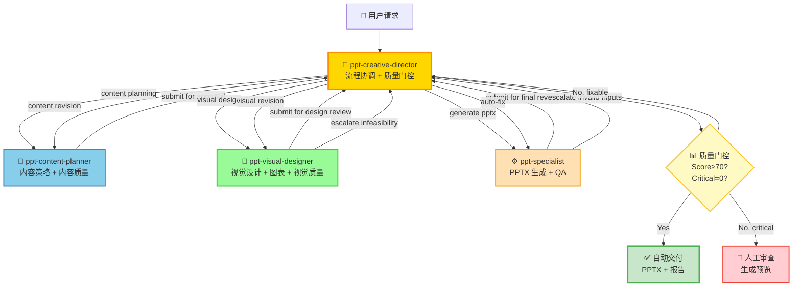

# PPT Agent Collaboration Protocol

**Purpose**: Define the collaboration workflow, iteration limits, and quality gates for the PPT creation team to ensure efficient and high-quality presentation generation.

**Version**: 1.0  
**Last Updated**: 2026-01-28

---

## Overview

The PPT creation follows a **specialist-driven collaboration model** where each agent has a clear, focused responsibility, aligned to real-world creative industry workflows rather than software development patterns.

**Design Philosophy**:
- Visual designers handle both layouts and charts (like Apple Keynote team)
- Content strategists do self-QA on content quality (like McKinsey consultants)
- Creative directors coordinate and make final decisions (like IDEO/Pentagram)

---

## Team Structure (3-Agent Architecture)



**Key Design Decisions**:
- ✅ **3 core roles** (vs 5 in original): content-planner, visual-designer, creative-director
- ✅ **Chart integration**: chart-specialist → visual-designer (real designers handle both layout and charts)
- ✅ **Distributed QA**: qa-reviewer → content-planner (content QA) + visual-designer (visual QA) + creative-director (final gate)
- ✅ **Creative coordination**: tech-lead → creative-director (aligned to creative director role, not tech lead)

**Industry Alignment**:
| Agent             | Real-World Role                | Representative Companies/People                      |
| ----------------- | ------------------------------ | ---------------------------------------------------- |
| -------           | ----------------               | --------------------------------                     |
| content-planner   | Content Strategist             | McKinsey Consultants, Barbara Minto                  |
| visual-designer   | Visual Designer + Chart Expert | Apple Keynote, Edward Tufte, Cole Nussbaumer Knaflic |
| creative-director | Creative Director              | IDEO, Pentagram, Duarte Design                       |

---

## Agent Responsibilities

### ppt-content-planner

**Role**: Content Strategist (aligned to McKinsey, Barbara Minto)

**Deliverables**: `.slides.md` + `slides_semantic.json` + `content_qa_report.json`

**Input**: User request, design documents

**Output to**: `ppt-visual-designer`

**Core Responsibilities**:
- **Content Planning**: Slide count, story flow, bullet points
- **Structure Design**: Hierarchical SCQA (macro + section-level + transitions), Pyramid Principle
- **Visual Type Assignment**: Assign visual_type from 3-level taxonomy (10 basic + 8 analytical + 6 domain-specific)
- **KPI Traceability**: Define KPIs in Key Decisions, trace through evidence and summary slides
- **Timing & Pacing Analysis**: Validate slide count fits allocated time; flag dense sections
- **Cognitive Intent Annotation**: Annotate critical visuals with primary_message, emotional_tone, attention_flow, key_contrast
- **Domain Extension Packs**: Activate domain-specific decision extraction patterns (e.g., Power Electronics, Manufacturing, Standards)
- **Content Quality Self-Check**: Logic consistency, Key Decisions completeness, bullet compliance, KPI traceability, timing feasibility

**Key Decisions**:
- Slide count and story flow
- Which slides need visualizations (with specific visual_type from taxonomy)
- Key Decisions placement (first 3-5 slides)
- Bullet points and text density (content level)
- KPI definition and traceability mapping
- Domain extension pack activation

**Quality Ownership**: Content quality (40/100 points)

**Referenced Standards**:
- `agents/ppt-content-planner.agent.md`
- Barbara Minto - *The Pyramid Principle*
- McKinsey - MECE Framework

---

### ppt-visual-designer

**Role**: Visual Designer + Chart Specialist (aligned to Apple Keynote, Edward Tufte, Cole Nussbaumer Knaflic)

**Deliverables**: 
- `.slides.md` (with theme + layouts + chart configs)
- PNG chart files

**Input**: `ppt-content-planner` output

**Output to**: `skills/ppt-generator/bin/generate_pptx.py` (pre-built renderer, ~1477 lines)

**Core Responsibilities**:
- **Visual Design**: Theme, colors, typography, layouts
- **Chart Design**: All 3 taxonomy levels — Basic (bar, line, pie, flowchart...), Analytical (waterfall, tornado, radar, sankey, bubble, treemap, pareto, funnel), Domain-Specific (engineering_schematic, kpi_dashboard, decision_tree, confidence_band, process_control)
- **Cognitive Intent Consumption**: Translate content-planner's cognitive_intent (emotional_tone, attention_flow, key_contrast) into Material Design tokens and visual specifications
- **Visual Quality Self-Check**: Contrast, aesthetic consistency, chart readability

**Key Decisions**:
- Design philosophy selection (Assertion-Evidence, Tufte, McKinsey Pyramid, etc.)
- Color scheme (primary, secondary, accent)
- Typography (fonts, sizes)
- Chart type selection and visual encoding (across 3-level taxonomy)
- Layout templates (title-only, bullet-list, two-column, full-image)
- Cognitive intent translation to design tokens

**Quality Ownership**: Visual quality (40/100 points)

**Integrated Capabilities**:
- Original visual-designer capabilities
- Original chart-specialist chart design
- Original qa-reviewer visual quality checks

**Referenced Standards**:
- `agents/ppt-visual-designer.agent.md`
- `skills/ppt-visual.skill.md`
- `skills/ppt-chart.skill.md`
- Edward Tufte - *The Visual Display of Quantitative Information*
- Cole Nussbaumer Knaflic - *Storytelling with Data*
- Cleveland Perception Hierarchy

---

### ppt-creative-director

**Role**: Creative Director (aligned to IDEO, Pentagram, Duarte Design)

**Core Responsibilities**:
- **Process Orchestration**: Coordinate content-planner ↔ visual-designer
- **Requirements Understanding**: Identify presentation_type, audience, tone
- **Quality Gating**: Comprehensive scoring (content 40 + visual 40 + overall 20)
- **Decision Making**: Auto-deliver vs Auto-fix vs Human-review
- **Final Review**: Approval before delivery

**Input**: All agent outputs + generated PPTX

**Deliverables**: 
- Final PPTX file
- quality_report.json

**Decision Framework**:
- ✅ **Auto-deliver**: Score≥70 AND Critical=0
- 🔧 **Auto-fix**: Score<70 AND Critical=0 AND fixable AND iter<2
- 👤 **Human-review**: Critical>0 OR Score<50 OR iter>2

**Quality Ownership**: Overall quality (20/100 points) + final gate

**Authority**: Final decision maker (but doesn't micromanage)

**Referenced Standards**:
- `agents/ppt-creative-director.agent.md`
- Nancy Duarte - *Slide:ology*
- Guy Kawasaki - 10/20/30 Rule

---

## Workflow Steps

### 1. Content Planning (CD → CP → CD)

```yaml
trigger: ppt-creative-director sends "content planning" handoff
agent: ppt-content-planner
input: [user_request, source_md, presentation_type]
output: slides.md + slides_semantic.json + content_qa_report.json
return_to: ppt-creative-director via "submit for approval" handoff
self_check: content_quality
success_criteria:
  - Key Decisions identified
  - Slide count within limits
  - Visual needs marked
  - Logical structure (Pyramid Principle)
  - Bullets within limits
  - slides_semantic.json completeness = 100%
  - KPI traceability ≥ 80%
```

### 1.5. Content Strategy Review (CD gate)

```yaml
agent: ppt-creative-director
input: slides.md + slides_semantic.json + content_qa_report.json
action: Review against Content Strategy Review Checklist
outcomes:
  approve: proceed to step 2
  reject: send "content revision" handoff back to ppt-content-planner
```

### 2. Visual Design (CD → VD → CD)

```yaml
trigger: ppt-creative-director sends "visual design" handoff
agent: ppt-visual-designer
input: slides_semantic.json (approved by CD)
output: design_spec.json + visual_report.json + diagram PNGs
return_to: ppt-creative-director via "submit for design review" handoff
self_check: visual_quality
success_criteria:
  - Theme applied (colors, fonts)
  - Layout templates defined
  - Design philosophy selected
  - All required diagrams configured
  - Visual style consistent
  - Color contrast ≥4.5:1
  - High-resolution output (200 DPI)
  - Cognitive intent consumed
```

### 2.5. Visual Design Review (CD gate)

```yaml
agent: ppt-creative-director
input: design_spec.json + visual_report.json
action: Review visual direction, brand compliance, WCAG contrast
outcomes:
  approve: proceed to step 3
  reject: send "visual revision" handoff back to ppt-visual-designer
```

### 3. PPTX Generation & QA (CD → PS → CD)

```yaml
trigger: ppt-creative-director sends "generate pptx" handoff
agent: ppt-specialist
input: slides.md + slides_semantic.json + design_spec.json
output: *.pptx + qa_report.json
return_to: ppt-creative-director via "submit for final review" handoff
depends_on: [2.5_visual_review_approved]
```

### 4. Final Review & Decision (CD gate)

```yaml
agent: ppt-creative-director
input: [*.pptx, qa_report.json, visual_report.json, slides_semantic.json]
evaluation:
  - content_score: 40 points
  - visual_score: 40 points
  - overall_score: 20 points
success_criteria:
  - Final Score ≥ 70
  - Critical issues = 0
  - Key Decisions present in first 5 slides
```

### 5. Delivery Decision

```yaml
agent: ppt-creative-director
condition: final_score ≥ 70 AND critical_issues == 0
actions:
  auto_deliver: 
    trigger: passed AND key_decisions_present AND kpi_traceability ≥ 80%
    output: [*.pptx, qa_report.json, visual_report.json, slides_semantic.json]
  auto_fix:
    trigger: not_passed AND fixable AND iter < 2
    handoff: "auto-fix" → ppt-specialist (then return to step 4)
  human_review:
    trigger: critical > 0 OR score < 50 OR iter > 2
    output: [preview.pptx, qa_report.json, review notes]
```

---

## Iteration Limits

### Rule 1: Maximum Iterations = 2

Any feedback loop between two agents is limited to **2 iterations**.

| Interaction                                | Max Iterations  | Escalation                    |
| ------------------------------------------ | --------------- | ----------------------------- |
| -------------                              | --------------- | -----------                   |
| content-planner ↔ visual-designer          | 2               | creative-director arbitration |
| creative-director → auto-fix → re-evaluate | 2               | human-review required         |

### Rule 2: Iteration Counting

```text
Iteration 1: content-planner → visual-designer (initial submission)
Iteration 2: visual-designer → content-planner (feedback / change request)
Iteration 3: ❌ Exceeded - escalate to creative-director
```

### Rule 3: Iteration Tracking Template

Every feedback message MUST include the iteration count:

```markdown
## Feedback (Iteration 1/2)

**From**: @ppt-visual-designer
**To**: @ppt-content-planner
**Remaining Iterations**: 1

**Issue**: Slide 4 has 8 bullets, exceeds limit of 5 for technical-review

**Request**: Split Slide 4 into two slides or convert to visual diagram

**Reason**: presentation_type = technical-review requires max_bullets = 5
           Visual diagram more effective for complex comparisons

---
⚠️ Note: If not resolved, next iteration escalates to @ppt-creative-director
```

---

## Quality Gates

### Content Quality (Self-Check by ppt-content-planner)

- ✅ Key Decisions in first 3-5 slides (with KPIs defined)
- ✅ Bullet points ≤ max_bullets (per presentation_type)
- ✅ Text density ≤ max_chars (per slide)
- ✅ Speaker notes coverage ≥ 80%
- ✅ Logical structure (Hierarchical SCQA + Pyramid Principle)
- ✅ KPI traceability ≥ 80% (all defined KPIs traced through evidence slides)
- ✅ Timing feasibility (avg ≤1.5 min/slide; no section >2× average)
- ✅ slides_semantic.json completeness (100% slide coverage)
- ✅ Cognitive intent on ≥3 critical visuals
- ✅ Domain extension packs activated appropriately

### Visual Quality (Self-Check by ppt-visual-designer)

- ✅ Color contrast ratio ≥ 4.5:1 (WCAG AA)
- ✅ Visual coverage ≥ 30% (charts/images)
- ✅ Aesthetic consistency (same theme)
- ✅ Chart quality (Cleveland Hierarchy) across all 3 taxonomy levels
- ✅ Layout balance (white space)
- ✅ Cognitive intent consumed (emotional_tone → design tokens applied)
- ✅ Level 2/3 visual types rendered correctly

### Overall Quality (Final Gate by ppt-creative-director)

**Blocking Conditions** (prevent delivery):
- ❌ Final Score < 70
- ❌ Critical issues > 0
- ❌ Key Decisions missing
- ❌ slides_semantic.json missing or empty
- ❌ KPI defined in Key Decisions but never referenced in evidence slides

**Warning Conditions** (deliver with notes):
- ⚠️ Major issues > 2
- ⚠️ Visual coverage < 30%
- ⚠️ KPI traceability < 80%
- ⚠️ Timing feasibility = warning (sections pacing > 1.5× average)
- ⚠️ Cognitive intent missing on >50% of critical visuals

---

## Evaluation Formula

```python
# Content Quality (40分)
content_score = 40 * (
    0.20 * key_decisions_score +      # 关键决策 8分
    0.20 * bullets_compliance +        # bullets规范 8分
    0.15 * speaker_notes_coverage +    # speaker notes 6分
    0.10 * text_density_compliance +   # 文本密度 4分
    0.15 * kpi_traceability +          # KPI 可追溯性 6分 (NEW)
    0.10 * timing_feasibility +        # 时间/节奏 4分 (NEW)
    0.10 * semantic_json_completeness  # slides_semantic.json 完整性 4分 (NEW)
)

# Visual Quality (40分)
visual_score = 40 * (
    0.25 * color_contrast +            # 对比度 10分
    0.25 * visual_coverage +           # 可视化覆盖 10分
    0.15 * aesthetic_consistency +     # 美学一致性 6分
    0.15 * chart_quality +             # 图表质量 6分
    0.10 * cognitive_intent_applied +  # 认知意图消费 4分 (NEW)
    0.10 * visual_type_diversity       # 视觉类型多样性 4分 (NEW)
)

# Overall Quality (20分)
overall_score = 20 * (
    0.4 * slide_count_compliance +     # 页数 8分
    0.3 * design_philosophy_match +    # 哲学符合 6分
    0.3 * domain_pack_appropriateness  # 领域包适当性 6分 (NEW)
)

final_score = content_score + visual_score + overall_score
passed = (final_score >= 70) and (critical_issues == 0)
```

---

## Success Metrics

Target KPIs for PPT generation workflow:

- ✅ End-to-end automation rate ≥80%
- ✅ Average generation time <60 seconds
- ✅ Quality score ≥70 in 90% of cases
- ✅ Human intervention rate <20%
- ✅ Agent iteration overruns <5%
- ✅ Content-planner self-check pass rate ≥95%
- ✅ Visual-designer self-check pass rate ≥88%

---

## Anti-patterns

### ❌ Anti-pattern 1: Iteration Overflow

```text
content-planner → visual-designer → content-planner → visual-designer → ...
```

**Problem**: No iteration limit leads to never-ending cycles

**Correct approach**: Escalate to creative-director after 2 iterations

### ❌ Anti-pattern 2: Skipping Self-Check

```text
content-planner → visual-designer (without content quality check)
```

**Problem**: Low-quality content flows downstream, wasting visual-designer time

**Correct approach**: Always run self-check before submitting to next agent

### ❌ Anti-pattern 3: Micromanagement by Creative Director

```text
creative-director: "Change bullet 3 on slide 5 to use different wording"
```

**Problem**: Violates "orchestrate, don't micromanage" principle

**Correct approach**: Provide feedback through proper agent (e.g., ask content-planner to revise)

### ❌ Anti-pattern 4: Ignoring Quality Gates

```text
Final score = 65, Critical = 1
Action: Auto-deliver ❌
```

**Problem**: Delivering low-quality PPT damages reputation

**Correct approach**: Trigger human-review when gates fail

---

## Degraded Output Strategies

When user input is incomplete, employ graceful degradation:

### Strategy 1: Assumptions with Placeholders

```markdown
## Degraded Output Declaration

**Reason**: User did not specify target audience

**Assumptions Made**:
- Audience: Technical team (default for design docs)
- Presentation type: technical-review
- Tone: Professional

**Placeholders**:
- Slide 1: [Company Logo] - replace with actual logo
- Slide 15: [Contact Info] - replace with actual contact

⚠️ **User**: Please confirm assumptions or provide corrections
```

### Strategy 2: Minimal Viable PPT

```markdown
## MVP Delivery

Due to incomplete input, delivering minimal viable version:

### Phase 1: Completed ✅
- Core content structure (10 slides)
- Key Decisions slide
- Basic theme applied

### Phase 2: Pending User Input ⏳
- Custom branding (logo, colors)
- Detailed speaker notes
- Custom charts (need data)

**Required from User**:
- [ ] Company branding guidelines
- [ ] Detailed data for charts
- [ ] Speaker notes content
```

---

## Escalation to Human Review

### Automatic Triggers

1. **Critical Issues**: Any critical issue detected
2. **Low Quality**: Final score < 50
3. **Iteration Overflow**: Iterations > 2
4. **Generation Failures**: Chart generation fails >50%
5. **User Request**: User explicitly requests review

### Review Request Format

```markdown
@human-reviewer – PPT review requested

## Reason for Escalation
- [X] Critical issues detected
- [ ] Quality score below threshold
- [ ] Iteration limit exceeded
- [ ] Generation failures

## Summary
- Project: online-ps-algorithm-v1.md → PPT
- Slides Generated: 15
- Quality Score: 48/100 ⚠️
- Critical Issues: 2

## Issues Detected

### Critical (2)
1. Slide 3: Key Decision missing (required in first 5 slides)
2. Slide 8: Color contrast ratio 2.1:1 (requires ≥4.5:1)

### Major (4)
1. Slide 4: 8 bullets (limit: 5)
2. Slide 6: Text density 450 chars (limit: 300)
3. ...

## Deliverables
- preview.pptx (attached)
- quality_report.json (attached)
- slides.md (source)

## Recommendation
Fix critical issues manually or adjust design requirements
```

---

## Version History

| Version  | Date       | Changes                                                                                                                                                                                                                                                                                |
| -------- | ---------- | -------------------------------------------------------------------------------------------------------------------------------------------------------------------------------------------------------------------------------------------------------------------------------------- |
| -------- | ------     | ---------                                                                                                                                                                                                                                                                              |
| 2.0      | 2026-02-05 | Domain-agnostic upgrade<br/>- Added slides_semantic.json to content-planner deliverables<br/>- Added hierarchical SCQA, KPI traceability, timing/pacing, cognitive intent<br/>- Expanded visual type taxonomy (10→24 types across 3 levels)<br/>- Updated evaluation formula with new dimensions (KPI traceability, timing, cognitive intent, visual diversity, domain pack)<br/>- Added blocking conditions: slides_semantic.json missing, KPI inconsistency<br/>- Updated visual-designer to consume cognitive_intent<br/>- Updated quality gates with KPI and timing checks |
| 1.0      | 2026-01-28 | Initial release (3-agent architecture)<br/>- Established content-planner, visual-designer, creative-director roles<br/>- Defined quality gates and evaluation formula<br/>- Set iteration limits (2) and escalation rules<br/>- Separated from general agent-collaboration-protocol.md |
