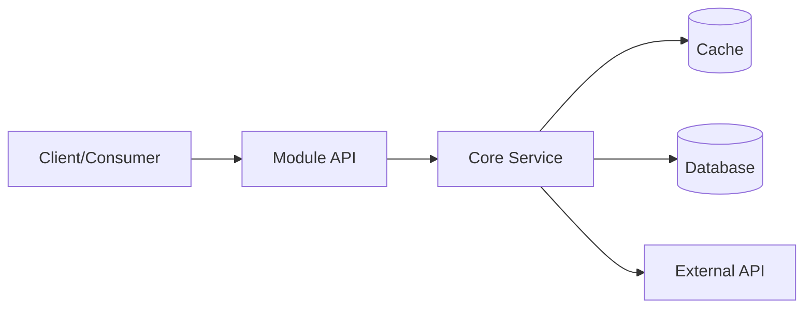

# [Module Name] Design Document

**Author**: [Your Name]  
**Date**: [YYYY-MM-DD]  
**Status**: Draft | In Review | Approved  
**Reviewers**: @go-architect, @go-api-designer

---

## 1. Context and Scope

### 1.1 Problem Statement

**What problem are we solving?**

[Describe the specific problem this module addresses. Be concrete and specific.]

**Why is this important?**

[Explain the business or technical value. What happens if we don't solve this?]

### 1.2 Target Users

**Who will use this module?**

- [ ] Internal services (which ones?)
- [ ] External API consumers
- [ ] CLI tools
- [ ] Other: [specify]

### 1.3 System Boundary

**What systems will this module interact with?**

- **Upstream dependencies**: [List services/databases/APIs this module calls]
- **Downstream consumers**: [List services/components that will call this module]

### 1.4 Out of Scope

**What will NOT be included in this design?**

- [Explicitly list features or use cases that are out of scope]
- [This helps prevent scope creep]

---

## 2. Goals and Non-Goals

### 2.1 Goals

**What are the measurable success criteria?**

- [ ] Goal 1: [e.g., Support 1000 requests per second with p95 latency < 100ms]
- [ ] Goal 2: [e.g., Reduce error rate from 5% to < 0.1%]
- [ ] Goal 3: [e.g., Enable feature X for 100% of users by Q2]

### 2.2 Non-Goals

**What are we explicitly NOT trying to achieve?**

- [e.g., NOT supporting protocol Y (will be added in v2)]
- [e.g., NOT optimizing for batch processing (focus is on real-time)]

---

## 3. Design Overview

### 3.1 Architecture Diagram

**High-level component view:**



### 3.2 Component Responsibilities

| Component        | Responsibility                         | Technology          |
| ---------------- | -------------------------------------- | ------------------- |
| ---------------- | -------------------------------------- | ------------------  |
| API Layer        | HTTP/gRPC handlers, request validation | net/http, grpc-go   |
| Service Layer    | Business logic, orchestration          | Go stdlib           |
| Repository Layer | Data access, caching                   | database/sql, redis |
| Client Layer     | External API integration               | net/http            |

### 3.3 Technology Stack

- **Go Version**: 1.21+ (or specify minimum version)
- **Framework**: net/http, grpc-go, or framework name
- **Database**: PostgreSQL, MySQL, or NoSQL option
- **Cache**: Redis, in-memory, or none
- **Messaging**: NATS, Kafka, RabbitMQ, or none
- **Observability**: OpenTelemetry, Prometheus, Grafana

---

## 4. API Design Guidelines

### 4.1 Error Handling Strategy

**How will errors be communicated to callers?**

- **Domain Errors** (business logic failures):
  - Return custom error types (e.g., `ErrUserNotFound`, `ErrInvalidInput`)
  - Wrapped errors with context: `fmt.Errorf("validate user: %w", err)`
  - HTTP: Map to appropriate status codes (400, 404, 409)

- **Infrastructure Errors** (system failures):
  - Return sentinel errors or wrapped errors
  - Examples: `ErrDatabaseUnavailable`, `ErrTimeout`
  - HTTP: Map to 500 or 503

- **Error Response Format** (for HTTP APIs):

  ```json
  {
    "error": {
      "code": "USER_NOT_FOUND",
      "message": "User with ID 123 not found",
      "details": {}
    }
  }
  ```

### 4.2 API Versioning Strategy

**How will we handle breaking changes?**

- [ ] URL versioning (e.g., `/api/v1/users`, `/api/v2/users`)
- [ ] Package versioning (e.g., `github.com/org/repo/v2`)
- [ ] Header versioning (e.g., `Accept: application/vnd.api+json; version=1`)

**Recommendation**: Use Go module versioning (v2, v3) for major versions.

### 4.3 Authentication/Authorization Strategy

**How will callers authenticate?**

- [ ] API Key (via header or query parameter)
- [ ] JWT (JSON Web Token)
- [ ] mTLS (mutual TLS)
- [ ] OAuth 2.0
- [ ] None (internal-only service)

### 4.4 API Overview

**What are the main operations?** (High-level only; detailed signatures in Section 10)

- `GetUserByID(ctx context.Context, id string) (*User, error)`: Retrieve user by ID
- `CreateUser(ctx context.Context, user *User) error`: Create a new user
- `UpdateUser(ctx context.Context, user *User) error`: Update existing user
- `DeleteUser(ctx context.Context, id string) error`: Delete user by ID

---

## 5. Data Model Overview

### 5.1 Key Entities

**What are the main domain objects?**

- **User**: Represents a system user
- **Subscription**: Represents a user subscription
- **Order**: Represents a purchase order

**Entity Relationships**:

- User has many Subscriptions (1:N)
- Subscription belongs to User (N:1)
- Order references User and Subscription (N:1, N:1)

**Note**: Detailed field definitions are in Section 11.

---

## 6. Concurrency Requirements Overview

### 6.1 Performance Targets

**What are the expected throughput and latency?**

- **Expected QPS**: 1000 requests per second (average), 2000 (peak)
- **Response Time**:
  - p50 < 50ms
  - p95 < 100ms
  - p99 < 200ms

### 6.2 Concurrency Strategy

**Which components need to be goroutine-safe?**

| Component       | Goroutine-Safe? | Strategy                                    |
| --------------- | --------------- | ------------------------------------------- |
| --------------- | --------------- | ------------------------------------------- |
| UserService     | Yes             | Stateless (no shared mutable state)         |
| ConfigLoader    | Yes             | Immutable after initialization              |
| Cache           | Yes             | Use sync.Map or third-party concurrent map  |
| PeriodicChecker | No              | Single goroutine only                       |

**Note**: Detailed concurrency contracts are in Section 12.

---

## 7. Cross-Cutting Concerns

### 7.1 Observability

**Logging Strategy**:

- Use structured logging (e.g., `log/slog` or `zap`)
- Log levels: DEBUG, INFO, WARN, ERROR
- Include correlation IDs for request tracing

**Metrics**:

- Request count, latency, error rate
- Resource usage (memory, goroutines)
- Use Prometheus format

**Tracing**:

- OpenTelemetry for distributed tracing
- Trace all external calls (DB, HTTP, gRPC)

### 7.2 Security

**Threat Model**:

- Input validation (prevent injection attacks)
- Rate limiting (prevent abuse)
- Authentication/Authorization (see Section 4.3)

**Mitigation**:

- Validate all inputs with strong typing
- Use prepared statements for SQL
- Implement rate limiting at API gateway or service level

### 7.3 Reliability

**Error Handling**:

- All errors must be checked and handled
- Use exponential backoff for retries
- Circuit breaker for external dependencies

**Retry Strategy**:

- Idempotent operations: retry up to 3 times
- Non-idempotent operations: no retry (or use idempotency keys)

---

## 8. Implementation Constraints

### 8.1 Framework Constraints

**Must use**:

- Go standard library for HTTP (net/http) or specify framework
- database/sql with appropriate driver
- context.Context for cancellation and timeout

**Must NOT use**:

- Reflection for performance-critical paths
- Global mutable state
- Goroutine leaks (always ensure cleanup)

### 8.2 Coding Standards

**Must follow**:

- Effective Go conventions
- Go Code Review Comments
- gofmt formatting (enforced by CI)
- All exported items must have godoc comments

---

## 9. Alternatives Considered

### Alternative 1: [Option Name]

**Description**: [Brief description of alternative approach]

**Pros**:

- [Advantage 1]
- [Advantage 2]

**Cons**:

- [Disadvantage 1]
- [Disadvantage 2]

**Decision**: Rejected because [specific reason].

### Alternative 2: [Option Name]

**Description**: [Brief description of alternative approach]

**Pros**:

- [Advantage 1]

**Cons**:

- [Disadvantage 1]

**Decision**: Rejected because [specific reason].

---

## 10. API Specification (Detailed)

### 10.1 Interface Definitions

**Complete Go interface definitions with godoc comments:**

```go
package user

import "context"

// UserService provides user management operations.
// Implementations must be safe for concurrent use by multiple goroutines.
type UserService interface {
    // GetUserByID retrieves a user by their unique identifier.
    //
    // Parameters:
    //   - ctx: Context for cancellation and timeout
    //   - id: User ID (must be non-empty UUID)
    //
    // Returns:
    //   - *User: User object if found, nil if not found (check error)
    //   - error: ErrUserNotFound if user doesn't exist, ErrInvalidInput if id is invalid,
    //            or infrastructure error (e.g., ErrDatabaseUnavailable)
    //
    // Goroutine-safety: Yes (stateless implementation)
    // Idempotent: Yes
    GetUserByID(ctx context.Context, id string) (*User, error)

    // CreateUser creates a new user.
    //
    // Parameters:
    //   - ctx: Context for cancellation and timeout
    //   - user: User object to create (ID will be auto-generated if empty)
    //
    // Returns:
    //   - error: ErrDuplicateUser if user already exists, ErrInvalidInput if validation fails,
    //            or infrastructure error
    //
    // Goroutine-safety: Yes
    // Idempotent: No (use idempotency key if retry is needed)
    CreateUser(ctx context.Context, user *User) error

    // UpdateUser updates an existing user.
    //
    // Parameters:
    //   - ctx: Context for cancellation and timeout
    //   - user: User object with updated fields
    //
    // Returns:
    //   - error: ErrUserNotFound if user doesn't exist, ErrInvalidInput if validation fails,
    //            or infrastructure error
    //
    // Goroutine-safety: Yes
    // Idempotent: Yes
    UpdateUser(ctx context.Context, user *User) error
}
```

### 10.2 Design Rationale

#### 10.2.1 Contract Precision

**Contract Table** (defines exact behavior for all scenarios):

| Scenario       | Input           | Return Value | Error                                                  | HTTP Status | Retry?   | Pattern          |
| -------------- | --------------- | ------------ | ------------------------------------------------------ | ----------- | -------- | ---------------- |
| -------------- | --------------- | ------------ | ------------------------------------------------------ | ----------- | -------- | ---------------- |
| Success        | Valid ID        | *User        | nil                                                    | 200         | No       | -                |
| Not Found      | Valid ID        | nil          | ErrUserNotFound                                        | 404         | No       | Sentinel error   |
| Invalid ID     | Empty/malformed | nil          | ErrInvalidInput                                        | 400         | No       | Validation error |
| DB Timeout     | Valid ID        | nil          | fmt.Errorf("db timeout: %w", context.DeadlineExceeded) | 503         | Yes (3x) | Wrapped error    |
| DB Unavailable | Valid ID        | nil          | ErrDatabaseUnavailable                                 | 503         | Yes (3x) | Sentinel error   |

**Error Types** (defined as package-level sentinels):

```go
var (
    ErrUserNotFound         = errors.New("user not found")
    ErrDuplicateUser        = errors.New("user already exists")
    ErrInvalidInput         = errors.New("invalid input")
    ErrDatabaseUnavailable  = errors.New("database unavailable")
)
```

#### 10.2.2 Caller Guidance (Executable Code Example)

**Complete example showing error handling, retries, logging, and metrics:**

```go
package main

import (
    "context"
    "errors"
    "fmt"
    "log/slog"
    "time"

    "github.com/org/repo/user"
)

// GetUserWithRetry demonstrates proper usage of UserService.GetUserByID
// with error handling, retries, logging, and metrics.
func GetUserWithRetry(ctx context.Context, svc user.UserService, userID string) (*user.User, error) {
    logger := slog.Default()
    
    // Input validation
    if userID == "" {
        logger.Warn("invalid user ID", "id", userID)
        return nil, user.ErrInvalidInput
    }
    
    // Retry configuration
    const (
        maxRetries     = 3
        initialDelay   = 100 * time.Millisecond
        backoffFactor  = 2.0
    )
    
    var lastErr error
    delay := initialDelay
    
    for attempt := 0; attempt <= maxRetries; attempt++ {
        // Add timeout to context (5 seconds per attempt)
        attemptCtx, cancel := context.WithTimeout(ctx, 5*time.Second)
        
        u, err := svc.GetUserByID(attemptCtx, userID)
        cancel()
        
        if err == nil {
            // Success
            logger.Info("user retrieved", "user_id", userID, "attempt", attempt+1)
            return u, nil
        }
        
        lastErr = err
        
        // Check error type to decide retry strategy
        if errors.Is(err, user.ErrUserNotFound) || errors.Is(err, user.ErrInvalidInput) {
            // Business errors: do NOT retry
            logger.Warn("user operation failed", "error", err, "user_id", userID)
            return nil, err
        }
        
        // Infrastructure errors: retry with backoff
        if errors.Is(err, user.ErrDatabaseUnavailable) || errors.Is(err, context.DeadlineExceeded) {
            if attempt < maxRetries {
                logger.Warn("retrying after error",
                    "error", err,
                    "user_id", userID,
                    "attempt", attempt+1,
                    "next_delay_ms", delay.Milliseconds())
                
                // Exponential backoff
                time.Sleep(delay)
                delay = time.Duration(float64(delay) * backoffFactor)
                continue
            }
        }
        
        // Unknown error or max retries exceeded
        logger.Error("user operation failed after retries",
            "error", err,
            "user_id", userID,
            "attempts", attempt+1)
        return nil, fmt.Errorf("get user failed after %d attempts: %w", attempt+1, err)
    }
    
    return nil, fmt.Errorf("get user failed: %w", lastErr)
}

// HTTP handler example with status code mapping
func handleGetUser(w http.ResponseWriter, r *http.Request) {
    userID := r.URL.Query().Get("id")
    
    u, err := GetUserWithRetry(r.Context(), userService, userID)
    if err != nil {
        // Map errors to HTTP status codes
        switch {
        case errors.Is(err, user.ErrUserNotFound):
            http.Error(w, `{"error":"user not found"}`, http.StatusNotFound)
        case errors.Is(err, user.ErrInvalidInput):
            http.Error(w, `{"error":"invalid user ID"}`, http.StatusBadRequest)
        case errors.Is(err, user.ErrDatabaseUnavailable):
            http.Error(w, `{"error":"service unavailable"}`, http.StatusServiceUnavailable)
        default:
            http.Error(w, `{"error":"internal server error"}`, http.StatusInternalServerError)
        }
        return
    }
    
    // Success: return user as JSON
    w.Header().Set("Content-Type", "application/json")
    json.NewEncoder(w).Encode(u)
}
```

#### 10.2.3 Rationale

**Why this design was chosen:**

- **Error handling**: Uses sentinel errors for clarity and errors.Is for checking
- **Context**: All methods accept context.Context for cancellation and timeout
- **Retry strategy**: Exponential backoff for infrastructure errors, no retry for business errors
- **Goroutine-safety**: Stateless service design avoids synchronization overhead

**Trade-offs**:

- Chose sentinel errors over custom error types for simplicity (can add error types later if needed)
- Chose stateless service to maximize concurrency (no locks needed)
- Chose context.Context for cancellation (slight overhead but standard practice)

#### 10.2.4 Alternatives Considered

##### Alternative 1: Return (User, bool) instead of (User, error)

**Pros**: Simpler for "not found" case  
**Cons**: Cannot distinguish between "not found" and infrastructure failures  
**Decision**: Rejected; need detailed error information for proper handling

##### Alternative 2: Use custom error types with methods

**Pros**: More structured error handling  
**Cons**: More complex; sentinel errors are sufficient for this use case  
**Decision**: Deferred; will revisit if error handling becomes more complex

### 10.3 Dependency Interfaces

**External dependencies that this module requires:**

```go
package user

import "context"

// UserRepository provides data access for user persistence.
// Implementations must be safe for concurrent use.
type UserRepository interface {
    // FindByID retrieves a user by ID from the data store.
    //
    // Returns:
    //   - *User: User object if found, nil if not found
    //   - error: ErrUserNotFound if not found, or infrastructure error
    //
    // Goroutine-safety: Yes
    FindByID(ctx context.Context, id string) (*User, error)

    // Save persists a user to the data store.
    // If user.ID is empty, a new ID will be generated.
    //
    // Returns:
    //   - error: ErrDuplicateUser if user already exists, or infrastructure error
    //
    // Goroutine-safety: Yes
    Save(ctx context.Context, user *User) error

    // Update modifies an existing user in the data store.
    //
    // Returns:
    //   - error: ErrUserNotFound if user doesn't exist, or infrastructure error
    //
    // Goroutine-safety: Yes
    Update(ctx context.Context, user *User) error
}
```

---

## 11. Data Model (Detailed)

### 11.1 User Entity

```go
package user

import "time"

// User represents a system user.
type User struct {
    // ID is the unique identifier (UUID v4).
    // Required for updates, auto-generated for creates.
    ID string `json:"id" db:"id"`

    // Email is the user's email address.
    // Required, must be valid email format, max 255 chars.
    Email string `json:"email" db:"email"`

    // Name is the user's display name.
    // Optional, max 100 chars.
    Name string `json:"name" db:"name"`

    // Status is the user's account status.
    // Valid values: "active", "inactive", "suspended".
    // Default: "active".
    Status string `json:"status" db:"status"`

    // CreatedAt is the timestamp when the user was created.
    // Auto-set on creation, immutable.
    CreatedAt time.Time `json:"created_at" db:"created_at"`

    // UpdatedAt is the timestamp when the user was last updated.
    // Auto-updated on modification.
    UpdatedAt time.Time `json:"updated_at" db:"updated_at"`
}

// Validate checks if the User struct has valid field values.
//
// Returns:
//   - error: ErrInvalidInput with details if validation fails, nil if valid
func (u *User) Validate() error {
    if u.Email == "" {
        return fmt.Errorf("%w: email is required", ErrInvalidInput)
    }
    if len(u.Email) > 255 {
        return fmt.Errorf("%w: email too long (max 255 chars)", ErrInvalidInput)
    }
    if len(u.Name) > 100 {
        return fmt.Errorf("%w: name too long (max 100 chars)", ErrInvalidInput)
    }
    if u.Status != "" && u.Status != "active" && u.Status != "inactive" && u.Status != "suspended" {
        return fmt.Errorf("%w: invalid status (must be active, inactive, or suspended)", ErrInvalidInput)
    }
    return nil
}
```

### 11.2 Database Schema

**PostgreSQL table definition:**

```sql
CREATE TABLE users (
    id UUID PRIMARY KEY DEFAULT gen_random_uuid(),
    email VARCHAR(255) NOT NULL UNIQUE,
    name VARCHAR(100),
    status VARCHAR(20) NOT NULL DEFAULT 'active',
    created_at TIMESTAMP NOT NULL DEFAULT NOW(),
    updated_at TIMESTAMP NOT NULL DEFAULT NOW()
);

CREATE INDEX idx_users_email ON users(email);
CREATE INDEX idx_users_status ON users(status);
```

---

## 12. Concurrency Requirements (Detailed)

### 12.1 Goroutine-Safety Contracts

**Per-method concurrency requirements:**

| Method      | Goroutine-Safe? | Expected QPS | Response Time Target | Synchronization Strategy           |
| ----------- | --------------- | ------------ | -------------------- | ---------------------------------- |
| ----------- | --------------- | ------------ | -------------------- | ---------------------------------- |
| GetUserByID | Yes             | 500          | p95 < 100ms          | Stateless (no sync needed)         |
| CreateUser  | Yes             | 50           | p95 < 200ms          | Stateless (DB handles concurrency) |
| UpdateUser  | Yes             | 100          | p95 < 150ms          | Stateless (DB handles concurrency) |

### 12.2 Concurrency Strategy

**Design Pattern**: Stateless service

**Why stateless?**

- No shared mutable state
- Each request is independent
- No synchronization overhead
- Horizontally scalable

**Implementation Notes**:

- UserService implementation has no instance fields (or only read-only fields set at initialization)
- All state is in the database or cache (which handle their own concurrency)
- Use connection pooling for database (configured in repository layer)

### 12.3 Connection Pooling

**Database connection pool configuration:**

```go
db.SetMaxOpenConns(25)     // Max open connections
db.SetMaxIdleConns(10)     // Max idle connections
db.SetConnMaxLifetime(5 * time.Minute)
db.SetConnMaxIdleTime(1 * time.Minute)
```

**Rationale**: 25 connections can support ~500 QPS at 50ms avg query time

---

## 13. Testing Strategy

### 13.1 Unit Tests

**Coverage Target**: Minimum 80% for business logic

**Test Structure**: Use table-driven tests with subtests

```go
func TestUserService_GetUserByID(t *testing.T) {
    tests := []struct {
        name       string
        userID     string
        setupMock  func(*MockUserRepository)
        wantUser   *User
        wantErr    error
    }{
        {
            name:   "success",
            userID: "123e4567-e89b-12d3-a456-426614174000",
            setupMock: func(m *MockUserRepository) {
                m.On("FindByID", mock.Anything, "123e4567-e89b-12d3-a456-426614174000").
                    Return(&User{ID: "123e4567-e89b-12d3-a456-426614174000", Email: "test@example.com"}, nil)
            },
            wantUser: &User{ID: "123e4567-e89b-12d3-a456-426614174000", Email: "test@example.com"},
            wantErr:  nil,
        },
        {
            name:   "not found",
            userID: "nonexistent",
            setupMock: func(m *MockUserRepository) {
                m.On("FindByID", mock.Anything, "nonexistent").
                    Return(nil, ErrUserNotFound)
            },
            wantUser: nil,
            wantErr:  ErrUserNotFound,
        },
        // ... more test cases
    }

    for _, tt := range tests {
        t.Run(tt.name, func(t *testing.T) {
            mockRepo := new(MockUserRepository)
            tt.setupMock(mockRepo)

            svc := NewUserService(mockRepo)
            got, err := svc.GetUserByID(context.Background(), tt.userID)

            if !errors.Is(err, tt.wantErr) {
                t.Errorf("GetUserByID() error = %v, wantErr %v", err, tt.wantErr)
                return
            }
            if !reflect.DeepEqual(got, tt.wantUser) {
                t.Errorf("GetUserByID() got = %v, want %v", got, tt.wantUser)
            }

            mockRepo.AssertExpectations(t)
        })
    }
}
```

### 13.2 Integration Tests

**Scope**: Test with real database (use testcontainers for PostgreSQL)

**Example**:

```go
func TestUserRepository_Integration(t *testing.T) {
    if testing.Short() {
        t.Skip("skipping integration test")
    }

    // Setup test database using testcontainers
    ctx := context.Background()
    container, err := postgres.RunContainer(ctx)
    if err != nil {
        t.Fatal(err)
    }
    defer container.Terminate(ctx)

    // Run migrations
    // ... setup code ...

    repo := NewUserRepository(db)

    t.Run("create and retrieve user", func(t *testing.T) {
        user := &User{Email: "test@example.com", Name: "Test User"}
        err := repo.Save(ctx, user)
        if err != nil {
            t.Fatalf("Save() failed: %v", err)
        }

        got, err := repo.FindByID(ctx, user.ID)
        if err != nil {
            t.Fatalf("FindByID() failed: %v", err)
        }
        if got.Email != user.Email {
            t.Errorf("Email = %v, want %v", got.Email, user.Email)
        }
    })
}
```

### 13.3 Benchmark Tests

**Performance validation**:

```go
func BenchmarkUserService_GetUserByID(b *testing.B) {
    mockRepo := new(MockUserRepository)
    mockRepo.On("FindByID", mock.Anything, mock.Anything).
        Return(&User{ID: "test", Email: "test@example.com"}, nil)

    svc := NewUserService(mockRepo)
    ctx := context.Background()

    b.ResetTimer()
    for i := 0; i < b.N; i++ {
        _, _ = svc.GetUserByID(ctx, "test")
    }
}
```

---

## 14. Deployment Considerations

### 14.1 Configuration

**Environment variables**:

- `DB_HOST`, `DB_PORT`, `DB_NAME`, `DB_USER`, `DB_PASSWORD`
- `REDIS_URL` (if using cache)
- `LOG_LEVEL` (debug, info, warn, error)
- `HTTP_PORT` (default: 8080)

### 14.2 Health Checks

**Endpoints**:

- `/healthz`: Liveness probe (always returns 200 if server is running)
- `/readyz`: Readiness probe (checks DB and cache connectivity)

### 14.3 Graceful Shutdown

**Implementation**:

```go
srv := &http.Server{Addr: ":8080", Handler: handler}

go func() {
    if err := srv.ListenAndServe(); err != nil && err != http.ErrServerClosed {
        log.Fatalf("listen: %s\n", err)
    }
}()

// Wait for interrupt signal
quit := make(chan os.Signal, 1)
signal.Notify(quit, syscall.SIGINT, syscall.SIGTERM)
<-quit

// Graceful shutdown with 5 second timeout
ctx, cancel := context.WithTimeout(context.Background(), 5*time.Second)
defer cancel()
if err := srv.Shutdown(ctx); err != nil {
    log.Fatal("Server forced to shutdown:", err)
}
```

---

## 15. Project Structure

**Recommended Go project layout:**

```text
mymodule/
├── cmd/
│   └── server/
│       └── main.go              # Application entry point
├── internal/
│   ├── user/
│   │   ├── service.go           # UserService implementation
│   │   ├── service_test.go      # Unit tests
│   │   ├── repository.go        # UserRepository interface
│   │   ├── repository_postgres.go  # PostgreSQL implementation
│   │   └── models.go            # User struct
│   ├── http/
│   │   ├── handler.go           # HTTP handlers
│   │   └── middleware.go        # Middleware
│   └── config/
│       └── config.go            # Configuration loading
├── pkg/
│   └── logger/
│       └── logger.go            # Shared logger (if reused by other modules)
├── migrations/
│   ├── 001_create_users.up.sql
│   └── 001_create_users.down.sql
├── go.mod
├── go.sum
├── Makefile                     # Build and test commands
├── Dockerfile
└── README.md
```

**Package Guidelines**:

- `cmd/`: Main applications (entry points)
- `internal/`: Private application code (not importable by external projects)
- `pkg/`: Public library code (can be imported by external projects)
- `migrations/`: Database migration files

---

## Appendix A: References

- [Effective Go](https://go.dev/doc/effective_go)
- [Go Code Review Comments](https://github.com/golang/go/wiki/CodeReviewComments)
- [Standard Go Project Layout](https://github.com/golang-standards/project-layout)
- [Google Design Docs Standards](.github/standards/google-design-doc-standards.md)

---

## Appendix B: Review Checklist

**Before submitting for review, verify:**

- [ ] All sections are complete (no "[TODO]" placeholders)
- [ ] API interfaces have complete godoc comments
- [ ] Contract table covers all error scenarios
- [ ] Caller Guidance includes 50-100 lines of executable code
- [ ] Concurrency strategy is clearly defined
- [ ] All exported types and functions are documented
- [ ] Error types are defined as package-level variables
- [ ] Test strategy is specified (unit, integration, benchmark)
- [ ] Project structure follows Standard Go Project Layout
- [ ] No Java-specific patterns (e.g., getters/setters, exceptions)

---

## End of Template
