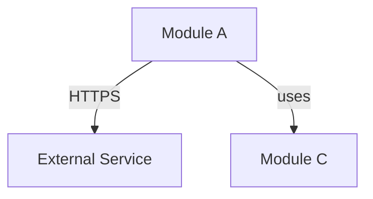
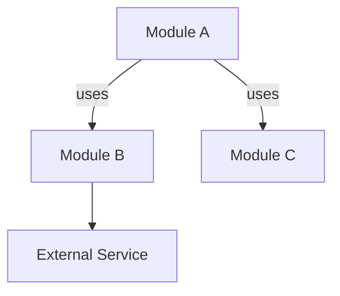
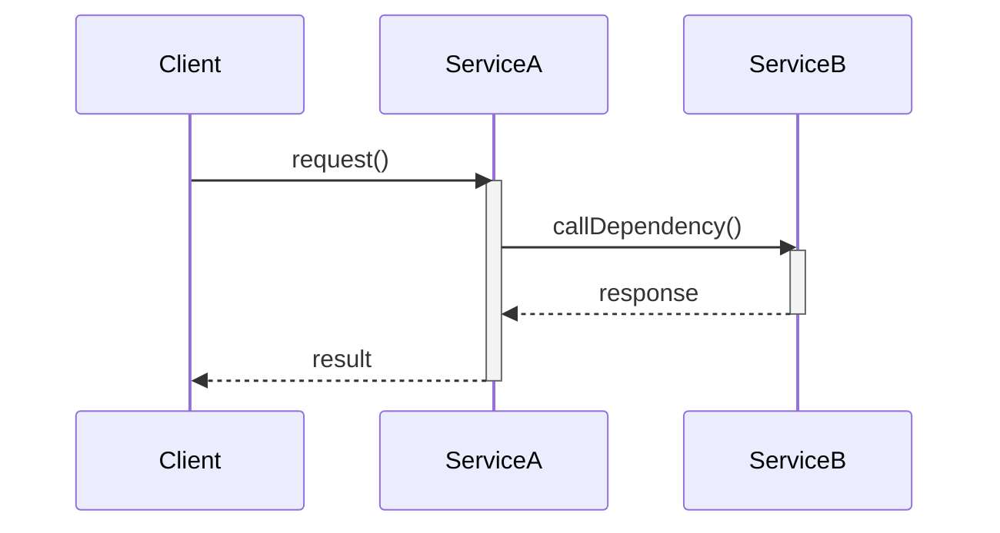
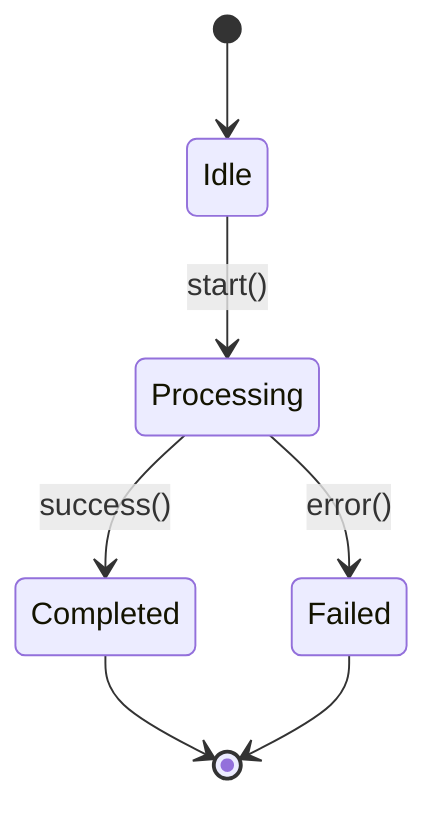

# [Module Name] Design Document

> **Standard**: This template follows `.github/standards/google-design-doc-standards.md`  
> **Complete examples and detailed guidelines**: See the standards document

**Author:** [Your Name]  
**Date:** [YYYY-MM-DD]  
**Status:** Draft | Review | Approved  
**Related Issue:** [Issue Link if applicable]

---

## 1. Context and Scope

**Background:**  
[为什么需要这个模块？解决什么业务问题？]

**Target Users:**  
[谁会使用这个模块？内部服务/外部 API/CLI 工具？]

**System Boundary:**  
[与哪些外部系统交互？交互方式是什么？]
- External System A: [交互方式，如 HTTPS REST API]
- External System B: [交互方式，如 Database/Message Queue]

---

## 2. Goals and Non-Goals

**Goals:**
- [目标1：必须实现的功能]
- [目标2：必须满足的性能指标，如 "响应时间 < 200ms (p95)"]
- [目标3：必须遵守的约束条件]

**Non-Goals:**
- [非目标1：不在此次实现范围内的功能]
- [非目标2：暂不考虑的场景]

---

## 3. Design Overview

### 3.1 Component Diagram



### 3.2 Component Description

- **Module A**: [职责描述，1-2 句话]
- **Module C**: [职责描述，1-2 句话]

---

## 4. API Design

### 4.1 Interface Definition

```java
/**
 * [接口描述]
 */
public interface ServiceName {
    /**
     * [方法描述]
     * 
     * @param param1 [参数描述 + 约束，如 "非空", "> 0"]
     * @return [返回值描述，如 "订阅信息，如果订阅无效返回 null"]
     * @throws ExceptionType [异常场景，如 "网络基础设施故障（连接超时、DNS 失败、HTTP 5xx）"]
     * @throws IllegalArgumentException [参数校验异常]
     * @ThreadSafe [Yes/No + 说明，如 "Yes（可从多个线程并发调用，无需外部同步）"]
     * @Idempotent [Yes/No]
     */
    ReturnType methodName(ParamType param1) throws ExceptionType;
}
```

### 4.2 Design Rationale

> **Critical**: This is the most important section. See standards 4.2 for detailed requirements.

**[Method/Feature Name] - [Decision Category]**:

1. **Decision**: [具体决策，一句话]

2. **Contract**: [接口契约 - 精确定义行为]
   - Return [X] when: [具体场景，如 "订阅不存在、已过期、已取消（HTTP 200, status=invalid）"]
   - Throw [Y] when: [具体场景，如 "连接超时、DNS 失败、HTTP 5xx"]
   - Never throws: [明确不会抛出的异常]

3. **Caller Guidance**: [调用方应该如何使用]
   - 收到返回值 [X] → [应该如何处理，如 "显示购买提示或降级功能"]
   - 捕获异常 [Y] → [应该如何处理，如 "重试（指数退避，最多 3 次）或向用户显示网络错误"]

4. **Rationale**: [为什么这样设计]
   - [解释设计决策的理由]

5. **Alternative Considered**: [考虑过的其他方案]
   - Alternative 1: [方案描述] → Rejected: [为什么不选]

---

**Example Decision Categories**:
- Error Handling Contract (错误处理契约)
- Thread Safety Contract (线程安全契约)
- Idempotency Contract (幂等性契约)
- Performance Trade-offs (性能权衡)

### 4.3 Dependency Interfaces

```java
/**
 * [依赖接口描述]
 */
public interface DependencyService {
    /**
     * [方法描述]
     * 
     * @ThreadSafe [Yes/No + 说明]
     */
    ReturnType dependencyMethod(ParamType param);
}
```

---

## 5. Data Model

| Entity | Fields | Type | Constraints | Description |
|--------|--------|------|-------------|-------------|
| Entity1 | field1 | String | Non-null, 32 chars | [描述] |
| | field2 | Enum | ACTIVE/EXPIRED | [描述] |
| | field3 | Date | Nullable | [描述] |
| Entity2 | field1 | int | > 0, milliseconds | [描述] |

---

## 6. Concurrency Requirements

### 6.1 Performance Targets

| Method | Concurrent? | Expected QPS | Response Time (p95) | Response Time (p99) |
|--------|-------------|--------------|---------------------|---------------------|
| methodA() | Yes | 100 | < 200ms | < 500ms |
| methodB() | No | N/A | < 10ms | < 50ms |

### 6.2 Thread Safety Requirements

**methodA()**:
- Requirement: 线程安全，支持并发调用
- Rationale: 预期从多个请求线程同时调用

**methodB()**:
- Requirement: 非线程安全，仅主线程调用
- Rationale: 应用启动时调用一次，无并发场景

---

## 7. Cross-Cutting Concerns

### 7.1 Performance

**SLO (Service Level Objective)**:
- Latency: p95 < [X]ms, p99 < [Y]ms
- Throughput: > [X] QPS
- Availability: > [X]%

**Optimization Strategy**:
- [优化策略，如 "使用连接池复用 HTTP 连接"]
- [超时设置]

### 7.2 Security

**Requirements**:
- [安全要求，如 "仅使用 HTTPS（禁用 HTTP）"]
- [证书验证要求]
- [敏感信息处理，如 "API Key 在日志中脱敏"]

### 7.3 Observability

**Logging**:
- INFO: [记录内容]
- WARN: [记录内容]
- ERROR: [记录内容]

**Metrics** (optional):
- [metric_name]: [类型 + 描述]
- [metric_name]: [类型 + 描述]

---

## 8. Alternatives Considered

### Alternative 1: [方案名称]

**Pros**:
- [优点1]
- [优点2]

**Cons**:
- [缺点1]
- [缺点2]

**Decision**: [不采用的理由]

---

### Alternative 2: [方案名称]

**Pros**:
- [优点1]

**Cons**:
- [缺点1]

**Decision**: [不采用的理由]

---

## 9. Open Questions (Optional)

1. **[问题描述]**
   - Owner: @[责任人]
   - Deadline: [YYYY-MM-DD]
   - Impact: [影响描述]

---

## References

- Standards: `.github/standards/google-design-doc-standards.md`
- Related Docs: [相关文档链接]

---

## 1. Context and Scope

**Background:**  
[描述问题背景：为什么需要这个模块？解决什么业务问题？]

**Target Users:**  
[谁会使用这个模块？内部服务？外部API？]

**System Boundary:**  
[这个模块的边界是什么？与哪些外部系统交互？]
- 外部系统A：[交互方式，如 REST API]
- 外部系统B：[交互方式，如 Database]

---

## 2. Goals and Non-Goals

**Goals:**
- [目标1：必须实现的功能]
- [目标2：必须满足的性能指标]
- [目标3：必须遵守的约束条件]

**Non-Goals:**
- [非目标1：不在此次实现范围内的功能]
- [非目标2：暂不考虑的场景]

---

## 3. Design Overview

### 3.1 Component Diagram



**Components:**
- **Module A**: [职责描述]
- **Module B**: [职责描述]
- **Module C**: [职责描述]

### 3.2 Key Design Decisions

**Decision 1: [决策标题]**
- Rationale: [为什么选择这个方案？]
- Trade-offs: [有什么权衡？]

**Decision 2: [决策标题]**
- Rationale: [为什么选择这个方案？]
- Trade-offs: [有什么权衡？]

---

## 4. API Design

### 4.1 Interface Definition

```java
/**
 * [模块对外提供的主要接口]
 */
public interface ServiceName {
    /**
     * [方法描述]
     * 
     * @param param1 [参数描述 + 约束]
     * @return [返回值描述]
     * @throws ExceptionType [异常场景]
     * @ThreadSafe [Yes/No + 说明]
     * @Idempotent [Yes/No]
     */
    ReturnType methodName(ParamType param1) throws ExceptionType;
}
```

### 4.2 Design Rationale

**[Method Name] - [Decision Category]**:
- Decision: [具体决策，如 "Return null for invalid input"]
- Rationale: [理由，如 "Invalid input is expected business condition, not exceptional"]
- Alternative Considered: [备选方案，如 "Throw InvalidInputException → Rejected (forces exception handling)"]

**Example Categories**:
- Error Handling Strategy (null vs exception vs error code)
- Thread Safety Requirements (why concurrent calls needed)
- Idempotency Decisions (can method be called multiple times)
- Performance Trade-offs (caching strategy, lazy loading)

### 4.3 Dependency Interfaces

```java
/**
 * [模块依赖的外部接口]
 */
public interface DependencyService {
    /**
     * [方法描述]
     * 
     * @ThreadSafe [Yes/No + 说明]
     */
    ReturnType dependencyMethod(ParamType param);
}
```

---

## 5. Data Model

**Key Entities:**

| Entity | Fields | Description | Constraints |
|--------|--------|-------------|-------------|
| Entity1 | field1: Type, field2: Type | [实体描述] | [约束条件] |
| Entity2 | field1: Type, field2: Type | [实体描述] | [约束条件] |

**Entity Relationships:**
- Entity1 → Entity2: [关系类型，如 one-to-many]
- Entity2 → Entity3: [关系类型]

**Data Flow:**
[简述数据如何流动：从哪里来，到哪里去]

---

## 6. Concurrency Requirements

### 6.1 Concurrency Scenarios

| Scenario | Concurrent? | Expected QPS | Peak QPS | Response Time Target |
|----------|-------------|--------------|----------|---------------------|
| [场景1] | Yes | 100 | 500 | < 200ms (95th) |
| [场景2] | No | N/A | N/A | N/A |

### 6.2 Thread Safety Requirements

| Component | Thread-Safe? | Reason | Expected Concurrency Level |
|-----------|-------------|--------|---------------------------|
| Component A | Yes | 会被多线程调用 | 1000 QPS |
| Component B | No | 单线程访问 | N/A |

**Concurrency Constraints:**
- [约束1：例如，强一致性要求]
- [约束2：例如，无锁要求]

**Performance Target:**
- Latency: [< 200ms for 95th percentile]
- Throughput: [> 1000 QPS]
- Scalability: [垂直扩展 or 水平扩展]

---

## 7. Cross-Cutting Concerns

### 7.1 Performance

**SLO (Service Level Objective):**
- Availability: [99.9%]
- Latency: [p50 < 100ms, p95 < 200ms, p99 < 500ms]
- Throughput: [> 1000 requests/sec]

**Performance Strategy:**
- [策略1：例如，使用缓存]
- [策略2：例如，异步处理]

### 7.2 Security

**Authentication:**
- [如何认证？API Key? JWT? OAuth?]

**Authorization:**
- [如何授权？基于角色？基于资源？]

**Data Protection:**
- [哪些数据需要加密？传输加密？存储加密？]

**Input Validation:**
- [如何防止注入攻击？参数验证策略？]

### 7.3 Observability

**Logging:**
- [关键操作需要记录哪些日志？]
- [日志级别策略？]

**Metrics:**
- [需要监控哪些指标？QPS? Latency? Error Rate?]

**Tracing:**
- [是否需要分布式追踪？使用什么工具？]

**Alerting:**
- [什么情况下告警？阈值是多少？]

### 7.4 Testing Strategy

**Unit Testing:**
- [单元测试范围？覆盖率要求？]

**Integration Testing:**
- [集成测试场景？]

**Performance Testing:**
- [负载测试计划？压力测试场景？]

---

## 8. Alternatives Considered

### Alternative 1: [方案名称]

**Description:**  
[方案描述]

**Pros:**
- [优点1]
- [优点2]

**Cons:**
- [缺点1]
- [缺点2]

**Why not chosen:**  
[为什么不选择这个方案？]

### Alternative 2: [方案名称]

**Description:**  
[方案描述]

**Pros:**
- [优点1]

**Cons:**
- [缺点1]

**Why not chosen:**  
[为什么不选择这个方案？]

---

## 9. Open Questions

> [列出待解决的问题，需要进一步讨论或调研的内容]

- [ ] Question 1: [问题描述]
  - Owner: [负责人]
  - Deadline: [解决时间]
  
- [ ] Question 2: [问题描述]
  - Owner: [负责人]
  - Deadline: [解决时间]

---

## 10. References

- [参考文档1：相关设计文档]
- [参考文档2：业界最佳实践]
- [参考文档3：技术规范]

---

## Appendix A: Sequence Diagram (Optional)

> 仅在交互协议复杂时添加



---

## Appendix B: State Machine Diagram (Optional)

> 仅在状态驱动系统时添加



---

## Change Log

| Date | Author | Changes |
|------|--------|---------|
| YYYY-MM-DD | [Name] | Initial draft |
| YYYY-MM-DD | [Name] | Updated after review |
