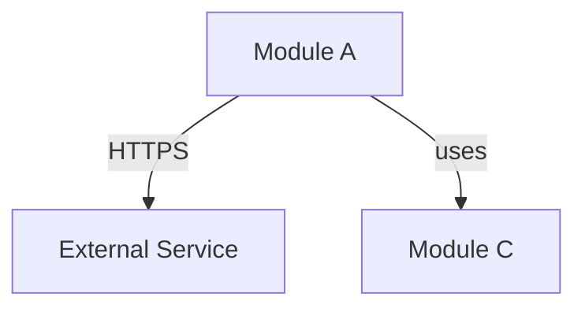
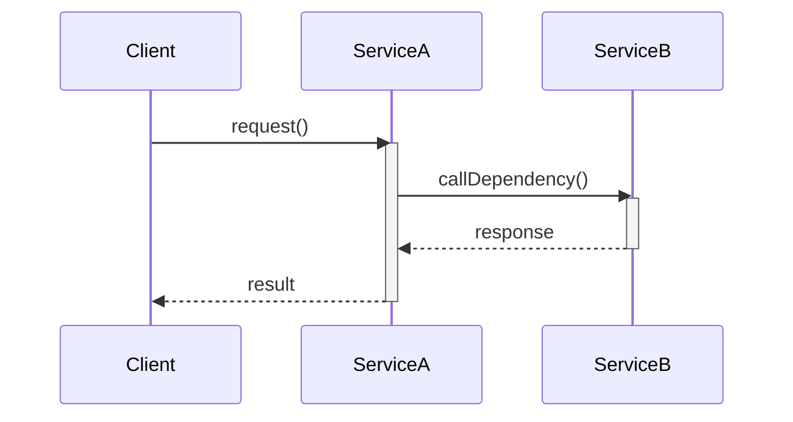
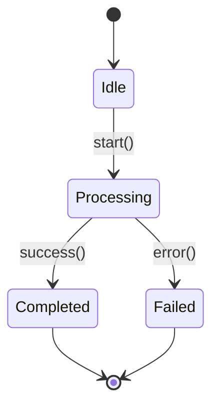

# [Module Name] Design Document

> **Standard**: This template follows `.github/standards/google-design-doc-standards.md`  
> **Complete examples and detailed guidelines**: See the standards document

**Author:** [Your Name]  
**Date:** [YYYY-MM-DD]  
**Status:** Draft | Review | Approved  
**Related Issue:** [Issue Link if applicable]

---

## 1. Context and Scope

**Background:**  
[Why is this module needed? What business problem does it solve?]

**Target Users:**  
[Who will use this module? Internal service, external API, or CLI tool?]

**System Boundary:**  
[Which external systems does it interact with, and how?]

- External System A: [Integration method, e.g., HTTPS REST API]
- External System B: [Integration method, e.g., Database or Message Queue]

---

## 2. Goals and Non-Goals

**Goals:**

- [Goal 1: required functionality]
- [Goal 2: required performance target, e.g., "response time < 200ms (p95)"]
- [Goal 3: required constraints]

**Non-Goals:**

- [Non-goal 1: out-of-scope functionality]
- [Non-goal 2: scenarios not considered in this phase]

---

## 3. Design Overview

### 3.1 Component Diagram


```mermaid
graph TD
    A[Module A] -->|HTTPS| B[External Service]
    A -->|uses| C[Module C]
```

### 3.2 Component Description

- **Module A**: [Responsibility summary, 1-2 sentences]
- **Module C**: [Responsibility summary, 1-2 sentences]

---

## 4. API Design

### 4.1 Interface Definition

```java
/**
 * [Interface description]
 */
public interface ServiceName {
    /**
     * [Method description]
     * 
     * @param param1 [Parameter description + constraints, e.g., "non-null", "> 0"]
     * @return [Return description, e.g., "subscription info; return null if invalid"]
     * @throws ExceptionType [Exception scenarios, e.g., "network infrastructure failure (timeout, DNS failure, HTTP 5xx)"]
     * @throws IllegalArgumentException [Parameter validation exception]
     * @ThreadSafe [Yes/No + explanation, e.g., "Yes (safe for concurrent calls without external synchronization)"]
     * @Idempotent [Yes/No]
     */
    ReturnType methodName(ParamType param1) throws ExceptionType;
}
```

### 4.2 Design Rationale

> **Critical**: This is the most important section. See standards 4.2 for detailed requirements.

**[Method/Feature Name] - [Decision Category]**:

1. **Decision**: [Specific decision in one sentence]

2. **Contract**: [Interface contract - precisely defined behavior]
   - Return [X] when: [Specific scenario, e.g., "subscription not found, expired, or canceled (HTTP 200, status=invalid)"]
   - Throw [Y] when: [Specific scenario, e.g., "connection timeout, DNS failure, HTTP 5xx"]
   - Never throws: [Exceptions that must never be thrown]

3. **Caller Guidance**: [How callers should use this]
   - On return value [X] -> [How to handle it, e.g., "show purchase prompt or degrade functionality"]
   - On exception [Y] -> [How to handle it, e.g., "retry with exponential backoff up to 3 times or show a network error"]

4. **Rationale**: [Why this design is chosen]
   - [Rationale for the design decision]

5. **Alternative Considered**: [Alternative options considered]
   - Alternative 1: [Option description] -> Rejected: [Why it was not selected]

---

**Example Decision Categories**:

- Error Handling Contract
- Thread Safety Contract
- Idempotency Contract
- Performance Trade-offs

### 4.3 Dependency Interfaces

```java
/**
 * [Dependency interface description]
 */
public interface DependencyService {
    /**
     * [Method description]
     * 
     * @ThreadSafe [Yes/No + explanation]
     */
    ReturnType dependencyMethod(ParamType param);
}
```

---

## 5. Data Model

| Entity  | Fields | Type   | Constraints        | Description |
| ------- | ------ | ------ | ------------------ | ----------- |
| ------- | ------ | ------ | ------------------ | ----------- |
| Entity1 | field1 | String | Non-null, 32 chars | [Description]      |
|         | field2 | Enum   | ACTIVE/EXPIRED     | [Description]      |
|         | field3 | Date   | Nullable           | [Description]      |
| Entity2 | field1 | int    | > 0, milliseconds  | [Description]      |

---

## 6. Concurrency Requirements

### 6.1 Performance Targets

| Method      | Concurrent? | Expected QPS | Response Time (p95) | Response Time (p99) |
| ----------- | ----------- | ------------ | ------------------- | ------------------- |
| ----------- | ----------- | ------------ | ------------------- | ------------------- |
| methodA()   | Yes         | 100          | < 200ms             | < 500ms             |
| methodB()   | No          | N/A          | < 10ms              | < 50ms              |

### 6.2 Thread Safety Requirements

**methodA()**:

- Requirement: thread-safe and supports concurrent calls
- Rationale: expected to be called by multiple request threads concurrently

**methodB()**:

- Requirement: not thread-safe; called only on the main thread
- Rationale: called once during application startup; no concurrency scenario

---

## 7. Cross-Cutting Concerns

### 7.1 Performance

**SLO (Service Level Objective)**:

- Latency: p95 < [X]ms, p99 < [Y]ms
- Throughput: > [X] QPS
- Availability: > [X]%

**Optimization Strategy**:

- [Optimization strategy, e.g., "reuse HTTP connections with a connection pool"]
- [Timeout configuration]

### 7.2 Security

**Requirements**:

- [Security requirement, e.g., "HTTPS only (disable HTTP)"]
- [Certificate validation requirements]
- [Sensitive data handling, e.g., "mask API keys in logs"]

### 7.3 Observability

**Logging**:

- INFO: [What to log]
- WARN: [What to log]
- ERROR: [What to log]

**Metrics** (optional):

- [metric_name]: [Type + description]
- [metric_name]: [Type + description]

---

## 8. Alternatives Considered

### Alternative 1: [Option name]

**Pros**:

- [Pro 1]
- [Pro 2]

**Cons**:

- [Con 1]
- [Con 2]

**Decision**: [Reason for rejection]

---

### Alternative 2: [Option name]

**Pros**:

- [Pro 1]

**Cons**:

- [Con 1]

**Decision**: [Reason for rejection]

---

## 9. Open Questions (Optional)

1. **[Question description]**
   - Owner: @[Owner]
   - Deadline: [YYYY-MM-DD]
   - Impact: [Impact description]

---

## 10. References

- Standards: `.github/standards/google-design-doc-standards.md`
- Related Docs: [Related document links]

## Appendix A: Sequence Diagram (Optional)

> Only include when interaction protocols are complex


```mermaid
sequenceDiagram
    participant Client
    participant ServiceA
    participant ServiceB
    
    Client->>ServiceA: request()
    activate ServiceA
    ServiceA->>ServiceB: callDependency()
    activate ServiceB
    ServiceB-->>ServiceA: response
    deactivate ServiceB
    ServiceA-->>Client: result
    deactivate ServiceA
```

---

## Appendix B: State Machine Diagram (Optional)

> Only include for state-driven systems


```mermaid
stateDiagram-v2
    [*] --> Idle
    Idle --> Processing: start()
    Processing --> Completed: success()
    Processing --> Failed: error()
    Completed --> [*]
    Failed --> [*]
```

---

## Change Log

| Date         | Author     | Changes                  |
| ------------ | ---------- | ------------------------ |
| ------------ | ---------- | ------------------------ |
| YYYY-MM-DD   | [Name]     | Initial draft            |
| YYYY-MM-DD   | [Name]     | Updated after review     |
