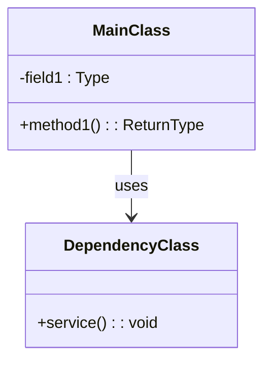
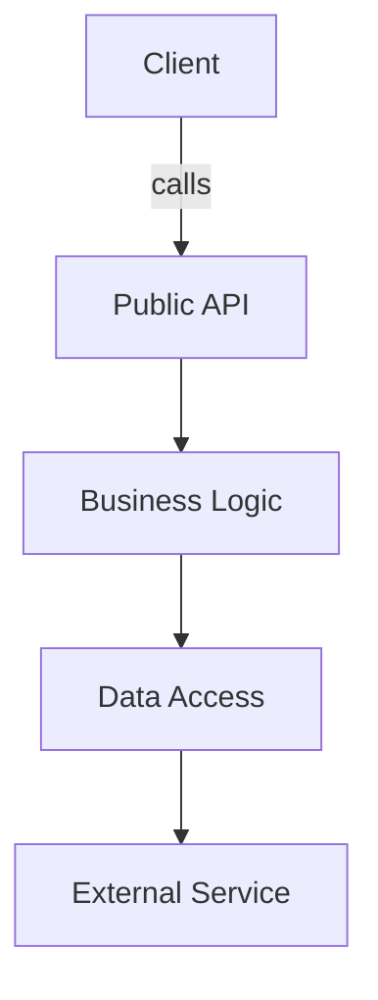
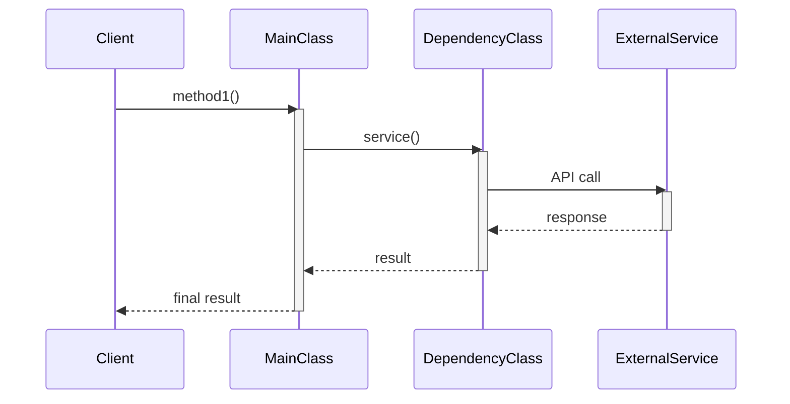
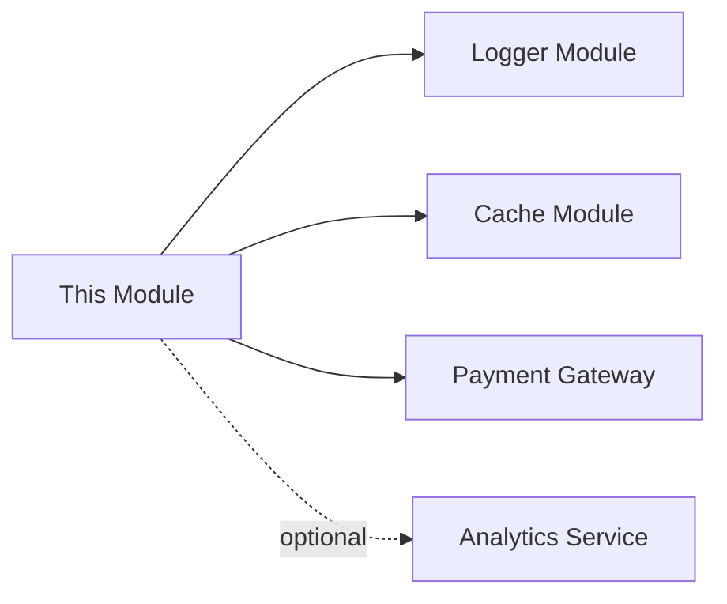

# [Module Name] Design Document

**Author:** [Architect Name]  
**Date:** [YYYY-MM-DD]  
**Status:** Draft | Review | Approved  
**Related Issue:** [Issue Link if applicable]

---

## 1. Module Overview

**Purpose:**  
[简述模块的核心目的和业务价值]

**Scope:**  
[定义模块边界：包含什么功能，不包含什么功能]

**Key Features:**
- [Feature 1: 简述]
- [Feature 2: 简述]
- [Feature 3: 简述]

**Success Criteria:**
- [性能指标，如：QPS > 1000]
- [质量指标，如：测试覆盖率 > 80%]
- [可维护性指标，如：圈复杂度 < 10]

---

## 2. Architecture Diagram

### 2.1 Class Diagram



### 2.2 Component Diagram



**Architecture Decisions:**
- [决策 1：为什么选择这种架构模式？]
- [决策 2：为什么使用这种依赖关系？]

---

## 3. Class Lifecycle

| Class Name         | Lifecycle              | Justification                                      |
|--------------------|------------------------|----------------------------------------------------|
| MainClass          | Singleton              | 全局共享配置，无状态                               |
| HelperClass        | Prototype              | 每次请求创建新实例，避免状态污染                   |
| CacheService       | Singleton              | 全局缓存，需要跨请求共享数据                       |
| RequestHandler     | Request-Scoped         | 每个请求独立实例，包含请求上下文                   |

**Instantiation Strategy:**
- **Singleton Classes**: [如何实例化？Builder pattern? Enum? Lazy initialization?]
- **Prototype Classes**: [谁负责创建实例？Factory? Constructor?]
- **Lifecycle Management**: [谁负责销毁实例？如何清理资源？]

---

## 4. Concurrency Requirements

### 4.1 Concurrency Scenarios

| Scenario                  | Concurrent Access | Expected QPS | Peak QPS |
|---------------------------|-------------------|--------------|----------|
| User subscription verification | Yes              | 100          | 500      |
| Periodic cache refresh    | No                | N/A          | N/A      |
| Configuration update      | Single-threaded   | N/A          | N/A      |

### 4.2 Thread Safety Strategy

| Class Name         | Concurrency Model          | Implementation Details                           |
|--------------------|----------------------------|--------------------------------------------------|
| MainClass          | Thread-Safe (Stateless)    | 所有方法无状态，无需同步                         |
| CacheService       | Thread-Safe (Synchronized) | 使用 ConcurrentHashMap，Atomic 变量             |
| ConfigManager      | Single-threaded            | 只在启动时初始化，无并发访问                     |

**Synchronization Rules:**
- **No Synchronization**: [哪些类不需要同步？为什么？]
- **Synchronized Methods**: [哪些方法需要同步？预期锁竞争如何？]
- **Lock-Free Design**: [是否使用 Atomic 变量？为什么？]
- **Immutable Objects**: [哪些类设计为不可变？为什么？]

**Performance Considerations:**
- [预期响应时间：< 100ms]
- [锁竞争评估：低/中/高]
- [扩展策略：垂直扩展/水平扩展]

---

## 5. Call Sequence

### 5.1 Primary Use Case: [Use Case Name]



**Call Flow Description:**
1. [步骤 1：Client 调用 MainClass.method1()]
2. [步骤 2：MainClass 调用 DependencyClass.service()]
3. [步骤 3：DependencyClass 调用 ExternalService API]
4. [步骤 4：返回结果给 Client]

**Error Handling:**
- [异常 1：ExternalService 超时 → 如何处理？]
- [异常 2：数据验证失败 → 如何处理？]

---

## 6. Dependencies

### 6.1 Internal Module Dependencies

**Dependency Table:**

| Dependency Module | Required Interface | Interface Contract | Integration Strategy | Failure Handling |
|-------------------|-------------------|-------------------|---------------------|-----------------|
| ConfigLoader      | ConfigProvider    | Config getConfig() | Constructor injection | Fail-fast on startup |
| HttpClient        | HttpSender        | Response send(Request) | Constructor injection | Retry 3 times |

**Interface Contracts:**

```java
// ConfigLoader 需要提供的接口
public interface ConfigProvider {
    /**
     * 获取配置对象
     * @return 不可变配置对象
     * @ThreadSafe Yes（可并发调用）
     * @throws ConfigException 配置加载失败
     */
    Config getConfig() throws ConfigException;
}

// HttpClient 需要提供的接口
public interface HttpSender {
    /**
     * 发送HTTP请求
     * @param request 请求对象
     * @return 响应对象
     * @throws IOException 网络异常
     * @ThreadSafe Yes（可并发调用）
     */
    Response send(Request request) throws IOException;
}
```

**Integration Strategy:**
- 依赖注入方式：构造函数注入（符合依赖倒置原则）
- 初始化顺序：ConfigLoader → HttpClient → [当前模块]
- 生命周期管理：所有依赖模块必须在当前模块初始化前就绪

**Circular Dependency Detection:**
- [是否存在循环依赖？如何消除？]

### 6.2 Internal Utility Dependencies

| Dependency Module | Type          | Purpose                  | Failure Handling       |
|-------------------|---------------|--------------------------|------------------------|
| Logger Module     | Strong        | 日志记录                 | N/A (Always available) |
| Cache Module      | Weak          | 性能优化                 | 降级到直接查询         |

### 6.3 External Dependencies

| External Service  | Type          | SLA           | Timeout | Retry Strategy       |
|-------------------|---------------|---------------|---------|----------------------|
| Payment Gateway   | Strong        | 99.9%         | 5s      | 3 retries with backoff |
| Analytics Service | Weak          | 95%           | 2s      | Best effort (no retry) |

**Dependency Graph:**



**Failure Scenarios:**
- [Scenario 1: Payment Gateway 超时]
  - Impact: [用户无法完成支付]
  - Mitigation: [重试 3 次，显示友好错误消息]
  
- [Scenario 2: Cache Module 不可用]
  - Impact: [性能下降 20%]
  - Mitigation: [降级到数据库直接查询]

**Circuit Breaker Strategy:**
- [是否使用熔断器？阈值是多少？]

---

## 7. Public APIs

### 7.1 API Contract

```java
/**
 * [API 描述]
 * 
 * @param param1 [参数描述]
 * @return [返回值描述]
 * @throws ExceptionType [异常场景]
 * @ThreadSafe [是否线程安全？]
 * @Idempotent [是否幂等？]
 */
public ReturnType methodName(ParamType param1) throws ExceptionType;
```

### 7.2 API List

| API Method           | Purpose               | Thread-Safe | Idempotent | Exception Handling |
|----------------------|-----------------------|-------------|------------|--------------------|
| verifySubscription() | 验证订阅状态          | Yes         | Yes        | 返回 false         |
| startMonitor()       | 启动周期性检查        | No          | Yes        | 抛出异常           |

**API Design Decisions:**
- [决策 1：为什么这个 API 设计为同步？]
- [决策 2：为什么返回 Optional 而不是 null？]

**Backward Compatibility:**
- [如何保证 API 向后兼容？]
- [废弃 API 的迁移策略？]

---

## 8. Implementation Constraints

### 8.1 Performance Requirements

- **Response Time**: [< 100ms for 95th percentile]
- **Throughput**: [> 1000 QPS]
- **Memory Usage**: [< 500MB heap]
- **CPU Usage**: [< 50% on 4-core machine]

**Performance Optimization Strategies:**
- [策略 1：使用对象池减少 GC]
- [策略 2：异步处理非关键路径]

### 8.2 Security Requirements

- **Authentication**: [如何验证身份？JWT? OAuth?]
- **Authorization**: [如何控制权限？RBAC? ABAC?]
- **Data Encryption**: [哪些数据需要加密？传输加密？存储加密？]
- **Input Validation**: [如何防止注入攻击？]

### 8.3 Compatibility Requirements

- **Java Version**: [Minimum: Java 8, Target: Java 11]
- **Dependencies**: [Spring Boot 3.2.x, Jackson 2.15.x]
- **Platform**: [Linux, macOS, Windows]

### 8.4 Testing Requirements

- **Unit Test Coverage**: [> 80%]
- **Integration Test**: [必须覆盖的场景]
- **Performance Test**: [Load test with 1000 QPS]
- **Concurrency Test**: [Stress test with 100 threads]

---

## 9. Implementation Notes

### 9.1 Critical Implementation Details

**Concurrency Implementation:**
```java
// Example: 如何实现线程安全
private final ConcurrentHashMap<String, Value> cache = new ConcurrentHashMap<>();
private final AtomicInteger counter = new AtomicInteger(0);
```

**Lifecycle Management:**
```java
// Example: 如何实现单例
public class Singleton {
    private static final Singleton INSTANCE = new Singleton();
    private Singleton() {}
    public static Singleton getInstance() { return INSTANCE; }
}
```

### 9.2 Known Limitations

- [限制 1：当前不支持分布式场景]
- [限制 2：缓存大小限制为 1000 条目]

### 9.3 Future Enhancements

- [增强 1：支持异步 API]
- [增强 2：添加 Metrics 和 Tracing]

---

## 10. Review and Approval

**Architecture Review:**
- [ ] 生命周期设计合理
- [ ] 并发模型匹配实际场景
- [ ] 依赖关系清晰
- [ ] 性能要求可达成
- [ ] 安全要求已考虑

**Reviewed By:**
- [Reviewer 1 Name]: [Date] - [Comments]
- [Reviewer 2 Name]: [Date] - [Comments]

**Approval:**
- [ ] Tech Lead: [Name] [Date]
- [ ] Architect: [Name] [Date]

---

## Appendix A: Glossary

| Term              | Definition                                    |
|-------------------|-----------------------------------------------|
| QPS               | Queries Per Second                            |
| SLA               | Service Level Agreement                       |
| Idempotent        | 多次执行结果相同的操作                        |

## Appendix B: References

- [Alibaba Java Coding Guidelines](https://github.com/alibaba/p3c)
- [Java Concurrency in Practice](https://jcip.net/)
- [Effective Java (3rd Edition)](https://www.oreilly.com/library/view/effective-java-3rd/9780134686097/)
